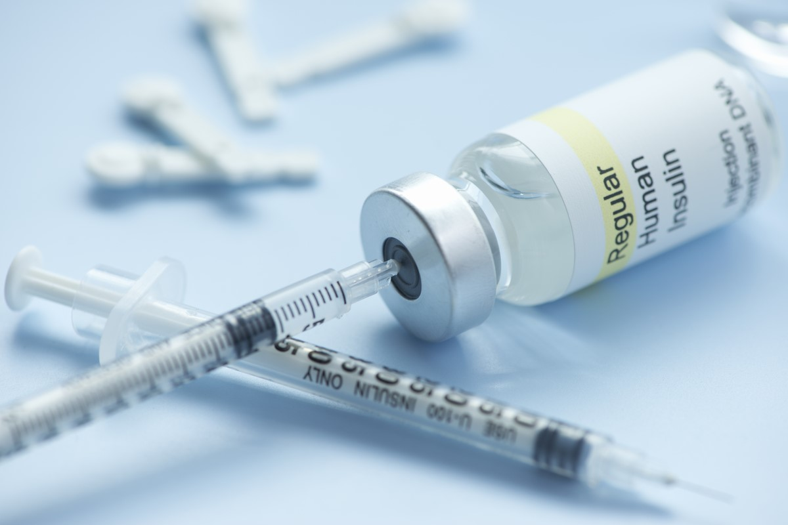

En el tratamiento de la Diabetes la Insulina juega un papel fundamental. Sin embargo debemos tener en claro qué es exactamente la insulina, los tipos de insulina en el mercado y como trabaja en nuestro organismo.

## Que es la Insulina?

Una definición practica sin adentrarnos en terminos estrictamente medicos es que la insulina es una hormona formada por 51 aminoácidos. Dentro del páncreas, las células beta producen la hormona llamada insulina. Con cada comida, las células beta liberan insulina para ayudar al cuerpo a utilizar o almacenar en la sangre la glucosa que se obtiene de los alimentos. Su déficit provoca la diabetes mellitus y su exceso provoca hiperinsulinismo con hipoglucemia.

En las personas con [diabetes tipo 1](/diabetes-tipo-1-diagnosticado/), el páncreas no produce insulina. Las células beta han sido destruidas y se necesitan inyecciones de insulina para utilizar la glucosa de las comidas. Las personas con [diabetes tipo 2](/diabetes-tipo-2/) producen insulina, pero sus cuerpos no responden bien a la misma. Algunas personas con diabetes tipo 2 necesitan medicamentos para la diabetes o inyecciones de insulina para ayudar a su cuerpo a utilizar la glucosa para obtener energía.

La insulina no se puede tomar como una píldora, ya que se descompone durante la digestión al igual que la proteína en los alimentos. Se debe inyectar en la grasa debajo de la piel para que llegue a la sangre. Existen diferentes tipos de insulina en función de la rapidez con que trabajan, y en función de su duración. Estos diferentes tipos de insulina viene en diferentes concentraciones, la más común es U-100.

## Tipos de insulina

- **De Acción Rápida:**Comienza a trabajar unos 15 minutos después de la inyección, con picos en aproximadamente 1 hora, y continúa trabajando por un tiempo de 2 a 4 horas. Tipos: Insulina glulisina (Apidra), la insulina lispro (Humalog) y la insulina aspart (NovoLog). Este tipo de insulina también es referida como insulina cristalina.

- **Regular o de Acción Corta:** Generalmente llega al torrente sanguíneo a los 30 minutos después de la inyección, picos de entre 2 a 3 horas después de la inyección, y es efectiva durante aproximadamente 3 a 6 horas. Tipos: Humulin R, Novolin R

- **De Acción Intermedia:** Generalmente llega al torrente sanguíneo de aproximadamente 2 a 4 horas después de la inyección, picos de 4 a 12 horas y eseficaz durante aproximadamente 12 a 18 horas. Tipos: [Insulina NPH](/insulina-nph/) (Humulin N, Novolin N)

- **De Acción Prolongada:** Alcanza el torrente sanguíneo varias horas después de la inyección y tiende a disminuir los [niveles de glucosa](/cuanto-es-el-nivel-normal-de-glucosa/) de manera bastante uniforme durante un período de 24 horas. Tipos: La insulina detemir (Levemir) y la insulina glargina (Lantus)

Nota: Esta información debes consultarla siempre con tu medico especialista.

## La insulina Tiene 3 Características:

- **El inicio:** Es el tiempo antes de que la insulina alcance el torrente sanguíneo y se inicie la reducción de la glucosa en sangre.
- **Pico:** Es el tiempo durante el cual la insulina está surtiendo el máximo efecto en términos de reducción de la glucosa en sangre.
- **La duración:** Es cuánto tiempo la insulina continúa reduciendo la glucosa sanguínea.

## **Resistencia a la insulina:**

Todas las insulinas vienen disueltas o suspendidas en líquidos. La estándar y la más comúnmente usada hoy en día es U-100,lo que significa que contiene 100 unidades de insulina por mililitro de fluido. También existe la insulina U-500 que está disponible para los pacientes que son extremadamente [resistentes a la insulina](/resistencia-la-insulina-y-diabetes-es-lo-mismo/). la insulina U-40, que cuenta con 40 unidades de insulina por mililitro de líquido, por lo general se ha eliminado en todo el mundo, pero es posible que todavía se pueda encontrar en algunos lugares (insulina U-40 se sigue utilizando en la atención veterinaria) .

## **Aditivos de la Insulina:**

Todas las insulinas poseen ingredientes añadidos. Esto evita el crecimiento de bacterias y ayuda a mantener un equilibrio neutral entre ácidos y bases. Las insulinas de acción intermedia (como la [insulina nph](/insulina-nph)) y de acción prolongada también contienen ingredientes que prolongan sus acciones. En algunos casos aislados, los aditivos pueden provocar alguna reacción alérgica.
