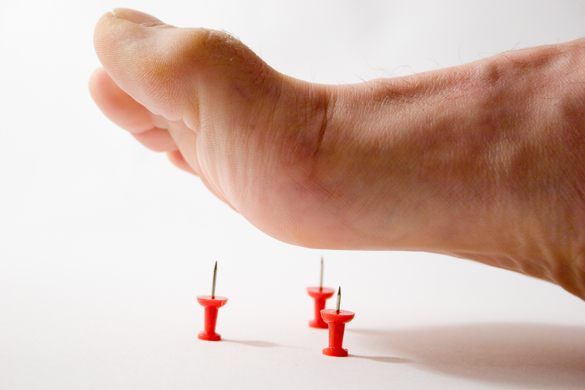
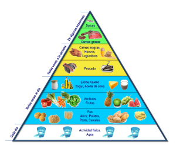
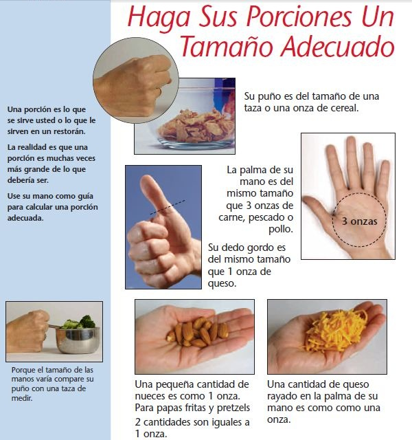

Si usted tiene diabetes, entiende algo claramente: lo que usted come, cuando lo come, y cuánto come puede enviar el nivel de azúcar en sangre a las nubes o hacerlo caer en picada. Para bien o para mal, "la dieta y la diabetes" van juntos como la sal y la pimienta. Con diabetes, usted corre el riesgo de experimentar lesiones y daños en los nervios que son causados por altos [niveles de azucar](/cuanto-es-el-nivel-normal-de-glucosa/) en la sangre. Esta condición se conoce como "**neuropatia diabetica**".

Lo que puede empezar como una pequeña [sensación de hormigueo](/7-razones-cosquilleo-en-las-manos-los-pies/) o entumecimiento en los pies pueden convertirse en grandes problemas para en las extremidades inferiores ([pie diabetico](/pie-diabetico)), caminar, trabajar y llevar una vida activa. La neuropatía diabética también puede causar estragos en su digestión, su respuesta sexual, y hacer que sea difícil sentir sensaciones corporales normales como ser los signos de caída de azúcar en sangre o hasta un ataque cardíaco.

Afortunadamente, una dieta balanceada que ayude a tratar las dolencias en nervios no es realmente diferente de la dieta estándar aconsejada para cualquier persona diabética._"El énfasis es en realidad sobre el control de azúcar en la sangre"_. Por supuesto, si un cambio en la dieta puede ayudar a que eso ocurra, es aconsejable aplicarla en nuestra rutina diaria de alimentación.

Un buen control de la glucosa puede proteger la salud de sus nervios y puede incluso ayudar a prevenir la neuropatía diabética. Usted ve a su médico sólo de vez en cuando, pero come varias veces al día. No importa qué medicamentos pueda estar tomando, su dieta para la diabetes tiene un constante e importantísimo impacto en su salud y bienestar. Cada bocado que come es importante.

## **Consejo #1 contra Neuropatia Diabetica: Siga una dieta equilibrada**

**¿Por qué?**

Recuerde la buena y vieja pirámide de los alimentos que ha aprendido en la escuela.

Una dieta balanceada incluye una variedad de alimentos:

- Carbohidratos (almidones),
- Frutas y verduras
- Leche y productos lácteos,
- Carnes de pollo y Pescado
- Grasas saludables.

Comer una dieta equilibrada ayuda a mantener el nivel de glucosa en los niveles deseados, controlar el peso y reducir el riesgo de complicaciones como la neuropatía Diabetica y enfermedades del corazón entre otros.

**El objetivo:**

Salir de las rutinarias comidas de todos los dias, probar nuevos alimentos, e incluir todos los grupos de alimentos en su dieta para la diabetes.

**¿Cómo?**

Su dieta dependerá de su nivel de actividad, si usted es hombre o mujer, y del motivo por el cual usted está tratando de perder peso. Estas pautas son generales, sin embargo consulte con su médico para ajustarse a un plan específico:

- Elija una variedad de alimentos ricos en nutrientes y bebidas entre los grupos básicos de alimentos.
- Equilibre las calorías de alimentos y bebidas con la actividad física para manejar un peso corporal ideal.
- Elija frutas ricas en fibra, verduras y granos enteros a menudo.
- Coma 2 tazas de fruta y 2 1/2 tazas de verduras al día (para alguien que come 2000 calorías)
- Reduzca las grasas saturadas y ácidos grasos trans eligiendo carnes magras y productos lácteos bajos en grasa o sin grasa.
- Elija y prepare alimentos y bebidas con pocos azúcares agregados o edulcorantes calóricos.
- Consuma menos de 2,300 mg de sodio por día.
- Limite el alcohol a no más de 1 bebida para las mujeres y 2 tragos para hombres.
- La actividad física regular de al menos 30 minutos al día para los adultos y 60 minutos para los niños.

## **Consejo 2 contra Neuropatia Diabetica: Separe sus comidas durante el día**

**¿Por qué?**

Saltarse comidas y comer en exceso puede enviar su azúcar en sangre al piso y luego dispararla hasta el techo. Dado que el daño y dolor del nervio diabético puede disminuir el apetito y hacer que sea más difícil de digerir alimentos, varias comidas más pequeñas pueden funcionar mejor para usted. Además, algunos medicamentos para la diabetes funcionan mejor cuando usted está tomándolos en conjunto con las comidas regulares.

**El objetivo:**

Encontrar un programa viable para las comidas y meriendas que se adapte a su estilo de vida y no uno que le gustaría tener. Sea realista acerca de la planificación de su dieta en su trabajo, cuando maneja, en la alimentación de los niños, etc.

**¿Cómo?**

Apunte a 3 pequeñas comidas y 3 meriendas saludables cada día para equilibrar el azúcar en la sangre:

1. Desayuno
2. Una colación/merienda de media mañana
3. Almuerzo
4. Una colación/merienda a media tarde
5. Cena
6. Una colación/merienda de la noche

## **Consejo #3 contra Neuropatia Diabetica: "Carbohidratos complejos"**

**¿Por qué?**

Los hidratos de carbono se digieren más lentamente y no "impactan" en su azúcar en sangre como lo hacen los azúcares simples. También se llenará más rápido, por lo que es menos probable que coma en exceso, y por otro lado los hidratos de carbono otorgan más vitaminas, minerales y fibra.

**El objetivo:**

La mayor parte de lo que usted come debe ser carbohidratos saludables. Debe Incluir:

- Granos enteros
- Frutas, verduras y leche baja en grasa. Panes y cereales de grano entero
- Arroz integral
- Frijoles y lentejas
- Las Papas y tortillas de maíz son buenas opciones.

**¿Cómo?**

Compre en el perímetro de las tiendas de comestibles, donde encontrará los alimentos más frescos. Evite la tentación de los pasillos intermedios, donde productos enlatados, en caja, y congelados son dejados de lado y con menos rotación.

Trate de consumir la versión menos procesada de cualquier alimento evitando los alimentos preparados, pre-mezclados del tipo "cenas listas", "sopas instantaneas", "cena de microondas", etc. ya que no son "ayudantes" cuando se trata de la diabetes y el dolor de nervio Diabetico.

Diviértase probando un nuevo tipo de vegetales con almidón, como el camote al horno, zanahorias asadas en el horno, o lentejas cocidas, en lugar de arroz blanco o panecillos.

## **Consejo #4 contra Neuropatia Diabetica. Olvídese del "extra grande"**

**¿Por qué?**

La mayoría de las personas se sorprenden al darse cuenta de lo pequeños que son los tamaños de porción "oficiales".

- Una porción de carbohidratos? : Sólo 1 rebanada de pan integral o 1/2 taza de avena cocida.
- Una porción de cereal seco? : Sólo el 3/4 de taza - que es más pequeño que su taza normal de café.
- Carne, pescado o aves de corral?: A tan sólo 3 onzas es una porción - que es aproximadamente del tamaño de la palma de su mano - una vez que se ha cocinado.

Sabía que si usted come un jugoso bistec de 16 onzas ingiere proteínas por valor de casi 6 cenas.? Cuídese!

**El objetivo:**

Adquiera el hábito de leer las etiquetas para saber los tamaños de las porciones reales de los alimentos que le gustan. Y haga estos cálculos. Si usted ingiere el doble de lo recomendado en algun tipo de alimento, evitelo en el menu del dia siguiente.

**¿Cómo?**

- Platos divididos o ensaladas cuando se va a comer fuera, o coma un aperitivo y una pequeña ensalada en lugar de un plato principal.
- Mantenga un buen libro de dieta de la diabetes en la mano para saber los tamaños exactos de las porciones de alimentos frescos como frutas y verduras.
- Compre un nuevo juego de tazas y cucharas de medir y mantengalos siempre a la vista en su cocina y estará más motivado para medir porciones.

## **Consejo #5 contra Neuropatia Diabetica: Adios Alcohol**

**¿Por qué?**

El alcohol es tóxico para los nervios. El hígado tiene dos funciones principales: Limpiar las toxinas como el alcohol de su cuerpo, y convertir [los carbohidratos](/que-son-carbohidratos/) en glucosa en la sangre que su cuerpo puede utilizar. Beber Alcohol desvía el trabajo de su hígado, ya que no va a empezar a trabajar para nivelar azúcar en la sangre hasta que se "barra" el alcohol en su torrente sanguíneo, por ende puede provocar cambios en el nivel de azucar . Y si usted tiene neuropatía diabética, la bebida puede estimular el dolor, hormigueo, y otros síntomas.

**El objetivo:**

Para estar seguro, se recomienda a las personas con neuropatía diabética avanzada no beber en absoluto, ya que es posible que el daño del nervio puede ser causado incluso por un consumo leve de alcohol (menos de 2 bebidas a la semana). Si usted bebe, lo aconsejable es no más de 1 bebida al día para las mujeres y 2 bebidas al día para los hombres.

**¿Cómo?**

- Pruebe una variedad de aguas minerales con una rebanada fresca de limón, lima o naranja para darle sabor.
- Si celebras en ocasiones, no beber con el estómago vacío. Tome su bebida con o después de la cena, para ayudar a prevenir bajos niveles de azucar en sangre.

## **Consejo #6 contra Neuropatia Diabetica. Coma menos grasa**

**¿Por qué?**

Casi 9 de cada 10 adultos con [diabetes tipo 2](/diabetes-tipo-2/) tienen sobrepeso. Bajar de peso puede disminuir la glucosa en la sangre, le dará más energía, alivia la carga sobre los pies doloridos y disminuye el riesgo de enfermedad cardíaca y [accidente cerebrovascular](/diabetes-y-acv/).

**El objetivo:**

Trate de seguir 3-5 porciones de grasa al día (o siga los consejos de su médico). Recuerde que 1 porción de grasa es sólo 1 cucharadita de aceite de oliva o margarina.

**¿Cómo?**

En estos días, la frase "bajo en grasas" se encuentra en todas partes. Pero leer las etiquetas de los alimentos cuidadosamente. "light" no siempre significa "bajo en grasa".

- Lea y conozca cuántos gramos de grasa hay en cada porción de los alimentos que le gustan.
- No importa cuán apurado se encentre, evite los lugares de comida rápida o sobre la marcha. Una sola comida de comida rápida puede costar toda una semana de porciones de grasa.
- Complemente su dieta con sopas bajas en grasa, ensaladas con aderezo bajo en grasa y vegetales crudos que satisfagan su paladar con variedad de sabores y texturas.
- Recuerde relajarse y disfrutar de sus comidas. De esta manera, usted es menos probable que coma en exceso y tendrá más probabilidades de disfrutar el sabor de los alimentos.
