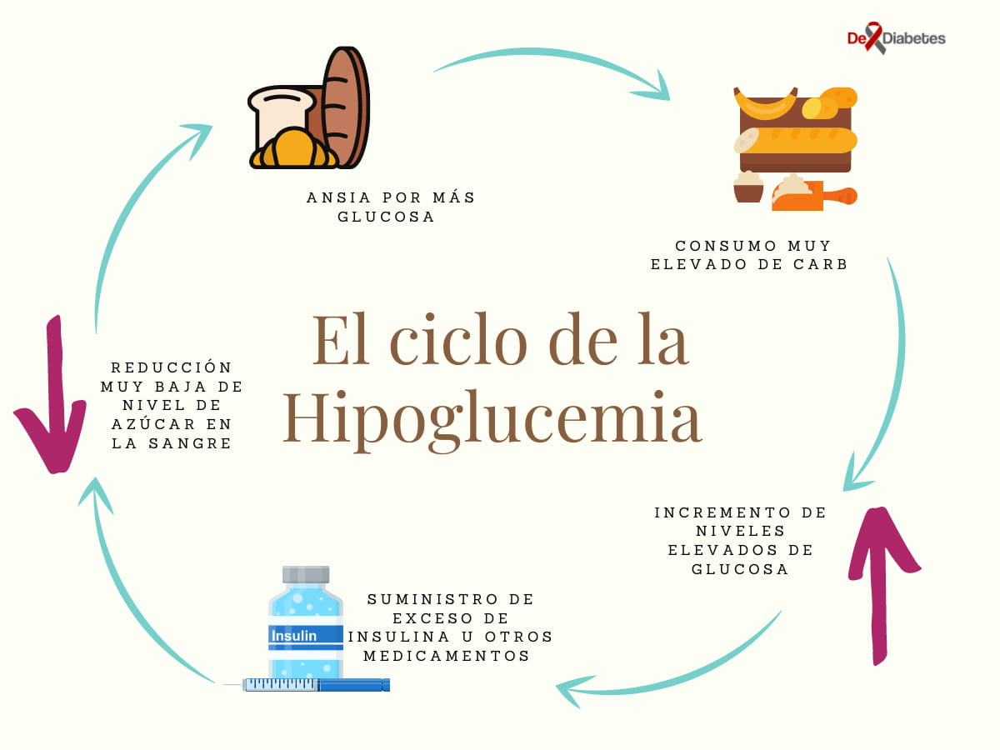
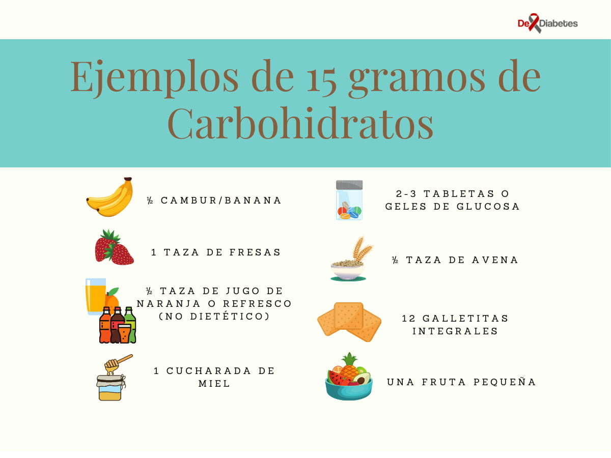
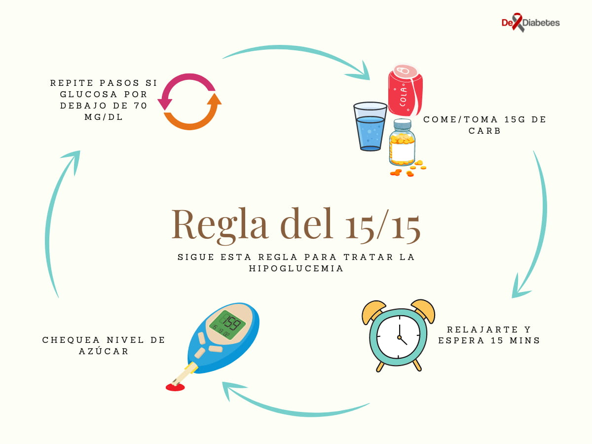

import { HipoSintomas } from '../../../constants/Tables/HipoSintomas.js'

import PostOptIn from 'components/Subscribe/PostOptin'

La hipoglucemia en personas con diabetes es una de las complicaciones donde el nivel de glucosa en la sangre baja demasiado de los rangos normales a un nivel donde ocasiona manifestaciones clínicas. 

La glucosa (azúcar) actúa como la principal fuente de energía para el cuerpo. Para poder aprovecharla se necesita de la insulina, una hormona pancreática que permite su paso de la sangre al interior de las células. Asimismo, la mayoría de los tejidos son capaces de almacenar reservas de glucosa para poder utilizarlas en situaciones de ayuno.

A diferencia de otros órganos, el sistema nervioso (ej. cerebro) no es capaz de almacenar o sintetizar glucosa. Es por ello que el cuerpo utiliza una red de mecanismos complejos, como hormonas y señales nerviosas, para regular las concentraciones de azúcar en la sangre y garantizar su aporte ininterrumpido al cerebro.

Por lo general, nuestro organismo mantiene el nivel de glucosa en sangre (glucemia) en un intervalo entre 70 y 110 mg/dL (en ayuno)[^1]. Sin embargo, en este momento es complejo definir un límite inferior de la glucosa (azúcar en la sangre), ya que los rangos “normales” pueden variar de persona a persona.[^1]

La hipoglucemia puede mostrar síntomas (hipoglucemia sintomática) o puede no mostrar síntomas ( hipoglucemia asintomática).

En episodios de hipoglucemia grave el individuo necesita ayuda de otra persona para restaurar los niveles de glucosa a la normalidad.

## ¿Cuáles son las Causas de Hipoglicemia?

La mayoría de los casos de hipoglucemia ocurren en adultos con diabetes mellitus (DM). A pesar de que la diabetes se caracteriza por niveles altos de glucosa en sangre (hiperglucemia), la hipoglucemia (azúcar en la sangre por debajo del nivel normal) suele darse con frecuencia en esta enfermedad.

### Hipoglucemia en personas con diabetes tipo 1

Generalmente, la hipoglucemia es un efecto secundario del tratamiento de la diabetes con fármacos hipoglucemiantes. De hecho, el problema de concentraciones bajas de azúcar en la sangre surge con mayor frecuencia en personas con diabetes mellitus tipo 1 que están en tratamiento con insulina. _Se estima que, en promedio, éstas presentan dos episodios sintomáticos por semana, y como mínimo otro de hipoglucemia grave, cada año[^1]_.

### Hipoglucemia en personas con diabetes tipo 2

Es de notar que, la ocurrencia de hipoglucemia aumenta en la diabetes tipo 2 con el uso de sulfonilureas (fármaco oral que aumenta la secreción de insulina) y de insulina.[^1]

### Causas posibles en la diabetes mellitus controlada[^1]

* Demasiada insulina en el torrente sanguíneo: la cantidad de insulina o de medicamentos para la diabetes administrada (ej. _sulfonilureas_) es excesiva o es a destiempo. Adicionalmente, el tipo de hormona puede ser inadecuado para el paciente.
* Disminución de la ingesta de glucosa que el cuerpo necesita (sin ajuste en el tratamiento) dada por omisión de comidas, patrones irregulares de ingesta o por el ayuno nocturno.
* Aumentan los niveles de actividad física (sin ajuste en el tratamiento o en la ingesta de alimentos): el ejercicio conlleva un aumento de la utilización de glucosa en sangre.
* Aumento de la respuesta de los tejidos a la insulina: esto puede estar dado por ejercicio físico, incremento de la pérdida de peso o una mejora en el plan de control de la glucosa en la sangre.
* Disminución de la producción de glucosa por el cuerpo (ej. por el hígado) por beber alcohol. Reducción de la eliminación de insulina por el riñon (ej. insuficiencia renal)

### Causas posibles en no diabéticos[^2]

* Fármacos (ej. para malaria) pueden ser
* Consumo excesivo de alcohol
* Sepsis (respuesta extrema del cuerpo a una infección)
* Insuficiencia orgánica (ej. hepática o renal)
* Tumores pancreáticos
* Inanición
* Deficiencias de las glándulas suprarrenales
* Deficiencias hormonales
* Hipoglucemia reactiva
* Algunos tipos de cirugías gástricas.

## ¿Cuáles son los Factores de Riesgo para Hipoglucemia en la diabetes?

Varios estudios han investigado los factores de riesgo para hipoglucemia severa en personas con diabetes. Se habla de hipoglucemia severa o grave cuando la persona afectada requiere asistencia para el tratamiento del episodio. Algunos factores de riesgo asociados con hipoglucemia severa en adultos con DM son:

* Terapia con [insulina NPH](/insulina-nph/) de acción intermedia o sulfonilureas.[^3]
* Edad avanzada.[^3]
* Presencia de enfermedades asociadas (ej. infecciones o insuficiencia orgánica).[^4]
* Episodios previos de hipoglucemia (en los seis meses anteriores).[^3]
* Falta de auto monitoreo de glucemia capilar.[^4]

<PostOptIn/>

## ¿Cuáles son los Síntomas y Signos de la Hipoglucemia?

Los signos y síntomas de hipoglucemia varían según la duración y la severidad de la misma. Asimismo, el nivel de glucosa en el que un individuo comienza a presentar síntomas es muy variable con un nivel por debajo de 70 mg / dl considerado bajo y un nivel por debajo de 50 mg / dL considerado muy bajo que require acción inmediata[^2]. Incluso hay personas con escasas manifestaciones clínicas, como los adultos de edad avanzada, o completamente asintomáticas durante los episodios (especialmente al principio).

Las manifestaciones clínicas de la hipoglucemia se pueden dividir en signos y síntomas autonómicos y neuroglucopénicos:

1. Los **síntomas autonómicos** están dados por la estimulación del sistema nervioso autónomo (SNA), el cual regula las funciones involuntarias del cuerpo (ej. frecuencia cardíaca, temperatura, presión arterial), incluyendo algunos mecanismos para el control de la glucemia.

2. Los **síntomas neuroglucopénicos** están dados por un déficit en el suministro de glucosa al cerebro.[^2]

<HipoSintomas/>

La hipoglucemia también puede ocurrir durante el sueño. Las pesadillas y la sudoración nocturna excesiva también pueden ser síntomas de un episodio.

Finalmente, a medida que la hipoglucemia progresa, pueden aparecer signos y síntomas más severos como confusión, visión borrosa, convulsiones y pérdida de la conciencia (desmayo)[^2].

Es de notar que, la deficiencia de glucosa puede ocasionar complicaciones graves y si es intensa y duradera puede ser letal.

## ¿Cómo se Realiza el Diagnóstico de la Hipoglucemia?

El diagnóstico y tratamiento rápido de la hipoglucemia (baja azúcar en la sangre) es esencial, independientemente de la causa de la misma.

Es importante recordar que, a pesar de que los signos y síntomas de la hipoglucemia pueden orientar al médico tratante sobre el problema, éstos son bastante inespecíficos.

Para corroborar que dichas manifestaciones clínicas son consistentes con un episodio agudo de hipoglucemia, es necesario que de manera correspondiente haya[^1]:

* Confirmación de un nivel bajo de glucosa en sangre (medición por métodos exactos de laboratorio).
* Alivio de los síntomas una vez que aumenta la concentración de azúcar en la sangre.

Es recomendable que las personas en tratamiento para la diabetes que experimenten síntomas de hipoglucemia, comprueben su nivel de glucosa en la sangre con la ayuda de un glucómetro o de medidores continuos de glucosa. Esto con el fin de documentar y tratar de forma temprana estos episodios.

El valor de corte de hipoglucemia para los adultos con diabetes mellitus (en tratamiento con insulina o sulfonilureas) está establecido alrededor 70mg/dL.[^5]

Para identificar la causa de la hipoglucemia, el médico tratante analizará los datos del interrogatorio, de la exploración física y de los estudios de laboratorio disponibles.

En pacientes con diabetes, el médico debe realizar estudios de función hepática, nivel de insulina, cortisol y hormonas tiroideas, entre otros. Además, es importante el descarte de una fuente de infección como causa de la hipoglucemia (ej. uroanálisis, hemocultivos y estudios de imágenes).[^2]

## ¿Cómo se puede prevenir un bajo nivel de azúcar en la sangre cuando tienes diabetes?

Principalmente, la prevención de la hipoglucemia requiere conocer y tratar el mecanismo por el nivel bajo de azúcar sucede. En el caso de las personas con diabetes, éstas son algunas de las formas de prevenir la hipoglucemia[^5].

* Educarse sobre la nutrición adecuada para el tratamiento de la diabetes que recibe.
* No omitir o retrasar comidas.
* Aprender a monitorear el nivel de glucemia capilar desde casa: practicar controles frecuentes de la misma según lo indicado por su médico tratante (ej. antes de acostarse, múltiples veces al día o a la semana).
* Dosificar la medicación con cuidado siguiendo las indicaciones médicas para las dosis de insulina y otros medicamentos para la diabetes. Administrar las dosis a tiempo.
* Realizar ajustes en su medicación o tomar un suplemento calórico extra en caso de aumentar su nivel de actividad física. Estas modificaciones deben estar basadas en las mediciones de glucemia capilar (previas al ejercicio), el tipo de tratamiento recibido y el tipo o duración del ejercicio.
* Cargar siempre una identificación que indique su condición y tratamiento (para emergencias).
* Evitar la ingesta de alcohol. Si decide ingerir alcohol debe aumentar la ingesta de carbohidratos de absorción lenta y realizarse controles de glucemia posteriores (incluso durante la noche). 

Lo más importante es que la respuesta de cada persona a la hipoglucemia es diferente. Si usted está en tratamiento para la diabetes mellitus, es importante que aprenda a identificar y documentar sus síntomas de alerta de hipoglucemia. Esto le permitirá a usted y a su médico establecer patrones para identificar y tratar un episodio de forma oportuna.

<PostOptIn/>

## ¿Cuál es el Tratamiento para la Hipoglucemia?

La hipoglucemia es una emergencia que debe ser tratada con rapidez para evitar consecuencias negativas. Para corregir la hipoglucemia, si la persona afectada se encuentra consciente, se debe aportar 15 gramos de carbohidratos por vía oral equivalente a: 

* Dos o tres (2-3) tabletas o geles de glucosa
* ½ taza de jugo o refresco (no dietético)
* 1 cucharada de azúcar o miel.

Para este fin, no deben utilizarse carbohidratos complejos o aquellos que contengan grasa (ej. chocolate), ya que esto puede enlentecer su absorción y por tanto sus efectos.[^6]

Si a los 15 minutos persisten los síntomas o los niveles de azúcar en la sangre siguen estando por debajo de 70mg/dL. (o del límite establecido para el paciente), se debe repetir la administración de carbohidratos. Se debe repetir este proceso, también llamado la **regla de los 15-15**, hasta que mejoren los síntomas y se normalicen los niveles de azúcar en la sangre. Este método por pasos ayudará a prevenir una elevación súbita e indeseada de los niveles de glucosa en sangre.

Finalmente, una vez logrado el objetivo de estabilizar los niveles de azúcar en la sangre, se recomienda ingerir una comida o bocadillo para evitar una recaída. Asimismo, se debe informar al médico tratante de lo ocurrido en caso de que sea necesario hacer algún ajuste en la medicación a corto o largo plazo.[^6]

### Tratamiento de hipoglucemia grave (severa)

Si se trata de una hipoglucemia severa o la persona afectada está inconsciente, llame al 911 para recivir servicios médicos de emergencia _ya que necesita tratamiento inmediato_. Éstos administrarán soluciones de glucosa por vía endovenosa hasta que la persona sea capaz de alimentarse por sí mismo.[^6]

Sin embargo, siempre que esté indicada por su médico, existe una alternativa ambulatoria (en ambiente no médico) para estos casos:

* El **_glucagon_** es una hormona producida por el páncreas que, cuando disminuye la glucemia, estimula la liberación en sangre de las reservas hepáticas de glucosa.
* Es por ello que puede ser administrado (por un conocido que conozca el procedimiento) para el tratamiento de hipoglucemia severa.
* Las vías de administración del glucagon son intramuscular, subcutánea, endovenosa y nasal.[^7] Si la hipoglucemia persiste se debe llamar a los servicios médicos de emergencia.

Los riesgos asociados con el uso de glucagon son más bajos que aquellos asociados con la hipoglucemia severa. Asimismo, el glucagon, siempre que esté disponible inmediatamente, puede llevar a una recuperación más rápida en comparación con la administración más tardía de glucosa por los servicios de urgencias[^7].

## Hipoglucemias si no Tienes Diabetes

### - Hipoglucemia reactiva (hipoglucemia posprandial).

Puede presentarse en personas que no viven con diabetes. Se produce después de una comida, generalmente dentro de cuatro horas después de comer y los síntomas son muy similares a los de la hipoglucemia.

### - Insuficiencia suprarrenal (enfermedad de Addison).

Las glándulas suprarrenales ubicadas justo por encima de los riñones, producen muy poco cortisol y, a menudo, muy poca aldosterona. Esta alteración, en ciertos casos, causa un nivel bajo de azúcar en la sangre.

Por supuesto, si su especialista en endocrinología sospecha de una deficiencia hormonal, se requerirán estudios y exámenes adicionales.

<div className="mt-8 bg-gray-400">

 

## Referencias

[^1]: Longo, D. L., Fauci, A. S., Kasper, D. L., Hauser, S. L., Jameson, J. L., & Loscalzo, J. (2012). Harrison Principios de Medicina Interna (18th ed., Vol. 2). McGraw-Hill Interamericana Editores, S.A. 
[^2]: Osama Hamdy, M. D. (2021, August 24). [Hypoglycemia. Practice Essentials, Background, Pathophysiology](https://emedicine.medscape.com/article/122122-overview#a5).Medscape. Visitado el 15 de septiembre del 2021.
[^3]: Dehesa-López E, Manzanarez-Moreno I, QuinteroPérez A. Factores de riesgo asociados con episodios de hipoglucemia grave en pacientes diabéticos. Med Int Mex 2014; 30:407-418.
[^4]: Jeon, J. Y., Kim, S. R., Kim, H. J., Kim, D. J., Lee, K.-W., Lee, J.-D., & Han, S. J. (2016). [Risk factors of severe hypoglycemia requiring medical assistance and neurological sequelae in patients with diabetes](https://doi.org/10.1097/md.0000000000005365). Medicine, 95(47).
[^5]: Cryer PE. Hypoglycemia in diabetes. Pathophysiology, prevalence and prevention. 3rd ed. Alexandria: American Diabetes Association; 2016
[^6]: Nares-Torices MA, González-Martínez A, Martínez-Ayuso FA, MoralesFernández MO. Hipoglucemia: el tiempo es cerebro. ¿Qué estamos haciendo mal? Med Int Méx. 2018 noviembre-diciembre;34(6):881-895.
[^7]: Kedia. (2011).[ Treatment of severe diabetic hypoglycemia with glucagon: An underutilized therapeutic approach](https://doi.org/10.2147/dmso.s20633). Diabetes, Metabolic Syndrome and Obesity: Targets and Therapy, 337.  

  
