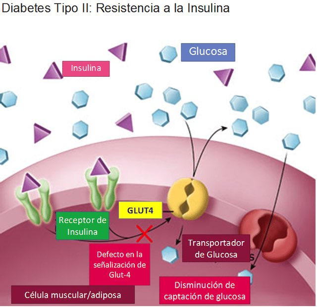

La Resistencia a la insulina se produce cuando la insulina es producida por el cuerpo, pero no es utilizada eficazmente por las células.

La insulina es una hormona que permite que las células de todo el cuerpo, particularmente del hígado y de los músculos, absorber la glucosa y utilizarla para crear energía.La Resistencia a la insulina interfiere con la absorción y puede conducir al desarrollo de la pre-diabetes o diabetes tipo 2.

## ¿Cómo desarrolla la resistencia a la insulina?

La Resistencia a la insulina tiene un fuerte factor genético. Nativos americanos, afroamericanos, hispanos, asiáticos americanos e isleños del Pacífico tienen todos un mayor riesgo de desarrollar resistencia a la insulina. Los antecedentes familiares de diabetes tipo 2 son también un indicador de un mayor riesgo de desarrollar resistencia a la insulina. Ciertos medicamentos pueden contribuir a la resistencia a la insulina, incluyendo un número de medicamentos utilizados para tratar el trastorno bipolar (Zyprexa, Depakote, clozaril, Seroquel y Risperdal), así como ciertos esteroides.

El síndrome metabólico, un grupo de trastornos que incluyen el exceso de peso (especialmente alrededor de la media), presión arterial alta y niveles elevados de lípidos en sangre también pueden causar resistencia a la insulina.

El embarazo, el estrés, las infecciones o la apnea del sueño no tratada, son otros factores de riesgo que pueden desarrollar resistencia a la insulina.

## En que se diferencian la resistencia a la insulina y la diabetes?

Existe una considerable superposición en los diagnósticos de resistencia a la insulina y la diabetes, pero no son la misma enfermedad. Con resistencia a la insulina, el cuerpo continúa produciendo insulina. De hecho, como las células de los músculos, la grasa y el hígado empiezan a no tomar en la insulina producida, el cuerpo aumenta la producción de insulina en un intento de hacer que estas células acepten la glucosa que comienza a acumularse en el torrente sanguíneo.

Si usted sufre de resistencia a la insulina su cuerpo producirá constantemente insulina y como los tejidos no responden a ella el cuerpo no será capaz de usar el azúcar apropiadamente.

La Diabetes resulta cuando el cuerpo deja de producir insulina o cuando el páncreas comienza a disminuir la producción de insulina después de un período de alta demanda, a menudo causada por la resistencia a la insulina.

## Existe tratamiento para resistencia a la insulina?

Si el páncreas sigue haciendo cantidades adecuadas de insulina, pero las células son cada vez más insensibles a ella, existen medicamentos que se pueden tomar para "volver a sensibilizar" a las células hepáticas y musculares. Una clase de medicamentos es metformina (Glucophage) y el otro es thiazolinediones (Actos y Avandia).

Los mismos cambios de estilo de vida que se recomiendan para las personas con diabetes, como ser el control de peso, ejercicio o comer una dieta equilibrada también son beneficiosos en la prevención de que la resistencia a la insulina se convierta en un diagnóstico de diabetes.

Debido a que no existe una prueba diagnóstica específica para la resistencia a la insulina, y porque no hay síntomas, el paciente puede tenerla durante muchos años antes del diagnóstico. Debido a esto, el paciente recibe finalmente un diagnóstico de diabetes tipo 2, una enfermedad necesitará controlar.
