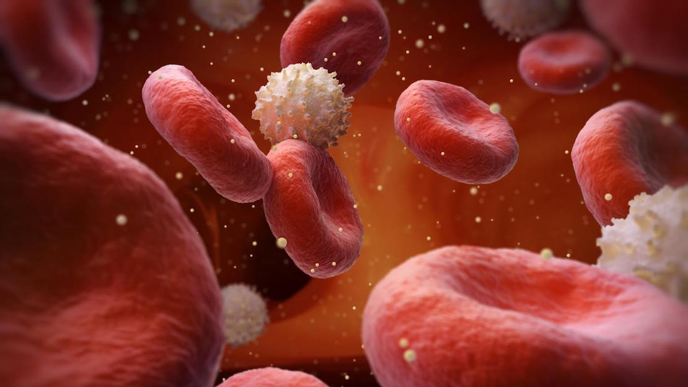

El azúcar es uno de los alimentos más comunes que se encuentran en nuestros refrigeradores y estantes de la despensa. Actualmente vivir sin ese aditivo sería algo ilógico. Se presenta en muchas formas diferentes, que van desde los complejos carbohidratos de granos enteros a [los carbohidratos](/que-son-carbohidratos/) simples que se encuentran en el azúcar refinado blanco y en alimentos altamente procesados. Tu cuerpo necesita pequeñas cantidades de azúcar al día para funcionar normalmente, pero demasiada cantidad de una sola vez puede hacer que experimentes reacciones adversas asociadas con una sobredosis de azucar.

## Azúcar alta

Cuando se presenta un alto nivel de azúcar producto de una sobredosis de azúcar, te sentirás como si estuvieras acelerado. Tus manos pueden empezar a temblar y tu cuerpo puede experimentar movimientos compulsivos. Sentarte inmóvil durante una subida de azúcar puede llegar a ser bastante difícil.

## Una sobredosis de azucar conduce a un choque de Azúcar

Cuando hay un exceso de azúcar en la sangre, el páncreas libera [insulina](/que-es-la-insulina-cuantos-tipos-existen/), que circula a través de tu cuerpo y le dice a las células que deben eliminar el azúcar de la sangre. El páncreas va rápidamente a resolver este desequilibrio. Esto produce un desequilibrio o choque súbito, pues se pasa de tener azúcar alta a una baja de azúcar repentino. Esto conduce a la fatiga, debilidad, irritabilidad y hambre por tener niveles de azúcar bajos en la sangre. Irónicamente cuando luego se producen antojos por lo general es de algo dulce.

## Almacenamiento de grasa

Después de que las células toman el azúcar que ingerimos tienen que hacer algo con él. Normalmente pequeñas cantidades de azúcar se utilizan como combustible, pero si hay una cantidad excesiva, ésta se almacena en las células grasas para su uso posterior. Así que las sobredosis de azucar  conducen a la acumulación de grasa extra.

## Bajo funcionamiento del sistema inmune

El exceso de azúcar en tu cuerpo en un momento dado disminuye el funcionamiento de tu sistema inmunológico. Las células blancas de la sangre no combaten las bacterias tan eficazmente cuando los azúcares simples se consumen en grandes cantidades. Esto es más notable de 30 minutos a 5 horas después del consumo. Si empiezas abusar del consumo de dulces mientras estás estresado, esto aumentará la probabilidad de enfermarte. La combinación de estrés y azúcar simple influirá de manera negativa en tu sistema inmune. La excepción a esto es si el azúcar viene en forma de hidratos complejos de carbono o almidones tales como los tubérculos.

Debe consumir alrededor de 40 gramos de azúcar por día, evitando los refrescos y dulces que no aportan nada valioso desde el punto de vista nutricional. Y para que empieces a controlar cualquier problema relacionado al azúcar y evitar que vaya a decantar en una inesperada diabetes chequea nuestro recurso.
