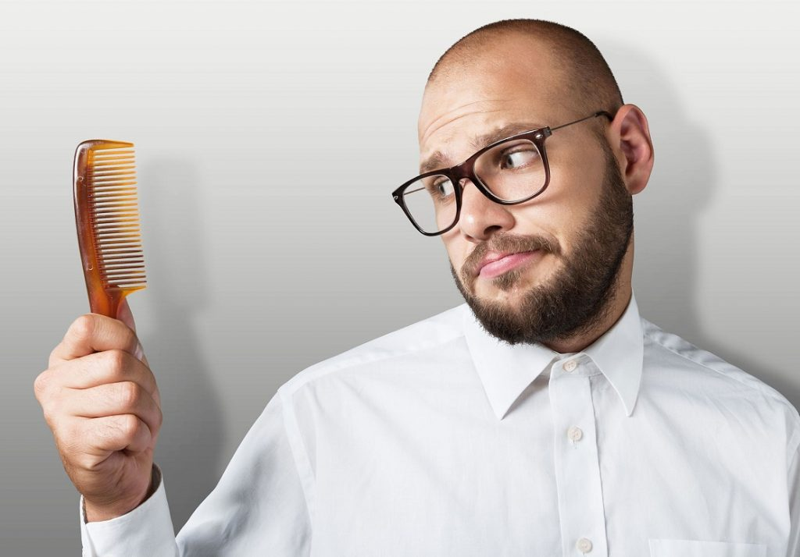

La diabetes es una condición que hace que el cuerpo no produzca suficiente insulina o no pueda aprovecharla adecuadamente. Como resultado, la circulación de la sangre se reduce y las contusiones y heridas no sanan fácilmente. La falta de circulación afecta el cuero cabelludo impidiendo que el folículo piloso se nutra. La persona promedio pierde un poco de pelo en todo el día, pero debido a que el cuerpo no lo repone rápidamente muchos diabéticos experimentan pérdida de cabello. Existen algunas medidas preventivas que se pueden tomar contra la caída del cabello en los diabéticos.

## 

## Indicaciones

1. Si estás perdiendo el cabello acude al médico inmediatamente: es posible que sea a causa de la diabetes y aún no te has enterado. Entre más pronto obtengas un diagnóstico sobre el origen de la pérdida de cabello, mejores oportunidades tendrás de hacer algo al respecto y podrás enfrentar mas eficientemente las consecuencias y detener los daños.
2. Cambia los medicamentos si actualmente tienes diabetes: en algunos casos existen medicinas cuyos efectos secundarios indeseados incluyen la perdida de cabello. Pide consejo a tu médico sobre la medicación adecuada para tu caso en particular.
3. Toma medicamentos que combatan las infecciones fúngicas y bacterianas, que es a menudo la causa de la pérdida del cabello en los diabéticos. Este tipo de medicinas puede ayudar a detener la pérdida de cabello.
4. Cuando enfermamos tendemos a deprimirnos, sobre todo si el diagnóstico es potencialmente grave como suele suceder con la diabetes. Trata de relajarte y reducir el estrés en tu vida, ya que puede ser una causa de pérdida de cabello. La diabetes puede aumentar el estrés y es importante descansar lo suficiente y hacer ejercicio regularmente - por lo menos 30 minutos al día - para limitar cualquier depresión.
5. Es muy importante Consumir una dieta saludable - baja en grasas y rica en frutas y verduras. Esto ayudará a mantener los niveles de insulina en un rango normal, lo que debería limitar la pérdida de cabello.
6. Hazte masajes en el cuero cabelludo para ayudar a la circulación sanguínea y fortalecer las raíces de los folículos pilosos.
7. No olvides comprobar regularmente los [niveles de glucosa](/cuanto-es-el-nivel-normal-de-glucosa/) en la sangre. Si estos se mantienen en los rangos normales no deberías de sufrir de perdida de cabello por esta causa.

En cualquier situación, empezar a perder el cabello, puede ser una señal de alerta.
