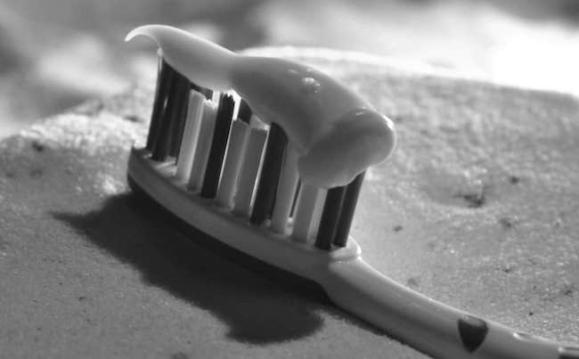

La diabetes, una condición causada por una alteración en la producción de insulina, que dificulta la capacidad del cuerpo para utilizar adecuadamente la glucosa. Esta condición se manifiesta de muchas maneras, incluyendo entre sus efectos el mal aliento. A veces los diabéticos emiten un olor químico con sabor a fruta o dulce. La higiene bucal en general puede eliminar o minimizar el mal aliento provocado por la diabetes.

## Mal aliento o halitosis.

Cualquiera que sea el nombre, es algo que nadie quiere. El mal aliento puede ser ligeramente molesto (así como socialmente molesto), y aunque puede ser causado por esa cena de pollo de 13 dientes de ajo que comió anoche, también puede indicar algo más grave, especialmente si tiene diabetes. Siga leyendo para aprender más acerca de la halitosis y como combatirla.

## ¿Qué es el mal aliento?

Si su aliento huele mal a usted o aquellos alrededor tuyo lo sienten, tiene mal aliento, también conocido como halitosis. Probablemente lo hemos tenido en algún momento, quizás relacionado con un alimento o bebida que hemos consumido, o posiblemente nos hemos despertado por la mañana con lo que yo llamo "aliento de dragón".

El aliento es desagradable (para usted y para los demás) y sin duda puede ser embarazoso (¿quién quiere el mal aliento cuando estás en una entrevista de trabajo o una primera cita?). Nuestra sociedad considera el mal aliento como algo que también debe ser desterrado: simplemente camine por el pasillo de la farmacia y presencie los enjuagues bucales, las pastas de dientes y otras pociones para librarse de esta condición. Desafortunadamente, la mayoría de estos productos funcionan temporalmente y, en algunos casos, pueden empeorar la condición.

## ¿Qué causa el mal aliento?

Hay muchas posibles causas del mal aliento, que van desde los alimentos a la higiene bucal a las condiciones de salud; las principales causas son las siguientes:

**Alimento:** Las partículas de alimentos que se atascan en la boca y los dientes comienzan a descomponerse y pueden causar olores. Además, algunos alimentos, como la cebolla y el ajo, se digieren y luego los compuestos que contienen azufre en ellos pasa a través de la sangre y los pulmones, donde se exhala. Cepillarse los dientes o usar el hilo dental, o enjuagarse la boca con un enjuague bucal cubre temporalmente el mal aliento, pero no lo quitará por completo. En el caso de los alimentos con olor fuerte, es necesario dejar que el cuerpo  los procese.

**Tabaco:** "La respiración del fumador" es muy desagradable. Además de los cigarrillos, otros tipos de tabaco pueden causar igualmente mal aliento, incluyendo el uso de tabaco de mascar, puros y pipas. El tabaco también puede manchar los dientes, reducir la capacidad de probar los alimentos, y causar enfermedad de las encías severa.

**Boca seca:** También llamada xerostomía, la boca seca puede ser el resultado de muchos factores, incluyendo medicamentos, daño a los nervios, tabaquismo, tratamientos contra el cáncer, envejecimiento y ciertas condiciones de salud, como el síndrome de Sjogren. La falta de saliva puede causar que los olores se acumulen (lo que es una de las razones por la que el "aliento de la mañana" no huele exactamente como una cama de rosas!).

**Mala higiene oral:** No cepillarse los dientes y usar hilo dental de acuerdo a las recomendaciones de su dentista puede dejarle con el aliento maloliente. Las partículas de alimentos pueden quedar atascadas entre los dientes, e incluso su lengua puede quedar cubierta con una película de bacterias, que puede conducir a la formación de olores.

**Las prótesis dentales mal ajustadas** y/o no limpiar correctamente las dentaduras postizas es otra fuente de olor en la boca. No cuidar sus dientes y encías puede conducir a periodontitis, o enfermedad de las encías, que es una condición grave. La enfermedad periodontal afecta los tejidos y el hueso que sostienen sus dientes. Además, se puede generar inflamación e infecciones. En el caso de la diabetes, la inflamación y las infecciones pueden causar elevados niveles de azúcar en la sangre.

Los signos de la enfermedad periodontal incluyen mal aliento, encías rojas o blandas, encías que sangran y dientes flojos o sensibles.

**Dieta muy baja en calorías o baja en carbohidratos:** Si está reduciendo drásticamente las calorías y/o carbohidratos para bajar de peso, es probable que forme sustancias llamadas cetonas, que son un subproducto de la descomposición de las grasas. Las centonas pueden hacer que su aliento huela mal.

**Medicamentos:** Algunos medicamentos causan mal aliento, incluyendo antihistamínicos, antidepresivos, diuréticos y ciertos medicamentos para la presión arterial.

**Condiciones en la boca, nariz y garganta:** El goteo post nasal, pequeñas piedras que se forman en las amígdalas, y cualquier infección de la nariz, garganta o boca puede conducir a halitosis.

**Reflujo ácido y otras condiciones:** El reflujo crónico del ácido del estómago (llamado enfermedad del reflujo gastroesofágico) puede literalmente dejar un mal sabor en la boca y causar mal aliento. Enfermedades del hígado, enfermedad renal, neumonía, trastornos metabólicos, y algunos tipos de cáncer, también, puede causar mal aliento.

**Cetoacidosis diabética:** Las personas que tienen diabetes tipo 1 (y algunas personas con tipo 2 que toman insulina) corren el riesgo de desarrollar cetoacidosis diabética, una condición médica muy grave que puede ocurrir debido a la falta de insulina. Uno de los signos distintivos de cetoacidosis diabética es un olor dulce y afrutado a la respiración.

## Prevención y tratamiento del mal aliento provocado por la diabetes

1. Mantén bajo control  los [niveles de glucosa](/cuanto-es-el-nivel-normal-de-glucosa/) en la sangre para deshacerte del mal aliento. Los niveles altos de glucosa causan el mal aliento en los pacientes diabéticos.

2. Cepíllate los dientes al menos dos veces al día. Cepilla los dientes y la lengua con una pasta de dientes que  combate gérmenes y usa hilo dental para eliminar las partículas entre los dientes. Si usas prótesis dentales debes removerlas todas las noches y limpiarlas antes de colocarlas en la boca.

3. Bebe agua abundantemente. Si creas un ambiente húmedo en tu boca aumenta la producción de saliva y reduce el mal aliento relacionada con la diabetes. Los diabéticos suelen tener la boca seca, lo cual permite que restos de alimentos y  bacterias permanezcan en los dientes.

4. Mastica chicle sin azúcar o chupa caramelos que no la contengan. Como el agua, estos productos sin azúcar mejoran la producción de saliva, lo que ayuda a eliminar el mal aliento causado por la diabetes.

5. Come alimentos que te ayuden naturalmente a deshacerte del mal aliento. Las frutas frescas y verduras como el apio y manzanas, y yogures que contienen cultivos activos combaten el mal aliento causado por la diabetes. Masticar frutas y vegetales crudos aumenta la producción de saliva en la boca. La Asociación Dietética Americana dice que las cultivos activos y la vitamina D en el [yogur](/yogur-griego-en-la-dieta-diabetica/) matan a las bacterias que causan el mal aliento.

6. Visita al odontólogo al menos dos veces al año. Los dentistas pueden dar a los pacientes consejos para deshacerse del mal aliento provocado por la diabetes. Tu médico de confianza te puede proporcionar el nombre de un médico que se especializa en odontología diabética o puedes visitar clínicas dentales para obtener información sobre dónde encontrar un dentista que se especialice en los diabéticos.
