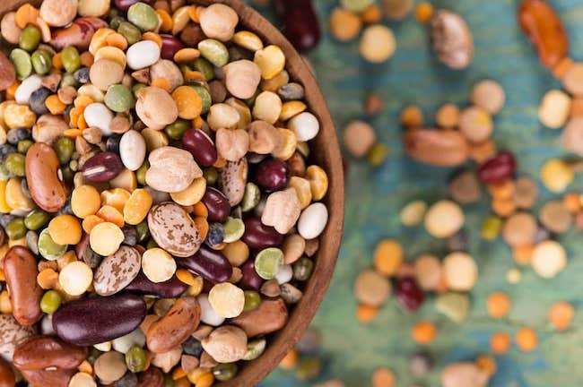

Los diabéticos tienen el desafío de encontrar alimentos que sean altos en energía y que a la vez tenga un índice glucémico (IG) bajo. Los alimentos perfectos en energía para los diabéticos son los que tienen valores de IG bajo, ya que el cuerpo tiene más tiempo para convertir la comida en energía. Esto significa que la energía se libera a una velocidad más consistente que con otros alimentos y no hay riesgo de aumentos repentinos en los niveles de azúcar en la sangre.

## 

## Legumbres

Las legumbres comprenden las semillas de lentejas, frijoles y guisantes. Las legumbres son plantas leguminosas, y son una fuente eficaz de energía para los diabéticos debido a que tienen un bajo valor de IG; también tienen una gran cantidad de fibra, proteínas, vitaminas y carbohidratos complejos, el último de los cuales es especialmente importante para la resistencia y energía a largo plazo. Otra ventaja es que no tienen colesterol y son bajas de contenido de grasa, lo que les hace una opción viable de alimentos para los diabéticos que están en busca de alimentos ricos en energía y que los mantengan o hagan perder peso. La mejor manera de prepararlos es simple; remojar los frijoles en agua durante seis a ocho horas antes de cocinarlos, o dejarlos en agua caliente durante una hora. Cocina a fondo hasta que los frijoles se ablanden, lo que hará que sean más fáciles de digerir.

## Los hidratos de carbono complejos

Cualquier alimento que contengan carbohidratos complejos son un buen sustituto de una dieta más azucarada la cual te dará energía inmediata, pero será en última instancia peligrosa para los diabéticos. Todo se debe comer con moderación, pero los alimentos con carbohidratos complejos debe consistir en cerca de la mitad de las calorías diarias de una persona, ya que los hidratos de carbono complejos tienden a ser altos en almidón. Ellos deben ser equilibrados con verduras y frutas. Ejemplos de alimentos ricos en carbohidratos complejos eficaces que son buenos para la energía y la resistencia son _**el pan, pasta de trigo integral, patatas, arroz, cereales y zanahorias**_.

## Lo que debes evitar

Evita los alimentos ricos en hidratos de carbono simples tanto como sea posible; a pesar de que te pueden dar el impulso de energía inmediata que deseas, para un diabético, es peligroso comer mucho de todo lo que contiene glucosa, fructosa, sacarosa o galactosa (el azúcar de la leche). Si estás entrenando para una actividad física intensa, siempre consulte a un nutricionista antes de comenzar una nueva dieta. Tu dieta, como diabético, dependerá de tu situación, del tipo de diabetes que tengas, y de lo que tu cuerpo puede manejar.
