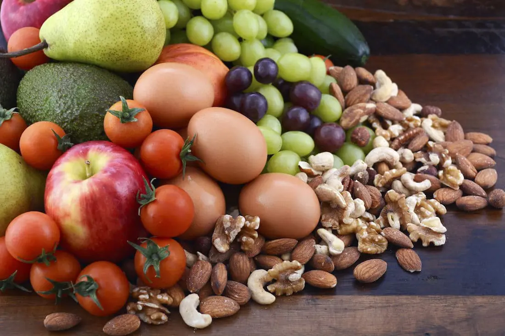

El índice glucémico (IG) mide la **velocidad** a la que los alimentos específicos elevan los [niveles de glucosa](/cuanto-es-el-nivel-normal-de-glucosa/) en sangre. Es necesario identificar los alimentos que eleven rápidamente tu nivel de azúcar en la sangre y también identifica los alimentos que se procesan más lentamente en el cuerpo y por lo tanto mantienen tus niveles de azúcar en la sangre estables durante un período de tiempo más largo.

## Bajo índice glucémico

Los alimentos con un índice glucémico bajo se digieren y absorben en el cuerpo lentamente. Los alimentos con bajo IG tienen un impacto gradual en los niveles de azúcar en la sangre.

## Beneficios

Los alimentos con bajo IG pueden ayudar a mejorar tus niveles de colesterol, controlar tu peso, reducir el riesgo de enfermedades del corazón, ayudan a mantenerte lleno o saciado durante períodos más largos de tiempo y mejoran tu control de la diabetes.

## Valores

Los alimentos con bajo IG son comidas con un índice glucémico inferior de 55. Los alimentos generalmente tiene establecidos sus índices glucémicos. Una porción de helado bajo en grasa, por ejemplo, es ideal con un IG de 50. Una porción de galletas de arroz, sin embargo, tiene un IG de 77.

## Ejemplos

Los alimentos más comunes con bajo índice glucémico son el brócoli, alcachofas, maní, [yogur](/yogur-griego-en-la-dieta-diabetica/) bajo en grasa, la cebada, el ñame, plátanos, coliflor, berenjena, garbanzos y macarrones.

## Dieta para lograr un índice glucémico (IG) bajo

El cambio a una dieta de bajo índice glucémico es tan simple como la sustitución de [los carbohidratos](/que-son-carbohidratos/) con IG alto, como el pan blanco (con un IG de 71) por los alimentos con IG bajo, como el pan integral (con un IG de 48). Te toca investigar y tabular cada alimento en base a su IG para que así mantengas un control estricto de lo que comes. Las tentaciones culinarias siempre van a estar presentes pero debes ser disciplinado en este aspecto ya que tu salud integral depende de ello. Además, esa disciplina no implica comer mal ni mucho menos ya que sobran alternativas de dietas muy sabrosas y nutritivas que cumplen con estándares bajos en los niveles de Indice Glucémico.
