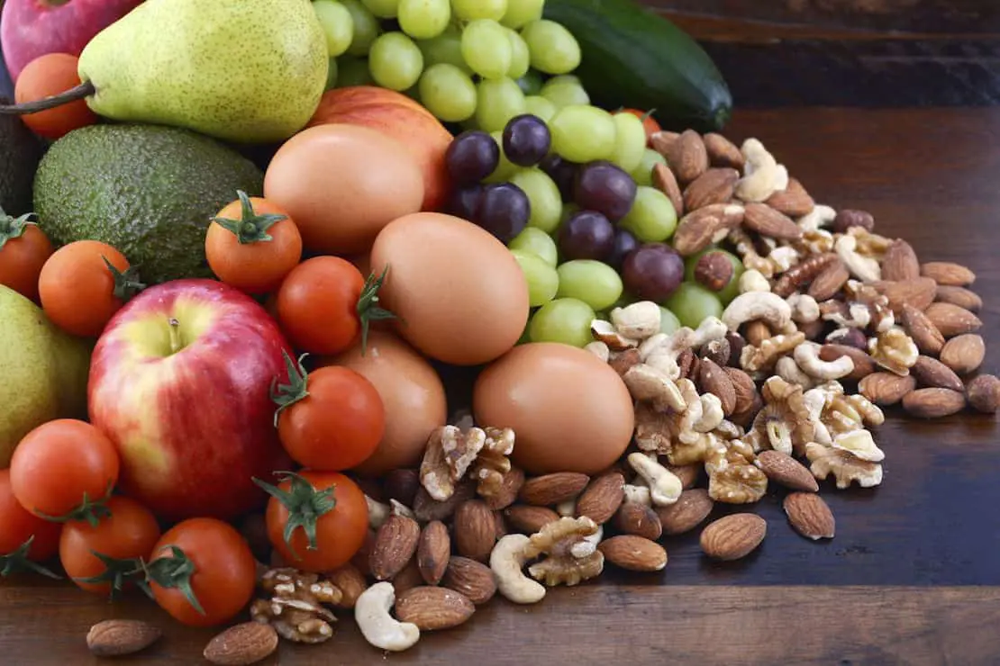

El índice glucémico (IG) clasifica los alimentos de acuerdo a la cantidad en que elevan el nivel de azúcar en la sangre de un individuo. Los alimentos con un IG alto (generalmente, 70 o más) se digieren y absorben muy rápidamente, haciendo que se elevan los niveles de azúcar en la sangre vertiginosamente, lo que puede ser un problema para las personas con [diabetes tipo 2](/diabetes-tipo-2/) y con enfermedad cardíaca coronaria. Estos alimentos son menos saludables que los alimentos con IG bajo, que han demostrado ser beneficiosos para la salud, pues ayudan a controlar la diabetes y a bajar de peso. A continuación verás los alimentos con IG alto que pueden ser perjudiciales para ti.

## Panes de harina refinada

Se consideran varios tipos de panes que tienen un alto índice glucémico. Después de comer panes con IG alto, el azúcar en la sangre puede aumentar sus niveles muy rápidamente. Los panes que tienen un alto índice glucémico incluyen pan blanco, baguettes, panecillos, pan negro y el pan sin gluten. Galletas de la oblea entran en esta categoría también.

## Pasta y arroz

Algunas pastas y arroces tienen un IG alto. Incluyen macarrones con queso o espaguetis de trigo durum. Ciertos arroces tienen un alto índice glucémico, incluyendo el arroz integral y arroz jazmín. Las tortas de arroz también tienen un IG alto.

## Cereales y desayunos típicos

Los cereales para el desayuno que son altos en niveles de carbohidratos tienden a tener el mayor índice glucémico. Estos cereales incluyen Coco Pops, hojuelas y copos de maíz, trigo inflado, Rice Krispies, Weetabix, Golden Grahams y Bran Flakes. Algunos granos de cereales tienen un IG alto, incluyendo copos de cebada y mijo. Una serie de desayunos y productos de panadería también se incluyen en esta categoría, incluyendo donuts, cruasanes y galletas.

## Bocadillos

Cuando se trata de aperitivos, no es de extrañar que muchos de ellos caen en un rango de IG superior. galletas saladas, caramelos y helados son algunos de los aperitivos con el más alto índice glucémico. Chips de maíz y galletas de soda se pueden añadir a esa lista también. Además, cada vez que agregas el azúcar de mesa a un alimento, los IG aumentan significativamente.

## Frutas y vegetales

A pesar de que consideramos que las frutas y verduras son ideales para estar sanos, algunos de estos alimentos tienen un IG más alto que los demás, incluidas las patatas, nabos, piña y sandía. . Las habas entran también en esta categoría, aunque técnicamente son una legumbre.
