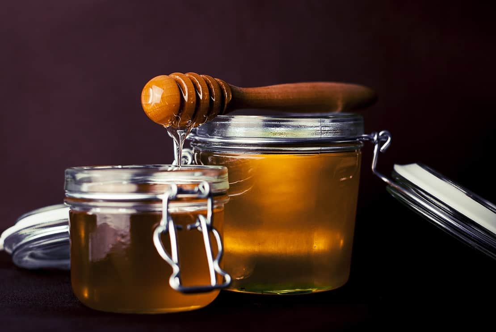
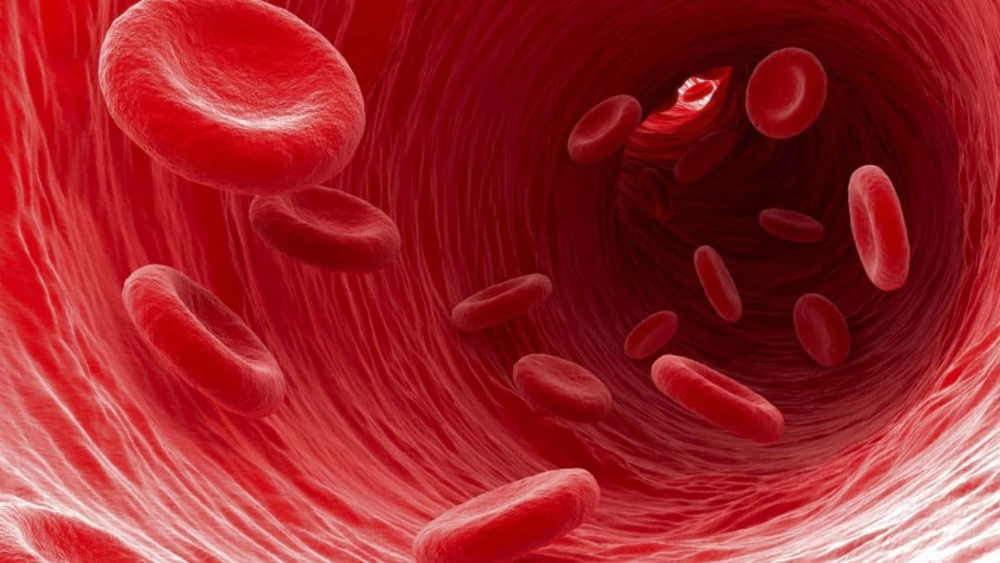
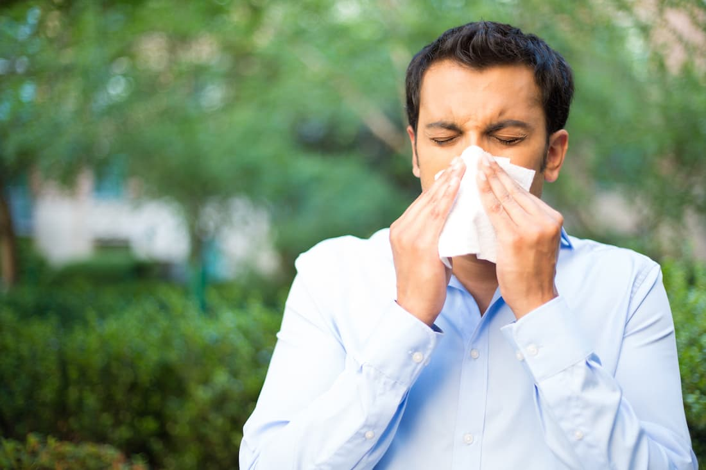

La miel es un edulcorante natural compuesto por 80 por ciento azúcares  naturales, 18 por ciento de agua y 2 por ciento de vitaminas y minerales. Comer mucha miel podría dar lugar a algunos efectos secundarios negativos como el aumento de peso, cambios en los niveles de azúcar en la sangre e incluso alergias.
En algunos casos, como el de una enfermedad preexistente, comer demasiada miel podría tener consecuencias graves. Y si eres de los que les gusta ir al campo a buscar tu propia miel no te va a gustar para nada encontrarte con un enjambre de abejas africanas, pero bueno, eso es otro tema.

## #1 Aumenta el nivel de azúcar en la sangre

La miel no es tan buena para las personas que sufren de diabetes debido a la gran cantidad de azúcar presente en ella. Debido a que la miel no contiene ninguna fibra,el consumir miel puede aumentar el nivel de azúcar en la sangre más rápidamente en comparación con aquellos alimentos con azúcar que contienen fibra.

Por lo tanto, si tienes diabetes o si estás sufriendo de baja de azúcar en la sangre, debes ser cauteloso al comer miel, porque la dulzura y la composición química de la miel son los mismos que el azúcar de mesa, sigue la misma precaución al consumir miel como si está consumiendo azúcar regular.

La dosis máxima recomendada de todos los azúcares (azúcar, miel o alimentos procesados) para **una persona saludable es de diez cucharadas por día**, lo que significa que debes en todo momento cuidar su consumo de azúcar. En el caso de una persona con diabetes, debes entender que el consumo de azúcar está muy relacionado con el número de carbohidratos máximo que puedes consumir en un día.

## #2 Puede causar aumento de peso

Tomar miel con agua tibia o jugo de limón promueve la pérdida de peso, ayuda en la pérdida de calorías adicionales y la eliminación de esos kilos de más. Sin embargo, es importante señalar que comer mucha miel y/o consumir miel por sí sola no es tan bueno para nuestro peso y puede engordarnos.

La miel contiene la misma proporción de calorías que el azúcar de mesa y de jarabe de maíz alto en fructosa, cuatro por gramo. Al igual que estas otras fuentes de azúcar, comer cantidades excesivas de miel sin aumentar el ejercicio se traducirá en un aumento de peso. El aumento de peso ocurre cuando la ingesta calórica supera las calorías quemadas.

Por lo tanto, la mejor manera de consumir miel para perder peso y mantener tu peso bajo control es consumirla con el estómago vacío: con un vaso de agua tibia o con un vaso de jugo de limón. Como mencioné anteriormente, la dosis máxima de todos los azúcares(combinados) en una persona saludable es de diez cucharadas por día y si desea mantenerse saludable, debemos mantener siempre este límite en nuestra mente.

## #3 Debe ser evitado por personas con presión arterial baja

La presión arterial juega un papel importante en mantenernos sanos, tanto la presión arterial alta como la presión arterial baja pueden tener un efecto negativo en nuestro cuerpo. Por lo tanto, es importante asegurarnos que nuestra presión arterial se mantenga bajo control.

El consumo de miel puede bajar la presión arterial, si sufres de presión arterial baja, debes evitar la miel, ya que sólo empeorará su condición. De la misma manera, si sufres de presión arterial alta y estás tomando medicamentos, debes evitar comer miel: bajará su presión arterial a un nivel tan bajo que puede poner su salud en peligro.

## #4 Puede causar estómago cólicos, estreñimiento, hinchazón etc.

La miel es buena para nuestro sistema digestivo y ayuda a mantenerlo saludable. Sin embargo, comer demasiada miel puede tener un efecto adverso en nuestro sistema digestivo dando lugar a condiciones como cólicos estomacales, diarrea, estreñimiento e hinchazón. La dosis máxima recomendada de miel es de diez cucharadas por día.

Consumir miel por encima de este nivel puede hacer más daño que bien. Esto es causado por la gran cantidad de fructosa presente en la miel. La alta cantidad de fructosa en la miel disminuye las funciones del intestino delgado para absorber los nutrientes adecuadamente.

## #5 Diabetes, Cáncer y enfermedades cardíacas

El uso _**excesivo**_ de la miel en los alimentos o comerla por sí sola puede aumentar el riesgo de desarrollar una enfermedad crónica como enfermedades del corazón. El cáncer de páncreas se incrementa en _70 por ciento_ en una dieta alta ingesta de azúcar. La Miel afecta a la producción de [insulina](/que-es-la-insulina-cuantos-tipos-existen/) en el cuerpo de la misma manera que el azúcar de mesa y la estimulación constante de la producción de insulina por comer en exceso miel puede conducir a la [diabetes tipo 1](/diabetes-tipo-1-diagnosticado/).

## #6 Alergias

Comer miel, en ocasiones, puede causar reacciones alérgicas en los seres humanos. La causa es la miel que ha sido contaminada con tipos específicos de polen o ha sido creado con el néctar de plantas específicas. Dependiendo de la severidad de la alergia a las especies de plantas, el consumo de un poco o mucho de una cierta variedad de miel podría resultar en diarrea, picazón en la mucosa, dolor abdominal, vómitos y reacciones más graves como anafilaxia y angioedema. Nunca le de miel a un bebé ya que puede desarrollar botulismo.

## #7 Acné

Comer alimentos que tienen alto índice glicémico aumenta la presencia de acné en la piel. El indice glicémico de la Miel oscila de bajo a alto dependiendo del tipo de miel. Comer cantidades excesivas de miel aumentará los valores glucémicos, independientemente del tipo de miel consumida y podría causar que aparezca o empeore el acné.

La moderación es la clave si deseas disfrutar de la miel, lo mejor es consultar primero con su médico, ya que él/ella será el mejor para decidir si usted puede (o si no puede) comer miel.
