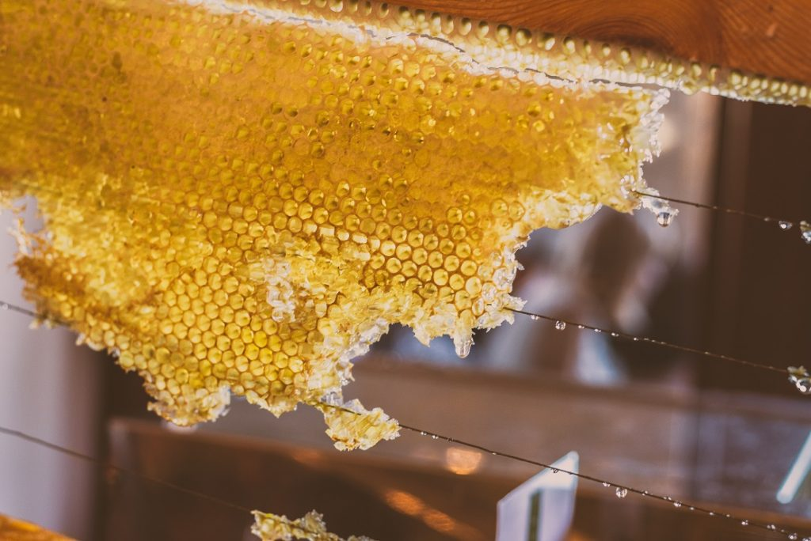

La miel es un alimento natural que tiene aproximadamente el mismo dulzor que el azúcar, pero contiene más calorías y más hidratos de carbono. Debido a la alta cantidad de hidratos de carbono en la miel muchas personas prefieren utilizar un sustituto sin azúcar para satisfacer su deseo de dulces. Los diabéticos y otras personas que necesitan controlar el consumo de azúcar, pero no quieren renunciar al sabor dulce, pueden beneficiarse de un sustituto de la miel sin azúcar.

## Néctar de Agave

El néctar de Agave tiene un sabor similar a la miel y muchos lo prefieren por encima ésta. Se extrae desde el núcleo de la planta. El néctar se filtra y se calienta a baja temperatura para descomponer [los carbohidratos](/que-son-carbohidratos/) en azúcares. Es considerado por muchos como un alimento crudo a causa del procesamiento de la baja temperatura.

Una porción . contiene sólo 60 calorías y 16 gramos de carbohidratos. Es menos viscoso que la miel, se mezcla fácilmente en alimentos y se vierte suavemente. A diferencia de los edulcorantes artificiales, no tiene sabor amargo. Es más dulce que el azúcar por lo que se requiere poca cantidad para endulzar. Además el sirope de agave posee un bajo índice glucémico, lo que implica que nos mantiene sin hambre durante más tiempo.

## Stevia es uno de los sustitutos de la miel más efectivo

Basado en la base de datos USDA, la Stevia pertenece a un grupo de edulcorantes no nutritivos. Esto significa que no hay calorías, vitaminas ni otros nutrientes. La disponibilidad de Stevia puede variar de un país a otro.

Actualmente, se utiliza comúnmente en los EE.UU. y fue aprobado para su [uso en la UE en 2011](http://www.efsa.europa.eu/en/efsajournal/pub/1537). Los efectos sobre la salud de la Stevia han sido cuestionados durante las últimas décadas. Sin embargo, según estudios recientes de la OMS (Organización Mundial de la Salud), el extracto de Stevia no parece tener efectos nocivos. Cuando se usa con moderación, la mayoría de los productos son 200-300 veces más dulce que el azúcar! Puede comprarse la Stevia en polvo (verde natural o refinado / blanco), Stevia en gotas (NuNaturals y SweetLeaf) o la Stevia glicerita (este es sólo el doble de dulce que el azúcar, con consistencia pegajosa).

La Stevia proviene de una planta que se encuentra en China y América del Sur y es un edulcorante y sustituto del azúcar obtenido a partir de las hojas de la especie de planta Stevia rebaudiana. Ayuda a equilibrar el páncreas y se recomienda para los diabéticos. Es más dulce que el azúcar o la miel y tiene un índice glucémico bajo. Está disponible en forma líquida o en polvo y se puede utilizar para cocinar y hornear. Es un edulcorante a base de hierbas y ayuda a regular el tracto digestivo. Stevia se disuelve fácilmente en bebidas frías y calientes.

**¿Es la stevia el sustituto perfecto para la miel o el azúcar?** No, pero me encanta y lo uso todos los días! Algunas personas encuentran la stevia amarga o son alérgicas a ella. ¡No todas las marcas son iguales! Algunas marcas y formas de stevia tienen mejor sabor y funcionan mejor que otras. El gusto es subjetivo, lo que te guste a tí puede que no me guste a mí

## Eritritol

Eritritol es un sustituto de la miel que se encuentra naturalmente en frutas, verduras y alimentos fermentados. Es un alcohol de azúcar que no afecta la glucosa en la sangre y tiene cero calorías. A diferencia del xilitol, son pocos los casos reportados sobre efectos laxantes. Esto se debe a que el 90% del Erythritol es absorbido antes de que entre en el intestino grueso y se excreta a través de la orina.

Según la investigación médica, el cuerpo humano puede tolerar saludablemente dosis diarias de hasta 1 gramo por kilogramo de peso corporal. Sin embargo, en grandes cantidades, puede causar malestar estomacal.

El eritritol tiene un [indice glucemico](/indice-insulinico-y-el-indice-glucemico/) (IG) de 0 y 0,2 calorías por gramo. No afecta el azúcar en la sangre y es adecuado para una dieta baja en carbohidratos. Su dulzura es de aproximadamente 0,7 de azúcar y es posible que tenga que utilizar un poco más cantidad que si consumieras azúcar.

El eritritol es comúnmente utilizado en la cocina baja en carbohidratos y es uno de mis favoritos. Puede probar edulcorantes disponibles comercialmente como Erythritol (no-GMO) o Swerve (una combinación de eritritol y oligosacáridos). Otro producto que recientemente he encontrado y recomendaría es Lakanto, que está hecha de Erythritol no-OGM y fruta de Luo Han Guo (fruto monje). Por último, Sukrin es otro edulcorante a base de eritritol que puede probar.

**¿Es el eritritol el sustituto perfecto de la miel o el azúcar?** No, pero esta muy cerca! Lo negativo es que es costoso, tiende a recristalizarse lo que resulta en una textura "crujiente" en helados, pudines, y tortas de queso. Esto también provoca el endurecimiento al enfriarse, por ejemplo: verás una corteza fina en tortas o una salsa de caramelo muy dura al enfriarse.

## Miel de Imitación

Hay una opción de imitación a la miel. Es sin azúcar y es ideal para las personas que requieren vigilar su consumo de azúcar y para los diabéticos. Puede ser utilizado como un sustituto de la miel en recetas o como un edulcorante para el té o café. Tiene el sabor y la sensación de la miel real y tiene una consistencia espesa, pero está hecha de jarabe de maltosa que se ha reducido para formar maltitol. Es seguro para las personas que deben controlar el azúcar en la sangre o deben tener en una dieta baja en hidratos de carbono.

## Como utilizar estos sustitutos de la miel para cocinar

La manera de combinar los edulcorantes en las comidas es un gusto muy personal. Las papilas gustativas perciben la dulzura de una manera única dependiendo de la persona.

Así es como yo los uso para cocinar ...

Si una receta regular pide 1-2 tazas de azúcar, normalmente uso 1/3 - 2/3 taza de eritritol granulado y luego aumento la dulzura con aproximadamente 1/4 - 1 cucharadita de stevia glicerita. ¿Por qué? Para mí, el eritritol produce un sabor muy fuerte y una sensación de quemazón en la parte posterior de mi garganta. He descubierto que el uso de una cantidad mínima de eritritol y el agregar la stevia (que es super-dulce) contrarresta tanto el sabor agudo de la eritritol y mitiga cualquier amargura de la stevia. El uso de eritritol y stevia juntos me permite usar menos eritritol, lo que me también me ahorra dinero.
