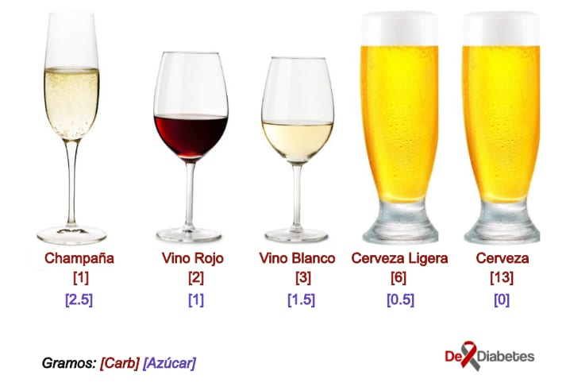

import { CarbsAlcohol } from '../../../constants/Tables/CarbsAlcohol.js'

Directrices de cantidades diarias de azúcar sugieren que las mujeres no deben consumir más de 90 g, y los hombres no más de 120 g de azúcar cada día. Al evitar o limitar el azúcar para conservar o mejorar la salud o el peso general, higiene dental, o para controlar la diabetes, mientras se disfruta de una bebida alcohólica no es un problema. Hay muchas bebidas alcohólicas sin azúcar o bajas en azúcar para elegir. Sin embargo, debes tener en cuenta que beber en exceso puede ser perjudicial para tu salud.

## Mejores opciones de Bebidas Alcohólicas sin Azúcar

### Cerveza sin azúcar

Cervezas como Budweiser, Corona y similares contienen poco o nada de azúcar, ya que el azúcar se ha convertido por las levaduras, en alcohol; esto hace a la cerveza una bebida alcohólica sin azúcar. Ten en cuenta que sin azúcar no significa sin calorías, por lo que las cervezas todavía cuentan para el consumo calórico diario.

La cerveza tiene un contenido más alto de [carbohidratos](/carbohidratos-y-el-indice-glucemico/) por porción que el vino o licor, pero el contenido de azúcar es más bajo. La cerveza regular tiene 13 gramos de carbohidratos por porción, pero cero gramos de azúcar. La cerveza ligera tiene menos carbohidratos: aproximadamente 6 gramos de carbohidratos por porción y menos de medio gramo de azúcar.

### El Vino

El Vino, que se hizo principalmente de uva, contiene una pequeña cantidad de azúcar, por lo que no es estrictamente una bebida alcohólica sin azúcar. Sin embargo, la cantidad de azúcar que contiene es muy baja, alrededor de 0,22 g por 100 ml de vino blanco y 0,62 g por 100 ml de vino tinto. Para los que les gusta tomar vino hay:

- Pinot Noir
- Merlot
- Cabaret
- Champagne
- Pinot Grigio
- Chardonnay

### Licores y bebidas fuertes

Licores como la ginebra, ron, brandy, tequila, vodka y el whisky no contienen azúcar o carbohidratos. Brandy y whisky no contienen azúcar. Una vez más, esto no quiere decir que son sin calorías (un trago de vodka tiene 55 calorías) así que ten esto en cuenta si estás tratando de perder peso.

La mayoría del tequila se hace de la planta del agave y se hace comúnmente con alcohol de 40% por volumen. No hay muchos tequilas con sabor en el mercado, por lo que no tiene que preocuparse demasiado sobre azúcares o carbohidratos añadidos. Tenga en cuenta que algunos productores de tequila mezclan su tequila con otros alcoholes. Trate de obtener el tequila que se deriva totalmente de la planta de agave.

Una de las mayores fuentes de azúcar cuando consumimos alcohol son en realidad las bebidas con los que se mezcla y se sirve. Una lata de bebida no dietética como cola contiene al menos 40 g de azúcar, así que asegúrate de evitar mezcladores de cola y de estilo limonada en favor de variedades "light" sin azúcar.

Las mejores opciones para acompañar estos licores son:

- Dieta y refrescos sin carbohidratos
- Agua con gas
- Agua tónica de la dieta
- Agua mineral
- Margarita Mix DietéticaBebidas mixtas

## Contenido de Azúcar en Cocteles

Los [jugos de frutas](/cuales-jugos-deben-beber-los-diabeticos/) utilizados como mezcladores o en cócteles son siempre naturalmente ricos en azúcar. Aunque el azúcar en la fruta no se considera dañina debido a la alta cantidad de fibra que la acompaña, este no es el caso con los jugos de frutas. Zumos como el de naranja y arándano en las bebidas alcohólicas deben ser evitados por personas en busca de bebidas alcohólicas sin azúcar.

Los gramos de azúcar empiezan a subir cuando consumes bebidas mezcladas. Por cada onza de refresco, agua tónica o jugo, hay aproximadamente 4 gramos (o una cucharadita) de azúcar. Las bebidas mezcladas, como margaritas, pina coladas y daiquiris, pueden contener más de 30 gramos de azúcar por porción. Al seleccionar una bebida alcohólica baja en carbohidratos y azúcares bajos, el vino y el licor destilado son las opciones más deseables.

## Tabla de Referencia de Contenido de Azúcar y Carbohidratos de Bebidas Alcohólicas

<CarbsAlcohol />
