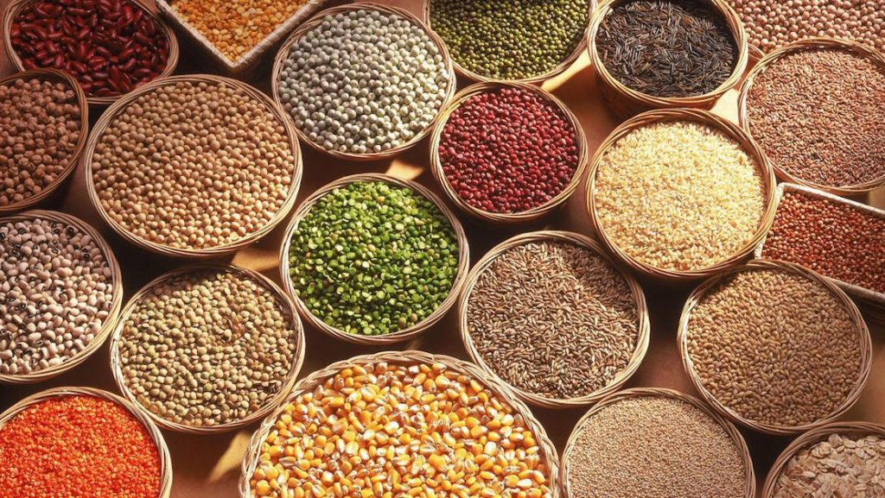

Los alimentos de bajo índice glicémico requieren que el cuerpo libere menos insulina, una hormona suministrada por el cuerpo para procesar el exceso de azúcar en la sangre. Por esta razón, muchos diabéticos comen una dieta rica en alimentos con bajo índice glucémico para controlar los niveles de glucosa. Estos alimentos también se digieren más lentamente lo que permite al consumidor sentirse lleno durante más tiempo. Como resultado, los alimentos de bajo índice glicémico pueden ayudar a perder peso. Las legumbres, verduras y granos enteros son ejemplos de alimentos de bajo IG.

## Indice Glicemico y los Nivel de glucosa

El índice glicémico, (GI) se refiere al efecto que un alimento tiene sobre los niveles de glucosa del cuerpo. La escala va de 1 a 100. Los alimentos con un puntaje de bajo índice glicémico son de 55 o menos. Alimentos de índice glicémico intermedio van desde 56 hasta 69, y cualquier alimento con un índice de 70 o más se considera un alimento de _alto índice glicémico_.

## Granos con Bajo Indice Glicemico

La Cebada nacarada tiene el [índice glicémico más bajo](/que-significa-bajo-indice-glucemico-ig/) de todos los granos. Otros granos con un bajo índice glicémico son los espaguetis, pan de centeno, fideos, macarrones, pan de varios granos, arroz instantáneo, pasta de trigo, fettuccini de huevo, arroz integral, trigo sarraceno, arroz de grano blanco, tortillas de trigo, fideos instantáneos, pan integral de centeno de grano entero, pan pesado con mezclado de granos, pan integral, pan amargo, pan de centeno, pan de trigo pan amargo y cebada agrietada.

## Granos con Alto Indice Glicemico

Granos con un alto índice glicémico incluyen cuscús, arroz basmati, arroz blanco instantáneo, arroz blanco de grano corto, tapioca, pan blanco y rosquillas.

## Otras Consideraciones

Puedes utilizar harinas sin gluten, como harina de garbanzo y las comidas hechas de semillas y frutos secos tales como harina de almendra, en lugar de harinas de trigo para hacer productos horneados ya que tienen GI inferiores.

Como ves, tienes a tu disposición numerosas alternativas que puedes incluir en tu dieta sin ningún problema. Lo mejor es lo natural, lo que va del campo a tu mesa, sin tanto procesamiento y cero refinamiento. Existen muchos otros granos que podríamos incluir en estas listas pero los dejaremos para próximos post donde podrás despejar tus dudas con respecto a tu alimentación. No olvides la tarea imprescindible de consultar a tu médico con respecto a la calidad y cantidad de alimentos que debes consumir.

## Tabla de Granos de Bajo Indice glucemico

<table className="table table-bordered table-hover table-condensed">
  <thead className="font-semibold bg-grey-100">
    <tr>
      <th>Alimento</th>
      <th>Indice Glucemico</th>
    </tr>
  </thead>
  <tbody>
    <tr>
      <td className="font-semibold">Cebada</td>
      <td> </td>
    </tr>
    <tr>
      <td>Cebada ( Hordeum vulgare ) (India)</td>
      <td>48</td>
    </tr>
    <tr>
      <td>Cebada, olla, cocidos (Goudas Food Products, Canadá)</td>
      <td>35 ± 4</td>
    </tr>
    <tr>
      <td>Cebada, olla, hervir 20 min (Goudas Alimentos Productos, Canadá)</td>
      <td>37</td>
    </tr>
    <tr>
      <td>
        Cebada, olla, hervir en agua con sal 20 min (Goudas Food Products,
        Concord, Canadá)
      </td>
      <td>25 ± 2</td>
    </tr>
    <tr>
      <td>Cebada, perlados, cocidos 60 min (UK)</td>
      <td>35 ± 4</td>
    </tr>
    <tr>
      <td>
        Granos de cebada, cocidos en agua durante 25 min (Kernel: agua = 1:2)
        (Suecia)
      </td>
      <td>25</td>
    </tr>
    <tr>
      <td>
        Granos de cebada, de alto contenido de amilosa (cubierta), hierven en
        agua durante 25 min (kernel: agua = 1:2) (Suecia)
      </td>
      <td>26</td>
    </tr>
    <tr>
      <td>
        Granos de cebada, de alto contenido en amilosa (casco-menos) hervidas en
        agua durante 25 min (kernel: agua = 1:2,5) (Suecia)
      </td>
      <td>20</td>
    </tr>
    <tr>
      <td>
        Granos de cebada, de cera (casco-menos), cocidos en agua durante 25
        minutos (kernel: agua = 1:2,5) (Suecia)
      </td>
      <td>22</td>
    </tr>
    <tr>
      <td>
        Grañones alforfón, hidrotermalmente tratados, descascarillado, hervido
        12 min (Suecia)
      </td>
      <td>45</td>
    </tr>
    <tr>
      <td>media de ocho estudios</td>
      <td>28 ± 2</td>
    </tr>
    <tr>
      <td className="font-semibold">Maíz / del maíz</td>
      <td> </td>
    </tr>
    <tr>
      <td> </td>
      <td> </td>
    </tr>
    <tr>
      <td>Gránulos de maíz (China)</td>
      <td>52 ± 3</td>
    </tr>
    <tr>
      <td>Maíz dulce</td>
      <td> </td>
    </tr>
    <tr>
      <td> </td>
      <td> </td>
    </tr>
    <tr>
      <td>Maíz dulce, &#39;Honey &amp; Pearl &quot;variedad (Nueva Zelanda)</td>
      <td>37 ± 12</td>
    </tr>
    <tr>
      <td>Maíz dulce (China)</td>
      <td>55 ± 2</td>
    </tr>
    <tr>
      <td>Maíz dulce, en la mazorca, hervido 20 min (Australia)</td>
      <td>48</td>
    </tr>
    <tr>
      <td>media de cinco estudios</td>
      <td>52 ± 5</td>
    </tr>
    <tr>
      <td className="font-semibold">Mijo</td>
      <td> </td>
    </tr>
    <tr>
      <td> </td>
      <td> </td>
    </tr>
    <tr>
      <td>
        Quinoa, cocinada, frigo, recalentado en microondas durante 1,5 min
        (Naturaleza Primera Orgánica, Australia) 
      </td>
      <td>53 ± 5</td>
    </tr>
    <tr>
      <td className="font-semibold">Arroz blanco</td>
      <td> </td>
    </tr>
    <tr>
      <td>Arroz blanco hervido, tipo NS</td>
      <td> </td>
    </tr>
    <tr>
      <td> </td>
      <td> </td>
    </tr>
    <tr>
      <td>Tipo NS (India)</td>
      <td>43</td>
    </tr>
    <tr>
      <td>
        Tipo NS, se hierve en agua con sal, refrigerado 16 a 20 h, recalentados
        (India)
      </td>
      <td>53</td>
    </tr>
    <tr>
      <td className="font-semibold">De grano largo, cocido</td>
      <td> </td>
    </tr>
    <tr>
      <td> </td>
      <td> </td>
    </tr>
    <tr>
      <td>
        De grano largo, blanco, sin convertir, hervido 15 min(Mahatma marca,
        Riviana Foods, Wetherill Park, Australia)
      </td>
      <td>50</td>
    </tr>
    <tr>
      <td className="font-semibold">
        Arroz de grano largo, las variedades de cocción rápida
      </td>
      <td> </td>
    </tr>
    <tr>
      <td> </td>
      <td> </td>
    </tr>
    <tr>
      <td>
        De grano largo, blanco, pre-cocinados, al microondas 2 min (Exprese
        Rice, claro, el tío Ben, Masterfoods, Reino Unido)
      </td>
      <td>52 ± 5</td>
    </tr>
    <tr>
      <td className="font-semibold">Gachas de arroz / Congee</td>
      <td> </td>
    </tr>
    <tr>
      <td> </td>
      <td> </td>
    </tr>
    <tr>
      <td>Arroz con leche, a partir de salvado de arroz (China)</td>
      <td>19 ± 1</td>
    </tr>
    <tr>
      <td>Gachas de arroz, hecho de arroz negro (China)</td>
      <td>42 ± 3</td>
    </tr>
    <tr>
      <td>Arroz, arroces especiales</td>
      <td> </td>
    </tr>
    <tr>
      <td> </td>
      <td> </td>
    </tr>
    <tr>
      <td>Arroz fácil de cocinar Americanos (Sainsbury, Reino Unido)</td>
      <td>49 ± 12</td>
    </tr>
    <tr>
      <td>
        Brown &amp; Wild, Readyde grano entero de tío Ben Medley (bolsa) (Effem
        Foods, EE.UU.)
      </td>
      <td>45 ± 5</td>
    </tr>
    <tr>
      <td>
        Brown RiceReady grano entero del tío Ben (Bolsa) (Effem Foods, EE.UU.)
      </td>
      <td>48 ± 5</td>
    </tr>
    <tr>
      <td>
        Chicken Flavored Brown Rice, Ready de tío Ben Whole Grain (bolsa) (Effem
        Foods, EE.UU.)
      </td>
      <td>46 ± 4</td>
    </tr>
    <tr>
      <td className="font-semibold">Jasmine arroz blanco</td>
      <td> </td>
    </tr>
    <tr>
      <td> </td>
      <td> </td>
    </tr>
    <tr>
      <td>Arroz blanco Moolgiri (Tajmahal Agro Industries, India)</td>
      <td>54</td>
    </tr>
    <tr>
      <td>
        Cosecha verduras del tío Ben Ready Whole Grain Medley  (bolsa) (Effem
        Foods, EE.UU.)
      </td>
      <td>48 ± 5</td>
    </tr>
    <tr>
      <td>
        Estilo español, arroz Uncle Ben Ready (bolsa) (Effem Foods, EE.UU.)
      </td>
      <td>51 ± 4</td>
    </tr>
    <tr>
      <td>
        Grano largo y salvaje, arroz Uncle Ben Ready (Bolsa) (Effem Foods,
        EE.UU.)
      </td>
      <td>49 ± 3</td>
    </tr>
    <tr>
      <td>
        Original grano largo, arroz Uncle Ben Ready (Bolsa) (Effem Foods,
        EE.UU.)
      </td>
      <td>48 ± 5</td>
    </tr>
    <tr>
      <td>
        Pollo asado aromatizado, Ready de tío Ben Arroz (bolsa) (Effem Foods,
        EE.UU.)
      </td>
      <td>51 ± 4</td>
    </tr>
    <tr>
      <td>
        Santa Fe, Ready de grano entero de tío Ben Medley TM (bolsa) (Effem
        Foods, EE.UU.)
      </td>
      <td>48 ± 6</td>
    </tr>
    <tr>
      <td className="font-semibold">
        Arroz blanco de bajo contenido en amilosa
      </td>
      <td> </td>
    </tr>
    <tr>
      <td> </td>
      <td> </td>
    </tr>
    <tr>
      <td>Doongara, blanco (1995)</td>
      <td>50 ± 6</td>
    </tr>
    <tr>
      <td>Doongara, blanco (1995)</td>
      <td>54 ± 7</td>
    </tr>
    <tr>
      <td>Doongara, blanco (2005)</td>
      <td>54 ± 6</td>
    </tr>
    <tr>
      <td>Doongara, blanco, cocido en olla de arroz (2007)</td>
      <td>48 ± 4</td>
    </tr>
    <tr>
      <td>media de cinco estudios</td>
      <td>54 ± 3</td>
    </tr>
    <tr>
      <td className="font-semibold">Basmati, blanco, hervido</td>
      <td> </td>
    </tr>
    <tr>
      <td> </td>
      <td> </td>
    </tr>
    <tr>
      <td>Basmati, blanco, hervido (Sainsbury, Reino Unido)</td>
      <td>43 ± 8</td>
    </tr>
    <tr>
      <td>Basmati, blanco, hervir 12 min (valor, Reino Unido)</td>
      <td>52 ± 11</td>
    </tr>
    <tr>
      <td>media de seis estudios</td>
      <td>57 ± 4</td>
    </tr>
    <tr>
      <td>Basmati, blanco, cocción rápida</td>
      <td> </td>
    </tr>
    <tr>
      <td className="font-semibold">Japónica / Koshihikari</td>
      <td> </td>
    </tr>
    <tr>
      <td> </td>
      <td> </td>
    </tr>
    <tr>
      <td>
        Koshikari (japónica), de grano corto blanco, hervida 15 min, a
        continuación, al vapor 10 min (Japón)
      </td>
      <td>48 ± 8</td>
    </tr>
    <tr>
      <td>
        Arroz japónica enriquecido con Sunfibre (Cyamoposis tetragonolobus)
        (fibra soluble)
      </td>
      <td> </td>
    </tr>
    <tr>
      <td className="font-semibold">Molido, blanco, arroz de alta amilosa</td>
      <td> </td>
    </tr>
    <tr>
      <td> </td>
      <td> </td>
    </tr>
    <tr>
      <td>
        Molido (blanco), alto contenido de amilosa (IR36) Arroz, cocinado en
        olla arrocera 19 min (Filipinas)
      </td>
      <td>55</td>
    </tr>
    <tr>
      <td>
        Molido (blanco), alto contenido de amilosa (IR36) Arroz, hervido 22 min
        (Filipinas)
      </td>
      <td>50</td>
    </tr>
    <tr>
      <td>
        Molido (blanco), alto contenido de amilosa (IR62) Arroz, cocinado en
        olla arrocera 20 min (Filipinas)
      </td>
      <td>53</td>
    </tr>
    <tr>
      <td>
        Molido (blanco), alto contenido de amilosa (IR62) Arroz,hervido 22 min
        (Filipinas) 
      </td>
      <td>43</td>
    </tr>
    <tr>
      <td className="font-semibold">Arroz, integral</td>
      <td> </td>
    </tr>
    <tr>
      <td> </td>
      <td> </td>
    </tr>
    <tr>
      <td>Brown, al vapor (EE.UU.)</td>
      <td>50</td>
    </tr>
    <tr>
      <td className="font-semibold">Arroz, integral, de alta amilosa</td>
      <td> </td>
    </tr>
    <tr>
      <td> </td>
      <td> </td>
    </tr>
    <tr>
      <td>
        Brown, alto contenido de amilosa (IR42) arroz, hierve 30 min (Filipinas)
      </td>
      <td>58</td>
    </tr>
    <tr>
      <td className="font-semibold">Arroz instantáneo / inflado</td>
      <td> </td>
    </tr>
    <tr>
      <td> </td>
      <td> </td>
    </tr>
    <tr>
      <td>
        Modificada, blanco, hervir 20-30 minutos, el tío Ben(Masterfoods,
        EE.UU.) 
      </td>
      <td>38</td>
    </tr>
    <tr>
      <td>
        Vaporizado, de alto contenido en amilosa (28%), Doongara (Productores de
        Arroz Co-op, Australia)
      </td>
      <td>50 ± 6</td>
    </tr>
    <tr>
      <td className="font-semibold">Arroz meloso</td>
      <td> </td>
    </tr>
    <tr>
      <td> </td>
      <td> </td>
    </tr>
    <tr>
      <td>Arroz, pegostozo, de alta amilosa (China)</td>
      <td>50 ± 2</td>
    </tr>
    <tr>
      <td className="font-semibold">Trigo, granos enteros</td>
      <td> </td>
    </tr>
    <tr>
      <td> </td>
      <td> </td>
    </tr>
    <tr>
      <td>Trigo, granos enteros ( Triticum aestivum ) (India)</td>
      <td>30 ± 9</td>
    </tr>
    <tr>
      <td className="font-semibold">Trigo, granos precocidos</td>
      <td> </td>
    </tr>
    <tr>
      <td> </td>
      <td> </td>
    </tr>
    <tr>
      <td>Cocina rápida (White Wings, Sydney, Australia)</td>
      <td>54 ± 11</td>
    </tr>
    <tr>
      <td>
        Trigo duro, precocida en bolsa, recalentado en microondas, Ebly expreso
        (Ebly, Francia)
      </td>
      <td>40 ± 5</td>
    </tr>
    <tr>
      <td>
        Trigo duro, precocinado, cocinado 20 min (Ebly, Chateaudun, Francia)
      </td>
      <td>52 ± 4</td>
    </tr>
    <tr>
      <td>Trigo duro, precocinados, cocidos 10 min (Ebly, Francia)</td>
      <td>50 ± 5</td>
    </tr>
  </tbody>
</table>
