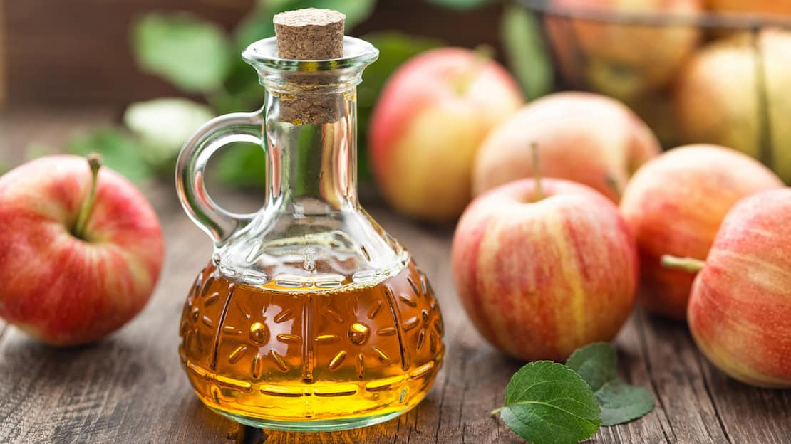

Se puede reducir el azúcar en la sangre con vinagre de sidra de manzana, que durante mucho tiempo ha sido valorado por sus propiedades nutritivas como un remedio popular. Los beneficios para la salud y el efecto de vinagre de sidra de manzana en los niveles de glucosa en la sangre se han investigado clínicamente. Puedes seguir los siguientes pasos para reducir el azúcar en la sangre con vinagre de sidra de manzana sin tener que gastar tu dinero duramente ganado en medicamentos comerciales.

## Beneficios del Vinagre de Manzana

**La diabetes:** Varios estudios sugieren que el vinagre de sidra de manzana [remedio casero para bajar el azúcar de inmediato](/remedios-caseros-para-bajar-el-azucar). Uno de estos estudios mostró que tomar dos cucharadas de vinagre a la hora de acostarse dio como resultado unos [niveles de glucosa](/cuanto-es-el-nivel-normal-de-glucosa/) en la mañana que eran más bajos de lo normal en aproximadamente un 5%. Sin embargo, este fue un estudio muy pequeño y sólo abarcó a 11 sujetos.

**La obesidad:** un estudio encontró que los sujetos que comían un pedazo de pan con pequeñas cantidades de vinagre se sentían más saciados que los que solo comían el pan. Pero esto también fue un estudio muy pequeño, que involucraba a 12 personas.

**Colesterol:** estudios con ratones han demostrado que el vinagre puede disminuir los niveles de colesterol en la sangre. Pero no hay tales estudios que se hayan llevado a cabo utilizando seres humanos como sujetos.

**La presión arterial:** el vinagre también ha logrado reducir la presión arterial, pero de nuevo los estudios fueron sólo en ratones.

Sin embargo, un gran estudio observacional encontró que las personas que comían ensaladas con aderezo de aceite y vinagre al menos cinco veces a la semana tenían tasas más bajas de enfermedades del corazón que otras personas. El problema es que, a pesar de que este fue un estudio a gran escala, es prácticamente imposible decir que era el vinagre el que hizo el truco y no alguna otra variable, como alguna de las hortalizas.

Los resultados de estos estudios pueden, en general, ser prometedores. Sin embargo, son poco más que eso. Se requieren estudios mucho más amplios para determinar si el vinagre de sidra de manzana (o de hecho cualquier vinagre) pueden ser de algún beneficio para nuestra salud.

Mientras tanto, deberíamos estar tomando vinagre de manzana con el argumento de que puede ser o tal vez no.

## ¿Qué tan seguro es el vinagre de manzana?

El vinagre de manzana es muy ácido y se sabe que quema la piel algunas veces al entrar en contacto. Esto significa que podría dañar el esmalte de los dientes y la carne de la boca y la garganta. Obviamente, siempre debe ser diluido con agua o un jugo y tomarse con precaución.

Cualquier persona (como yo) que haya experimentado el reflujo ácido, en el que el [ácido del estómago](/dolor-estomacal-en-losas-diabeticosas/) que se libera durante el proceso digestivo fluye de nuevo hasta la garganta, será extremadamente cuidadosa de cualquier cosa que dañe los tejidos de la garganta y la boca.

El vinagre de manzana también podría, en teoría, tener un efecto adverso sobre medicamentos para la diabetes y enfermedades del corazón. Además, se ha sugerido que este vinagre podría reducir los niveles de potasio y disminuir la densidad ósea.

Una vez más, parece que nada ha sido probado clínicamente en estudios a gran escala.

Mientras no haya estudios serios a gran escala no te recomiendo usar el vinagre ya que es muy ácido. Pero siempre podrás añadirlo a tu ensalada.

## Pasos a seguir para usar el vinagre de manzana para la diabetes

1. Mezcla 2 cucharadas de vinagre de sidra de manzana en un vaso de agua o jugo sin azúcar. Bebe esto justo antes de irte a la cama.
2. Luego mezcla ¼ de taza de vinagre de sidra de manzana con ¼ de taza con miel. DC Jarvis, MD, un autor bien conocido por investigar los beneficios para la salud de vinagre de sidra de manzana, dice que dicha mezcla con la miel aumenta sus poderes curativos. Almacena tu mezcla en un frasco de vidrio, y toma dos cucharadas al día.
3. Compra suplementos de vinagre de sidra de manzana, y toma una dosis diaria de 285 mg. Esta es una manera conveniente para meter el vinagre de manzana en una apretada agenda, o si simplemente no te gusta el sabor de este vinagre disuelto en agua o jugo.
4. Para reducir el azúcar en la sangre haz un aderezo de ensalada de vinagre de manzana y aceite de oliva. Vierte el vinagre de sidra de manzana (¼ de taza) en un frasco limpio. Añade ¼ de taza de aceite de oliva. Agita el frasco y luego se vierte en una botella de spray. Usa la mezcla como un chorrito de ensaladas. El Aceite de oliva en sí es eficaz para bajar el azúcar en la sangre.
5. Añade el vinagre de sidra de manzana a tu dieta diaria. Se usa para marinar carnes y acompañar diferentes alimentos.

Este es un remedio muy antiguo y hace milenios Hipocrates lo utilizaba como un tónico para la salud. Pero no olvides buscar el consejo profesional de tu médico u otro profesional de la salud antes de buscar reducir el azúcar en la sangre con vinagre de sidra de manzana. No tomes más de 2 cucharaditas de vinagre de sidra de manzana sin diluir al día. Tomado en grandes dosis durante un período prolongado tiende a erosionar el esmalte de los dientes y causar quemaduras en la boca y la garganta. _**No lo uses si eres mujer y tienes osteoporosis. Y jamás lo tomes si estás usando laxantes, diuréticos o medicamentos para el corazón.**_
