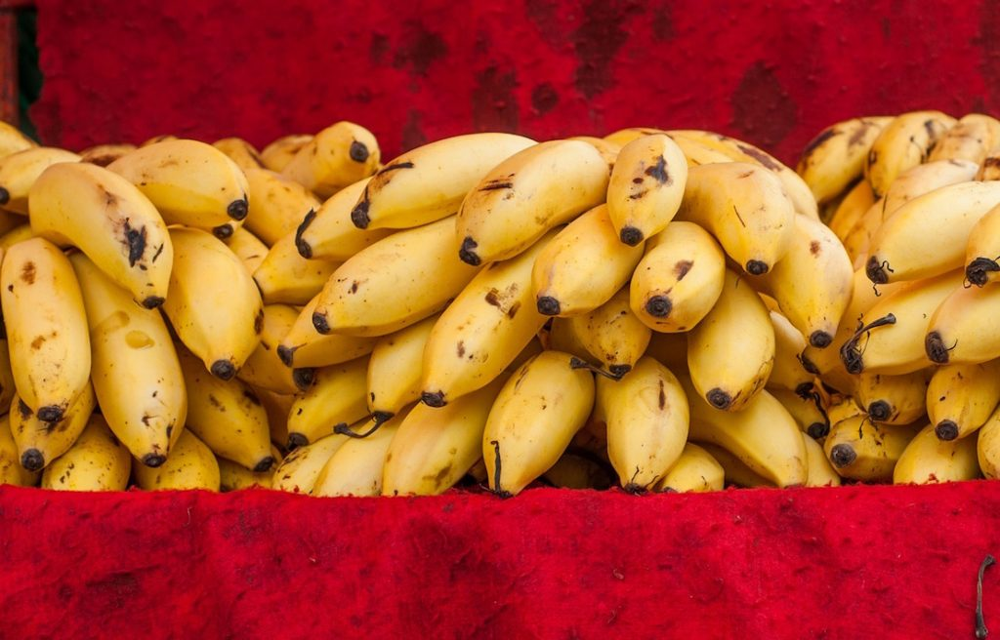

Los bananos (o cambures) son frutas tropicales sabrosas y nutritivas y contienen propiedades medicinales. Pueden ayudar a aliviar el estrés, la tensión pre-menstrual, la presión arterial alta y algunos incluso afirman que las pieles de bananas pueden curar las verrugas. El banano es una fruta versátil que está llena de vitaminas y lo convierten en una deliciosa adición a tu dieta. Esta fruta también da un impulso rápido cuando los niveles de azúcar en la sangre son bajos.

## 

## Nivel de Glucosa

El índice glucémico, o IG, mide lo que ocurre con el azúcar en la sangre después de comer los alimentos. Fue creado para ayudar a las personas a controlar sus niveles de azúcar en la sangre, en particular las personas con diabetes. Una puntuación baja en el índice glucémico es cualquiera menor de 55, una puntuación media es de entre 56 y 69 y una puntuación alta es mayor de 70. Los bananos tienen un puntaje bajo IG de 51, por lo tanto, comer bananas debería producir un impulso inmediato y sostenido a los niveles de energía.

## Las bananas y el Azúcar en la sangre

Las bananas, incrementan y mantienen naturalmente los niveles de azúcar en la sangre debido a su alto contenido de hidratos de carbono, y son beneficiosos para el alivio de las náuseas matutinas. También son útiles como una cura para la resaca; haz un puré con un poco de miel y se convierte en un batido. Comer dos cambures antes de un entrenamiento de 90 minutos te dará suficiente energía para mantener tu cuerpo en todo momento. Los cambures contienen tres azúcares naturales: sacarosa, fructosa y glucosa. Estos azúcares naturales dan el impulso controlado a los niveles de azúcar en la sangre que los dulces o chocolate no hacen.

## Vitaminas

Los cambures son particularmente ricos en vitaminas del grupo B y por lo tanto tiene muchos beneficios. La vitamina B6 se ayudar mediante la regulación de los [niveles de glucosa](/cuanto-es-el-nivel-normal-de-glucosa/) en la sangre, a mejorar el estado de ánimo. Si vas a dejar de fumar, los bananos pueden ayudar, ya que contienen altos niveles de vitamina C, A1, B6, B12 y el potasio y magnesio; estas propiedades serán de ayuda para tu cuerpo a recuperarse de la abstinencia de nicotina. Si estás nervioso, la vitamina B en esta fruta te ayudará a calmarte.

## Bananas y Estado de Ánimo

Los cambures contienen triptófano, un tipo de aminoácido que se convierte en serotonina, produciendo un efecto calmante. Comer bananas regularmente puede ayudar a las personas que sufren de depresión. También pueden ayudar a las personas con trastorno afectivo estacional. Los plátanos son ricos en potasio, por lo que podrían ayudar a mantener el estado de alerta y la concentración. El potasio también puede reducir el riesgo de presión arterial alta y el [accidente cerebrovascular](/diabetes-y-acv/). Los cambures también son ricos en hierro y pueden ayudar en casos de anemia.
