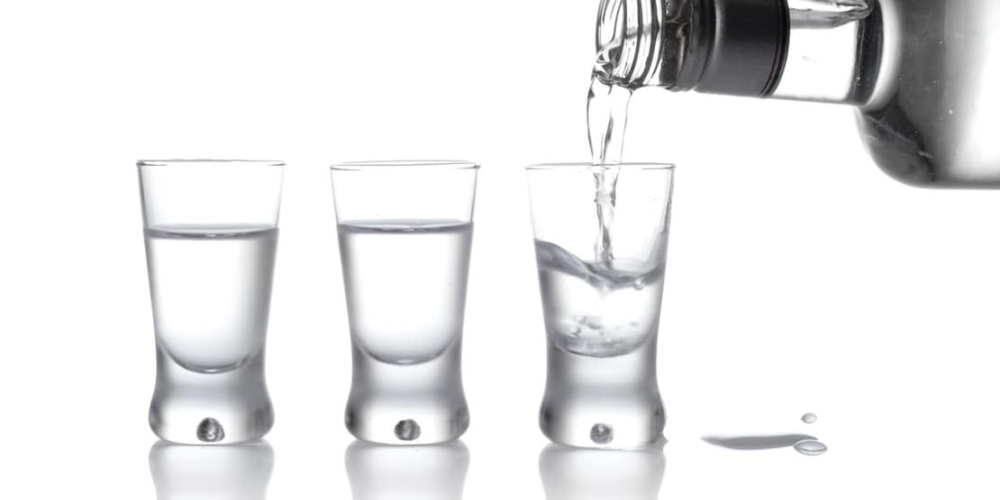

El vodka es uno de los mejores inventos rusos sin ninguna duda. Y tiene una gran ventaja: **no tiene carbohidratos.** Sin embargo nos gusta prepara cócteles de vodka y a menudo se pueden cargar con azúcar y los carbohidratos de ingredientes como azúcar simple, jugos de frutas y soda regular. Las bebidas de vodka más bajos en hidratos de carbono se hacen con mezcladores sin calorías como la soda, refresco de dieta, agua tónica de dieta y edulcorantes sin calorías. Saltarse las adiciones azucaradas ayudará a cumplir con tu dieta baja en carbohidratos y todavía podrás disfrutar de una copa con los amigos. Habla con tu médico acerca de qué tipo y la cantidad de alcohol que puedes consumir con seguridad.

## Mantén tu trago de vodka bajo en carbohidratos

Un vodka sencillo o con soda es completamente libre de [carbohidratos](/carbohidratos-y-el-indice-glucemico/) y una salida elegante al cóctel que te meterá en problemas con los carbohidratos. Pero puede ser aburrido. Viste el vaso arriba añadiendo frutas y hortalizas frescas, como una rodaja de limón, una rodaja de pepino y/o un trozo de sandía fresca. No sólo vas a estar bebiendo menos de 100 calorías, también vas a recibir algunas vitaminas y minerales esenciales y también fibra. Tienes muchas alternativas para preparar un trago delicioso con toronjas, serás la envidia de tus amigos, pero recuerda mantener la moderación, no te sobrepases.

De seguro estas acostumbrado(a) a la bebida cosmopolita bastante dulce, afrutada y repleta de hidratos de carbono, pero no tiene que ser así, puedes preparar alternativas superiores sin las desventajas del azúcar y los hidratos de carbono. Recoge un poco de vodka y la dieta de arándano y añade un poco de jugo de limón recién exprimido para tomar una bebida con menos de 100 calorías y **menos de 1 gramo de carbohidratos**.

Para un cóctel con mucho sabor, mezcla el vodka de vainilla con jengibre. Esta es una combinación dulce con menos de 100 calorías y sin carbohidratos. Es exquisita y de seguro que habrá más de uno o una que quiera probar "tus inventos". Recuerda evitar el exceso, siempre picar algún pasapalo entre tragos y consulta a tu médico acerca de estas opciones para comprobar que sean indicadas para ti. Y disfruta de la vida, la vida es hoy y tu bienestar es lo más importante.
