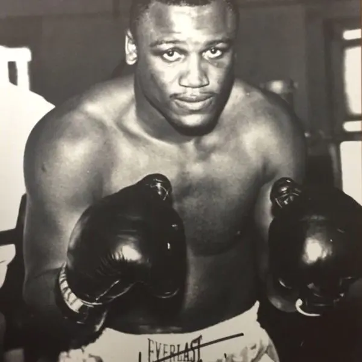

Muchos artistas y personalidades famosas pueden verse estupendamente bien en la tv o en el cine pero la diabetes no se intimida ante las cámaras y menos ante la fama. Es una enfermedad quisquillosa que a veces puede sorprendernos de manera inoportuna y también puede sorprender a los famosos, incluso a aquellos y aquellas de cuerpos hermosos, fuertes y juveniles que visitan los gimnasios con asiduidad y cuyos ingresos les permiten tener las mejores dietas y especialistas a su disposición. Claro, en esta lista siempre encontrarás a ese famoso o famosa que no practica ejercicios o hace dietas, sino que por el contrario, lleva una vida de placeres y bacanales que posiblemente pudieron influir en el desarrollo de la diabetes.

## 1\. Salma Hayek

¿Qué de malo pudo haber hecho este rico bombón mexicano para desarrollar diabetes? Pues, la verdad no lo sé pero debes tomar en cuenta que la vida de los artistas puede ser difícil, sobre todo al principio de sus carreras. En realidad Salma desarrolló **Diabetes Gestacional** _durante el embarazo de su hija Valentina_. Ella llegó a tener 18 kg de sobrepeso y de seguro eso desencadenó su situación. Esta hermosa madre logró controlar la situación con dietas especiales y cambiando sus hábitos alimenticios.

## 2\. José José

Otro mexicano muy famoso conocido por su hermosa voz y sus problemas de alcoholismo (hoy en día, gracias a Dios, superados), "El Príncipe de la Canción" llegó a padecer [retinopatía diabética](/como-vencer-la-ceguera-causada-por-la-retinopatia-diabetica/) en uno de sus ojos y pudo salvar su visión ocular gracias a intervenciones quirúrgicas basadas en inyecciones y rayos láser. Su diagnóstico temprano le evitó a este popular cantante males mayores y hoy en día se mantiene en buena salud gracias a los tratamientos que lleva a cabo y su disciplina personal.

## 3\. Larry King, presentador de TV

Este famoso personaje comenzó a sufrir [diabetes tipo 2](/diabetes-tipo-2/) en los 90. Para él fue una sorpresa ya que hacía ejercicio y comía sano, pero así son las cosas, la diabetes suele ser implacable y silenciosa. Incluso una vez tuvo un ataque de [hipoglucemia](/la-hipoglucemia-nivel-bajo-de-azucar-en-sangre/) en pleno show pero no pasó a mayores.

## 4\. Joe Frazier

El mítico ex-campeón de peso pesado también adquirió la enfermedad al final de su vida. Fue un hombre muy rudo que peleó contra super campeones como Alí, Foreman y otros. Al final, la diabetes y un cáncer de hígado fueron más fuertes que los golpes recibidos durante su gran carrera boxística.

## 5\. Diego Armando Maradona

El "Pelusa" se puede decir que ha tenido un estilo de vida bastante libertino. Aunque tenía un físico excepcional es posible que los abusos a los que lo sometió le haya desencadenado el problema. Diego engordó mucho y ya sabes que ese es un factor que influye en la diabetes. Espero que no me demande por escribir esto de él, todo un ídolo del fútbol.
