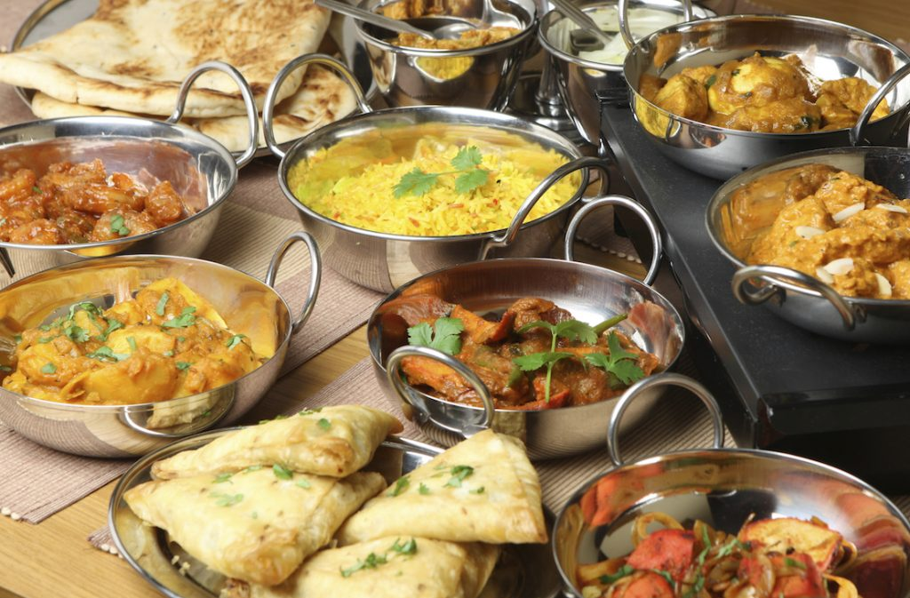

---

title: 'Dieta de la India para la diabetes tipo 2'
date: '2015-09-16'
slug: 'dieta-de-la-india-para-la-diabetes-tipo-2'
coverImage: 'Dieta-de-la-India-para-la-diabetes.jpg'
category: 'alimentacion'
categories: ['alimentacion']
description:  "A nivel mundial existen diversos estudios para enfrentar el problema de la diabetes. En la India hay expertos que coinciden con los expertos occidentales pero hacen aportes muy interesantes a esta lucha. Dieta de la India para la diabetes tipo 2"
---

La [diabetes tipo 2](/diabetes-tipo-2/) es una forma de diabetes que se produce generalmente en la edad adulta y es una enfermedad donde el paciente no es dependiente de la [insulina](/que-es-la-insulina-cuantos-tipos-existen/). La diabetes tipo 2 es una enfermedad crónica que influye en la forma en el cuerpo metaboliza la glucosa o azúcar, de modo que más adelante se pueda utilizar como fuente de energía. Esta forma de diabetes implica el desarrollo de resistencia a la insulina y/o el cuerpo no puede generar cantidades adecuadas de insulina para mantener los niveles de azúcar en la sangre equilibrados. Este problema puede ser controlado con dieta y ejercicio.

## Fibra

En el libro "Speaking of Diabetes and Diet: A Valuable Survival Guide for the Newly Diagnosed Diabetic," cuyos autores Deepa Mehta y SA Vali explican la importancia de la fibra en la dieta diabética. El Consejo Indio de Investigación Médica sugiere una ingesta diaria de 25 a 35 gramos de fibra. La fibra ayuda a reducir de forma natural los [niveles de glucosa](/cuanto-es-el-nivel-normal-de-glucosa/).

En la dieta de la India, los alimentos ricos en fibra incluyen cosas como el salvado, granos enteros, cereales, fruta fresca, frutos secos, verduras crudas, frijoles rojos, brotes de soja, las preparaciones de salmonete, habas de racimo, tallos de loto, hojas de curry, granada, chiles verdes, cilantro y semillas Cardomon. Mehta y Vali también afirman que una introducción a los alimentos ricos en fibra debe hacerse lentamente y progresivamente; aumentar la cantidad de fibra por cinco gramos al día hasta que cumpla el límite de los 35 gramos por día. Si lo haces, te ayudará a evitar la sensación de un abdomen hinchado y problemas con flatulencias o regularidad del intestino distendido.

## Los hidratos de carbono

De acuerdo con Metha y Vali, el diabético debería consumir de 65 a 75 por ciento de las calorías diarias en hidratos de carbono complejos. Esto asegurará que los niveles de azúcar en la sangre permanezcan regulados. El consumo de carbohidratos complejos ayuda a minimizar los triglicéridos y el colesterol en la sangre y también mejora los procesos digestivos. Las fuentes alimentarias para los diabéticos son las legumbres, el arroz y el pan integral.

## Proteínas

Metha y Vali recomiendan que el 25 por ciento de las calorías diarias provengan de las proteínas. Las fuentes alimentarias incluyen la soja, queso, pollo, claras de huevo, el pescado y las verduras de hoja verde. Una dieta excesiva en proteínas puede tener efectos nocivos sobre el hígado y los riñones, obligándolos a trabajar más duro.

## Chana

Chana dal es una leguminosa común de la dieta de la India; estas leguminosas son veneradas por sus propiedades anti-diabéticas. Mantiene los niveles de azúcar en la sangre naturalmente y es rica en fibra. También reduce los niveles de azúcar en sangre en ayunas por frustrar el paso de los azúcares en la orina; esto reduce los requerimientos de insulina.

## Colesterol

La dieta de la India para la diabetes tipo 2 también recomienda bajar el consumo de colesterol. Los altos niveles de colesterol contribuyen a la enfermedad cardiovascular; no más de 300 miligramos de colesterol deben consumirse diariamente. Para reducir los niveles de colesterol, Metha y Vali recomiendan hornear, cocinar al vapor, asar los alimentos en lugar de freírlos. Consumir bajo en grasa y consumir productos lácteos descremados en lugar de las variedades de leche entera.
