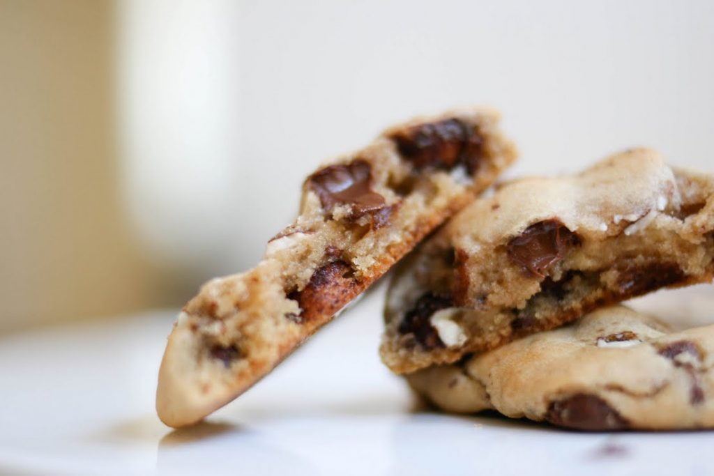

Las personas diabéticas también pueden disfrutar de postres y darse algunos gustos, pero son necesarias algunas modificaciones de en las recetas para convertir una galleta tradicional a una segura para las personas con diabetes. En particular, las recetas de galletas para diabeticos son bajas en azúcar o no tienen azúcar añadido. Existen sustitutos de azúcar granulada que ayudan a reemplazar la taza de azúcar tradicional en la mayoría de las recetas de galletas para diabeticos puedan disfrutarlas con un riesgo mínimo.

## Adapta recetas tradicionales para crear recetas de galletas para diabeticos

Examina la receta que quieras disfrutar y reemplaza todo el azúcar requerida en la receta con un edulcorante artificial como Equal u otro parecido. El azúcar crea una textura especial en las galletas. Experimenta con la cantidad de azúcar en una receta mediante la preparación de un lote de prueba. Hornea un lote de galletas con edulcorante, y si las galletas son demasiado crujientes, haces el siguiente lote y reemplaza sólo el 50 por ciento del azúcar con el edulcorante granulado artificial. Añade una cucharadita adicional de extracto de vainilla por cada taza de azúcar sustituido en la receta. Para lograr el pardeamiento adecuado, rocía las superficies de las galletas con aceite en aerosol antes de hornear. Compruebe las galletas de 3 a 5 minutos antes del tiempo de cocción en la receta para ver si se están listas. En esto hay ensayo y error.

## Receta fácil: galletas de coco sin hornear

Batir 8 oz de queso crema reducido en grasa con 2 tazas de coco rallado. Forma en bolas para galletas. Enfría en el congelador durante 2 horas. Para darle un toque festivo, sumerge cada bola de galletas de coco en chocolate negro fundido y vuélvelas a meter en la nevera.

## Galletas para Diabeticos #1:Galletas de canela

Una de nuestras recetas de galletas para diabeticos favoritas. Batir 1 huevo entero con 1 cda. de agua hasta que quede esponjoso. Mezcla con 3 cucharaditas de edulcorante artificial granulado y 1 cdta. de [canela](/canela-glucosa-alta/) molida. De manera opcional puedes agregar 1/2 cucharadita de planta de jengibre con la canela. Mezcla 3/4 taza de harina leudante. Pon la mezcla sobre una bandeja para hornear de 2 pulgadas. Hornear durante 10 a 12 minutos a 375 grados. Cuando hayas terminado, retírala del horno y deja enfriar completamente. Mezcla 4 oz de queso crema bajo en grasa con 1/4 taza de sustituto de azúcar granulada y 1/2 cda. de canela molida. Utiliza esta crema de queso canela con hielo glaseado en la parte superior de las galletas, o usala como relleno colocado entre dos galletas.

## Galletas para Diabeticos #2:Merengue especial

Este es un ejemplo de una receta que debe tener media del azúcar original, para lograr la textura adecuada. Las recetas merengue normalmente piden 1 taza de azúcar granulada. Esta receta sustituye a 1/2 taza del azúcar con algún sustituto de azúcar.

Preparación:

Para hacer la receta, bate 2 claras de huevos con 1 cdta. de extracto de vainilla hasta que esté suave y espumoso. Sin dejar de batir las claras de huevo, agrega 1/2 taza de azúcar, 1 cucharada. a la vez. Continua batiendo y mezcla media taza del sustituto de azúcar granulada, 1 cucharada a la vez. Bate hasta que llegues al punto óptimo. Le puedes añadir chispas de chocolate y luego colocas los merengues con su forma tradicional sobre una bandeja para hornear y hornea a 300 grados durante 15 minutos. Baja el horno a 200 grados y hornea durante 1 hora y 45 minutos adicionalmente. Deja enfriar completamente antes de servir.

## Galletas para Diabeticos #3: Almendras, Chocolate y Cerezas

**Ingredientes para 24 porciones:**

6 cucharadas de mantequilla ablandada 3/4 taza de azúcar granulada (**sustituto de azúcar para los diabéticos**) 1 huevo 1 yema de huevo 1 cucharadita de vainilla Un oz. de chocolate dulce para hornear, agridulce, o semidulce, derretido y enfriado un poco 1 1/3 tazas de harina 1/2 taza de cerezas secas 1/3 taza de rodajas de almendras.

Preparación:

En un tazón mediano bate la mantequilla con una batidora eléctrica a velocidad media-alta unos 2 minutos o hasta que esté suave. Añade el azúcar granulada, batiendo hasta que quede cremoso. Bate el huevo, la yema de huevo y la vainilla hasta que se mezclen. Agrega chocolate derretido. Luego agrega la harina. Añadir las cerezas y almendras secas. Tapa la masa y déjala reposar por una hora.

Precalienta el horno a 350 grados F. Ten listas las bandejas para hornear con papel pergamino; dejar de lado. Forma la masa en bolas de 1 pulgada. Coloca las bolas alrededor de 1 pulgada de distancia en bandejas para hornear preparadas. Hornea durante 10 a 12 minutos. Sácalas y déjalas enfriar completamente.

Has un glaseado tipo llovizna de Chocolate-almendra sobre las galletas refrigeradas. Deja reposar hasta que el glaseado se establezca completamente. Para almacenar, pon las galletas en capas entre hojas de papel encerado en un recipiente hermético. Cúbrelas. Puedes guárdalas en el refrigerador hasta por 3 días o congelar hasta por 3 meses. Son 24 porciones y de seguro algunas tendrás que dejarlas para disfrutarlas luego.

Existen muchas otras alternativas de recetas de galletas para diabeticos que pueden ser disfrutadas con moderación y mucho placer.

## Galletas para Diabeticos #4: Galletas de Requesón

**Ingredientes para 4 porciones:**

100 g Harina de trigo 1 cdta Polvo para hornear 50 cc Mantequilla o aceite de oliva 150 g Requesón 2cc Esencia de vainilla 2 unid Huevos ½ Limón (Ralladura) Edulcorante liquido.

Preparación:

1. Colocar en un recipiente la mantequilla y el requesón. Mezclar enérgicamente con un tenedor e incorporar la esencia de vainilla, la ralladura de limón, el edulcorante y los huevos.
2. Tamizar la harina con el polvo para hornear y agregar de poco en poco a la preparación anterior.
3. Colocar cucharadas en pequeños moldes previamente enmarcados.
4. Llevar al horno caliente entre 5 y 20 min.

Proteínas: 9.9 g Lípidos: 14.6 g Carbohidratos: 24.1 g Raciones de Carbohidratos: 1.6
