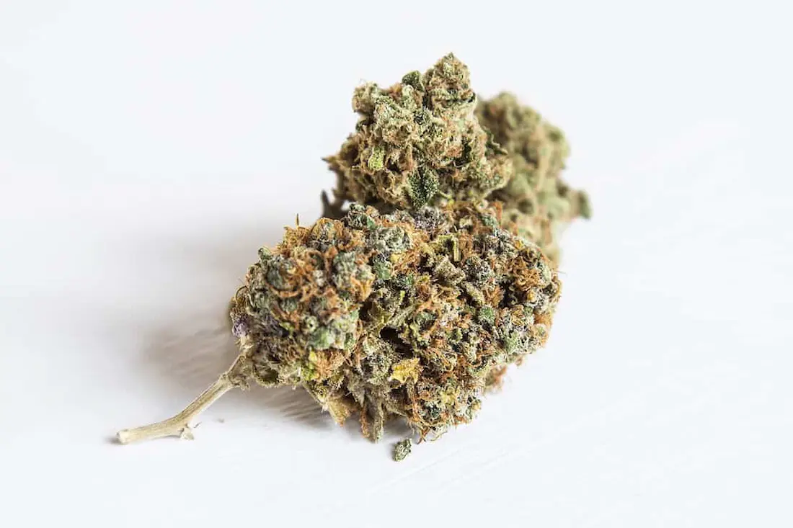

El cannabis o marihuana, es un fármaco derivado de la planta de cannabis que se utiliza para uso recreativo, con fines medicinales y rituales religiosos o espirituales. Las plantas de cannabis producen una familia única de compuestos llamados cannabinoides. De éstos, el principal compuesto psicoactivo (función que afecta al cerebro) es el tetrahidrocannabinol (THC). La marihuana contiene altos niveles de THC, así como otros productos químicos psicoactivos que producen que los usuarios se sientan en estado alterado al inhalar o ingerir la misma. Alabada y criticada, la marihuana ha demostrado ser una verdadera farmacia natural, cosa que ni sus detractores pueden negar.

## Historia de la marihuana

El cannabis ha sido utilizado por los seres humanos desde hace miles de años, y el primer registro de su uso data del 3er milenio antes de Cristo. Es originaria de Asia Central y del Sur, y se cree que ha sido utilizada por muchas civilizaciones antiguas, sobre todo como una forma de medicina o terapia a base de hierbas.

## Clase de drogas: Cannabis

Las leyes relativas a la producción, posesión, uso y venta del cannabis entraron en vigor a principios del siglo 20. Pero a pesar de ser ilegal en la mayoría de los países, incluyendo los de América y Europa, su uso como droga recreativa es todavía muy común. De hecho, según las Naciones Unidas, es la droga ilícita más utilizada en el mundo, con aproximadamente 22,5 millones de adultos en todo el planeta que se estima,  usan marihuana a diario.

## Estatus legal

Por poner un ejemplo, en el Reino Unido, el cannabis se clasifica como una droga de Clase B. Por lo tanto, los individuos capturados en posesión de estos medicamentos se les administra un castigo más leve, a menudo la confiscación de la droga y una advertencia.

## Efectos del cannabis

El cannabis provoca una serie de notables pero leves efectos (en comparación con otras drogas recreativas) físicos y mentales. Éstos incluyen:

- Aumento de la frecuencia del pulso cardíaco
- Boca seca
- Aumento del apetito
- Ojos rojos producto de más sangre a nivel ocular
- Aturdimiento
- Mareos ocasionales
- Problemas con la memoria, la concentración, la percepción y el movimiento coordinado

Los grupos pro-cannabis y activistas a menudo ponen de relieve sus beneficios para el alivio del dolor y el estrés, y el hecho de que nunca se ha reportado una muerte relacionada al uso de la marihuana.

## La marihuana y sus efectos sobre la diabetes

### 1\. Los posibles beneficios del cannabis

Algunos estudios, si bien están basados en animales de laboratorio, en los últimos años han puesto de manifiesto una serie de posibles beneficios para la salud del cannabis para los diabéticos. Un trabajo de investigación publicado por la Alianza Centroamericana para el Cannabis Médicos (AAMC) sugirió que el cannabis puede ayudar con los siguientes beneficios:

- Estabiliza el azúcar en la sangre (una gran cantidad de evidencia anecdótica se está construyendo entre los diabéticos para apoyar esto).
- Disminuye la inflamación arterial comúnmente experimentada por los diabéticos, que puede conducir a la enfermedad cardiovascular
- Previene la inflamación de los nervios y alivia el dolor de la neuropatía (la complicación más común de la diabetes que puede after el [pie diabetico](/pie-diabetico))  estimulando los receptores en el cuerpo y el cerebro.
- Baja la presión arterial con el tiempo, lo que puede ayudar a reducir el riesgo de enfermedades del corazón y otras complicaciones de la diabetes
- Ayuda a mantener abiertos los vasos sanguíneos y mejorar la circulación.
- Colabora a aliviar los calambres musculares y el dolor de los trastornos gastrointestinales (GI)
- Puede ser utilizada para hacer cremas de uso tópico para aliviar el dolor neuropático y el [hormigueo en las manos](/7-razones-cosquilleo-en-las-manos-los-pies/) y pies.

Los compuestos de marihuana también se han demostrado que ayudan a reducir la presión intraocular (la presión del fluido dentro del ojo) de manera considerable en las personas con glaucoma, un tipo de enfermedad de los ojos que es causada por condiciones que restringen severamente el flujo sanguíneo al ojo, tales como la severa [retinopatía diabética](/como-vencer-la-ceguera-causada-por-la-retinopatia-diabetica/) .

### 2\. El tratamiento para la inflamación

Investigadores israelíes de la Universidad Hebrea de Jerusalén creen que el cannabidiol (CBD), un compuesto encontrado en el cannabis, podría tratar diferentes enfermedades como la diabetes, la arterosclerosis y las [enfermedades cardiovasculares](/diabetes-y-los-problemas-coronarios/). Este estudio fue publicado en 2015. El CDB no es psicoactivo y posee propiedades anti-inflamatorias. La inflamación crónica se sabe que juega un papel importante en el desarrollo de resistencia a la insulina y la diabetes tipo 2. Los estudios continúan y la marihuana está en el ojo del huracán.
