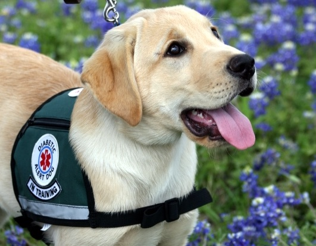

La diabetes es una enfermedad grave que puede afectar a casi cualquier canino e influir sustancialmente su salud de una manera negativa si no se trata adecuadamente. Las pruebas de diagnóstico de la diabetes en perros están disponibles fácilmente a través de los consultorios veterinarios. El dueño de un perro puede realizar las pruebas rutinarias de glucosa en la sangre en el hogar; En caso de que sea dificultoso hacerlo en su propia casa, el veterinario tiene la técnica y herramientas necesarias para realizar dichas pruebas en su consultorio.

## Pruebas de Diagnóstico de la diabetes en perros

Después de haber probado que tu mascota tiene diabetes, es conveniente ir al consultorio de un veterinario, donde éste realizará un análisis de sangre y/o prueba de orina que indicará la resistencia del animal a la insulina o la falta de producción de esta hormona. Si el páncreas de tu perro no está produciendo suficiente insulina, habrá una indicación sostenida de altos niveles de glucosa en la sangre. Esta prueba se llama A1c, y que por lo general mide el porcentaje de los niveles de glucosa en la sangre durante un período de dos a tres meses. El examen de orina, que es menos preciso que la prueba de sangre A1c, pondrá a prueba para detectar signos de cetonas, que son una indicación de niveles anormales de azúcar en la sangre.

## Pos-Diagnóstico de la diabetes en perros

Después del diagnóstico positivo de diabetes en perros, un veterinario le recetará ya sea medicación oral y / o inyecciones de insulina si el páncreas del perro no está produciendo insulina, que es un tratamiento similar al igual que con los seres humanos para la diabetes de tipo 1 y [diabetes tipo 2](/diabetes-tipo-2/). Dependiendo de la gravedad de la diabetes del perro, las pruebas de glucosa en la sangre normalmente pueden ser necesarias para garantizar un tratamiento preciso de la condición del perro. Diariamente se requerirán pruebas de los niveles de glucosa si el perro está en tratamiento con insulina para mantener los niveles normales de glucosa y para evitar episodios peligrosos de hiperglucemia o [hipoglucemia](/la-hipoglucemia-nivel-bajo-de-azucar-en-sangre/) que implican altos y bajos niveles de azúcar en la sangre.

## Consideraciones

En el hogar las pruebas de glucosa en la sangre pueden convertirse en una tarea difícil de realizar con éxito, ya que hay muchos factores externos que influyen en los niveles de glucosa en la sangre de un perro. El estrés, el calor, el ejercicio, los hábitos alimenticios, la enfermedad y acciones diarias normales son todos  eventos que pueden afectar los niveles de glucosa. Este cambio constante en los números puede hacer que estas pruebas en la sangre hechas en casa sean muy  difíciles, ya que se necesitará mantener una vigilancia constante sobre las indicaciones físicas de alto o bajo nivel de azúcar en la sangre.

## Glucómetros

En el hogar los monitores de pruebas manuales de glucosa en sangre se refieren a menudo como _**glucómetros**_. El uso de un medidor en su casa con su perro diabético puede ser un método más fácil y más barato para el monitoreo del azúcar en la sangre de tu mascota. Estos Medidores para las pruebas son hechas por varios fabricantes, tales como: Accu-Check, One Touch y FreeStyle. Estas empresas también producen tiras de prueba que reúnen una pequeña gota de sangre en la punta de la tira, ésta se lee a continuación por la máquina y se traduse en un número. Este número es el nivel de glucosa en el torrente sanguíneo y se mide por mg/dL.

## Métodos de ensayo

Realizar una prueba de glucosa en la sangre de tu perro para vigilar la diabetes puede ser bastante complicado. Dependiendo de la tolerancia de tu perro al dolor y su comportamiento cuando se prueba, la recopilación de una gota de sangre puede ser simple o todo un acontecimiento. Normalmente, el método para probar los niveles de glucosa de tu perro consiste en utilizar primero un dispositivo o aguja para reunir una gota de sangre, ya sea de su  oreja, cola, labio o de la pata. La ubicación de la muestra de sangre dependerá de lo que tu perro te lo permita. Una tira de prueba se inserta en el medidor, y luego recogerá la gota de sangre al permitir que el extremo de la tira reactiva absorba la sangre a través de la punta. El medidor luego leerá el nivel de glucosa en unos cinco segundos y te informará de la necesidad de tu perro de recibir tratamiento o no.

Nuestras mascotas son nuestros mejores compañeros y somos responsables de su bienestar, esto incluye su alimentación y salud. La causa exacta de la diabetes en los perros es desconocida. Sin embargo, las enfermedades auto-inmunes, la genética, la obesidad, la pancreatitis crónica, ciertos medicamentos y los depósitos anormales de proteínas en el páncreas pueden jugar un papel importante en el desarrollo de la enfermedad.

Sin embargo, es importante comprender que la diabetes se considera un trastorno manejable, y muchos perros diabéticos pueden llevar una vida feliz y saludable.
