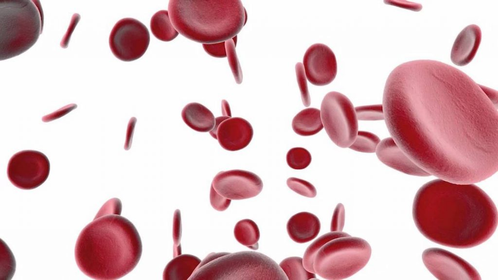

El nivel de A1C **es el porcentaje de glóbulos rojos que tienen moléculas de azúcar unidos a ellos**. También se le conoce como hemoglobina glicosilada,  hemoglobina A1C y HbA1c. Tu médico puede medir el número de A1C con un análisis de sangre para determinar los niveles promedio de azúcar en la sangre durante los últimos dos o tres meses. Un nivel de A1C normal, se sitúa entre 4 y 6 por ciento. Si tú tiene diabetes tipo 1 o tipo 2,  debes tratar de mantener el número de A1C por debajo del 7 por ciento.

Los niveles de A1c son una medida del promedio de azúcar en la sangre a través del tiempo. En Internet  se pueden encontrar muchas ideas para lograr bajar los niveles de A1c. Las sugerencias van desde el uso de la [canela](/canela-glucosa-alta/) en tu dieta hasta beber alcohol. Sin embargo, la implementación de una o dos ideas encontradas al azar, no te permitirá conseguir los resultados que necesitas. _**Sólo un cambio metódico en su dieta y estilo de vida hará bajar los niveles de A1c**_. Según los especialistas, _la pérdida de peso es la manera más eficaz para lograr el control de azúcar en la sangre_. También señalan que es importante para las personas que tienen diabetes tomar pruebas de A1c de forma rutinaria.

## Dieta

1. Cuenta tus calorías. Los niveles de A1c están mucho más afectados por el número total de calorías consumidas que por el contenido de calorías individuales. Por ejemplo, es mejor comer la mitad de un panecillo de canela que poner crema de leche en tu café ya la crema es más densa en calorías. Según los especialistas, la dieta es la forma natural más eficaz para reducir los niveles de A1c.

2. Debes mantener un diario de calorías consumidas cada día. Trata de mantener aproximadamente 2.000 calorías totales consumidas durante el transcurso de aproximadamente seis comidas pequeñas, aunque es bueno consultar a un profesional para tu ingesta calórica ideal.

3. No te permitas pasar tanto tiempo sin ingerir alimentos pensando que tienes una compensación por llenarte de alimentos con alto contenido calórico. Manten una merienda saludable a mano.

4. Procura desayunar dentro de la media hora luego levantarte cada día. Las investigaciones realizadas por los especialistas mostró que _las personas que comieron un desayuno temprano fueron los más exitosas en mantener un peso saludable_.

Debes considerar que hay alimentos que deben evitarse sí o sí. Los Hidratos de carbono simples, los alimentos grasos con exceso de calorías, los puedes evitar al limitar el consumo de papas, arroz, fideos y alimentos que contengan harina blanca. Pasar postres azucarados, dulces, helados, refrescos y  galletas, pasteles, productos de panadería y donas. Evita el pollo frito, comidas congeladas, carnes frías, refrescos azucarados y el agua con sabor, batidos y bebidas de frutas comprados en la calle, batidos de leche (merengadas), pizza congelada, y comidas fritas, hamburguesas, pizza y sándwiches de pollo o pescado. Todos estos alimentos pueden elevar tus niveles de A1C, especialmente si  tienes diabetes.

## Ejercicio

1. Actívate. Hacer ejercicio en combinación con un plan de control de la dieta acelerará la reducción de A1c. El ejercicio aeróbico quema calorías y mejora la resistencia a la [insulina](/que-es-la-insulina-cuantos-tipos-existen/), lo que puede reducir la necesidad de medicamentos. La [diabetes tipo 2](/diabetes-tipo-2/) se puede prevenir a través de simples cambios de estilo de vida y perder alrededor de 5 a 7 por ciento del peso corporal. _El ejercicio puede ayudar al cuerpo a deshacerse del exceso de glucosa debido a la creación de un mayor porcentaje de masa muscular_.

2. No sientas que tienes que pasar horas en un gimnasio. Ten en cuenta lo que haces en un día típico y busca maneras en que puedes llegar a ser más activo. Puedes caminar enérgicamente durante 15 minutos varias veces al día o sacar a pasear al perro. Eso es bueno para ti y tu perro estará más feliz.

3. En tu trabajo o cualquier edificio elije las escaleras en lugar del ascensor.
4. Juega con tus hijos o nietos en lugar de ver la televisión o pasar el día en Facebook o chateando.
5. Al caminar, ponte retos en tu rutina. Sube una colina o añade estiramientos. El [yoga](/yoga-contra-la-diabetes/) es una excelente opción. Mediante la incorporación de pequeños cambios en tu vida, no sólo va a apenas notar la diferencia, también va s a dar pasos importantes hacia la reducción de tus niveles de A1c.

## Manten la motivación

1. Da seguimiento y disfruta de los beneficios de la reducción de A1c. Mide tu presión sanguínea a medida que avanzas en tu programa, y deleitate viéndola bajar. Disfruta probar nuevas comidas, sabrosas y saludables.

2. Busca otros beneficios para la salud. **Estudios han demostrado una correlación directa entre los esfuerzos para reducir la A1c y mejorar el colesterol.**
3. Prueba nuevas actividades y verás como tus niveles de salud y energía mejoran. Practica tenis, baile, kayak, natación, parapente o el ala delta.
