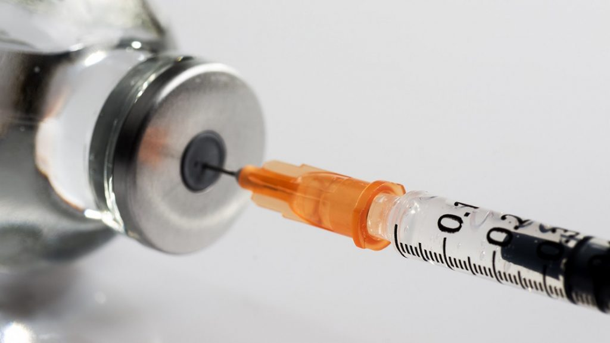

La insulina es una hormona producida por el páncreas que ayuda a regular la cantidad de glucosa en la sangre moviéndola a las células que la utilizan para obtener energía para tu organismo y permitir que éste funcione normalmente. *Todo el mundo necesita una cierta cantidad de glucosa para proporcionar energía*, pero cuando el páncreas no produce suficiente insulina (como en la diabetes tipo 1) o no reacciona a ella apropiadamente (como en la diabetes tipo 2), la glucosa se acumula en la sangre y puede causar problemas de salud graves. Algunos diabéticos son capaces de controlar el azúcar en la sangre con dieta y ejercicio, pero otros deben inyectarse insulina para mantener el azúcar en la sangre dentro de un rango normal. El precio de la insulina varía en las farmacias, sigue estos consejos para conseguir insulina a un bajo costo.

## Cómo conseguir insulina a un bajo costo

1. **Compra en volumen**. Pregúntale a tu médico la posibilidad de que te dé una receta de 3 meses de insulina en lugar de una prescripción de 30 días. La mayoría de los planes de prescripción de seguros requieren que pagues un copago cada vez que renueves la receta. Si tu receta es para 3 meses, es posible que puedas obtener un suministro de 3 meses de insulina para un solo copago. Y si no tienes seguro siempre podrás solicitar un descuento directo al comprar en mayor cantidad.
2. **Usa los genéricos**. Varios marcas de insulina están disponibles en marcas genéricas, Así por ejemplo, los nombres de marcas como Humulin R y Humulin N se venden genéricamente como Novolin R y Novolin N, respectivamente. Las marcas genéricas a menudo cuestan \$ 20 menos que las marcas famosas para un suministro de 30 días. Si el tipo de insulina que utilizas no está disponible en una marca genérica, habla con tu médico acerca de la posibilidad de cambiar a una marca por otra.
3. **Obtén muestras gratuitas**. Pregúntale a tu médico si te puede dar muestras de insulina. Muchos representantes de las compañías farmacéuticas visitan los consultorios médicos con regularidad y dejan muestras de medicamentos que los doctores pueden pueden regalar a sus pacientes.
4. **Solicita los descuentos**. La mayor parte de las principales compañías farmacéuticas ofrecen descuentos o medicamentos gratis a los pacientes que no pueden darse el lujo de pagarlos al precio normal. Tu médico te puede dar ayuda (se requieren declaraciones tanto financieras y médicas). Si es aprobado, el medicamento gratis o con descuento puede ser enviado directamente a tu casa o al consultorio de tu médico.

Lo importante es no desesperar y saber que siempre puede haber una solución.

Es tu deber analizar bien esta situación. No se si te habrás fijado en la poca disponibilidad de medicamentos genéricos para la Diabetes y otras enfermedades. **Incluso los genéricos para diabéticos, incluyendo la [insulina](/que-es-la-insulina-cuantos-tipos-existen/), pueden ser bastante costosos. ¿Por qué no hay un genérico económico para la insulina?** Esa es una pregunta interesante que te deberías realizar ya que hay muchas personas en el mundo que no pueden pagar este medicamento.

Una investigación analiza por qué las personas con diabetes que dependen de inyecciones de insulina para salvar la vida  aún no tienen opciones genéricas más baratas para tratar su enfermedad.

"Sorprendentemente, este tema no se ha hablado, así que estamos haciendo la pregunta: ¿Por qué no hay insulina genérica" dijo el autor del estudio principal, el Dr. Kevin Riggs, un investigador de la Facultad de la Universidad Johns Hopkins de Medicina de Baltimore.

En su informe, publicado el 19 de marzo en el New England Journal of Medicine, Riggs y su colega el Dr. Jeremy Greene describen cómo **el desarrollo EXCLUSIVO de la insulina permitió a las empresas farmacéuticas mejorar continuamente el medicamento mientras se extienden patentes durante décadas**. Y las leyes de patentes establecen que **los medicamentos genéricos no se pueden fabricar hasta una patente sobre un medicamento de marca expire**. El costo de la insulina para alguien que no tiene cobertura de seguro en EEUU está entre $ 120 a $ 400 al mes. _Como ves, es un negocio perfecto donde lo que importa son las ventas y no la vida humana. Es lamentable pero así es_.
