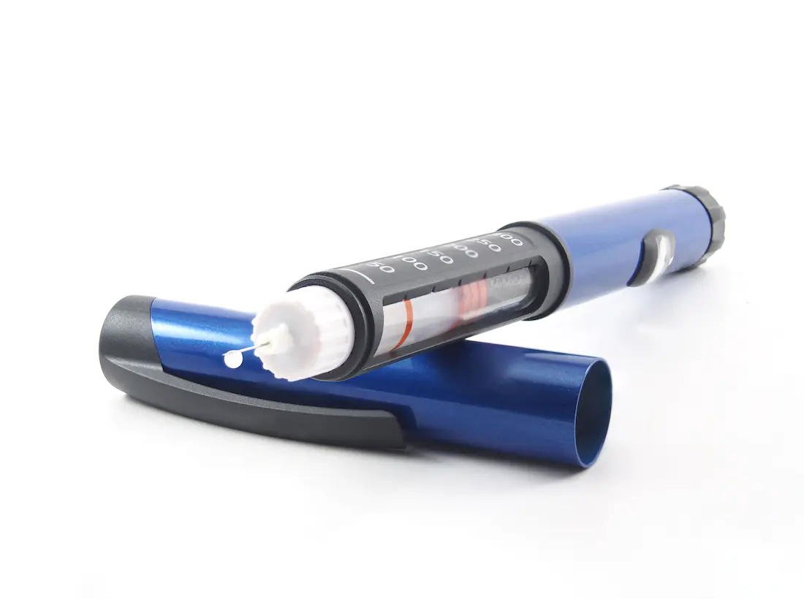

import { Video } from '../../../components/Complete'

Existen diversos modos para introducir la insulina en el torrente sanguíneo pero el más usado y odiado, sigue siendo la tradicional inyectadora. Este incomprendido artefacto salva millones de vidas en el mundo pero la verdad no conozco un ser humano que le simpatice este producto y sus casi siempre dolorosos pinchazos. Las plumas para inyectar insulina son una opción un poco más cómodas y precisas. Además de discretas pueden ser menos molestosas que las inyectadoras tradicionales.

Una pluma de insulina se utiliza para inyectar la insulina en el tratamiento de la diabetes. Como bien sabes la insulina es una hormona producida por el páncreas. La pluma compone de un cartucho de insulina (integrado o comprado por separado) y un dial para medir la dosis, y se usa con agujas desechables en la pluma para administrar la dosis. Fue introducida y comercializado como Novopen por la empresa danesa Novo Nordisk en 1985.

## Tipos de plumas

Un número de compañías hacen plumas de insulina incluyendo Novo Nordisk, Aventis y Eli Lilly. Estas empresas producen plumas para la mayoría de sus marcas de insulinas, incluyendo NovoLog / NovoRapid, Humalog, Levemir y Lantus.

Hay dos sistemas de pluma: reusables y desechables (prellenadas):

Una pluma durable utiliza un cartucho de insulina reemplazable. Cuando el cartucho de insulina está vacío, estecartucho se elimina y uno nuevo se inserta en la pluma. Una pluma prellenda es totalmente desechable. La pluma viene pre-llena con insulina, y cuando el cartucho de insulina o depósito está vacío, toda la unidad se descarta.

Las plumas de insulina son utilizados por el 95% de los pacientes tratados con insulina en Europa, Asia, Australia y Escandinavia con excelentes resultados. Están actualmente son infrautilizadas en América pero su uso cada día se está popularizando.

Las plumas de insulina ofrecen varias ventajas significativas sobre las jeringas de insulina: la facilidad de manejo, la precisión, y que son más discretas de usar. Puedes llevarla en un bolsillo y usarla cuando lo requieras

## Cómo utilizar una pluma de insulina (puedes ver el Video Explicativo)

Atornilla o introduce con presión una nueva aguja de la pluma. Si es necesario, ceba la pluma para eliminar el aire de la aguja Gira la perilla en el extremo de la pluma (o "marcar") con el número de unidades necesarias Inserta la aguja en la piel Pulse el botón en el extremo de la pluma para administrar la dosis Cuenta hasta cinco o diez, dependiendo de la dosis inyectada Elimina la aguja. Si es una pluma desechable debes botarla.

<Video src="https://www.youtube.com/embed/gciQEPUSnvI" />

## Ventajas

Las plumas de insulina tienen una serie de ventajas:

- Son más conveniente y más fáciles de transportar que una jeringa tradicional. - Te puedes administrar varias dosis muchas veces más con más precisión. - Son más sencillas de usar para las personas con impedimentos visuales o con habilidades motoras mermadas. - El dolor de la inyección es menor (como son agujas pulidas y recubiertas no están embotadas por la inserción en un frasco de insulina antes de una segunda inserción en la piel). 
- Es importante que se utilicen los sitios apropiados para la inyección en el cuerpo. Un profesional de la salud  te ayudará a determinar el mejor lugar de inyección para un paciente. En general, los lugares de inyección recomendados son el abdomen, partes de las nalgas y áreas del muslo.

## Desventajas

A diferencia de la tradicional jeringa, dos insulinas diferentes no pueden ser mezcladas por el usuario en una pluma de insulina.  Por otro lado, algunos de los más nuevos tipos de insulina no se pueden mezclar en absoluto. Además, el uso de lápices y agujas para pluma suele ser más caro que utilizar las vías tradicionales tradicionales como el método de la jeringa; el seguro de cobertura para plumas de insulina en los Estados Unidos y otros países pueden variar ampliamente.

## Accesorios

La tecnología no ha cambiado mucho desde el lanzamiento de la primera pluma de insulina hace más de 25 años por Novo Nordisk. Un número de compañías independientes han creado accesorios para ayudar a las personas que utilizan las plumas de insulina a gestionar mejor su consumo de insulina.

- Sin embargo se iventó una cartera para ayudar a mantener las plumas de insulina frías a temperaturas de ambientes cálidos. Timesulin es un "tope inteligente" que funciona con todos los principales tipos de pluma de insulina para mostrar a los usuarios el tiempo que ha pasado desde que uso su pluma de insulina y se una inyección para ayudar a evitar las dosis dobles, perdidas o accidentales. Existe un dispositivo Rastreador inteligente  que sirve como una tapa para la mayoría de las plumas de insulina y transmite los datos de inyección de insulina y los [niveles de glucosa](http://dediabetes.com/cuanto-es-el-nivel-normal-de-glucosa/) a través de Bluetooth a los teléfonos inteligentes y tabletas.
