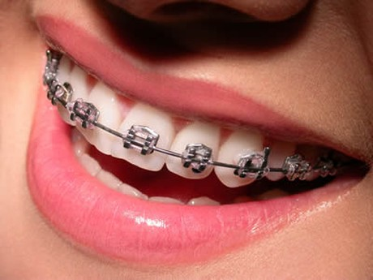

En el día a día del odontólogo se pueden presentar a la consulta pacientes con Diabetes, por lo que es necesario estar conscientes de las consideraciones en el manejo médico y dental para esta extensa población de pacientes. **_Ningún tratamiento dental debería iniciarse hasta saber si el paciente está adecuadamente controlado por el endocrinólogo_** pues, los pacientes diabéticos no solo están expuestos a descompensaciones en su metabolismo, sino a complicaciones por infección, cicatrización, sangrado secundario, pérdida ósea del hueso alveolar, entre otras complicaciones propias de esta difícil enfermedad.

La salud bucal es un componente sumamente importante que no puede separarse de la salud general del paciente, por lo que el odontólogo debe trabajar en conjunto con el médico que está tratando la diabetes. La ortodoncia es la especialidad que estudia, previene y trata las malas oclusiones. Mediante la ortodoncia se puede corregir el mal alineamiento de piezas dentarias, su mala posición, los dientes "encaramados" o su apiñamiento, la falta de espacio para una pieza dental y las alteraciones de la oclusión, entre otros.

## Requisitos para un Tratamiento de Ortodoncia

Para realizar un tratamiento de ortodoncia en una persona diabética debe cumplirse con los siguientes requisitos:

- estar controlado mediante la medicación indicada por su médico endocrinólogo
- tener una condición periodontal que sea favorable salud de las encías y tejidos que rodean los dientes)
- Mantener una buena higiene dentales

Para esto también es importante la evaluación previa de un periodoncista. Los tratamientos de ortodoncia no deben de ser muy prolongados y además los movimientos dentales que se realizan deben ser lentos y controlados.

## Sobre el Tratamiento de Ortodoncia

La eliminación del sarro y la placa bacteriana durante el tratamiento de ortodoncia deben ser mensuales, y se además hay que prestar especial atención a las indicaciones especiales de higiene dental del paciente. Para realizar un tratamiento dental o de ortodoncia hay que tener presente que los pacientes con Diabetes tienen mayor riesgo de complicaciones y problemas de salud oral. Cuanto peor controlado esté el nivel de azúcar en la sangre, mayores problemas tendrá el paciente. La Diabetes mal controlada no solo afecta la capacidad de defensa del organismo frente a las infecciones que pueden aparecer en la boca, sino también la capacidad de remodelado óseo al realizar los movimientos dentales en ortodoncia. Se puede decir que el organismo está en condiciones mermadas que impiden una buena recuperación. Los problemas dentales son frecuentes en pacientes diabéticos por lo que se debe prestar especial atención a la acumulación de placa bacteriana y a las heridas para evitar posibles complicaciones durante el tratamiento. _Es importante tener conciencia que este tipo de problemas puede evitarse o disminuirse cuando el paciente está bajo control médico, mantiene una dieta alimenticia adecuada, no fuma, tiene buenos hábitos de higiene dental y visita a su odontólogo al menos 3 veces al año._

El odontólogo general y el ortodoncista deben estar en constante comunicación con el médico endocrinólogo cuando están realizando tratamientos en pacientes que padecen de Diabetes; además tienen la responsabilidad de educar a los pacientes diabéticos que están bajo su atención e insistir que acudan periódicamente a las citas de control médico. Con la diabetes no se pueden permitir descuidos.

## Estos son algunos consejos a tener en cuenta

Seguir rigurosamente las instrucciones del odontólogo antes, durante y después de la consulta.

- Las personas con Diabetes que lleven aparatos de ortodoncia deben contactar con su ortodoncista inmediatamente en caso de que algún elemento produzca un corte en la mucosa de las mejillas, encías, paladar o en la lengua.

- El médico endocrinólogo debe estar al tanto de su tratamiento de ortodoncia. En esta batalla se debe actuar como un equipo muy bien acoplado.

- El estado de dientes y encías debe ser bueno, de lo contrario no está indicado realizar el tratamiento de ortodoncia.

- Debe tener un programa de al menos una profilaxis dental tres o más veces al año (es posible que tu dentista te recomiende una mayor frecuencia dependiendo del estado de su boca y de los tratamientos que necesites) y un control más frecuente durante el tratamiento de ortodoncia. De ser posible, debes eliminar el sarro y hacerte profilaxis en forma mensual durante el tratamiento.

- Evita la formación de placa bacteriana usando también el hilo dental al menos una vez al día.

- Cepilla los dientes después de cada comida. Utiliza un cepillo de cerdas suaves.

- Si tienes una prótesis removible límpiala a diario.

- Si fumas habla con su doctor sobre los tratamientos para dejar ese nefasto vicio.

- Usa un enjuague adecuado que ayude a prevenir la formación de placa bacteriana. Esto se hace tres veces al día como mínimo.

La apariencia y salud dental es muy importante en todas las personas pero si tienes diabetes siempre debe prevalecer tu estado de paciente diabético sobre cualquier tratamiento dental. Luego que analices con tu médico tu seguridad entonces podrás comenzar tu tratamiento de ortodoncia.
