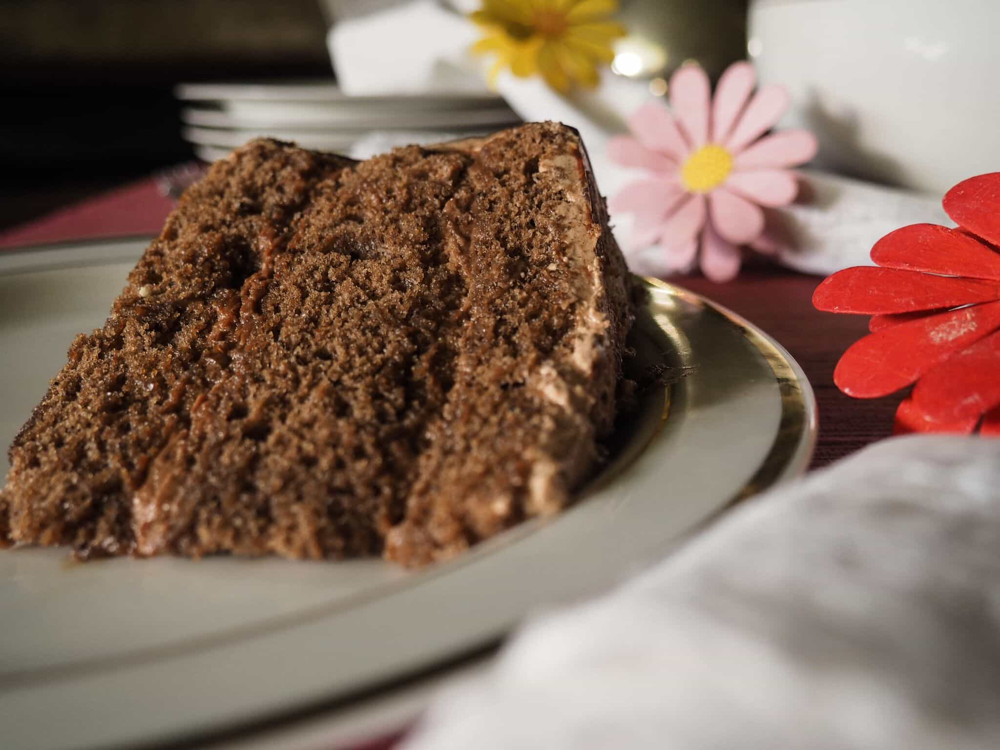
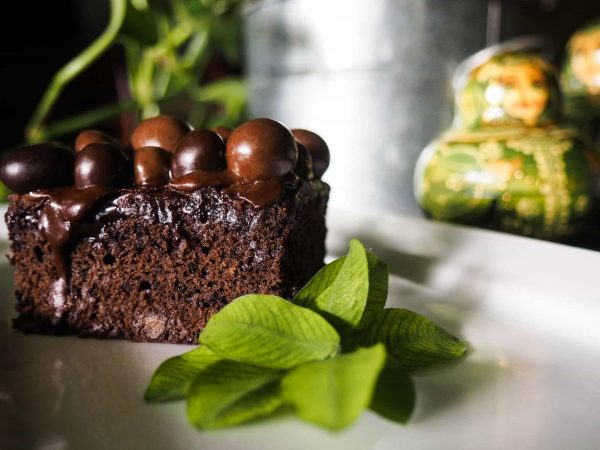
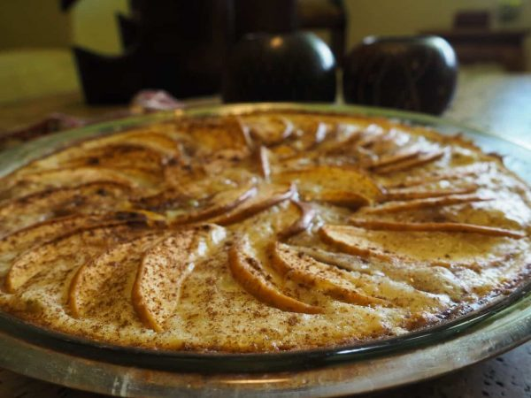
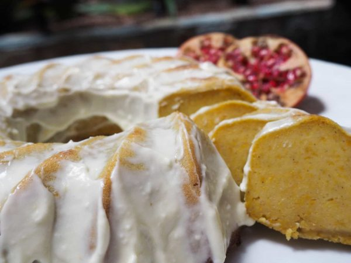
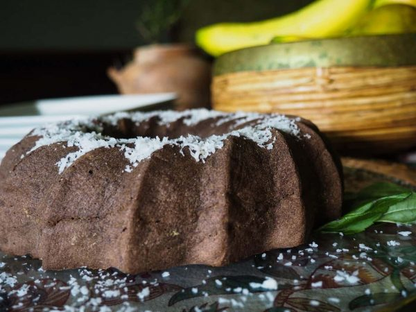
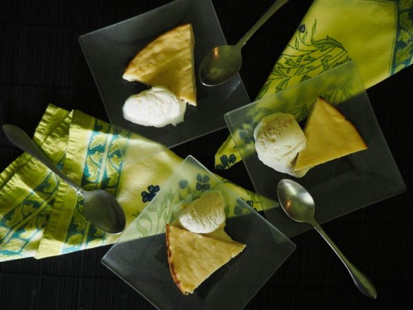
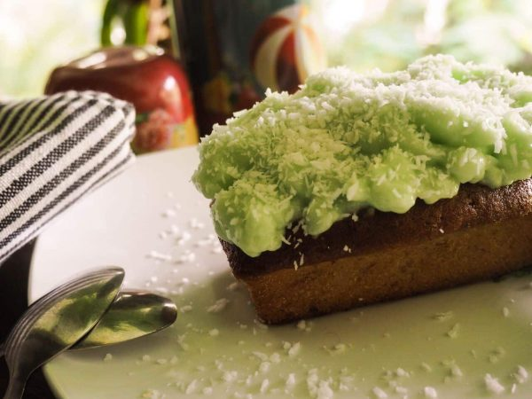

import Alert from '@material-ui/lab/Alert';

Empezando por la Torta Alemana, los invitamos a disfrutar de nuestras mejores recetas de tortas para diabeticos. Hemos seleccionado aquellas recetas cuyo contenido nutricional están acorde con las necesidades de la persona diabética y con un exquisito sabor.

## Tortas para Diabeticos #1: Torta Alemana

A pesar de que una persona tenga diabetes, existen pocas razones para no disfrutar de vez en cuando de un pastel de chocolate alemán. Esta deliciosa torta utiliza algunas onzas de chocolate para hornear o cacao sin azúcar, harina de pastel, mantequilla, huevos y azúcar. Para adornarla se usa leche evaporada, nueces, coco, yema de huevo, azúcar y vainilla. Se pueden utilizar sustitutos para el azúcar y grasa en la torta, dejando caer la carga de calorías de forma considerable, lo que hace que sea un mejor postre para los diabéticos que la receta original. Aunque puedes jugar con los ingredientes, también se puede seguir las instrucciones para hacer el pastel basado en recetas tradicionales de la torta de chocolate alemana.

<h3 className="mx-auto">Para la torta</h3>

Ingredientes

<ul>
<li>4 huevos separados</li>
<li> 1 taza de leche descremada</li>
<li> 150 gr. de chocolate oscuro, sin azúcar</li>
<li> ½ taza de mantequilla</li>
<li> ½ taza de puré de manzana (hornear las manzanas hasta que estén blandas)</li>
<li> 30 gr. de edulcorante granulado o en polvo</li>
<li> 1 cucharada de extracto de vainilla</li>
<li> ½ taza de agua</li>
<li> 2 tazas de harina todo uso</li>
<li> 1 cucharada de polvo para hornear</li>
<li> Una pizca de sal</li>
</ul>

  
Preparación

  <ol>
    <li>Precalentar el horno a 180ºC (350ºF).</li>
    <li>Batir las claras a punto de nieve con el edulcorante y reservar.</li>
    <li>
      Batir las yemas de huevo, junto con la mantequilla hasta que se ponga
      cremosa.
    </li>
    <li>
      Derretir el chocolate a baño de maría con leche, incorporarlo a la
      mantequilla y las yemas de huevo.
    </li>
    <li>
      Incorporar la harina, el polvo de hornear, la cucharada de vainilla y la
      pizca de sal, seguir batiendo hasta lograr una consistencia homogénea.
    </li>
    <li>Incorporar el puré de manzana.</li>
    <li>
      Incorporar las claras de huevo con el edulcorante, haciendo movimientos
      envolventes.
    </li>
    <li>
      Hornear durante 30 minutos o hasta introducir un palillo y que salga seco.
    </li>
    <li>Colocar la Cobertura. Para este paso tienes dos opciones:</li>
  </ol>
  <ul>
    <li>
      Puedes hornear la torta sin la cobertura, y luego colocar la cobertura al
      final de la cocción. En este caso, introduce la torta cuando ya le hayas
      colocado la cobertura unos 5 minutos en el horno o hasta que dore un poco
      la cobertura.
    </li>
    <li>
      Puedes colocar la cobertura y después hornear la torta, siempre cuidando
      que la cobertura no esté demasiado cerca de la parte superior del horno
      para que no se queme (colócala en la bandeja más baja).
    </li>
  </ul>

<h3 className="mx-auto">Para la Cobertura</h3>

Ingredientes

<ul>
<li>4 yemas de huevo</li>
<li>300 gr. de leche evaporada</li>
<li>1 cucharada de extracto de vainilla</li>
<li>20 gr. de edulcorante granulado o en polvo</li>
<li>½ taza de mantequilla</li>
<li>250 gr. de coco rallado</li>
</ul>

  
Preparación

  <ol>
    <li>Batir las yemas de huevo con la mantequilla.</li>
    <li>Incorporar el edulcorante y la vainilla.</li>
    <li>Incorporar la leche descremada.</li>
    <li>Mezclar con el coco rallado y colocar sobre la torta.</li>
  </ol>

### Consejos para el montaje

1. Esta torta puede quedar muy bonita si la presentas por capas.
2. Para ello, puedes hornear la mezcla en tres moldes iguales, cuando esté lista, cubres cada capa con un poco de cobertura haciendo una torre,
3. Después cubres toda la parte exterior con la cobertura.
4. Finalmente, hornea unos 5 minutos de nuevo o hasta que la cobertura esté un poco dorada.

<Alert variant="outlined" severity="info">
Porciones: 8. Tiempo de preparación y cocción: 1 hora. Tiempo de reposo: Dejar
  enfriar en la nevera durante 2 horas. Calorías estimadas por porción: 350.

</Alert>

## Tortas para Diabeticos #2: **Torta de Chocolate**

Ingredientes

<ul>
<li>4 huevos</li>
<li>100 gr. de mantequilla</li>
<li>250 gr. de chocolate semi-amargo, sin azúcar</li>
<li>1 cucharada de café</li>
<li>200 gr. de fructuosa</li>
<li>1 cucharada de almidón de maíz</li>
<li>¼ de taza de cacao</li>
<li>1 taza de harina</li>
<li>Bombones o chocolates sin azúcar.</li>
</ul>

  
Preparación

  <ol>
    <li>Precalentar el horno a 180ºC (350ºF).</li>
    <li>Batir los huevos hasta que aumenten su volumen.</li>
    <li>Incorporar la fructuosa y seguir batiendo durante unos 5 minutos.</li>
    <li>Derretir el chocolate con la mantequilla a baño de maría.</li>
    <li>Incorporar el chocolate derretido a los huevos con la fructuosa.</li>
    <li>
      Agregar la taza de harina progresivamente, mezclando con una cuchara.
    </li>
    <li>Incorporar el cacao, el almidón de maíz y la cucharada de café.</li>
    <li>
      Hornear durante 30 minutos o hasta que al introducir un palillo salga
      seco.
    </li>
    <li>Servir adornando con bombones o chocolate sin azúcar.</li>
  </ol>

<Alert variant="outlined" severity="info">
Porciones: 8. Tiempo de preparación y cocción: 1 hora. Tiempo de reposo: Se
  puede servir tibio o dejar enfriar. Calorías estimadas por porción: 370.

</Alert>

## Tortas para diabeticos #3: **Pastel de Manzana**

Ingredientes

<h3>Para la masa</h3>
<ul>
<li>2 tazas de harina</li>
<li>20 gr. de edulcorante granulado o en polvo</li>
<li>50 gr. de mantequilla</li>
<li>1 cucharada de polvo de hornear</li>
</ul>

<h3>Para el Relleno</h3>
<ul>
<li>2 huevos</li>
<li>1 taza de leche descremada</li>
<li>20 gr. de edulcorante en polvo o granulado</li>
<li>5 manzanas</li>
<li>1 taza de mermelada de frutas sin azúcar (manzana, naranja o moras funcionan bien)</li>
</ul>

  
Preparación

  <ol>
    <li>Precalentar el horno a 180ºC (350ºF).</li>
<li>Derretir la mantequilla e incorporarla a la harina, el polvo para hornear y agregar el edulcorante.</li>
<li>Formar una masa, extenderla y cubrir un molde bajo con ella.</li>
<li>Hornear durante 15 minutos o hasta que dore.</li>
<li>Mezclar los huevos con la leche descremada y el edulcorante.</li>
<li>Rebanar las manzanas.</li>
<li>Cubrir el molde con las manzanas ordenadas formando un círculo (o un cuadrado si el molde es cuadrado).</li>
<li>Agregar una capa de la mezcla de leche.</li>
<li>Hacer otra capa de manzanas y cubrirla con un poco de mermelada sin azúcar.</li>
<li>Hornear durante 15 minutos o hasta que dore.</li>
  </ol>

<Alert variant="outlined" severity="info">
Porciones: 8. Tiempo de preparación y cocción: 1:30. Tiempo de reposo: Se
  puede servir tibia o dejar enfriar a temperatura ambiente (no en la nevera).
  Calorías estimadas por porción: 280.

</Alert>

## Tortas para diabeticos #4: Torta Americana

<h3 className="mx-auto">Para la torta</h3>

Ingredientes

<ul>
<li>1 taza de harina</li>
<li>1 cucharada de polvo para hornear</li>
<li>4 huevos separados</li>
<li>10 gr. de edulcorante en polvo o granulado</li>
<li>30 gr. de mantequilla</li>
<li>¼ de taza de jugo de naranja</li>
<li>1 taza de puré de calabaza</li>
<li>Canela al gusto</li>
</ul>

  
Preparación

  <ol>
    <li>Precalentar el horno a 180ºC (350ºF).</li>
    <li>Batir los huevos a punto de nieve y reservar.</li>
    <li>
      Batir la mantequilla con el edulcorante hasta que adquiera un color
      blanco.
    </li>
    <li>
      Incorporar el jugo de naranja y el puré de calabaza (se puede hacer
      horneando la calabaza y pasándola por un procesador).
    </li>
    <li>
      Incorporar la harina, la canela y el polvo para hornear hasta lograr una
      mezcla homogénea.
    </li>
    <li>Incorporar las claras de huevo haciendo círculos envolventes.</li>
    <li>
      Hornear durante 40 minutos o hasta que al introducir un palillo a la
      mezcla el mismo salga seco.
    </li>
  </ol>

<h3 className="mx-auto">Para la Cobertura</h3>

Ingredientes

<ul>
<li>50 gr. de queso crema</li>
<li>½ taza de zumo de naranja</li>
<li>10 gr. de edulcorante en polvo o granulado</li>
</ul>

  
Preparación

  <ol>
    <li>Mezclar el queso crema, el zumo de naranja y el edulcorante.</li>
    <li>Cubrir la torta una vez horneada con la mezcla.</li>
  </ol>

<Alert variant="outlined" severity="info">
Porciones: 8. Tiempo de preparación y cocción: 1 hora y media. Tiempo de
  reposo: Dejar enfriar a temperatura ambiente durante 2 horas. Calorías
  estimadas por porción: 280.

</Alert>

## Tortas para diabeticos #5: Torta Húmeda de Chocolate

Ingredientes

<ul>
<li>½ taza de harina</li>
<li>1 cucharada de polvo para hornear</li>
<li>2 huevos</li>
<li>Esencia de vainilla</li>
<li>½ taza de mantequilla</li>
<li>1 tableta de chocolate amargo, sin azúcar</li>
<li>½ taza de cacao en polvo</li>
<li>20 gr. de edulcorante granulado o en polvo</li>
<li>Coco rallado sin azúcar</li>
</ul>

  
Preparación

  <ol>
    <li>Precalentar el horno a 180º (350ºF).</li>
    <li>
      Derretir la tableta de chocolate con la mantequilla a baño de maría.
    </li>
    <li>
      Batir los huevos con el edulcorante hasta lograr una mezcla homogénea.
    </li>
    <li>Incorporar la harina y el polvo para hornear.</li>
    <li>
      Incorporar el chocolate derretido y mezclar hasta obtener una mezcla
      homogénea.
    </li>
    <li>
      Incorporar el cacao en polvo a su gusto (dependiendo de qué tan oscura y
      amarga desee la torta).
    </li>
    <li>Hornear durante 30 minutos (debe quedar húmeda por dentro)</li>
    <li>Servir con un poco de coco.</li>
  </ol>

<Alert variant="outlined" severity="info">
 Porciones: 8. Tiempo de preparación y cocción: 1 hora. Tiempo de reposo:
  Servir tibio, puede reposar unos 20 minutos después de salir de horno.
  Calorías estimadas por porción: 300.

</Alert>

## Tortas para diabeticos #6: **Torta de Ricota y Pera**

Ingredientes

<ul>
<li>500 gr. de ricota</li>
<li>4 huevos separados</li>
<li>1 taza de yogurt descremado</li>
<li>15 gr. de edulcorante granulado o en polvo</li>
<li>1 cucharada de vainilla</li>
<li>¾ de tazas de harina</li>
<li>1 cucharada de polvo para hornear</li>
<li>4 peras</li>
</ul>

  
Preparación

  <ol>
    <li>Precalentar el horno a 180ºC (350ºF).</li>
    <li>Batir las claras de huevo a punto de nieve y reservar.</li>
    <li>
      Batir las yemas de huevo e incorporar el yogurt, el edulcorante, la
      vainilla y el polvo para hornear hasta obtener una mezcla homogénea.
    </li>
    <li>Incorporar manualmente la harina, la ricota y las claras de huevo.</li>
    <li>Agregar las peras rebanadas a la mezcla.</li>
    <li>Servir en un molde profundo.</li>
    <li>Hornear durante 1 hora.</li>
  </ol>

<Alert variant="outlined" severity="info">
  Porciones: 8. Tiempo de preparación y cocción: 2 horas. Tiempo de reposo:
  dejar enfriar a temperatura ambiente. Calorías estimadas por porción: 270.

</Alert>

## **Tortas para Diabeticos  #7:** **Torta Bombón de Menta**

<h3 className="mx-auto">Para la torta</h3>

Ingredientes

<ul>
<li>3 huevos</li>
<li>20 gr. de edulcorante granulado o en polvo</li>
<li>½ taza de cacao tostado amargo (o cacao convencional)</li>
<li>2 tazas de harina</li>
<li>50 gr. de mantequilla</li>
<li>120 ml. De leche descremada</li>
<li>1 cucharada de polvo para hornear</li>
<li>1 cucharada de bicarbonato de sodio</li>
</ul>

  
Preparación

  <ol>
    <li>Precalentar el horno a 180ºC (350ºF).</li>
    <li>
      Batir los huevos hasta que aumenten su volumen e incorporar el
      edulcorante.
    </li>
    <li>
      Incorporar la mantequilla derretida y el cacao, continuar batiendo hasta
      lograr una mezcla homogénea.
    </li>
    <li>
      Agregar la harina, el bicarbonato y el polvo para hornear y batir
      manualmente.
    </li>
    <li>Incorporar la leche descremada.</li>
    <li>
      Hornear durante 35 minutos o hasta que al introducir un palillo en la
      mezcla el mismo salga seco.
    </li>
  </ol>

<h3 className="mx-auto">Para la Cobertura</h3>

Ingredientes

<ul>
<li>4 claras de huevo</li>
<li>10 gr. de edulcorante granulado o en polvo</li>
<li>1 cucharada de esencia de menta</li>
<li>1 cucharada de gelatina sin sabor</li>
</ul>

  
Preparación

  <ol>
    <li>Batir las claras de huevo hasta punto de nieve.</li>
    <li>Hidratar la gelatina sin sabor e incorporarla a la mezcla.</li>
    <li>Agregar el saborizante de menta y el edulcorante.</li>
    <li>Dejar enfriar y servir sobre la torta.</li>
  </ol>

<Alert variant="outlined" severity="info">
  Porciones: 8. Tiempo de preparación y cocción: 1 hora. Tiempo de reposo: Dejar
  enfriar en el refrigerador. Calorías estimadas por porción: 320.

</Alert>

