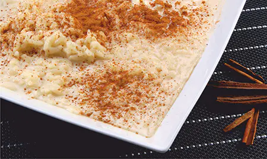
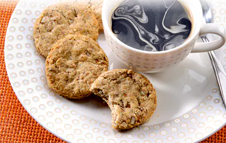
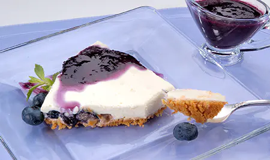
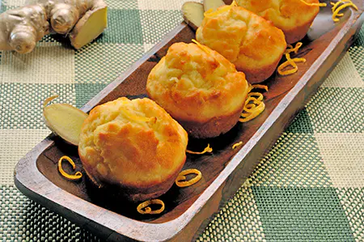

¿Quién dice que por tener diabetes no puedes comer delicioso? Pues, aún hay muchas personas que piensan que tener diabetes implica tener que estar condenado(a) de por vida a comer de una manera casi frugal y sin prácticamente ninguna alternativa dietética que incentive el paladar a disfrutar de las artes divinas del mundo culinario. Como si no fuera suficiente castigo tener esta complicada enfermedad tienen que lidiar con dietas sabridas y aburridas en sus día a día. Pero esto no tiene que ser así y hoy te traje otras recetas muy ricas que te harán reconciliarte con la buena comida y deliciosos postres. Ummm, a poner manos a labor:

## Budín de Zanahorias y Naranjas.

Cantidad: 12 porciones

Lavar, pelar y rallar 3 zanahorias medianas.

Mezclar con 4 huevos, 2 ½ cdas. de edulcorante en polvo o granulado, jugo y ralladura de 2 naranjas, ½ taza de avena instantánea y 1 cda. de polvo de hornear.

Forrar con papel la base de un molde para budín. Colocar la mezcla y hornear a 160º C durante 40 minutos

### Aporte nutricional por porción

Calorías (kcal)   70

Glúcidos (g)   9,3

Proteínas (g)   3,4

Grasas (g)    2,1

## Arroz con leche

Cantidad: 8 porciones

Cocinar hasta que esté tierno: 1/2  taza de arroz común,  1 cda. + 1 cdta. de edulcorante en polvo o granulado, 4 tazas de leche descremada y 1 rama de canela.

Aparte batir 3 yemas. Incorporar la mezcla caliente lentamente sobre las yemas

y cocinar 2 minutos más revolviendo continuamente.

**Retirar del fuego y agregar** 1 cdta. de vainilla

Servirlo espolvoreado con canela.

### Aporte nutricional por porción

Calorías (kcal) 92

Glúcidos (g) 10,1

Proteínas (g) 6,0

Grasas (g) 3,0

## Polvorones con almendras

Cantidad: 8 porciones (3 unidades/porción)

Horno: 180º C / Tiempo: 10 a 15 minutos

Procesar: 2 tazas de harina, 1 taza de harina integral, 1/2 taza de almendras, 1 Cda. + 1 cdita. de edulcorante en polvo o granulado y 2 cditas. de polvo de hornear.

Agregar: 1/2 taza de manteca derretida, 2 huevo, 1 cdtia. de ralladura de limón, y 2 cditas. de vainilla.

Formar una masa y estirar de  1/2 cm de espesor. Cortar círculos de 5 cm de diámetro.

Colocar sobre chapa sin enmantecar. Hornear. Enfriar sobre rejilla.

### Aporte nutricional por porción

Calorías (kcal) 383

Glúcidos (g) 23,6

Proteínas (g) 8,0

Grasas (g) 28,5

## Tarteletas de Crema de Vainilla

Cantidad: 8 porciones

Cortar 1/3 taza de manteca fría del tamaño de un arveja en 1 ¼ taza de harina. Agregar de a poco y mezclar con un tenedor 3 cdas. de agua fría.  Unir para formar una masa y estirar fina sobre tabla enharinada. Cortar y forrar tarteletas. Cocinar hasta dorar en horno a 180º durante 10 a 12 minutos. Enfriar.

Crema.

Calentar 1 1/2 taza de leche descremada. Aparte mezclar 3 cdas. de almidón de maíz y 1 Cda. + 2 cditas. de edulcorante en polvo o granulado,  1/2 taza de leche descremada y 2 yemas.

Agregar a la leche caliente y cocinar revolviendo siempre hasta que suelte el hervor.

Retirar del fuego y agregar 1 cdita. de vainilla. Rellenar las tarteletas con la crema fría.

### Aporte nutricional por porción

Calorías (kcal) 172

Glúcidos (g) 18,5

Proteínas (g) 4,8

Grasas (g) 8,8

## Cheesecake

Cantidad: 8 porciones

Mezclar 1 1/2 taza de galletitas dulces sin azúcar procesadas con1/4 taza de manteca derretida.

Presionar sobre tortera desmontable. Cocinar hasta dorar.

Mezclar 1/4 taza de agua hirviendo con 1 cda. de gelatina sin sabor. Agregar la gelatina a 200 g de queso blanco descremado, 1 cda. de edulcorante en polvo o granulado y 1/2 taza de leche descremada. Enfriar y cuando empiece a coagular, batir bien.

Batir y agregar a la mezcla anterior 1 taza de crema doble y 1/4 cdta. de edulcorante en polvo o granulado. Colocar la mezcla sobre la masa alternando con 1 taza de arándanos cortados y 1/4 cdta. de edulcorante en polvo o granulado. Enfriar.

Servir con la siguiente salsa: cocinar hasta que tome punto1 taza de arándanos cortados, 1/2 cdta. de edulcorante en polvo o granulado y 1 taza de agua.

### Aporte nutricional por porción

Calorías (kcal) 313

Glúcidos (g) 19,6

Proteínas (g) 7,1

Grasas (g) 22,9

## Molletes de jengibre y naranja

8 porciones (2 unidades por porción)

Mezclar: 2 1/2 tazas de harina, 1 cdita. de polvo de hornear, 2 cditas. de cáscara de naranja rallada y 1 cda. de Sucralight

Aparte mezclar: 3 huevos, 1 taza de [yogur](/yogur-griego-en-la-dieta-diabetica/) natural sin azúcar, 1/4 taza + 3 cdas. de aceite y          1 cda. de jengibre rallado

Agregar los ingredientes líquidos a los secos. Mezclar rápidamente. Llenar hasta los 2/3 los moldes de molletes enmantecados. Hornear a180º C  durante 25 minutos. Enfriar sobre rejilla.

### **Aporte nutricional por porción**

Calorías (kcal) 283

Glúcidos (g) 28,4

Proteínas (g) 7,0

Grasas (g) 15,7

## Postre de limón

**Ingredientes:** 1 y ½ tazas de agua, 3 cucharadas de SUCRALIGHT POLVO o alternativa, 4 cucharadas de almidón de maíz, 3 yemas, 3 cucharadas de margarina bajas calorías, 2 cucharadas de ralladura de limón y ½ taza de jugo de limón.

**Elaboración:** calentamos el agua y agregamos SUCRALIGHT y el almidón de maíz disuelto en agua fría.  Cocinamos a fuego suave revolviendo hasta que espese. Batimos las yemas y agregamos a éstas un poco de la crema caliente. Mezclamos bien y volcamos las yemas al total de la crema, revolviendo. Cocinamos 1 minuto más y agregamos la margarina, ralladura y jugo de limón. Ponemos al fuego suave 2 minutos más, revolviendo siempre. Retiramos, dejamos entibiar y antes de que cuaje rellenamos con la crema cáscaras de limones o naranjas, ahuecadas. Llevamos a la heladera y servimos frío.

### Valor nutricional para una porción

Glúcidos (g) 3,2

Proteínas (g) 0,7

Lípidos (g) 3,6

Calorías (Kcal) 47,2
