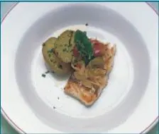
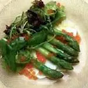
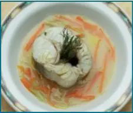
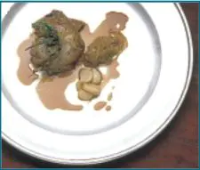

Las personas diabéticas a menudo se sienten un poco desanimadas ya que piensan que solo pueden comer alimentos saludables, y por saludables ellos entienden que son poco apetitosos, sabridos y sin color. En fin, una dieta para enfermos. Pero eso no es completamente cierto. Los diabéticos en líneas generales solo deben tener sus [niveles de glucosa](/cuanto-es-el-nivel-normal-de-glucosa/) bajo control y llevar un conteo de sus porciones de hidratos de carbono para consumir cualquier alimento al que estén acostumbrados. no quiero decir con esto que salgas ahorita a comprar una hamburguesa y aventártela con una Coca Cola.

Esa no es la idea de mis palabras, esa chatarra que te acabo de describir no debe comerla nadie, ni siquiera las personas sanas. Pero en un caso dado, una persona diabética podría comerse esa basura una vez cada tres meses y si ha mantenido una disciplina en su dieta, consumir ese veneno en ese periodo no debería hacerle mucho daño. Aún así recomiendo evitar ese tipo de alimentos.

Pero el arte culinario está lleno de creatividad y de verdaderas obras de arte para el deleite de nuestro sentido del gusto. Espero que te animes a probar estas deliciosas recetas que chefs profesionales han preparado para ti:

## Cherne encebollado

 

**INGREDIENTES (4 PERSONAS): 4 lomos de cherne salado, ajo, cebolla, pimiento, tomate maduro pelado, laurel y tomillo, aceite de oliva, vino blanco seco y vinagre.**

Poner el cherne en remojo un día antes procurando cambiarle el agua dos veces. Blanquear y quitar todas las espinas posibles. En una cacerola poner el aceite con el ajo hasta que estén dorados, añadir la cebolla, luego el pimiento y al final el tomate y la hoja de laurel y el tomillo. Cuando esté todo cocido, añadir un poco de vino seco y el vinagre. En una sartén freír el cherne pasado un poco por harina, con mucho cuidado para que no se rompa. Retirar de la cacerola la mitad del encebollado, incorporar los lomos de cherne y cubrir con la otra mitad del encebollado que se acaba de retirar. Dejar cocer durante unos minutos y dejar reposar antes de servir. Se puede acompañar de unas patatas arrugadas. Por su sabor y su textura, el cherne se puede sustituir por mero.

## Espárragos trigueros sobre queso fresco y erizos de mar

**INGREDIENTES: 2 manojos de espárragos trigueros, 400 g de queso fresco, aceite de oliva, vinagre de sidra, sal gorda, 12 erizos de mar, lechugas variadas.**

Cortar el queso fresco y colocar en la base del plato. Pelar y cocer los espárragos trigueros durante 4 minutos en agua con sal y un poquito de azúcar. Aún calientes disponer encima del queso fresco. Colocar encima las lechugas limpias y cortadas. Aliñar con la vinagreta. Vinagreta: abrir los erizos vivos y coger solamente las huevas e ir poniéndolas en el aceite de oliva después de añadir el vinagre y la sal gorda.

## Cazuela de merluza y verduritas vitalizantes

**INGREDIENTES (2 PERSONAS): 200 g merluza fresca, 150 g patata, 50 g zanahoria, 40 g cebolla, 40 g puerros, 2 cucharadas de aceite de oliva, 2 ramas de perejil, sal.**

Preparar un caldo con las espinas y pieles de la merluza. En el caldo cocer al dente las verduritas cortadas en juliana muy fina. Cuando las verduras estén a punto, agregar la merluza cortada en trozos grandes, el aceite de oliva y sazonar. Este plato debe consumirse conjuntamente: verduritas, merluza y caldo, como si se tratase de un guiso.

## Perdiz roja de los montes de Toledo al vino blanco Sauvignon

**INGREDIENTES (6 PERSONAS): 6 perdices rojas de 350 g, 2 l de vino blanco Sauvignon, 1/2 l de aceite de oliva virgen, 2 kg de cebollas frescas rojas, 4 cabezas de ajos enteras, 2 ramitas de tomillo fresco, 2 ramitas frescas de mejorana, 10 bolas de pimienta negra, sal al gusto.**

Desplumar las perdices, lavarlas con agua hasta eliminar la sangre totalmente, atarlas después y escurrirlas bien. En una cazuela de acero echar el aceite de oliva y preparar un fondo de cebolla fileteada, colocar las perdices con la pechuga hacia el fondo y cubrir con cebolla, las cabezas de ajo enteras, la pimienta y las ramitas de tomillo y mejorana. Añadir a continuación el vino blanco y cocer a fuego lento. Añadir la sal. La perdiz se cuece a fuego lento durante unas tres horas y media. Con un pincho de cocina pinchar las perdices para comprobar si están blandas o no: la que esté se saca y se dejan cocer más las otras. Cuando la cebolla esté deshecha pasar la salsa por un colador. Servir las perdices en el plato una vez desatadas rociadas con su propia salsa. Aromatizar con aceite de oliva.

Como bien puedes ver estas deliciosas recetas de alta cocina son muy saludables, solo es cuestión de que pongas manos a la obra y consulta a tu médico antes de hacer cambios en tu dieta.
