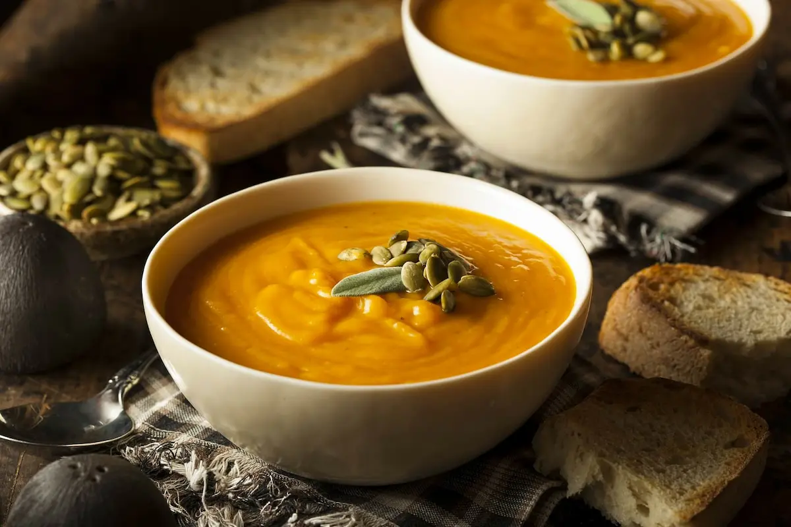
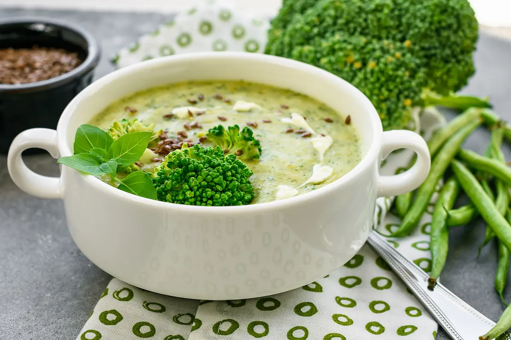

Aquí incluimos recetas de sopas para diabeticos para que preparen una comida que de gusto. La idea es no abusar de ciertos alimentos y prepararlos de tal forma que cumplan con los requerimientos para que no afecten los niveles de glucosa en los diabéticos .

## Cacerola de pollo y champiñones

### Ingredientes

- 1 libra de pechugas de pollo deshuesadas y sin piel, cortadas en trozos pequeños
- 1 lata (de 14 onzas) de caldo de pollo sin grasa
- 1/4 taza de agua caliente
- 1/2 cucharadita de tomillo seco
- 2 tazas arroz instantáneo  sin cocinar
- 8 onzas de champiñones, en rodajas finas
- 1 lata (10 3/4 onzas) 98% de crema sin grasa de sopa de apio, sin diluir
- Perejil fresco picado

### Instrucciones

Cocina el pollo en el caldo y el agua en un sartén antiadherente de 12 pulgadas hasta que la mezcla empiece a hervir completamente. Agrega el tomillo y el arroz. Coloca las setas en la parte superior. (No revuelvas las setas en arroz.) Pon una cubierta a la sartén; apagar el fuego y dejar reposar 5 minutos.

Revuelve la sopa; cocina a fuego lento durante 5 minutos o hasta que esté caliente. Espolvorear con perejil.

Sugerencia: Servir con ensalada de verduras mixta y fresas frescas en rodajas.

**Rendimiento**: 4 porciones. Tamaño de la porción: 1 1/2 tazas.

Información Nutricional por porción: Calorías: 277, Carbohidratos: 28 g, Proteína: 32 g, Grasa: 4 g, Grasa saturada: 1 g, Colesterol: 67 mg, Sodio: 774 mg, Fibra: 2 g

## Sopa de Calabaza

### Ingredientes

- 1 cucharadita de margarina o mantequilla
- 1 cebolla grande, picada en trozos
- Media calabaza (cerca de 1 1/2 libras), cortada en pedazos de 1/2 pulgadas
- 2 latas (de 14 onzas cada una) de caldo de pollo bajo en sodio, divididos
- 1/2 cucharadita de nuez moscada molida
- 1/8 cucharadita de pimienta blanca
- [Yogur](/yogur-griego-en-la-dieta-diabetica/) natural sin grasa y cebollino picado (opcional)

### Instrucciones

Derrite la margarina en una cacerola grande a fuego medio. Agrega la cebolla; cocina y revuelve 3 minutos. Añade la calabaza y 1 lata de caldo; Lleva al punto de ebullición a fuego alto. Reduce el fuego a bajo; cubre y cocina a fuego lento 20 minutos o hasta que la calabaza se ablande.

Pon a licuar la sopa por lotes, volviendo la sopa a la olla después de cada lote mezclado.\* (O usa una batidora manual de inmersión.) Agrega el resto del caldo de la lata, la nuez moscada y la pimienta. Cocina a fuego lento, sin tapar, por 5 minutos, revolviendo ocasionalmente.

Sirve la sopa en 6 tazones; sirve con el yogur y el cebollino, si lo desea.

_\* Variación: Añadir 1/2 taza de crema de leche o mitad y mitad con la segunda lata de caldo._

_\*\* Sin Gluten: Para hacer este plato libre de gluten, asegúrate de leer las etiquetas de ingredientes cuidadosamente y comprar caldo de pollo sin gluten._

**Rendimiento:** 6 porciones. **Tamaño de la porción:** 3/4 taza.

**Información Nutricional por porción:** Calorías: 79, Carbohidratos: 14 g, Proteína: 5 g, Grasa: 1 g, Grasa saturada: 1 g, Colesterol: 0 mg, Sodio: 107 mg, Fibra: 4 g.

## Sopa rápida de brócoli

### Ingredientes

- 4 tazas de pollo bajo en sodio  y libre de grasa o caldo de verduras
- 2 1/2 libras  de brócoli
- 1 cebolla, picada en cuartos
- 1 taza baja en grasa (1%) de  leche
- 1/4 cucharadita de sal (opcional)
- 1/4 taza de queso azul desmenuzado

### Instrucciones

Coloca el caldo, el brócoli y la cebolla en una cacerola grande; Lleva al punto de ebullición a fuego alto.Reduce el fuego a bajo; cubre y cocine a fuego lento unos 20 minutos o hasta que las verduras estén blandas.

Prepara puré en la licuadora y retornalo a la cacerola. Si lo deseas, agrega la leche y la sal. Añade agua o caldo adicional, si es necesario.

Sirve la sopa en tazones; espolvorear con el queso.

**Rendimiento:** 6 porciones. **Tamaño de la porción:** 1 taza.

**Información Nutricional por porción:** Calorías: 91, Carbohidratos: 12 g, Proteína: 7 g, Grasa: 2 g, Grasa saturada: 1 g, Colesterol: 6mg, Sodio: 175 mg, Fibra: 3 g

Espero que estas deliciosas recetas sean de tu agrado. Son muy buenas para las personas con [diabetes tipo 2](/diabetes-tipo-2/) y garantizan que tu glucosa en la sangre se mantendrá en los rangos normales por más tiempo. Lo mejor es que son sabrosas y no tienes que estar haciendo sacrificios exagerados en tu paladar, todo lo contrario, te demuestra con hechos que una persona diabética puede seguir disfrutando de comidas muy sabrosas sin dejar de ser saludables y nutritivas. La diabetes no va a privarte de que disfrutes de una rica comida, solo hay que usar un poco la imaginación y ser creativo a la hora de preparar tus recetas. Que tengas buen provecho.
