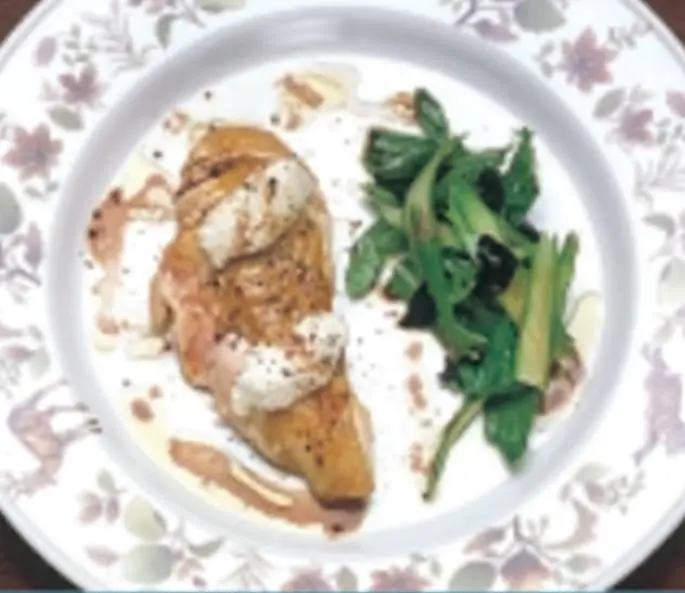

Bueno, hoy vengo Internacional con estas otras recetas que ni los reyes, reinas o jeques saben que existen porque son especiales para los queridos lectores y lectoras que de alguna manera buscan soluciones alimenticias para ellos o algún familiar o conocido que tenga diabetes. Solo recuerden consultar con su médico o dietista ante cualquier duda o cambios en su dieta. Sin más preámbulos les dejo las recetas:

## Pechuga de gallo de corral con queso fresco y trufa

### Ingredientes (4 personas):

2 pechugas de gallo, 400 g de queso fresco, 100 g de trufa, hojas de rúcula, espárragos verdes, albahaca, 1 dl de aceite de oliva virgen, limón, vinagre de Módena.

### Instrucciones:

Asar la pechuga y dejar reposar entre dos platos quedando jugosa. Turbinar el queso fresco hasta formar una crema. Aliñar las hojas de rúcula, los espárragos hervidos, la albahaca y la trufa laminada con el aceite de oliva, unas gotas de limón y vinagre de Módena. Cortar la pechuga en filetes, poner una cucharadita de la crema de queso encima y acompañar con los espárragos, la albahaca, la trufa y la rúcula. Aliñar con la vinagreta donde se han macerado las verduritas con la trufa.

## Ensalada de trucha

### Ingredientes (4 personas):

1 trucha de 1 kg, 1/2 escarola, 2 puerros cocidos, 59 g de judías verdes, 2 tomates maduros, 100 g de berros, hongos para salsa Boletus Edulis, 8 gambas, 4 cocochas, 4 ostras. Para la salsa vinagreta: tomate, cebolla, trufa, huevo cocido, pimiento rojo, aceite de oliva, vinagre de Jerez, perejil y sal. Para la salsa Boletus Edulis: 50 g boletus edulis, 1 yema cruda, 1 puerro cocido.

### Instrucciones:

Triturar todo, añadir sal y vinagre de jerez y montar como si se tratase de una salsa mayonesa. En un plato disponer un molde circular. En la base disponer el puerro cocido picado en tiras, colocar capas de trucha hervida encima del puerro, poner una cucharada de tomate triturado con vinagre y aceite, añadir las judías verdes cortadas en tiras y cocidas, y otra capa de trucha. Preparar una salsa de berros como se ha hecho con los tomates. Añadir una cucharada de esa salsa a cada molde. Cubrir con otra capa de trucha y encima escarola picadita. Quitar el molde. Aliñar todo con la vinagreta y añadir la ostra. Decorar el plato al gusto con la salsa de berros, la salsa de hongos y la de tomate. Disponer las cocochas a un lado de la ensalada y las gambas cocidas al otro.

## Patatas guisadas con setas

### Ingredientes (6 personas):

800 g de setas, 1,2 kg de patatas, 1,5 dl de aceite de oliva, 3 dientes de ajo, 3 hojas de laurel, 1 cucharada de pimentón, 1 ramita de tomillo, guindilla, sal.

### Instrucciones:

Limpiar las setas y partirlas en trozos más bien grandes. Cachar las patatas en trozos irregulares, no muy grandes, procurando que tengan todas el mismo tamaño y arrancándolas sin llegar a cortar cada trozo totalmente. Poner al fuego una cazuela con el aceite. Cuando esté caliente, agregar los ajos, la guindilla y las hojas de laurel. Añadir a continuación las patatas cachadas y las setas. Saltear todo unos minutos, espolvorear el pimentón, el tomillo desmenuzado y la sal y rehogar un poco más. Añadir agua suficiente para que quede cubierto; probar y rectificar el punto de sal si hace falta y dejar cocer a fuego moderado 30 o 40 minutos. Este plato debe quedar espeso al finalizar la cocción. Si no ocurre así, sacar unas cuantas patatas, machacar y volver a echar en la cacerola, dejando que den un hervor.

## Atún con brócoli

### Ingredientes (4 personas):

1/2 mango, 600 g de atún fresco (lomo), 1 calamar (60 g), 20 g de judías verdes, 1 pieza de brócoli, cebollino, perejil, aceite de oliva, vinagreta de mostaza, pimienta, sal.

### Instrucciones:

Marcar el lomo de atún en la plancha por los cuatro costados salpimentados. Escaldar unas ramitas de cebollino y elaborar aceite de cebollino. Cortar el mango en láminas. Cortar el calamar crudo. Picar el cebollino restante y las hojas de perejil. Elaborar una vinagreta con mostaza, vinagre, aceite de oliva, sal y pimienta. Cortar las judías verdes crudas en láminas muy finas. Cocer el brócoli. Cuando esté al dente sumergir el brócoli en agua y hielo y escurrir. Con la licuadora preparar un puré montado con aceite de oliva. Cortar el lomo de atún en láminas y dividir en cuatro raciones. Untar el atún con la vinagreta de mostaza, el aceite de cebollino y el perejil y el cebollino picados. Colocar encima del atún un poco de juliana de mango, juliana de calamar y juliana de judías verdes.

Ok, ya tienes estas otras deliciosas recetas para tu disfrute y el de tu familia. Solo resta que te pongas manos a la obra y demuestres tus dotes de chef internacional a todos tus conocidos. Y cuando digas que es tan sano que hasta un diabético puede disfrutarlo tendrán que inclinar la cabeza ante ti. Cuídate mucho.
