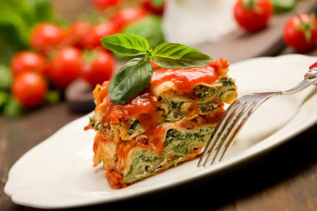
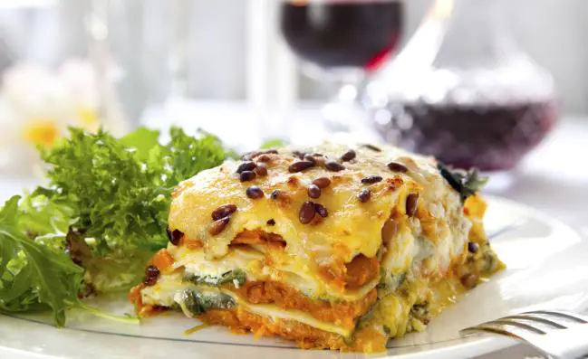
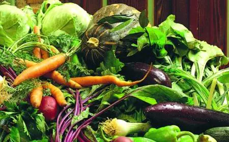

¡Navidad, navidad hoy es navidad! Que lindo día tan especial para nosotros los occidentales. Es la celebración del nacimiento del Niño Jesús y debe haber muchos niños muy felices recibiendo sus regalos al pie de un arbolito navideño, o en un nacimiento o quizás debajo de la cama. En realidad deseo de todo corazón que cada niño en el mundo, sea rico o pobre reciban un lindo presente que ilumine sus caras de alegría. Si algo puede salvar este planeta ese algo son los niños y niñas que con su pureza e inteligencia solo les importa sonreír y ser felices. Y para que tú hoy puedas disfrutar la navidad hoy te traje estas Comidas Vegetarianas Para Diabéticos.

Presta atención a estas exquisitas **recetas vegetarianas para la mesa navideña**: te proponemos una terrina vegetariana como plato principal, y luego te sugerimos algunas opciones de guarniciones y otros platos principales vegetarianos, para que el menú navideño sea exquisito, completo y saludable.

## Terrina navideña vegetariana

### Ingredientes:

- 1 cebolla, finamente picada
- 1 cucharada de aceite de oliva
- 3 dientes de ajo, picados
- 300g de proteína vegetal texturizada
- 2 cucharadas de pasta de curry
- 30g de pan rallado
- 3 gotas de esencia de almendras
- 2 cucharadas de agua
- 1/2 cucharadita de romero seco
- 50g de nueces tostadas
- 250g de ciruelas picadas
- 4 huevos batidos
- 1 naranja sin cáscara rebanada
- 1 lata de ajíes asados, sin piel
- Sal y pimienta

### Preparación:

Enciende el horno para precalentarlo a temperatura media. Forra un recipiente de terrina o budín con papel manteca o antiadherente de aluminio.

Saltea las cebollas en aceite de oliva durante 5 minutos y luego agrega el ajo y la proteína vegetal texturizada. Cocina durante 10 minutos.

Agrega la pasta de curry, el pan rallado, la esencia de almendras, el agua, el romero, la mitad de las ciruelas y las nueces, revuelve un poco y apaga el fuego. Deja enfriar durante 10 minutos y luego agrega los huevos batidos. Condimenta con sal y pimienta.

En la base del molde de terrina coloca las naranjas rebanadas. Coloca luego en el molde la mitad de la preparación, luego una capa de ajíes asados, y encima el resto de la preparación. Por último, una capa de ciruelas y nueces.

 Cubre con el papel antiadherente y lleva al horno durante 30-40 minutos. Desmolda con cuidado la terrina y ya estará lista para servir.

## Lasagna vegetariana con pan italiano

### Ingredientes:

- 4 zucchini medianos
- 1 paquete de champiñones frescos
- 1 cebolla mediana
- Ajo fresco (para dar sabor)
- 280 grs de espinaca congelada cortada
- 790 grs de salsa para pastas
- 680 grs de queso muzzarella
- 227 grs de fetas de queso
- Aceite de oliva
- Fideos de lasagna

### Preparación:

Hierve los fideos de lasagna hasta al dente. Pica los zucchini, los champiñones, la cebolla y el ajo.

 Calienta un sartén con aceite de oliva y saltea las verduras hasta que estén tiernas. Añade la espinaca descongelada y luego agrega la salsa para pastas.

Cubre la lasagna con las verduras en capas. Añade queso muzzarella en cada capa.

Cubre con las fetas de queso. Hornea en un horno precalentado a 180º hasta que la lasagna esté dorada y burbujeante.

Sirve con pan italiano caliente.

Lista... ¡Qué delicia!

## Parrillada de verduras a las brasas

Para los amantes de la **parrilla** les acercamos una receta vegetariana, pero que también puede ser acompañada por carnes. Los colores y texturas que ofrecen los vegetales son ideales para llevar a la mesa un plato colorido. Por eso no deberías perderte estas instrucciones para preparar una **parillada de verduras**. Es suamente saludable y sus sabores son deliciosos.

### **Ingredientes:** _(para 4 porciones)_

Papas pequeñas 8 Cebollas 2 Tomates redondos 2 Aceite de oliva 6 cucharadas Sal y pimienta a gusto

###  **Preparación:**

Paso 1: Lavar las papas con su piel y los tomates. Secarlos con papel absorbente. Cortar las cebollas y los tomates al medio o en gajos. Tener la **parrilla precalentada y con poca brasa** porque se va a usar para una cocción lenta, ya que algunos vegetales, como los tomates, son muy sensibles al calor directo. Primero colocar los papines con su cáscara y enteros.

Paso 2: Cuando los vegetales estén tiernos de un lado, darlos vuelta y agregar las cebollas, con el corte para abajo y continuar la cocción hasta que estén tiernos. En el caso de los tomates hay que tener cuidado, ya que su interior es casi todo líquido. Cocinarlos sólo 2 minutos de cada lado.

Distribuir los vegetales en una fuente, rociar con aceite de oliva, sal y pimienta y servir.

Se puede experimentar con otro tipo de vegetales y sumar a la parrilla: batatas con su piel o choclos en su chala.

Y esas son las recetas vegetarianas, sabrosas, saludables y nutritivas que te traje hoy. En este día tan especial puedes prepararlas a la vez que cocinas los típicos platos navideños. Solo recuerda consultar a tu médico ante cualquier duda ya que tu salud es lo primero. Deseo que tengas una ¡Feliz Navidad!
