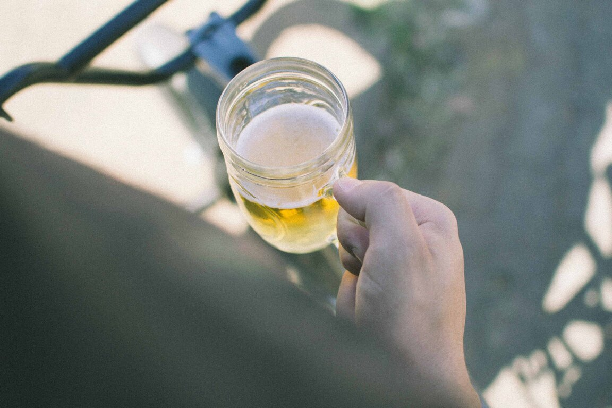

A la mayoría de nosotros nos gusta una bebida social de vez en cuando. De hecho, algunos hemos tenido las experiencias más íntimas con el alcohol. Pero ¿está bien mezclar el alcohol y diabetes?

Los diabéticos pueden beber con seguridad el alcohol, aunque en cantidades muy pequeñas. Sin embargo, hay varias cosas que los diabéticos deben tener en cuenta sobre el alcohol y diabetes.

El tipo de alcohol en nuestros vinos, cervezas y licores es **_el_** _**etanol**_, también conocido como *alcohol* _etílico_. Es una de las drogas recreativas más antiguas utilizadas por los seres humanos, este producto químico se usa también como un combustible y como un disolvente.

El alcohol, frutas, verduras o granos son fermentados. Durante la fermentación la levadura o ciertas bacterias reaccionan con los azúcares en estos alimentos, y ocurre la creación de etanol y dióxido de carbono como subproductos.

El vino y la sidra son hechas por la fermentación de frutas o verduras. La fermentación de cereales como la cebada y el centeno son la base de cerveza y licores. Estos licores se producen cuando se destila el líquido fermentado, es decir, se elimina una porción del agua, lo que deja una concentración más fuerte de alcohol y sabores.

El contenido alcohólico de una bebida depende de cuánto tiempo se ha dejado fermentar y, en el caso de las bebidas espirituosas, de la cantidad de agua que se ha eliminado durante la destilación.

## Consideraciones sobre el Alcohol y Diabetes

Si tienes diabetes, hay ciertas cosas que debes considerar al decidir si bebes o no.

Los diabéticos suelen usar una gama de medicamentos para tratar la diabetes y sus enfermedades asociadas como la hipertensión (presión arterial anormalmente alta) y los problemas de colesterol.

El alcohol puede interferir con las acciones de ciertos medicamentos para el tratamiento de estas condiciones por lo que debes consultar con tu médico para averiguar si puedes beber alcohol de forma segura.

También debes preguntar si el alcohol puede tener un efecto adverso sobre cualquier otra condición médica que puedas tener, tales como enfermedad ocular diabética, neuropatía diabética o triglicéridos altos.

También es necesario tener en cuenta que el alcohol puede causar que tu glucosa en la sangre caiga gravemente, especialmente si estás tomando insulina o estás usando el tipo de [pastillas que estimulan](/pastillas-para-la-diabetes/) la liberación de insulina.

### ¿Cuánto se debe tomar?

El hecho es que todo el mundo reacciona de manera diferente al alcohol. Tu sexo, altura y peso son sólo algunos de los muchos factores que determinan cómo el alcohol te afecta. Incluso lo que has comido durante el día o la cantidad de sueño que has tenido la noche anterior puede hacer una diferencia en cuanto a cómo te afecten las copas.

Dicho esto, los expertos recomiendan como límites para los hombres son cervezas y media al día, o dos copas de vino o dos tragos de una bebida espirituosa como el whisky o ginebra. Y eso no significa que te puedes beber las cervezas y además los dos tragos de whisky el mismo día.

Los límites recomendados para las mujeres son la mitad de las de los hombres.

### Las calorías vacías

El alcohol, las droga recreativa más querida del mundo, es baja en nutrientes, pero tiene muchas calorías. Estos son calorías vacías, es decir, las calorías que tienen poco o ningún valor nutricional.

Cuando el hígado descompone el alcohol hacia abajo, se convierte en grasa. Si estás controlando tu diabetes con una dieta muy baja en grasa, esto no es una buena noticia en absoluto.

El alcohol tiene sólo siete calorías por gramo, lo que es un poco mejor que los nueve calorías por gramo que se obtiene de la grasa animal, pero es mucho peor que las cuatro calorías por gramo que se obtiene de [los carbohidratos](/que-son-carbohidratos/).

Son esas calorías en el alcohol las que crean "la barriga cervecera". El alcohol también puede elevar los triglicéridos (grasas en la sangre) lo que aumenta tu riesgo de enfermedad cardíaca.

## Mejores alternativas de licor para diabéticos

Sin embargo, si insistes en beber, y al mismo tiempo, deseas mantener tu nivel de glucosa en la sangre y el peso en sus niveles actuales y preservar la salud de tu corazón, entonces debes:

- Beber cervezas ligeras en lugar de cerveza negra o cervezas oscuras;
- Las cervezas artesanales pueden tener el doble de las calorías y alcohol que las cervezas ligeras, según la Asociación Americana de Diabetes.
- Puedes tomar vino, pero elige los blancos secos, rojos o rosas sobre los blancos dulces, vinos espumosos y vinos de postre para controlar el consumo de calorías y carbohidratos
- Bebidas fuertes como el vodka, ginebra y tequila también son aceptables, pero ten cuidado con lo que les mezclas. Elije acompañamiento sin calorías como la soda de dieta o agua de soda sobre jugos, soda regular y agua tónica, que son altos en carbohidratos y azúcar.

Por supuesto, si quieres perder peso, debes evitar las calorías vacías de alcohol por completo.

## El alcohol y diabetes: Bajo nivel de azúcar

Las bebidas alcohólicas contienen muchos carbohidratos, así que si eres diabético, beber cantidades moderadas de alcohol hará que tu azúcar en la sangre suba. Sin embargo, este aumento inicial pronto se desvanece y el nivel de glucosa en la sangre puede empezar a caer.

Si tomas más de dos o tres bebidas durante una sesión y luego, extrañamente, tu nivel de glucosa en la sangre puede seguir cayendo hasta terminar con una [hipoglucemia](/la-hipoglucemia-nivel-bajo-de-azucar-en-sangre/) (niveles peligrosamente bajos de azúcar en la sangre). Esto es más probable que suceda si se encuentra con la insulina.

Los efectos pueden ocurrir inmediatamente después de beber y hasta 24 horas después, dependiendo de la cantidad de bebidas que hayas tomado. Cuanto más se bebe, más grande es el riesgo y cuanto más tiempo el riesgo más peligroso es. Los efectos son particularmente graves si bebes con el estómago vacío.

Los síntomas de la hipoglucemia – mareos, desorientación y somnolencia – son similares a los de la embriaguez. Esto puede ser peligroso si no recibes el tratamiento adecuado para la hipoglucemia. La mezcla de alcohol y la posibilidad de hipoglucemia pueden aumentar los riesgos asociados a beber y conducir.

## Como el alcohol baja el nivel de azúcar en la sangre

Normalmente, tu hígado mantiene los niveles de azúcar en la sangre mediante la liberación de glucosa, según sea necesario. Pero cuando estás bebiendo alcohol, el hígado está tan ocupado por tratar el alcohol que hace un mal trabajo en la liberación de la glucosa en el torrente sanguíneo. Esto puede llevar a una caída en los niveles de azúcar en la sangre - especialmente si estás bebiendo con el estómago vacío.

En promedio, el hígado tomará de una a una hora y media para procesar completamente una sola bebida alcohólica. Existe el riesgo de hipoglucemia durante todo este tiempo. Esto es sólo para una bebida, así que si tienes dos bebidas se duplicará la cantidad de tiempo que estás en riesgo de hipoglucemia. De hecho, cuanto más bebas, más tiempo vas a estar en riesgo de serio de bajo nivel de azúcar en la sangre.

Ten en cuenta que si se combina el ejercicio con alcohol (por ejemplo, ir al bar después de una sesión en el gimnasio), el riesgo de hipoglucemia aumenta porque la mayoría de los tipos de ejercicio bajan los niveles de azúcar en sangre.

## Consejos para beber

Si vas a salir a beber, he aquí algunos consejos:

- Siempre bebe con moderación, lo que significa no más de una bebida al día para las mujeres y dos bebidas por día para los hombres. Una bebida equivale a 5 onzas de vino, 12 onzas de cerveza o 1,5 onzas de licores fuertes.
- Lo mejor es hacer tu consumo de alcohol, mientras comes algo.
- Nunca comenzar a beber con el estómago vacío ya que el alcohol se absorbe muy rápidamente en el torrente sanguíneo. Come un refrigerio antes de brindar con tus amigos.
- Si estás fuera de horario de comida, pica algo con almidón, como las patatas fritas.
- Lleva contigo una fuente de hidratos de carbono, tales como tabletas de glucosa, en caso de que necesites un impulso repentino en el nivel de azúcar en la sangre.
- Revisa tu glucosa en la sangre antes y hasta 24 horas después de beber.
- Usa un collar o un brazalete médico que indica que eres diabético. Dile a tus compañeros de borracheras que tienes diabetes para que sepan lo que deben hacer si tienes una hipoglucemia, y diles que puede ser confundida con embriaguez cuando tu aliento huele a alcohol.
- Si tomas más de unos pocos tragos durante una noche, come un bocadillo con almidón, como el pan tostado, antes de ir a la cama. Esto es para minimizar el riesgo de una hipoglucemia ya que tu hígado funciona toda la noche y el día siguiente para deshacerse del alcohol en tu sistema.
- Para disminuir el impacto de una resaca, bebe mucha agua u otra bebida de rehidratación antes de ir a la cama.

## Resacas

La mayoría de nosotros hemos experimentado una resaca en algún momento u otro, por lo que una descripción no es necesaria. Varían, sin embargo, por lo que el alcance y la intensidad de los síntomas difiere entre las personas. Los síntomas también pueden variar dependiendo de cuán borracho estabas y por cuánto tiempo.

Las resacas suelen comenzar unas horas después de beber y pueden durar hasta varios días.

Las **causas** de las resacas depende de qué y cuánto bebe. La razón principal es que el etanol (alcohol etílico) en la bebida (hasta un 40% en el caso de las espirituosas) aumenta la producción de orina. Esto lleva a la deshidratación cuando se pasa el agua, que se tiende a ser mucho cuando se está bebiendo. La deshidratación causa fatiga, dolores de cabeza y boca seca.

El alcohol también reacciona con el revestimiento del estómago que puede hacerte sentir náuseas. Esto sucede cuando el etanol se metaboliza en acetaldehído. Convertir el acetaldehído en ácido acético lleva tiempo, y se puede observar que el acetaldehído es más tóxico, mutagénico y carcinogénico que el alcohol.

Pueden haber otras varias cosas en una bebida alcohólica que contribuyen a la resaca. Estos incluyen impurezas tales como otros alcoholes y conservantes, congéneres (productos secundarios que ayudan a determinar sabor y color creado durante la fermentación), y las impurezas tales como zinc u otros metales que se añaden deliberadamente para mejorar el sabor. Sí, nunca se puede estar seguro de lo que hay en una bebida de fantasía tal como un licor.

La única forma de evitar una resaca por completo es evitar beber. Dicho esto, hay algunas cosas que puedes hacer para disminuir el impacto de una resaca:

- Bebe agua u otro fluido de rehidratación ... esto es probablemente la mejor medida que puedes hacer
- Una cucharada de bicarbonato de sodio puede ayudar a aliviar tu estómago
- Has un poco de ejercicios. Esto elevará tu tasa metabólica y ayudará a eliminar las toxinas asociadas a metabolizar el alcohol. El ejercicio también acelera la entrega de oxígeno a las células lo que puede aumentar la velocidad a la que se desintoxican los compuestos nocivos.
- Si estás desesperado(a), podrías ir a un respirador y obtener una dosis de oxígeno suplementario lo que ahorrará la molestia y el esfuerzo de hacer ejercicio.

## Conclusiones
Si optas por tomar bebidas alcohólicas, sigue las indicaciones de arriba y tómalascon comida. Pregúntale a tu médico si puedes tomar bebidas alcohólicas.
Si tomas bebidas alcohólicas varias veces a la semana, asegúrate de que tu médico esté enterado antes de que te recete alguna pastilla para la diabetes.
Bebe solo cuando tienes la glucosa bajo control. Házte una prueba de glucosa en la sangre (si tu médico te lo indica) para ayudarte a decidir si puedes beber.