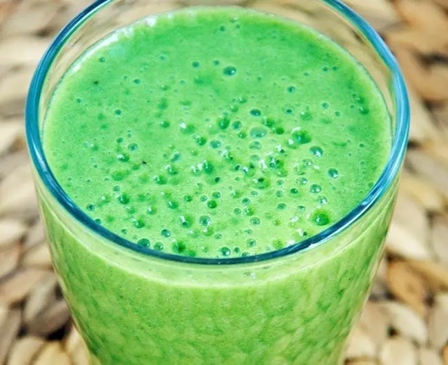

Nadie quiere saber que tienen diabetes, pero casi uno de cada cuatro mayores de de 60 años reciben esta noticia. Muchos otros tienen prediabetes, una condición donde el nivel de glucosa en la sangre es más alto de lo normal, pero aún no lo suficientemente alto como para ser diagnosticado como diabetes. Si usted cae en cualquiera de las categorías, existe un grano que puede ayudarle a controlar su glucosa en la sangre y ofrecer otra protección contra la diabetes tipo 2. La hierba de cebada, una vez conocida como el "alimento de los gladiadores", tiene un perfil único de nutrientes que la convierte en un gran defensor contra la diabetes y vale la pena añadir a su dieta.

Como ya hemos discutido en otros artículos de este blog, la diabetes tipo-2 crea una serie de problemas de salud entre los que se encuentran:

- Problemas de colesterol que incrementa el riesgo de ataque al corazón y [enfermedades del corazón](/diabetes-y-los-problemas-coronarios/);

- Niveles inconsistentes de azúcar en la sangre que no pueden cumplir con la demanda de insulina requerida por el cuerpo.

- Y aunque el aumento de la insulina a través de medicamentos a menudo ha sido la principal fuente de refugio para los diabéticos, esto hace poco para mejorar los problemas de colesterol o tener un impacto duradero en los niveles de azúcar en la sangre.

## Características Nutricionales de la Hierba de Cebada

Contiene una amplia variedad de vitaminas, minerales, enzimas y aminoácidos. La hierba de cebada contiene una gran cantidad de clorofila, y es rico en vitaminas A, B, C, hierro y calcio.

## Beneficios de la Hierba de Cebada para Diabéticos

Desde hace varios años, los investigadores han estudiado los efectos de la suplementación con hierba de cebada para limitar los problemas de colesterol, regular el azúcar en sangre y los niveles de insulina. La hierba de cebada es un remedio natural rico en vitaminas, minerales y antioxidantes, y ha demostrado efectos positivos con respecto a los problemas de colesterol. También puede ser incluido en el grupo de [remedios caseros para bajar el azúcar](/remedios-caseros-para-bajar-el-azucar), el colesterol y los niveles de insulina asociados con la diabetes tipo 2.

Cebada y [otros granos enteros](/granos-con-bajo-indice-glicemico/) son fuentes ricas en magnesio, un mineral que actúa como un cofactor para más de 300 enzimas, incluyendo enzimas que intervienen en el uso del cuerpo de la glucosa y la secreción de insulina.

La FDA permite que los alimentos que contienen al menos un 51% de granos enteros en peso (y también son bajos en grasa, grasa saturada y colesterol) pueden declarar que su consumo es vinculado a un menor riesgo de enfermedades del corazón y ciertos tipos de cáncer. Ahora, la investigación sugiere que el consumo regular de cereales integrales también reduce el riesgo de diabetes tipo 2.

En un estudio de 8 años con 41,186 participantes realizado por el Estudio de la Mujer Negra en la Universidad de Boston, se confirmó una relación inversa entre el magnesio, el calcio y las principales fuentes de alimentos en relación con la diabetes tipo 2: el riesgo de diabetes tipo 2 se mostró 31% más bajo en aquellas mujeres que frecuentemente consumían granos enteros.

En un estudio médico de 2010, se sugirió que las plantas medicinales pueden tener efectos terapéuticos en enfermedades complejas como la diabetes. Polvo de hierba de cebada fue seleccionado debido a sus beneficios reportados. El grupo experimental de los diabéticos tomó 1,2 g de cápsulas de la hierba de cebada cada día durante sesenta días. El grupo de control no tuvo ningún suplemento. No se hicieron otros cambios, y no se tomaron otras medidas alternativas. Perfiles de azúcar en sangre en ayunas y de lípidos de los pacientes fueron tomadas al principio y al final del estudio.

Aquel grupo que tomó polvo de cebada experimentó un descenso significativo del nivel de azúcar en la sangre en ayunas. Ningún cambio se observó en el grupo de control. Hubo una reducción del 5,1% en los niveles de colesterol total después de dos meses. Los investigadores también observaron que el riesgo de enfermedad coronaria se redujo significativamente en los diabéticos que tomaron suplementos de hierba de cebada.

## Como Incluir la Hierba de Cebada como parte de tu Dieta?

Puedes encontrar en el mercado hierba de cebada en forma de polvo que permite incluirla como parte de tu dieta. Es fácil de incluir en tu bebida favorita, te dura más y, si viajas, puedes llevarlo fácilmente contigo para mantener tu régimen.

Basado en investigaciones recientes y en lo que se sabe sobre los antioxidantes, grasas monoinsaturadas y las vitaminas que se encuentran en la hierba de cebada, se recomienda **no más de 15 g por día** de consumo de hierba de cebada.

Se sugiere que uses una cucharadita y media, puedes agregar más o menos dependiendo de tus preferencias. Algunas ideas que puedes implementar para incluirla en tu dieta son:

- **El “Shot”**: agrega polvo de hierba de Cebada: a un vaso de agua para tu dosis diaria. Nada desastroso y fácil de limpiar!
- **Elixir Verde**: mezcla tu jugos favoritos – manzana, mango, naranja – para un elixir simple y delicioso
- **Batido Verde**: no te gusta el sabor de la cebada? Agrégale cebada a tu batido de frutas y vegetales matutino…no vas a enterarte que te lo estabas tomando!

## Te Recomiendo Comprar Productos Naturales y sin Aditivos

Cuando compres un producto de hierba, busca que sea solo de hierba. Evita acidophilus, maltodextrina, lecitina de soja (o soya), stevia, algas, etc, etc, etc. Yo trato de buscar productos básicos naturales porque creo que hay valor en la comida sencilla. Hay númerosas opciones en esta categoría, yo prefiero “Just Barley” (Solo Cebada) por la pureza de su producto pero hay muy buenas alternativas en el mercado.

Te recomiendo que pruebes incorporar hierba de cebada en tu rutina diaria. Para ayudarte en tu iniciación, estoy incluyendo el enlace siguiente donde podrás ver una serie de opciones especialmente seleccionadas, incluyendo “Just Barley”
