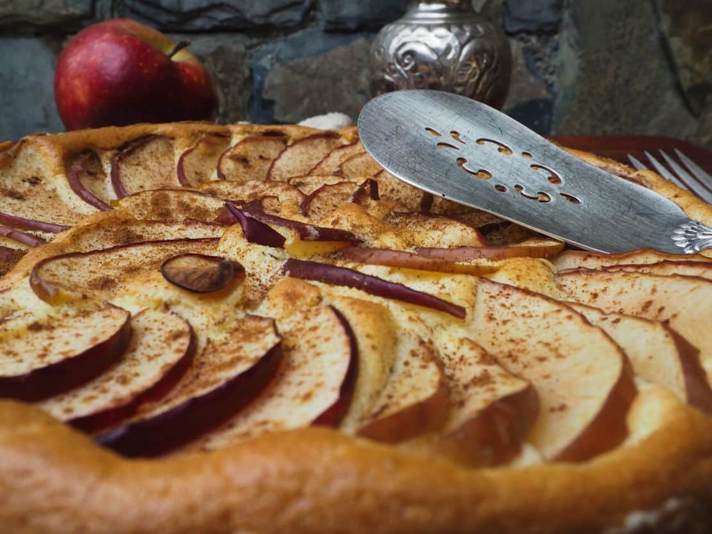
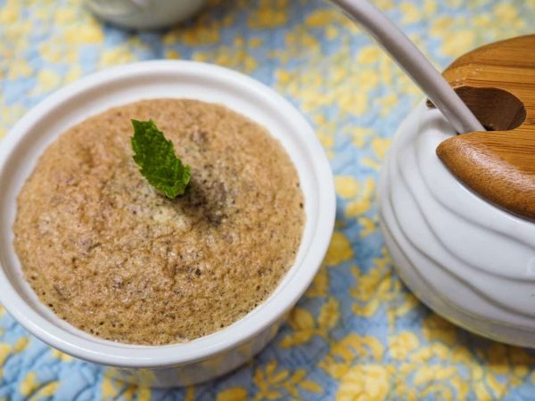
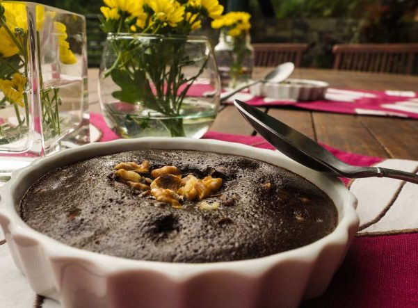
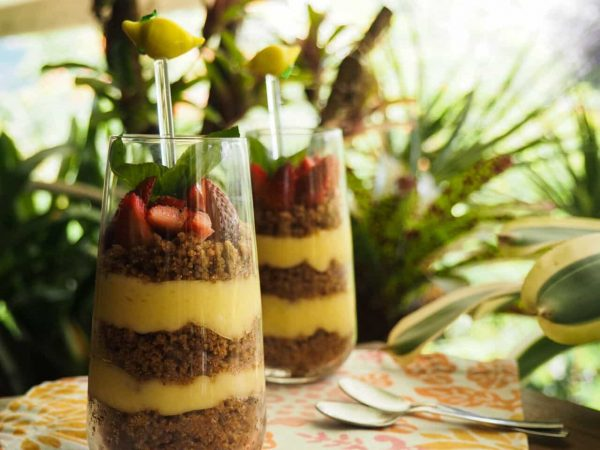
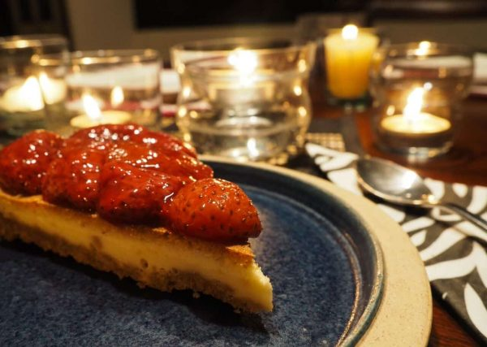
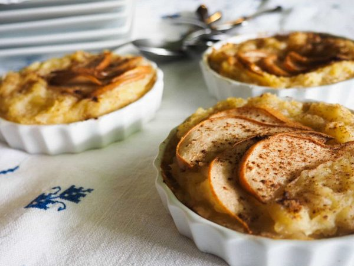
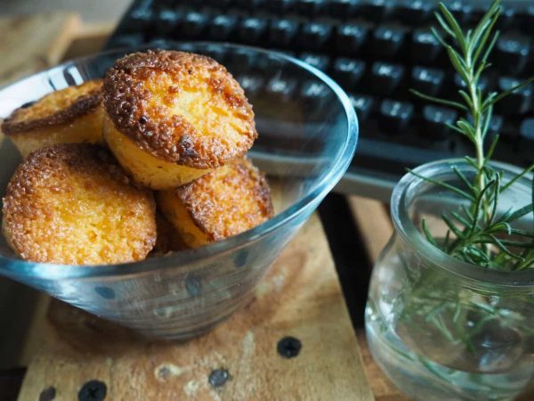

import Alert from '@material-ui/lab/Alert';

Las personas con diabetes  merecen disfrutar de algo dulce. En este artículo te enseñaremos 7 recetas de **Tartas para Diabéticos** realmente increíbles y para todos los gustos.

## #1 Tarta de Manzana y Canela

Una de las favoritas de nuestras recetas de tartas para diabéticos, la tarta de manzana y [canela](/canela-glucosa-alta/) que te enseñamos a preparar es una de las recetas infantiles mas fáciles de preparar. Si tu pequeño es diabético o si simplemente quieres darte un gusto, ¡busca lápiz y papel y comienza ahora!

INGREDIENTES:

- 4 huevos (separados)
- 20 gr. de edulcorante granulado o en polvo
- 1 cucharada de miel
- 2/3 de tazas de harina
- 1 cuchara de polvo para hornear
- Ralladura de 1 cáscara de limón
- Una pizca de sal
- 3 manzanas rojas
- Canela para decorar

Preparación:

1. Precalentamos el horno a 180º.
2. Se baten las claras en punto de nieve.
3. Se incorpora poco a poco la harina, la ralladura de limón, la sal, el edulcorante, el polvo de hornear y las yemas hasta obtener una mezcla homogénea (preferiblemente con una cuchara de madera).
4. Se cortan las manzanas en rodajas muy finas.
5. Se vierte la mezcla en un molde bajo, con un poco de mantequilla, y se colocan las manzanas superpuestas, formando un círculo.
6. Se espolvorea un poco de canela y se hornea durante 20 minutos a 180º, o hasta introducir un palillo en la mezcla y que salga seco.

<Alert variant="outlined" severity="info">
 Porciones: 8. Tiempo de preparación y cocción: 1 hora. Tiempo de reposo: Se
  puede servir tibio con un poco de helado o dejar enfriar. Calorías estimadas
  por porción: 92.

</Alert>

## #2 Tarta de Almendras

INGREDIENTES:

- 200 gr. de almendras molidas (harina de almendras)
- 1 cucharada de harina
- 1 cucharada de mantequilla
- 20 gr. de edulcorante (preferiblemente que venga de la Stevia, granulado o en polvo)
- 4 huevos
- Ralladura de 1 limón
- Una cucharada de canela

Preparación:

1. Precalentamos el horno a 180º C.
2. Batimos los huevos con el edulcorante. Incorporamos la mantequilla derretida y seguimos batiendo hasta blanquear la mezcla.
3. Mezclamos las almendras molidas, la cucharada de harina y la ralladura de limón. Incorporamos esta mezcla a los huevos con una cuchara de madera o removedor.
4. Incorporamos la harina y la cucharada de canela.
5. Horneamos en moldes individuales o en un molde grande durante 20-30 minutos, o hasta que se pinche con un palillo la mezcla y salga seco.

<Alert variant="outlined" severity="info">
 Porciones: 8. Tiempo de preparación y cocción: 1 hora. Tiempo de reposo: Dejar
  enfriar fuera del refrigerador, aproximadamente 2 horas. Calorías estimadas
  por porción: 197.

</Alert>

## #3 Tarta de Chocolate

Los dulces y las recetas infantiles para fiestas son también para nuestros niños con diabetes. Aprende a hacer una tarta de [chocolate](/pueden-los-diabeticos-comer-chocolate/) y sorpréndelo el día de su cumpleaños. INGREDIENTES:

- 1 huevo
- 20 ml. De aceite de oliva
- 80 gr. de fructosa
- 60 ml. de leche descremada
- 50 ml. De agua
- 60 gr. de harina
- Cacao en Polvo 20 g
- Polvo para hornear
- Nueces trituradas, al gusto

Preparación:

1. Precalentamos el horno a 180º.
2. Mezclamos manualmente todos los ingredientes líquidos de la receta.
3. Posteriormente incorporamos el cacao, la harina, el polvo para hornear, la fructuosa y las nueces trituradas.
4. Se vierte la mezcla en un molde refractario y se hornea durante 20 minutos o hasta que al introducir un palillo en la mezcla el mismo salga seco.

<Alert variant="outlined" severity="info">
 Porciones: 6. Tiempo de preparación y cocción: 1 hora. Tiempo de reposo: Se
  puede servir tibio con un poco de helado o dejar enfriar. Calorías estimadas
  por porción: 206.

</Alert>

## #4: Tarta de Limón “Delicia”

INGREDIENTES:

**Para el relleno:**

- 5 yemas de huevo
- 20 gr. de edulcorante granulado o en polvo
- El zumo de 4 limones
- Ralladura de la cáscara de un limón
- 1 cucharada de almidón de maíz
- 100 gr. de mantequilla fría

**Para el crust:**

- 150 gr. de galletas sin azúcar trituradas
- 30 gr. de mantequilla derretida
- Fresas y hojas de menta para decorar

Preparación:

1. Precalentar el horno a 180º.
2. Calentar en una olla el zumo de limón, la ralladura de limón y el edulcorante.
3. Una vez que se haya disuelto se incorpora el almidón de maíz (disuelto en un poquito de agua) y las yemas de huevo, sin dejar de revolver.
4. Una vez que se logre una textura de crema, se incorpora la mantequilla fría removiendo rápidamente, hasta lograr una crema homogénea.
5. Enfriar la mezcla.
6. Mezclar las galletas con la mantequilla derretida y hornear durante 20 minutos a 180º, o hasta que estén tostadas.
7. Se puede servir en capas, o se puede colocar la galleta en la parte baja de un molde y verter la mezcla de limón sobre la misma.
8. Decorar con fresas y hojas de menta.

<Alert variant="outlined" severity="info">
Porciones: 8. Tiempo de preparación y cocción: 2 horas. Tiempo de reposo:
  Enfriar en el refrigerador durante 2 horas y servir frío. Calorías estimadas
  por porción: 256.

</Alert>

## #5 Tarta de Queso Tradicional

Esta tarta de queso para diabéticos es una tarta de cumpleaños que se la puedes regalar a una persona diabética. Además de prepararla con ingredientes sin azúcar y con productos bajos en grasa, les aseguro que es riquísima.

INGREDIENTES:

- 220 gr. de queso crema
- 2 cucharas de mantequilla
- 6 huevos, separados
- ½ taza de leche entera
- 5 cucharadas de almidón de maíz
- 1 cuchara de zumo de limón
- 1/3 de taza de edulcorante granulado o en polvo
- 1 pizca de sal
- ½ cucharita de polvo de hornear
- Fresas para decorar

Preparación:

1. Precalentamos el horno a 170º.
2. En una olla a fuego muy bajo mezclamos el queso crema, la mantequilla y la leche; los sacamos de la olla hasta para bajar la temperatura.
3. Batimos las claras de huevo incorporando poco a poco el edulcorante hasta que alcancen el punto de nieve.
4. Batimos las yemas de huevo con el polvo de hornear, la pizca de sal y el almidón de maíz hasta que suban su volumen y la mezcla se vuelva más blanca.
5. Se incorpora la mezcla de queso a la de yemas de huevo y se bate hasta que esté homogénea. Posteriormente, agregamos las claras de huevo en punto de nieve haciendo movimientos envolventes suaves con una cuchara de madera.
6. Se coloca la mezcla en un molde alto cubierto con mantequilla. El molde se debe colocar en otra bandeja con agua caliente (en baño de maría).
7. Se hornea durante 1 hora y 10 minutos. (No abrir el horno durante los primeros 45 minutos para que no se escape el vapor).
8. Se colocan las fresas con un poco de agua en una olla y se cocinan a fuego lento hasta obtener una mermelada (se puede incorporar un poco de edulcorante si están muy ácidas). Se sirve sobre la tarta de queso.

<Alert variant="outlined" severity="info">
 Porciones: 8. Tiempo de preparación y cocción: 2 horas. Tiempo de reposo:
  Dejar enfriar fuera del refrigerador y servir a temperatura ambiente. Calorías
  estimadas por porción: 222.

</Alert>

## #6 Tarta de Peras

INGREDIENTES: **Para la masa:**

- 100 gr. de mantequilla
- 1 huevo
- 10 gr. de edulcorante granulado o en polvo
- 1 ½ tazas de harina
- 1 cucharada de polvo para hornear
- 1 cucharada de ralladura de cáscara de naranja
- 2 cucharadas de jugo de naranja
- 1 cucharada de canela y especies trituradas (anís dulce o cardamomo)

**Para el relleno:**

- 3 peras en rodajas
- 2 peras en puré
- 20 gr. de edulcorante granulado o en polvo
- 1 cucharada de almidón de maíz
- 2 tazas de jugo de naranja
- 1 cucharada de gelatina sin sabor en polvo
- ¼ de taza de agua tibia
- 1 cucharada de esencia de vainilla

Preparación:

**Para la masa:**

1. Precalentar el horno a 180º.
2. Batir la mantequilla y el huevo hasta que alcance un color blanco.
3. Incorporar la harina, el polvo para hornear, el edulcorante, la ralladura y el jugo de naranja y las especies.
4. Amasar y estirar, colocar la masa sobre un molde bajo.
5. Hornear durante 20 minutos o hasta que dore.

**Para el relleno:**

1. Mezclar las peras en puré con el agua tibia, la vainilla, la gelatina sin sabor y el jugo de naranja. Cocinar hasta espesar.
2. Colocar la mezcla sobre la masa cocida.
3. Cubrir con rebanadas de peras.
4. Hornear durante 10 minutos o hasta que las peras se doren.

<Alert variant="outlined" severity="info">
  Porciones: 8. Tiempo de preparación y cocción: 1 hora. Tiempo de reposo: dejar
  enfriar a temperatura ambiente durante 2 horas. Calorías estimadas por
  porción: 240.

</Alert>

## #7 Tarta de Queso Blanco

INGREDIENTES:

- 250 gr. de queso blanco rallado
- 250 gr. de queso amarillo (holandés) rallado
- 20 gr. de edulcorante granulado o en polvo
- 3 cucharadas de harina
- 1 cucharada de polvo para hornear
- 4 huevos

Preparación:

**Para la torta:**

1. Precalentar el horno a 180º.
2. Se mezclan los dos tipos de queso hasta que estén homogéneos.
3. Se baten los huevos a mano con el edulcorante
4. Se incorpora el queso blanco y amarillo a la mezcla de huevos y poco a poco se incorpora la harina y el polvo para hornear.
5. Se puede verter la mezcla en moldes individuales o en un molde refractario grande para la tarta.
6. Se hornea durante 45 minutos o hasta que esté dorada.

<Alert variant="outlined" severity="info">
  Porciones: 6. Tiempo de preparación y cocción: 1 hora y media. Tiempo de
  reposo: Dejar enfriar fuera del refrigerador y servir a temperatura ambiente.
  Calorías estimadas por porción: 274.

</Alert>

