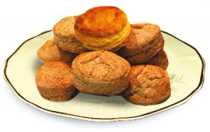

---

title: '12 Dulces Para Diabeticos'
date: '2016-05-10'
slug: 'dulces-para-diabeticos'
category: 'alimentacion'
categories: ['alimentacion']
description: "Y seguimos en este diciembre culinario para que las personas que tengan diabetes no vayan a decir que no pudieron disfrutar estas vacaciones decembrinas" 
---

Y seguimos en este diciembre culinario para que las personas que tengan diabetes no vayan a decir que no pudieron disfrutar estas vacaciones decembrinas por causa de que no comieron delicioso. Hoy te traigo _Dulces Para Diabeticos_ que serán la delicia de grandes y chicos y de diabéticos y los no diabéticos.

## **Dulces para Diabeticos #1: Moldecitos Cítricos**

Esta receta da para 4 porciones

**Ingredientes:** 400 g. de queso blanco, 1 Cda. de gelatina sin sabor, 2 Cdas. de endulzante para diabéticos, 1 Cda. de ralladura de limón y naranja, 2 Cdas. de pasas de uvas, 4 Cdas. de copos integrales

**Procedimiento:** Espolvorear la gelatina sobre el queso blanco. Mezclar y agregar el endulzante para diabéticos, la ralladura, las pasas de uva y los copos. Verter en moldecitos previamente mojados con agua fría. Colocar en heladera dos horas, desmoldar y servir. Conservar en heladera hasta el momento de consumir.

### **Valor nutricional por porción**

Carbohidratos (g)   9,4   

Proteínas (g)    12,3

Grasas (g)        0,1

Calorías (Kcal)  88

## **Dulces para Diabeticos  #2:** **Espuma de Frutilla**

Esta receta da para 6 porciones

**Ingredientes:** 2 cdas. de gelatina sin sabor (14 g.), 1 ½ tazas de leche descremada, ¼ kilo de frutillas, ¼ kilo de queso blanco descremado, 2 cdas. de endulzante para diabéticos. **Procedimiento:** Disolver la gelatina con la leche caliente. Licuar las frutillas con el queso blanco y endulzante para diabéticos. Verter en molde forrado con film adherente para facilitar el desmoldado. Colocar en heladera durante dos horas como mínimo para que tome consistencia. Desmoldar y servir.

### **Valor nutricional por porción**

Carbohidratos (g)      8,2

Proteínas (g)    6,0

Grasas (g)        0,3

Calorías (Kcal)  60

## **Dulces para Diabeticos  #3:** **Panqueques de Manzana**

Esta receta da para 5 porciones

**Masa:** 1 taza de harina, 2 cdas. de cacao,  1 huevo y 1 yema, ½ lt. de leche descremada, 1 cda. de aceite de maíz y 1 cda. de endulzante para diabéticos.**Relleno:** 4 manzanas (3 tazas), ¼ taza de agua para el vapor, 1 cda. de endulzante para diabéticos y ½ cdita. de [canela](http://dediabetes.com/canela-glucosa-alta/).**Procedimiento:** Para la masa, licuar  los ingredientes y dejar reposar ½ hora. Calentar con aceite o rocío vegetal  una sartén. Verter  con un cucharón  chico la mezcla y dejar deslizar hasta formar una capa fina sobre el fondo. Dorar y dar vuelta.**Relleno:** Pelar, cortar en cubos y cocinar  al vapor las manzanas con endulzante para diabéticos y la canela. Rellenar cada panqueque, arrollar y espolvorear con canela. Servir tibios. Como variante se pueden salsear con 3 cdas. de mermelada dietética aligerada.Aporte nutricional de 1 porción:

### **Valor nutricional por porción**

Carbohidratos (g)      36,6

Proteínas (g)    9,2

Grasas (g)        6,6 

Calorías (Kcal)  243

## **Dulces para Diabeticos  #4:** **Sorbete de Naranja**

Esta receta da para 4 porciones

**Ingredientes:** 1 taza de vino dulce (tipo Marsala), 2 Cdas. de jugo de naranja, 1 cdita. de ralladura de naranja, Pizca de nuez moscada, 1 Cda. de endulzante para diabéticos, ½ lt. de [yogur](http://dediabetes.com/yogur-griego-en-la-dieta-diabetica/) natural descremado

**Procedimiento:** Mezclar el vino con el jugo de naranja, ralladura, nuez  moscada y endulzante para diabéticos. Colocar en heladera tapado durante 1 hora. Agregar el yogur bien helado y batir hasta que esté espumoso. Verter en copas altas y conservar 3 días en refrigerador; el vino se depositará en el fondo y la crema en la parte superior. Servir el sorbete frío sin congelar.

### **Valor nutricional por porción**

Carbohidratos (g)      12,3

Proteínas (g)    6,9

Grasas (g)        0,2

Calorías (Kcal) 132
                                             

## **Dulces para Diabeticos  #5:** **Semifreddo de Ricotta**

Esta receta da para 8 porciones

**Ingredientes**: 1 huevo y 4 claras, 2 cdas. de endulzante para diabéticos, 1 cdita. de esencia de vainilla, ½ k. de ricota, 1 cda. de ralladura de limón, ½ taza de fruta deshidratada picada (pasas de uva, ciruela o damasco).

**Procedimiento:** Batir el huevo y las claras junto con endulzante para diabéticos y vainilla.  Agregar y mezclar la ricota, la ralladura, y las frutas.  Verter en molde untado con aceite o rocío vegetal.  Cocinar en horno moderado durante 40 minutos. Retirar cuando esté cuajado y dejar enfriar en heladera 2 horas como mínimo.  Servir frío, decorado con hojitas de menta fresca.

### **Valor nutricional por porción**

Carbohidratos (g)      9,8

Proteínas (g)    9,6

Grasas (g)        5,2

Calorías (Kcal)  124

## **Dulces para Diabeticos  #6:** Flan de Chocolate

12 porciones

**Ingredientes:** 6 huevos, 1 litro de leche descremada, 3 cucharadas de SUCRALIGHT POLVO, 2 cucharadas de cacao, 1 cucharadita de esencia de vainilla.

**Elaboración:** mezclamos con batidor de mano los huevos con la leche, SUCRALIGHT o alternativa, cacao y vainilla. Volcamos la preparación en budinera con tubo en el medio y cocinamos en horno  moderado a baño María, o en microondas.  En ambos casos, controlamos que esté totalmente cuajado antes de retirarlo. Se omiten los tiempos de cocción porque dependen de la temperatura de los huevos y la leche que podrían, o no, estar en la heladera. Dejamos enfriar, ponemos en la heladera un par de horas y recién después desmoldamos.

### **Valor nutricional por porción**

Carbohidratos (g)      4,2

Proteínas (g)    5,7

Grasas (g)        2,7

Calorías (Kcal)  65

## **Dulces para Diabeticos  #7:** **Scones Dulces para Té**

12 porciones

**Ingredientes**: 1 y ½ tazas de harina blanca, 1 y ½ tazas de harina integral, 1 cucharada de polvo de hornear, pizca de sal, 2 y ½ cucharadas de SUCRALIGHT POLVO o alternativa, 60 g. de margarina bajas calorías, 1 huevo, ½ taza de jugo de naranja y 1 cucharada de ralladura de naranja.

**Elaboración:** ponemos en un recipiente las harinas, polvo de hornear, sal y SUCRALIGHT. Batimos el huevo y le agregamos de a poco la margarina derretida. Unimos las dos preparaciones y formamos la masa. Amasamos sobre la mesada, estiramos con palote

dejando la masa de 1 y ½ cm. de espesor y cortamos con cortapastas. Cocinamos en horno moderado durante 12 minutos aproximadamente, hasta que comprobamos que están prontos y empiezan a dorarse. Se pueden servir con una mermelada casera.

### **Valor nutricional por porción**

Carbohidratos (g) 32

Proteínas (g) 4

Grasas (g) 1,4

Calorías (Kcal) 162

## **Dulces para Diabeticos  #8:** **Duraznos de Fiesta**

4 porciones

**Ingredientes:** 4 duraznos frescos firmes rociados con 1 cucharada de SUCRALIGHT POLVO o alternativa, 1 taza de galletitas integrales molidas, 2 cucharadas de SUCRALIGHT POLVO o alternativa,  ½ taza de jugo de naranja, ½ taza de nueces molidas, 1 cucharada de ralladura de naranja.

**Elaboración:** pelamos los duraznos, cortamos en mitades y rociamos con SUCRALIGHT. Formamos una pasta con las galletitas,  SUCRALIGHT, jugo de naranja, nueces y ralladura. En el hueco de cada mitad de durazno ponemos una cucharadita colmada de esta preparación.  Cubrimos con film adherente y ponemos en la heladera durante dos horas.  Servimos el postre bien frío.

### **Valor nutricional por porción**

Carbohidratos (g) 31,6

Proteínas (g)  6,5

Grasas (g)   13,1

Calorías (Kcal) 256

## **Dulces para Diabeticos  #9:** **Flan de Café**

Esta receta rinde para 8 porciones.

**Ingredientes:** 4 yemas, 8 claras, 2 tazas de leche descremada, ½ taza de almidón de maíz, 1 taza de agua caliente, 1 y ½ cucharadas de café instantáneo, 2 y ½ cucharadas de edulcurante para diabéticos, 1 cucharada de esencia de vainilla. **Elaboración:** Batimos con batidor de alambre manual las claras y las yemas con el edulcurante para diabéticos, agregamos la esencia, el almidón disuelto en la leche descremada y el café previamente disuelto en la taza de agua caliente. Volcamos toda la preparación en budinera y cocinamos en horno convencional a baño María o en  molde adecuado para microondas, sin baño María. Cuando está cuajado, retiramos, dejamos enfriar y desmoldamos.

### **Valor nutricional por porción**

Carbohidratos (g) 9,2 

Proteínas (g)  6,5

Grasas (g)   4

Calorías (Kcal) 85

## **Dulces para Diabeticos  #10:** **Pan de Naranja**

Esta receta rinde para 6 porciones.

**Ingredientes:** 2 huevos, 2 y ½ cucharadas de, edulcurante para diabéticos, 1 y ¼ taza de harina, 1 taza de queso blanco descremado, 2 cucharaditas de polvo de hornear, vainilla, ralladura de naranja.

**Elaboración:** Batimos los huevos con el edulcurante para diabéticos hasta formar una crema espesa. Agregamos de a poco el queso blanco, harina, polvo de hornear y al final, vainilla y la ralladura de naranja.

Mezclamos bien y volcamos sobre molde forrado  con papel manteca. Cocinamos en horno moderado, a 200º hasta que está cocido y empieza a dorarse. Retiramos, dejamos enfriar y saboreamos.

### **Valor nutricional por porción**

Carbohidratos (g) 29 

Proteínas (g)  8,4

Grasas (g)   4,1

Calorías (Kcal) 186

## **Dulces para Diabeticos  #11:** **Budín de Arroz**

Esta receta rinde para 8 porciones.

**Ingredientes:** 2 tazas de arroz blanco, 4 tazas de agua, pizca de sal, 3 huevos, 1taza de vino rosado, 2 ½ Cdas. de edulcurante para diabéticos

**Procedimiento:** Cocinar el arroz en con una pizca de sal. Agregar y mezclar los huevos batidos, el vino y el edulcurante para diabéticos. Verter la preparación en budinera aceitada o untada con rocío vegetal. Cocinar hasta que cuaje.

### **Valor nutricional por porción**

Carbohidratos (g) 40,7 

Proteínas (g)  5,5

Grasas (g)   2,1

Calorías (Kcal) 233                                                   

## **Dulces para Diabeticos  #12:** **Casi Helado Festivo**

Esta receta rinde para 8 porciones.

**Ingredientes:** ½ kg. de ricotta, 1 huevo, 4 claras, 2 y ½ cucharadas de edulcurante para diabéticos, 1 cucharada de ralladura de  limón y naranja, 1 cucharadita de canela en polvo, 1 taza de fruta seca picada (pasas de uva, ciruelas o damascos).

**Elaboración:** Batimos el huevo y las claras con edulcurante para diabéticos y la canela. Incorporamos la ricota, ralladura y frutas picadas y mezclamos bien. Vertemos la preparación en molde apenas aceitado y cocinamos en horno moderado durante 40 minutos. Cuando está cuajado, lo retiramos, dejamos enfriar y luego ponemos en heladera durante 2 horas. Servimos frío adornado con frutas y hojitas de menta o salvia.

### **Valor nutricional por porción**

Carbohidratos (g) 17,2 

Proteínas (g)  10

Grasas (g)   5,8

Calorías (Kcal) 162  
