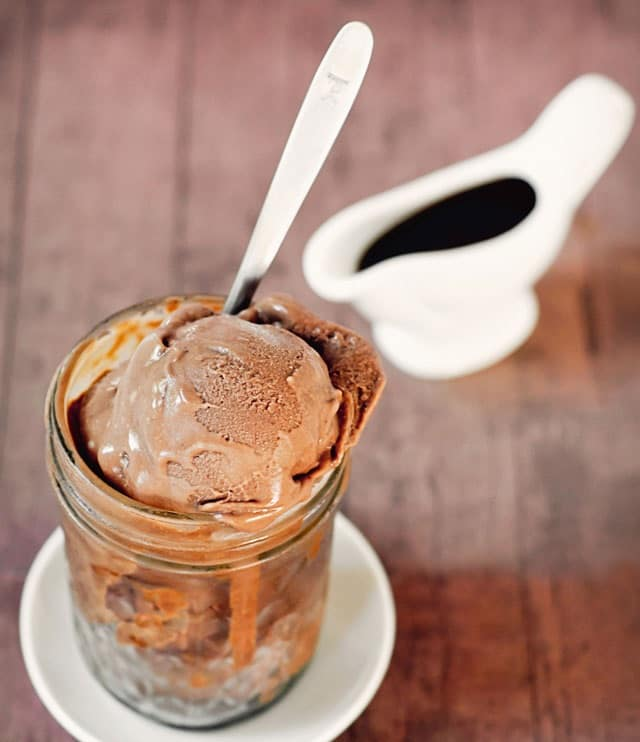

Iniciamos este viaje culinario para demostrar que la diabetes se puede tratar comiendo sano y sobre todo, comiendo sabroso. Espero que las siguientes recetas sean del agrado de todos. Por favor, no olviden consultar a su médico ante cualquier duda o cambios en su dieta. A continuación las mejores 16 recetas de postres para diabeticos:

## Postres para Diabeticos #1: Copa caribeña con pudín de chía

### Ingredientes:

- Frutas al gusto (puedes utilizar cambur o bananas, kiwis, fresas, frambuesas, albaricoques, duraznos, higos, uvas o las frutas que más te gusten)
- 1 taza de yogurt griego descremado
- ½ taza de leche de almendras (o leche descremada)
- ¼ de taza de semillas de chía
- 10 gr. de edulcorante granulado o en polvo
- Esencia de vainilla
- Hojas de yerbabuena o menta para decorar

### Preparación:

1. En un bol mezcla la leche de almendras (o leche descremada) con las semillas de chía, deja reposar la mezcla en la nevera durante 2 horas o hasta que la chía suelte la “gelatina” (puedes dejarlas más o menos tiempo dependiendo de qué tan espeso quieras el pudín, mientras más tiempo repose, más espesa será la mezcla).
2. Mezcla el pudín de chía que tenías en la nevera con el yogurt, el edulcorante y la esencia de vainilla.
3. Sirve en moldes individuales.
4. Cubre los moldes con las frutas de tu preferencia.
5. Decora con hojas de menta.

### Notas de la Receta:

Porciones: 6. Tiempo de preparación y cocción: 20 minutos. Tiempo de reposo: aproximadamente 2 horas en la nevera. Calorías estimadas por porción: 130.

## Postres para Diabeticos #2: Moldecitos de Batatas

### Ingredientes:

- 4 huevos
- 2 Batatas
- 2 tazas de leche descremada
- 1 cucharadita de vainilla
- 1 cucharadita de ralladura de limón
- 2 cucharadas de endulzante para personas diabéticas
- 1 cucharada de mermelada de duraznos dieta

### Preparación:

Puré de Batatas\*

1. Lavamos y secamos bien las batatas
2. Precalentamos el horno a 220 ° C (425 ° F).
3. Coloque las batatas en una cacerola para hornear, colocamos la cacerola en la rejilla central del horno, y horneamos por unos 80 minutos o hasta que un cuchillo se puede insertar en el centro de cada batata sin esfuerzo.
4. Retiramos del horno y dejamos enfriar durante unos 15-20 minutos
5. Retiramos la piel.
6. En un tazón mediano, mezclamos bien las batatas con un triturador de patatas o tenedor. Guardar. \* Este método de cocción conservará la dulzura natural de las patatas que se desperdicia parcialmente cuando las patatas se herven en su lugar.

Moldecitos:

1. Precaliente el horno a 325 F.
2. Batimos apenas los huevos, incorporamos el puré y la leche.
3. Luego agregamos la vainilla, ralladura y endulzante para personas diabéticas.
4. Ligeramente engrasamos 6 a 8 moldecitos (4 o 6 onzas).
5. Agregamos cantidades iguales de la mezcla de la patata dulce a los moldecitos.
6. Colocamos los moldecitos llenos en una cacerola y preparamos un baño de maria agregando el agua caliente a la cacerola de modo que el nivel del agua cubra hasta mitad de la altura de los moldecitos. Tenga cuidado de evitar que caiga agua dentro de los moldecitos.
7. Hornear por 40 a 45 minutos, cuando pinchamos con la hoja de un cuchillo y sale limpia, retiramos
8. Dejar enfriar y luego refrigerar por lo menos 2 horas antes de servir.
9. Disolvemos la mermelada con alguna cucharada de agua hirviendo y bañamos los moldecitos desmoldados.

### Notas de la Receta:

Esta receta es para 6 porciones. Aporte nutricional de 1 porción:

<table className=" border-2 border-gray-300">
  <thead>
    <tr className="border-2 border-gray-300 text-center">
      <th className="border-2 border-gray-300 text-center w-auto px-4">
        Proteínas (g)
      </th>
      <th className="border-2 border-gray-300 text-center w-auto px-4">
        Glúcidos (g)
      </th>
      <th className="border-2 border-gray-300 text-center w-auto px-4">
        Grasa (g)
      </th>
      <th className="border-2 border-gray-300 text-center w-auto px-4">
        Calorías
      </th>
    </tr>
  </thead>
  <tbody>
    <tr className="border-2 border-gray-300">
      <td className="border-2 border-gray-300 text-center">7</td>
      <td className="border-2 border-gray-300 text-center">13,1</td>
      <td className="border-2 border-gray-300 text-center">3,7</td>
      <td className="border-2 border-gray-300 text-center">115</td>
    </tr>
  </tbody>
</table>

## Postres para Diabeticos #3: Helados de Canela y Chocolate

### Ingredientes:

- 300 g de helado de chocolate diet o sin azúcar
- 1 vasito de yogur descremado natural (185 c.c.)
- 2 cucharaditas de [canela](http://wordpress-273468-1181825.cloudwaysapps.com/canela-glucosa-alta/) en polvo, pizca de nuez moscada
- ½ taza de agua
- 1 cucharada de café instantáneo
- 1 cucharada de endulzante para personas diabéticas
- 1 cucharada de chocolate en barra sin agregado de azúcar, picado.

### Preparación:

1. Mezclamos el yogur con café, endulzante para personas diabéticas, nuez moscada y canela.
2. Ponemos el helado ya batido en un bol y le agregamos de a poco la mezcla anterior, hasta que quede una crema bien homogénea.
3. Volcamos la preparación en molde a gusto, tapamos y ponemos en freezer.
4. Lo servimos rociado con el chocolate picado por arriba.

### Notas de la Receta:

Esta receta es para 4 porciones.

Aporte nutricional por porción:

<table className=" border-2 border-gray-300">
  <thead>
    <tr className="border-2 border-gray-300 text-center">
      <th className="border-2 border-gray-300 text-center w-auto px-4">
        Proteínas (g)
      </th>
      <th className="border-2 border-gray-300 text-center w-auto px-4">
        Glúcidos (g)
      </th>
      <th className="border-2 border-gray-300 text-center w-auto px-4">
        Grasa (g)
      </th>
      <th className="border-2 border-gray-300 text-center w-auto px-4">
        Calorías
      </th>
    </tr>
  </thead>
  <tbody>
    <tr className="border-2 border-gray-300">
      <td className="border-2 border-gray-300 text-center">4,4</td>
      <td className="border-2 border-gray-300 text-center">9</td>
      <td className="border-2 border-gray-300 text-center">2,3</td>
      <td className="border-2 border-gray-300 text-center">75</td>
    </tr>
  </tbody>
</table>

## Postres para Diabeticos #4: **Mermelada de Peras.**

### Ingredientes:

- 1 kg. de peras firmes
- 4 clavos de olor
- 1 ramita de canela
- pizca de nuez moscada
- 2 cucharadas de gelatina sin sabor
- cáscara de 1 limón cortada como cinta (sólo la parte amarilla)
- 1 y ½ cucharadas de endulzante para diabéticos.

### Preparación:

1. Pelamos y retiramos las semillas de las peras
2. Ponemos la cáscara y semillas en un liencito y atamos fuerte, para que no se salgan.
3. Cortamos las peras en cuartos, ponemos en cacerola adecuada y agregamos también el atadito de cáscaras y semillas, ya que en la cocción le darán textura a la mermelada.
4. Agregamos también canela, clavos de olor, cáscara de limón y nuez moscada.
5. Cubrimos apenas con agua y ponemos al fuego.
6. Cuando levanta el hervor, bajamos el fuego y dejamos que conserve el hervor hasta que el agua prácticamente, se evapore cuidando que no se queme.
7. Retiramos y hacemos puré con las peras, retirando la cáscara de limón, canela y clavos.
8. Hidratamos la gelatina sin sabor con media taza de agua, entibiamos hasta que se disuelva bien y la volcamos en el puré de peras.
9. Calentamos nuevamente toda la preparación mezclando con cuchara de madera y retiramos.
10. Dejamos la cacerola destapada y, cuando está tibia, le agregamos el endulzante para diabéticos.
11. Mezclamos bien y dejamos enfriar.
12. Envasamos en recipiente limpio, seco y previamente enjuagado con alcohol.
13. Tapamos bien el recipiente y conservamos en heladera, hasta terminar de consumir la mermelada. La gelatina se conserva hasta una semana.

### Notas de la Receta:

Esta receta alcanza para 4 personas. Aporte nutricional de 1 porción:

<table className=" border-2 border-gray-300">
  <thead>
    <tr className="border-2 border-gray-300 text-center">
      <th className="border-2 border-gray-300 text-center w-auto px-4">
        Proteínas (g)
      </th>
      <th className="border-2 border-gray-300 text-center w-auto px-4">
        Glúcidos (g)
      </th>
      <th className="border-2 border-gray-300 text-center w-auto px-4">
        Grasa (g)
      </th>
      <th className="border-2 border-gray-300 text-center w-auto px-4">
        Calorías
      </th>
    </tr>
  </thead>
  <tbody>
    <tr className="border-2 border-gray-300">
      <td className="border-2 border-gray-300 text-center">0,5</td>
      <td className="border-2 border-gray-300 text-center">30,7</td>
      <td className="border-2 border-gray-300 text-center">0,4</td>
      <td className="border-2 border-gray-300 text-center">128</td>
    </tr>
  </tbody>
</table>

## Postres para Diabeticos #5: Flan de Café Aromático

### Ingredientes:

- 4 yemas y 8 claras
- 2 tazas de leche descremada
- ½ taza de almidón de maíz
- 1 taza de agua caliente
- 1 y ½ cucharadas de café instantáneo
- 2 y ½ cucharadas de endulzante para diabéticos
- 1 cucharada de esencia de vainilla

### Preparación:

1. Batimos con batidor de alambre manual las claras y  las yemas con el endulzante para diabéticos
2. Agregamos la esencia, el almidón disuelto en la leche descremada  y el café previamente disuelto en la taza de agua caliente.
3. Volcamos toda la preparación en la budinera y cocinamos en horno convencional a baño María o en molde adecuado para microondas, sin baño María.
4. Cuando está cuajado, retiramos, dejamos enfriar y desmoldamos.

### Notas de la Receta:

Esta receta alcanza para 8 personas. Aporte nutricional de 1 porción:

<table className=" border-2 border-gray-300">
  <thead>
    <tr className="border-2 border-gray-300 text-center">
      <th className="border-2 border-gray-300 text-center w-auto px-4">
        Proteínas (g)
      </th>
      <th className="border-2 border-gray-300 text-center w-auto px-4">
        Glúcidos (g)
      </th>
      <th className="border-2 border-gray-300 text-center w-auto px-4">
        Grasa (g)
      </th>
      <th className="border-2 border-gray-300 text-center w-auto px-4">
        Calorías
      </th>
    </tr>
  </thead>
  <tbody>
    <tr className="border-2 border-gray-300">
      <td className="border-2 border-gray-300 text-center">6,5</td>
      <td className="border-2 border-gray-300 text-center">9,2</td>
      <td className="border-2 border-gray-300 text-center">2,4</td>
      <td className="border-2 border-gray-300 text-center">85</td>
    </tr>
  </tbody>
</table>

## Postres para Diabeticos #6: Pastel Oriental

Esta receta alcanza para 4 personas.

**Ingredientes:** 2 huevos, 1 1/2 Cda de endulzante para diabéticos, ¼ taza de jugo de naranja, 1 cda. de ralladura de naranja, 1 cta de ralladura de limón, ½ quilo de zanahorias ralladas finas, 2 cdas de almendras peladas y picadas, pizca de nuez moscada, ¼ taza de harina, 1 cdita. de polvo de hornear.

**Procedimiento:** Batir los huevos hasta cremosos y agregar el endulzante para diabéticos, el jugo, la ralladura de naranja y de limón. Agregar las zanahorias, las almendras y la nuez moscada. Incorporar en forma envolvente la harina mezclada con el polvo de hornear. Colocar en molde de 24 cm. diámetro aceitado o untado con rocío vegetal. Hornear hasta que esté dorado y se desprenda de los bordes. Retirar y dejar enfriar antes de servir.

Aporte nutricional de 1 porción:

<table className=" border-2 border-gray-300">
  <thead>
    <tr className="border-2 border-gray-300 text-center">
      <th className="border-2 border-gray-300 text-center w-auto px-4">
        Proteínas (g)
      </th>
      <th className="border-2 border-gray-300 text-center w-auto px-4">
        Glúcidos (g)
      </th>
      <th className="border-2 border-gray-300 text-center w-auto px-4">
        Grasa (g)
      </th>
      <th className="border-2 border-gray-300 text-center w-auto px-4">
        Calorías
      </th>
    </tr>
  </thead>
  <tbody>
    <tr className="border-2 border-gray-300">
      <td className="border-2 border-gray-300 text-center">5,4</td>
      <td className="border-2 border-gray-300 text-center">19,4</td>
      <td className="border-2 border-gray-300 text-center">5,1</td>
      <td className="border-2 border-gray-300 text-center">144</td>
    </tr>
  </tbody>
</table>

## Postres para Diabeticos #7: **Mousse de Frutillas**

### Ingredientes:

- 1 sobre de gelatina sin azúcar de fresa o frambuesa (12 gr.)
- 2 cucharadas de agua caliente
- 1 taza de yogurt griego
- 2/3 de taza de puré de fresas o frambuesas (hervir las fresas hasta que estén suaves y procesar manualmente)
- Fresas, frambuesas y hojas de menta para decorar

### Preparación:

1. En un bol colocar el sobre de gelatina con el agua caliente.
2. En una olla calentar ligeramente el puré de fresas o frambuesas.
3. Mezclar el puré de fresas o frambuesas con la gelatina diluida.
4. Llenar un recipiente de agua con hielo aproximadamente hasta la mitad.
5. Colocar el bol sobre el recipiente de agua con hielo – haciendo un baño de maría inverso – y remover con una cuchara de madera hasta enfriar.
6. Añadir el yogurt y continuar mezclando.
7. Servir en recipientes individuales y llevar a la nevera al menos durante dos horas.
8. Sacar de la nevera y adornar con fresas, frambuesas y menta.

Porciones: 6.

Tiempo de preparación y cocción: 20 minutos.

Tiempo de reposo: aproximadamente 2 horas en la nevera.

Calorías estimadas por porción: 150.

## Postres para Diabeticos #8: Muffins de Especias y Manzanas

Esta receta es suficiente para 15 unidades o porciones.

**Ingredientes:** 2 huevos, 6 medidas de edulcurante para diabéticos, 1/3 taza de aceite de maíz, 1 ½ taza de manzanas verdes, ¾ taza de yogurt descremado natural, 1 cdita. de vainilla, 1 cdita.de ralladura de limón, 1 cdita.de canela pizca de nuez moscada, pizca de sal, 1 ½ taza de harina, 2 cditas.de polvo de hornear, ½ cdita. de bicarbonato de sodio, 1/3 taza de harina de maíz, ¼ taza de almidón de maíz

**Procedimiento:** Pelar y rallar las manzanas. Batir los huevos, el edulcurante para diabéticos, el aceite de maíz, las manzanas, el yogurt, la vainilla, la ralladura de limón, la canela, la nuez moscada y la sal. Mezclar la harina, el polvo de hornear, el bicarbonato de sodio, la harina de maíz y el almidón de maíz. Agregar en el centro la preparación anterior y unir. Aceitar o untar con rocío vegetal moldes y colocar la mezcla por cucharadas Hornear a 160º C durante 15 minutos.

Aporte nutricional de 1 porción:

<table className=" border-2 border-gray-300">
  <thead>
    <tr className="border-2 border-gray-300 text-center">
      <th className="border-2 border-gray-300 text-center w-auto px-4">
        Proteínas (g)
      </th>
      <th className="border-2 border-gray-300 text-center w-auto px-4">
        Glúcidos (g)
      </th>
      <th className="border-2 border-gray-300 text-center w-auto px-4">
        Grasa (g)
      </th>
      <th className="border-2 border-gray-300 text-center w-auto px-4">
        Calorías
      </th>
    </tr>
  </thead>
  <tbody>
    <tr className="border-2 border-gray-300">
      <td className="border-2 border-gray-300 text-center">3,1</td>
      <td className="border-2 border-gray-300 text-center">15,9</td>
      <td className="border-2 border-gray-300 text-center">6,3</td>
      <td className="border-2 border-gray-300 text-center">134</td>
    </tr>
  </tbody>
</table>

## Postres para Diabeticos #9: Mermelada de Frutos Rojos

**Ingredientes:** ½ kg de frutillas, jugo de 1 naranja, 3 medidas de edulcurante para diabético, 2 cditas. de gelatina sin sabor, ¼ taza de agua fría.

**Sustituciones:** Arándanos, ciruelas o frambuesas.

**Procedimiento:** Lavar y picar las frutillas. Dejar en un bol 15 minutos con el jugo de la naranja. Poner a hervir hasta que se deshagan. Agregar el edulcurante para diabéticos y dejar 1 minuto más. Agregar la gelatina sin sabor hidratada en agua fría. Dejar que levante hervor. Retirar y envasar. Guardar 15 días en la heladera.

Aporte nutricional de 1 porción:

<table className=" border-2 border-gray-300">
  <thead>
    <tr className="border-2 border-gray-300 text-center">
      <th className="border-2 border-gray-300 text-center w-auto px-4">
        Proteínas (g)
      </th>
      <th className="border-2 border-gray-300 text-center w-auto px-4">
        Glúcidos (g)
      </th>
      <th className="border-2 border-gray-300 text-center w-auto px-4">
        Grasa (g)
      </th>
      <th className="border-2 border-gray-300 text-center w-auto px-4">
        Calorías
      </th>
    </tr>
  </thead>
  <tbody>
    <tr className="border-2 border-gray-300">
      <td className="border-2 border-gray-300 text-center">4,4</td>
      <td className="border-2 border-gray-300 text-center">56</td>
      <td className="border-2 border-gray-300 text-center">2,7</td>
      <td className="border-2 border-gray-300 text-center">266</td>
    </tr>
  </tbody>
</table>

## Postres para Diabeticos #10: **Bizcocho Borracho**

Esta receta es suficiente para 6 porciones.

**Ingredientes:** 4 huevos, ½ taza de leche en polvo descremada, 1 cdita. de polvo de hornear, 2 cditas. de esencia de vainilla, ralladura de limón y naranja, ¼ taza de bebida alcohólica, (whisky, cognac), harina cantidad necesaria, ½ taza de queso blanco descremado, 2 y ½ cucharadas de edulcurante para diabéticos y ½ taza de pasas de uva.

**Elaboración:** Batimos los huevos con 2 cucharadas del edulcurante para diabéticos, vainilla y polvo de hornear hasta lograr punto letra. Cernimos sobre el batido la leche en polvo, agregamos cognac, ralladura y las pasas de uva espolvoreadas con harina. Mezclamos todo en forma envolvente. Volcamos la preparación en una placa de 15 x 20 cms previamente aceitada y cocinamos en horno moderado durante 15 minutos. Cortamos en cuadrados y decoramos con el queso batido junto con ½ cucharada de endulzante y esencia de vainilla. Es un bocado ideal para acompañar una rica taza de té.

Aporte nutricional de 1 porción:

<table className=" border-2 border-gray-300">
  <thead>
    <tr className="border-2 border-gray-300 text-center">
      <th className="border-2 border-gray-300 text-center w-auto px-4">
        Proteínas (g)
      </th>
      <th className="border-2 border-gray-300 text-center w-auto px-4">
        Glúcidos (g)
      </th>
      <th className="border-2 border-gray-300 text-center w-auto px-4">
        Grasa (g)
      </th>
      <th className="border-2 border-gray-300 text-center w-auto px-4">
        Calorías
      </th>
    </tr>
  </thead>
  <tbody>
    <tr className="border-2 border-gray-300">
      <td className="border-2 border-gray-300 text-center">8,3</td>
      <td className="border-2 border-gray-300 text-center">17</td>
      <td className="border-2 border-gray-300 text-center">5</td>
      <td className="border-2 border-gray-300 text-center">146</td>
    </tr>
  </tbody>
</table>

## Postres para Diabeticos #11: **Compota de Damascos**

Esta receta es suficiente para 4 porciones.

**Ingredientes:** 200 g. de orejones de damascos, ½ taza de agua, 1 taza de vino blanco seco, 1 cucharada de edulcurante para diabéticos, 1 vasito de yogur descremado sabor vainilla

**Elaboración:** Ponemos en un recipiente los damascos, agua y vino, colocamos al fuego hasta que levanta el hervor. Agregamos edulcurante para diabéticos y con fuego bajito dejamos cocinar hasta que los orejones estén tiernos. Retiramos y enfriamos. Servimos cada porción con un copete de yogur y una hojita de menta fresca.

Aporte nutricional de 1 porción:

<table className=" border-2 border-gray-300">
  <thead>
    <tr className="border-2 border-gray-300 text-center">
      <th className="border-2 border-gray-300 text-center w-auto px-4">
        Proteínas (g)
      </th>
      <th className="border-2 border-gray-300 text-center w-auto px-4">
        Glúcidos (g)
      </th>
      <th className="border-2 border-gray-300 text-center w-auto px-4">
        Grasa (g)
      </th>
      <th className="border-2 border-gray-300 text-center w-auto px-4">
        Calorías
      </th>
    </tr>
  </thead>
  <tbody>
    <tr className="border-2 border-gray-300">
      <td className="border-2 border-gray-300 text-center">5</td>
      <td className="border-2 border-gray-300 text-center">40,5</td>
      <td className="border-2 border-gray-300 text-center">0,4</td>
      <td className="border-2 border-gray-300 text-center">186</td>
    </tr>
  </tbody>
</table>

## Postres para Diabeticos #12: Mermelada de Manzanas (4 porciones)

INGREDIENTES:

½ kg. de manzanas, 2 y ½ cucharadas de endulzante en polvo para diabéticos o alternativa, 1 cucharada de gelatina sin sabor, 1 cucharadita de ralladura de naranja, ½ taza de agua.

Elaboración: Pelamos las manzanas, retiramos las semillas y cortamos en trozos. Ponemos en un recipiente el agua, ralladura de naranja, las semillas (en una gasa) y las manzanas. Cocinamos hasta que se reduce el líquido. Retiramos el paquetito de las semillas y hacemos un puré con la fruta. Disolvemos la gelatina en agua fría, incorporamos a la preparación y llevamos a hervor un par de minutos. Retiramos del fuego, agregamos endulzante en polvo para diabéticos o alternativa y dejamos enfriar. Podemos utilizarla como postre, relleno de bizcochos, para untar u otras variadas opciones.

1 porción: 105 calorías aprox.

## Postres para Diabeticos #13: Besitos de Nuez

### Ingredientes:

- 250 gramos de ricota descremada
- 1 cucharada de chocolate en polvo
- 4 nueces picadas
- 1 cucharada de avena crocante
- 1 y ½ cucharadas de endulzante en polvo para diabéticos o alternativa
- 1 cucharadita de esencia de vainilla
- 1 cucharada de pasas de uva
- 1 cucharada de gelatina sin sabor
- 2 cucharadas de whisky.

### Preparación:

1. Calentamos el whisky hasta que hierva un par de minutos
2. Mezclamos whisky con la ricota, chocolate en polvo, nueces, avena, endulzante en polvo para diabéticos o alternativa, esencia y pasas de uva.
3. Espolvoreamos la gelatina sin sabor y mezclamos bien.
4. Volcamos toda la preparación en molde rectangular, previamente mojado con agua fría.
5. Ponemos en la heladera dos horas, retiramos y cortamos en rombos . Conservamos en la heladera hasta el momento de servir.

Porciones: 4

1 porción: 223 calorías**\***

<table className=" border-2 border-gray-300">
  <thead>
    <tr className="border-2 border-gray-300 text-center">
      <th className="border-2 border-gray-300 text-center w-auto px-4">
        Proteínas (g)
      </th>
      <th className="border-2 border-gray-300 text-center w-auto px-4">
        Glúcidos (g)
      </th>
      <th className="border-2 border-gray-300 text-center w-auto px-4">
        Grasa (g)
      </th>
    </tr>
  </thead>
  <tbody>
    <tr className="border-2 border-gray-300">
      <td className="border-2 border-gray-300 text-center">6,7</td>
      <td className="border-2 border-gray-300 text-center">15</td>
      <td className="border-2 border-gray-300 text-center">13</td>
    </tr>
  </tbody>
</table>

**\***Sin el whisky las calorías totales son 203

## Postres para Diabeticos #14: Volcán de Chocolate

### Ingredientes:

- 225 gr. de chocolate
- 50 gr. de mantequilla (se puede sustituir por aceite de oliva)
- 2 huevos
- 3 cucharadas de harina
- 25 gr. de edulcorante en polvo o granulado
- 30 gr. de cacao

### Preparación:

1. Precalentar el horno a 180º.
2. Derretir el chocolate a baño de maría con la mantequilla (o el aceite de oliva).
3. En un bol mezclar manualmente los huevos, el edulcorante y la harina.
4. Incorporar el chocolate a la mezcla.
5. Agregar el cacao y corregir el dulce.
6. Colocar en moldes individuales.
7. Hornear durante 10 minutos, la idea es que el centro quede un poco crudo para que sea cremoso al probarlo.

Consejo: si te da miedo que los volcancitos no se sostengan y se rompan por estar muy suaves en el centro, hornéalos en moldes bonitos aptos para el horno para que no tengas que desmoldarlos y siempre te quedarán perfectos.

Porciones: 8

Tiempo de preparación y cocción: 30 minutos.

Tiempo de reposo: es preferible servirlos recién sacados del horno.

Calorías estimadas por porción: 306.

## Postres para Diabeticos #15: Barritas de Almendras “Crunch”

### Ingredientes:

- 1 taza de avena
- 20 gr. de edulcorante en polvo o granulado
- 1 cucharada de canela en polvo
- 2 cucharadas de semillas de chía
- 1 cucharada de linaza molida
- 1 huevo
- ½ taza de leche de almendras (o leche descremada)
- ½ cucharada de polvo para hornear

### Preparación:

1. Precalentar el horno a 180º.
2. Prepara un molde para hacer cupcakes o barritas con capacillos de papel o engrasando con un poco de mantequilla si se van a desmoldar.
3. Mezclar los ingredientes secos en un bol (avena, edulcorante, canela, chía, linaza y polvo para hornear).
4. Agregar el huevo y la leche de almendras o la leche descremada.
5. Hornear durante 15 o 20 minutos o hasta que estén firmes.

Porciones: 8.

Tiempo de preparación y cocción: 20 minutos.

Tiempo de reposo: aproximadamente 1 hora a temperatura ambiente.

Calorías estimadas por porción: 120.

## Postres para Diabeticos #16: Bocaditos de Café

### Ingredientes:

- 1 y ½ tazas de leche en polvo descremada
- 2 huevos y 4 claras
- 2 cucharadas de endulzante en polvo para diabéticos o alternativa
- 1 cucharadita de canela en polvo
- 2 cucharaditas de café instantáneo en polvo
- ½ cucharadita de cacao amargo
- 3 gotas de esencia de almendras
- 1 cucharadita de polvo de hornear.

### Preparación:

1. Mezclamos la leche en polvo junto con el café y el cacao.
2. Aparte batimos los huevos y las claras junto con las esencias y canela, endulzante en polvo para diabéticos o alternativa y polvo de hornear, hasta punto letra.
3. Unimos las dos preparaciones mezclando en forma envolvente.
4. Volcamos sobre una placa rectangular de 18 x 25 cms. previamente aceitada y cocinamos en horno moderado durante 15 minutos.
5. Retiramos, cortamos en rombos y ponemos en otra placa, nuevamente al horno muy suave, para que se sequen y queden crocantes.

Porciones: 4
