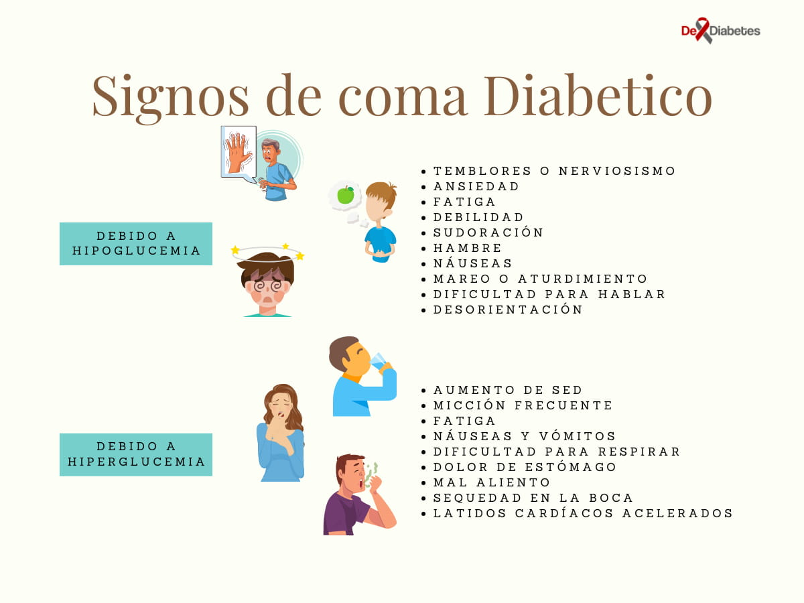

import { Video } from '../../../components/Complete'

Reconocer a tiempo los signos de un coma diabetico puede ayudar a salvar la vida de la persona con diabetes.

Un coma provocado por niveles bajos de azúcar en la sangre puede tener varios factores como no comer, el consumo de alcohol y el exceso de ejercicio. Los niveles de azúcar se agotan rápidamente lo cual puede inducirlo.

Entrar en coma, convulsiones y la muerte pueden ser las consecuencias inminentes para la persona con diabetes si la ayuda no se administra pronto.

## ¿Qué es un coma diabetico?

Un coma diabético es una complicación de la diabetes que amenaza la vida que causa la perdida de consciencia. Una persona con diabetes puede sufrir de un coma diabetico si sus niveles de azúcar en la sangre son demasiado altos o demasiado bajo.

Si caes en un coma diabético, estás vivo, pero no puedes despertar o responder a sonidos u otros tipos de estimulación. Si no se trata, un coma diabético puede ser fatal.

## Causas

### Cetoacidosis Diabética[^1]

Ocurre cuando el cuerpo empieza a descomponer la grasa demasiado rápido. Este proceso forma ácidos tóxicos conocidos como cetonas que se acumulan en el plasma sanguíneo.

Cetoacidosis diabética es la combinación de acumulación de cetonas con niveles altos de azúcar en la sangre y puede desencadenar un coma.

Esta condición es más común en la diabetes tipo 1, pero a veces ocurre en diabetes tipo 2 o diabetes gestacional.

### Síndrome Hiperosmolar (HHS)[^2]

El síndrome hiperglucémico hiperosmolar  es una complicación seria de la diabetes mellitus. HHS ocurre cuando los niveles de glucosa en sangre (azúcar) de una persona son demasiado altos durante un largo período, lo que lleva a una deshidratación severa (sed extrema) y confusión

Puede ocurrir cuando el nivel de azúcar en la sangre supera los 600 miligramos por decilitro (mg / dl), o 33.3 milimoles por litro (mmol / l)

### Hipoglucemia

El cerebro necesita glucosa para funcionar. En casos severos, el bajo nivel de azúcar en la sangre puede hacer que la persona se desmaye.

Puede ocurrir cuando los niveles de glucemia en la sangre descienden por debajo de 50 mg/dl

## Factores de riesgo

Cualquiera que tenga diabetes tiene riesgo de coma diabético, pero los siguientes factores pueden aumentar el riesgo:

- Problemas con la administración de insulina. 
- Cuando estás enfermo o lesionado, los niveles de azúcar en sangre tienden a aumentar, a veces de manera espectacular.
- Condiciones médicas, como insuficiencia cardíaca o enfermedad renal.
- Diabetes mal manejada
- Saltarse comidas o insulina deliberadamente
- Tomar alcohol
- Uso de drogas ilegales.

## Reconocer los síntomas de un coma diabético

Muchas personas con diabetes experimentadas son conscientes cuando su nivel de azúcar en la sangre es bajo, sin embargo, si el nivel de azúcar en la sangre baja demasiado, pueden perder la lucidez necesaria para reconocer que algo está mal.

La hipoglucemia causa cambios en la personalidad y en la función cognitiva - incluso pueden parecer intoxicados:

*   Ansiedad
*   Irritabilidad
*   Dolores de cabeza
*   Hambre extrema
*   Mareo
*   Sacudidas físicas de las extremidades
*   Piel pálida
*   Sudoración excesiva
*   Discurso lento
*   Confusión
*   Pulso rápido
*   Problemas de coordinación
*   Incautación
*   Desmayo

Un coma diabético presenta síntomas adicionales cuando ocurre en la noche:

*   Hablar mientras duerme
*   Pesadillas
*   Comportamiento agresivo
*   Ropa o ropa de cama empapada en sudor

En casos severos, la persona con diabetes puede caer inconsciente. Sin embargo, la clave aquí es reconocer los síntomas desde el principio y administrar cuidados inmediatos.

## Instrucciones a seguir ante un coma diabético

*   Toque las manos de la víctima en busca de signos de frío y sensación pegajosa. Este es uno de los signos que dicen que está teniendo una reacción.
*   Pregúntale si siente mareos o si siente como si fuera desmayarse. Sienta a la persona enferma en una silla o en una cama para prevenir accidentes o lesiones.
*   Evalúa si la víctima está como confusa o borracha. La confusión es un signo seguro de shock diabético y puede actuar de una manera errática. Un shock diabético es a menudo confundido con una borrachera, aunque no haya bebido alcohol.
*   Tómale el pulso. Si presenta pulso rápido o cualquiera de los otros signos que se han mencionado en los pasos anteriores entonces debe ser evaluados médicamente a la brevedad posible.
*   Debes conversar con la persona enferma e indagar si se siente débil. Cuando el azúcar en la sangre cae a un nivel peligrosamente bajo, la víctima puede sentirse débil, cansada y desea dormir.
*   Pregúntele si tiene dolor de cabeza o visión borrosa y busca si presenta sudoración anormal. Indaga si ha comido. Dale jugo de naranja o cualquier otro zumo azucarado, dulces de cualquier tipo o una gaseosa no dietética. Lo más seguro es que necesite azúcar en su sistema. Cuando se sienta mejor después de la ingesta de azúcar, lo instas hacer una cita para ser evaluado por un médico inmediatamente.
*   Un diabético puede presentar un comportamiento agresivo o combativo. Estos síntomas pueden confundirse fácilmente con otras condiciones. Ante esta situación no debes perder el control de la situación y debes procurar ayuda de otras personas o llamar al número de emergencias médicas. La persona enferma puede perder el control sobre sí mismo y esta situación puede agravarse más de la cuenta.

## ¿Que hacer para reocuparte de un coma?

Un coma diabético necesita tratamiento inmediato.

Un médico puede revertir un coma en un diabético rápidamente, pero el tratamiento depende del tipo:

*   **Por hipoglucemia:** el tratamiento es con glucosa e inyectable glucagón. A veces a una persona con bajo nivel de azúcar en la sangre con solo darle glucosa se despierta rápidamente y mejora en cuestión de minutos. Sin embargo, cuando la persona no es dirigida adecuadamente, puede injerir glucosa en exceso.
*   **Por hiperglucémica:** el médico proporcionará hidratación e insulina. Muchas veces la persona no recuperará el conocimiento sin tratamiento con líquidos por vía intravenosa e insulina si tenía un nivel muy alto de azúcar en la sangre.

Deben tomar la acción apropiada al tipo de coma para evitar complicaciones.

La mayoría de las personas hacen una recuperación completa.

Sin tratamiento, el coma puede ser fatal. Incluso si no se produce un coma, el impacto a largo plazo puede ser perjudicial.

## ¿Cuánto tiempo puede estar una persona en coma?

La persona comenzará a recuperarse rápidamente después de que comience el tratamiento. En algunos casos la recuperación puede tardar horas. Incluso cuando el azúcar en la sangre vuelve a la normalidad, las personas pueden experimentar disfunción nerviosa, incluyendo convulsiones o problemas del habla.

Sin embargo, si no reciben tratamiento poco después de ingresar al coma, puede haber efectos a largo plazo, por ejemplo, un riesgo de daño cerebral irreversible.

## ¿Cuál es el seguimiento?

Si tienes diabetes debes consultar a tu médico y hablar sobre la mejor manera de evitar otro coma. Tu médico probablemente realizará pruebas adicionales para entender el estado de tu diabetes y determinar la mejor manera de manejar tu caso particular.

## Referencias

[^1]: [Harvard Health Publishing](https://www.health.harvard.edu/a_to_z/diabetic-ketoacidosis-a-to-z). Harvard Medical School. Revisado el 26 de septiembre de 2021

[^2]: [Diabetic hyperosmolar syndrome](https://www.mayoclinic.org/diseases-conditions/diabetic-hyperosmolar-syndrome/symptoms-causes/syc-20371501#). Mayo Clinic. Revisado el 26 de septiembre de 2021

