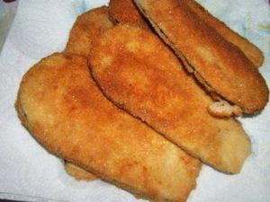
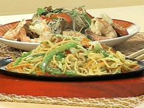
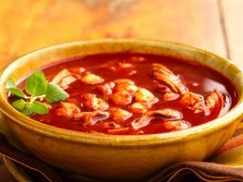
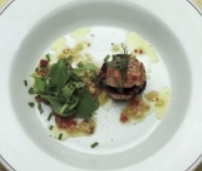
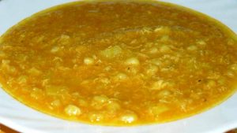
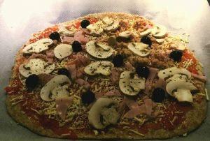
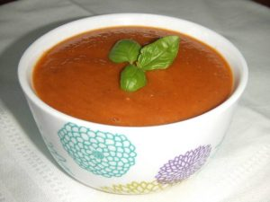

La buena alimentación es imprescindible para prevenir y controlar la diabetes. Pero muchas veces las personas diabéticas creen que estarán condenadas de por vida a tener que comer "sano pero sin buen gusto". En anteriores post he demostrado que esa es una aseveración muy alejada de la realidad pues existen comidas muy ricas que los diabéticos y diabéticas pueden consumir sin problemas. Solo hay que tener algo de cuidado con las raciones de hidrato de carbono y otras previsiones. Con consultar a su médico debe ser suficiente para darle gusto al paladar.

## Comida para Diabeticos #1: Milanesa de berenjenas para diabéticos

A lo mejor estarás pensando que tengo una fijación con las berenjenas pero de hecho ni siquiera me gustaban cuando chico. Luego aprendí a comerlas... guao, definitivamente le da un súper sabor especial a las comidas que las hace únicas. Hay unas especialidades italianas que saben de infarto. Por eso hoy te traje esta deliciosa receta que es muy rápida de preparar y que te hará quedar bien en cualquier ocasión.

_Ingredientes:_

6 berenjenas (piel tersa, no arrugada y sin brillo) Aceite para el sartén 3 dientes ajo Sal - pimienta 1 cucharita de ají molido 2 cdas perejil picado

**Instrucciones**

- Con ayuda de un pela papas, quitas la cáscara de las berenjenas. Primero las cortas a lo largo por el medio, y a cada mitad le haces lo mismo.
- Es decir que cada berenjena te proveerá de 4 lonjas. En un escurridor las acomodas y les vas poniendo un poco de sal gruesa.
- Mientras tanto, en un frasco, le pones aceite a la mitad, los dientes de ajo desmenuzados, la sal, pimienta y ají molido (poco).
- Lavas bien las berenjenas para sacarle la sal, y las secas muy bien con un lienzo seco.
- Tienes que tratar de secar a las berenjenas, porque las vas a freir, y corres el riego de que salte el aceite hirviendo.
- En el sartén, pones aceite para freír, y vas colocando una a una a tus lonjas de berenjena, a las que vas dorando una a una.
- Cuando las retiras, las pones sobre un papel absorbente de cocina. ¿Ya las freíste?.
- Las pones en una bandeja plana y del frasco le vas poniendo el aderezo que preparaste con ayuda de una cucharita.
- Decoras con el perejil picado. Aquí tienes un plato vegetariano y apto para diabéticos.

## Comida para Diabeticos #2: Fideos orientales para diabéticos

Queridos comensales: esta es  una receta muy simple, muy utilizada en la cocina oriental, y que puede ser consumida por las personas diabéticas y además es muy sabrosa. Como bien se puede  apreciar, es vegetariana, así que con mucho más razón es recomendable para la salud en general.

_Ingredientes:_

250 gr fideos de arroz finos 2 zanahorias 3 puerros 2 cebollas de verdeo 1 cebolla blanca 1 morrón 2 dientes ajo 2 zuchini 100 gr brotes de soja 200 gr. champiñones 1 toque jengibre rallado a gusto salsa de soja 2 cdas aceite de oliva sal, pimienta a gusto y perejil

**Instrucciones**

- Lavar bien las verduras y luego cortar en juliana, todas ellas; lavar bien los champiñones, filetearlos y reservar.
- Colocar al fuego una olla con agua, hasta que hierva; colocar un wok al fuego y poner el aceite a calentar y agregar en este orden: zanahorias, puerros, cebollas, ají morrón y ajos.
- Agregar los champiñones, y brotes de soja, para darles una rápida cocción; poner la salsa de soja a gusto y condimentar con sal, pimienta y jengibre.
- Añadir los fideos de arroz que fueron hervidos por 3 minutos y retirados del agua hirviendo con una espumadera; poner los fideos en el wok, y remover.
- Servir agregando perejil picado por arriba.

## Comida para Diabeticos #3: Pozole para diabéticos

Una versión para diabéticos de la popular sopa mexicana "pozole".

Esta receta está sacada (con algunas variaciones) de la Publicación del National Diabetes Education Program (USA)

###  Ingredientes

1. 2 libras carne de res sin grasa cortada en cubitos

2. 1 cda aceite de oliva

3. 1 cebolla grande picada

4. 1 diente ajo finamente picado

5. ¼ cdts sal

6. cdts pimienta

7. ¼ taza cilantro fresco picado

8. 1 lata (15 onzas) tomates en su jugo

9. 2 onzas pasta de tomate

10. 1 lata (1 libra y 13 onzas) de maíz descascarillado

### Instrucciones

1. Calienta el aceite de oliva en una olla grande. Sofríe la carne.

2. Añade la cebolla, el ajo, la sal, el pimentón, el cilantro y suficiente agua para cubrir la carne. Remueve hasta mezclar los ingredientes completamente. Tapa la olla y cocina a fuego lento hasta que la carne se ablande.

3. Añade los tomates y la pasta de tomate

4. Continúa cocinando por unos 20 minutos.

5. Añade el maíz descascarillado y cocina por otros 15 minutos, revolviendo de vez en cuando. Si está muy espeso, añade agua hasta obtener la consistencia deseada.

## Comida para Diabeticos #4: Lomos de lubina al aceite de oliva

INGREDIENTES (4 PERSONAS)

1 lubina de 1,500 kg

2 tomates maduros

100 ml de aceite de oliva

Ajo

Sal.

Limpiar el pescado dejándolo sólo con la piel. Cortar en cuatro trozos o, si se prefiere, en ocho más pequeños. Cocer al vapor justo para que quede jugoso. Escalfar los tomates para quitarles la piel y las pepitas. Batir los tomates con una lámina de ajo y el aceite de oliva y, si se desea, una pizca de sal. Una vez a punto, colocar los lomos en un plato y acompañar con un poco de esta salsa. Aderezar el plato con aceite de oliva, vinagre y sal.

## Comida para Diabeticos #5: Fondo de ave con espárragos y setas

INGREDIENTES (10 PERSONAS)

1/2 gallina de corral

100 g de zanahorias

100 g de apio

50 g de cebolla

100 g de puerros

Laurel

1 manojo de espárragos

250 g de setas de temporada

Sal

Pimienta.

Poner en un recipiente todos los ingredientes, excepto los espárragos y las setas; cubrir con agua y proceder como un caldo tradicional, con una cocción de unas 3 horas aproximadamente. Colar y reservar. De forma simultánea, cocer los espárragos ya desprovistos de la parte dura y, a continuación, proceder de igual forma con las setas. Colocar los espárragos, las setas y la carne de gallina en el centro del plato junto con una hoja de laurel y servir el caldo en soperas.

## Comida para Diabeticos #6: Cocochas y tripas de bacalao con garbanzos

INGREDIENTES (4 PERSONAS)

20 cocochas de bacalao

3 tripas de bacalao

100 g de garbanzos (cocidos)

Caldo de pescado

Ajo

Cebolla

Perejil

Sal.

Limpiar muy bien las tripas cortadas en juliana fina, cortar la cebolla muy fina y pocharlas con un poco de ajo picado en aceite. Guisar las tripas con cebolla; añadir un poco de caldo de pescado y los garbanzos, rectificar de sal. Pochar las cocochas con un poco de aceite y terminar de cocerlas con el potaje de tripas y garbanzos. Colocar las cocochas y los garbanzos un poco “estéticos” para que se vean perfectos.

## Comida para Diabeticos #7: Ensalada templada de verduras, anchoas y boquerones con melón y sandía

INGREDIENTES (4 PERSONAS)

4 rodajas de melón

4 rodajas de sandía,

150 g de lechugas variadas (ollo, escarola verde, berros, hoja de roble…)

8 anchoas en aceite

8 anchoas en escabeche (boquerón)

Aceite de nuez

Vinagre de Módena.

En una sartén con muy poco aceite se marcan el melón y la sandía hasta que cojan temperatura y color. Pasar a un papel absorbente. Lavar y escurrir las verduras, aliñar con el vinagre y el aceite de nuez. Colocar en un plato el melón y la sandía fritos. Sobre ellos la verdura aliñada y cubrir con las anchoas en aceite y en escabeche. Rectificar por último de vinagre y aceite. En todo el aliño no se incorpora sal, ya que la aportan las anchoas. De ahí el contraste entre el dulce de la fruta y el salado de las anchoas.

## Comida para Diabeticos #8: Ensalada de gambas sobre remolacha con berros y maches

INGREDIENTES (4 PERSONAS)

250 g de remolachas cocidas

1 kg de gambas rojas

2 tomates pelados

Canónigos

Berros de jardín

Perifollo en hojas

Sal.

_Para la vinagreta de pimiento_:

1 puerro

1/2 cebolla

1/2 pimiento rojo

2 dl aceite de oliva

2 c.s. vinagre de txacolí

Sal.

Para hacer la vinagreta limpiar y cortar finamente las verduras y mezclarlas con el resto de ingredientes. Pelar las gambas, sazonarlas y saltearlas con un poco de aceite de oliva, dejándolas muy jugosas. Quitar las pepitas a los tomates y cortarlos en dados pequeños. Cortar las remolachas en rodajas. Mezclar en un recipiente los canónigos, el tomate y un poco de vinagreta. En una fuente colocar rodajas de remolacha, encima las gambas y en el centro los canónigos aliñados, repartir encima de las gambas un poco de vinagreta, unas hojas de perifollo, unos berros de jardín y servirlo.

## Comida para Diabeticos #9: Caldo Millo

INGREDIENTES (4 PERSONAS)

1 cebolla mediana bien picadita

2 dientes de ajo bien picaditos

2 tomates maduros sin piel ni pepitas troceados finamente

2 piñas de millo (mazorcas) frescas y tiernas cortadas en cuatro trozos

250 g de granos de maíz fresco muy tierno o en conserva

300 g de calabacines

300 g de papas medianas peladas

800 cl de agua

Cilantro

Aceite de oliva

Sal marina gruesa.

Existen dos formas de elaborar este plato: preparar directamente todo en crudo, o proceder primero a la elaboración de un sofrito. Para el sofrito: en una cazuela disponer, junto al aceite, la cebolla y los tomates a fuego muy lento hasta que queden “bobitos”, muy tiernos, casi deshechos. Pasar el sofrito a un caldero y añadir el agua hirviendo; incorporar las papas cortadas hasta la mitad, separando luego los trozos con las manos, para que durante el guiso suelten algo de su almidón. Seguidamente añadir la piña de millo (mazorca) y el maíz en grano. Pasados 8 minutos, agregar los calabacines cortados en trozos no muy grandes. Después de 12 minutos más, añadir el cilantro y un par de cucharadas de aceite de oliva. Sazonar y esperar unos 5 minutos. Servir cada plato con su correspondiente trozo de piña de millo.

## Comida para Diabeticos #10: Filete de ternera con espárragos para diabéticos

Aprovechando la temporalidad de las verduras he traído una cena super ligera y muy sana con espárragos. En este momento los espárragos son más baratos, están más buenos y el contenido en nutrientes es el perfecto, conviertiéndolo en un plato totalmente apto para diabéticos.

###### Ingredientes

1. 125 grFilete de ternera

2. 150 grEspárragos verdes

3. 10 mlAceite de oliva

4. Sal

###### Instrucciones

- Cocinamos los espárragos al horno a máxima temperatura con media cucharadita de aceite de oliva (5ml) y sal al gusto.
- Mientras se hacen los espárragos, que tardarán unos 10 minutos, hacemos el filete a la plancha.
- Servimos todo en el mismo plato y adicionamos la media cucharadita de aceite que nos queda en crudo por encima del filete.

## Comida para Diabeticos #11: Pizza para diabéticos

Aquí traigo otra pizza la cual siempre la catalogan como uno de esos "alimentos prohibidos" para las personas diabéticas. Pero no contaban que en este blog ya hemos traído 2 pizzas para nada prohibidas que puede disfrutar la familia completa. Solo toma ciertas precauciones y consulta con tu médico cuando hagas algunos cambios en tu dieta.

###### Ingredientes

1. 500 gHarina integral y un poco mas para amasar

2. 350 mlAgua

3. 2 Cucharas soperasAceite virgen extra y un poco mas para untar

4. 1 Cucharitalevadura

5. 3Tomates

6. Champiñones

7. Aceitunas

8. Pechuga de pavo en tacos o en lonchas

9. Orégano

10. Queso rallado bajo en calorias

######  Instrucciones

- Ponemos en un recipiente la harina y le damos la forma de un volcán.
- Cogemos otro recipiente y añadimos el agua y la levadura , 5 minutos.
- En el interior del Volcan añadimos el aceite y la mezcla de levadura con agua.
- Amasamos, la masa absorbera el agua y se volvera elastica.
- Cuando introduzcamos los dedos y salgan limpios retiramos la masa.
- En una superficie ponemos arina y procemos a amasar de fuera hacia dentro unos 5 minutos .
- Hacemos una bola homogenea con la masa y con una brocha la untamos ligeramente con aceite , ponemos en un plato ondo y cubrimos con un trapo 30 minutos.
- Ya tenemos la masa lista ahora es el momento de tomar la decision de dividir la masa para congelar o no, de esta manera tendriamos dos pizza para dos comensales por cada una.
- Es el momento de dar forma , se coge una masa , se espolvorea arina sobre una superficie y comenzamos a estirar de dentro hacia fuera .
- Rallamos el Tomate y lo escurrimos para quitar el agua .
- Ponemos nuestra base de Tomate y el resto de ingredientes.
- Precalentar el Horno y en 15 minutos a disfrutar de una Pizza muy saludable.

## Comida para Diabetico #12: Salsa de tomates para diabéticos

Esta salsa de tomate casera la preparé para conservarla ya que lleva tiempo cocinarla y si la envasamos adecuadamente y la refrigemos en la nevera, siempre que se necesite salsa de tomate solo tendrás que sacarla y listo. Es una excelente estrategia para ahorrar dinero y tiempo.

Esta salsa es apta para diabéticos porque no tiene azúcar, sino que se usa estevia, y una larga cocción, para quitarle acidez. También puedes usar otro edulcurante apto para diabéticos.

_Ingredientes:_

2 kgs tomates maduros 2 cebollas grandes 1 pimiento rojo grande 1 nabo 4 dientes ajo en láminas y sin el centro unas hojas albahaca 1 ramito perejil 3 sobres estevia 1 vasito vino tinto 1 cda [canela](/canela-glucosa-alta/) molida sal y pimienta 1 cda orégano seco 1 cdts mejorana 1 chorrito aceite de oliva virgen

**Instrucciones**

- Pelar y trocear los tomates. Cortar la cebolla, el pimiento y el nabo.
- En una sartén grande o cacerola poner un chorrito de aceite de oliva. Rehogar la cebolla y los ajos durante 3´. Agregar el pimiento y dejar 3´ más. Añadir el nabo, el tomate, las hierbas y las especias.
- Echar el vino y dejar un par de minutos a fuego fuerte. Bajar el fuego, espolvorear con la estevia, tapar y dejar cocer alrededor de 2 horas. Si fuese necesario se le agregará agua o, mejor, caldo casero.
- Una vez frío triturar y envasar en frascos.
- Etiquetar y congelar.
