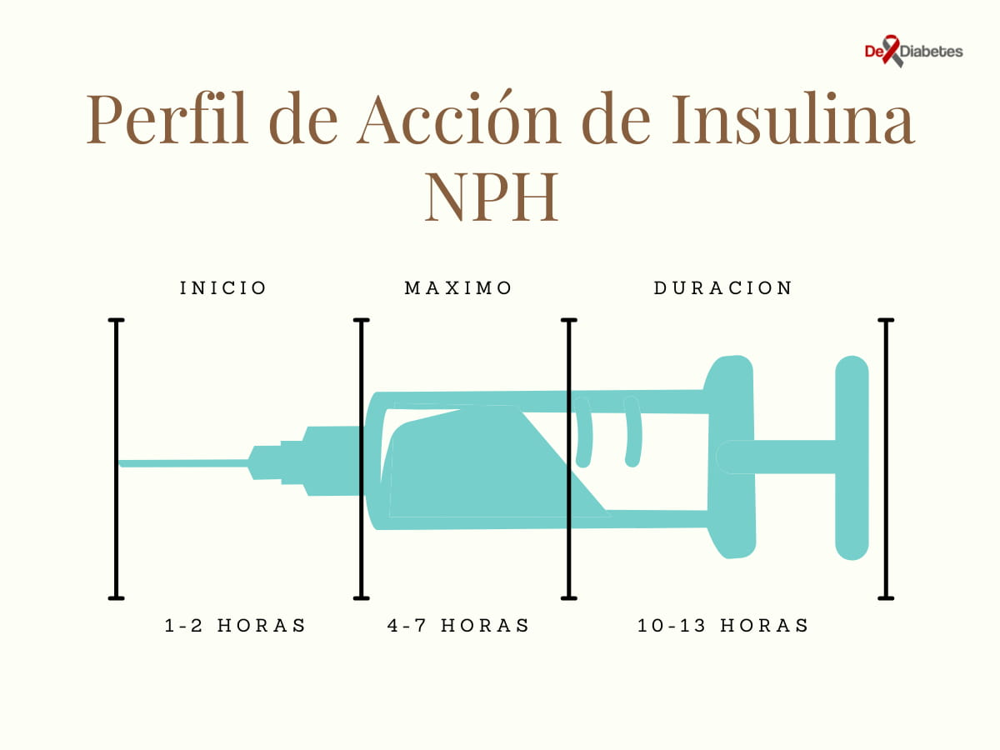

En general, la insulina y los análogos de insulina humana como la insulina NPH se utilizan en el tratamiento de la diabetes, principalmente en el tratamiento con insulina de pacientes con diabetes mellitus tipo 1. Sin embargo, los pacientes con diabetes tipo 2, en los cuales ha mermado la producción interna de insulina por parte del páncreas o que tengan complicaciones crónicas, son también candidatos a la terapia de insulina.

Las insulinas se clasifican según, la rapidez con que empiezan a actuar luego de su inyección, el máximo efecto de la insulina  y el tiempo que acción. Así, existen insulinas de acción rápida, inyecciones de insulina de acción intermedia e insulinas de acción prolongada (acción lenta).  

Dentro de la insulina de acción intermedia, se encuentra la insulina NPH (Protamina Neutra Hagedorn). Es la insulina humana aislada a la cual se le ha añadido una proteína (protamina) para que su absorción sea más lenta.

La insulina NPH es una insulina neutra, de aspecto turbio, que debe agitarse suavemente antes de inyectarse. Este tipo de insulina se usa para controlar el azúcar entre las comidas y satisfacer los requerimientos de insulina del paciente diabético durante la noche.

## **Tiempos de acción de la insulina NPH**

- Tipo de Acción: NPH (acción intermedia)
- Inicio de Acción: 1-2 horas
- Pico de Acción: 4-7 horasa
- Duracción maxima de acción: 10-13 horas

## **Formas de presentación de la insulina NPH**

- **NPH sola**: Es la insulina humana NPH sin adición de otros compuestos. Se encuentran con el nombre comercial de Humulin® N o Novolin® N.
- **NPH premezcla (insulinas premezcladas)**: es una combinación previamente realizada por el laboratorio que distribuye, de insulina NPH con insulina regular (simple o cristalina). Esta combinación funciona ya que prácticamente no existe interferencia entre estos dos tipos de insulinas. Esta presentación de premezcla comenzará a actuar en los primeros 30 minutos y permanecerá activa entre 16 y 24 horas. Existen varios preparados con diferentes proporciones en las mezclas respectivas, entre ellas se encuentran con su nombre comercial:

    - Eli Lilly: Humulin® 50/50 y 70/30 (Eli Lilly)
    - Novo Nordisk: Mextard® 70/30 y Novolin® 70/30

- Los análogos de insulina no se suelen mezclar debido a posibles interferencias.

## ¿Pueden las mujeres embarazadas usar Insulina NPH?

Se recomienda el uso de insulina NPH que es de efectividad y seguridad comprobada por décadas, y realizar los ajustes y correcciones de la dosis de insulina de acuerdo a los resultados del automonitoreo de la glicemia.

La insulina NPH tiene una categoría B de embarazo. Para estas insulinas, la FDA ha recibido suficientes datos en humanos que permiten se consideren de bajo riesgo durante el embarazo.[^1]

## ¿Cómo se realiza la administración de insulina NPH?

- La vía de administración de la insulina NPH es por inyección vía subcutánea. No administre por vía intravenosa ni intramuscular.
- Siéntese o colóquese de pie en forma relajada.
- Escoja la zona donde va a inyectarse la insulina (cara lateral de los muslos o cara anterior y baja del abdomen)
- Limpie con alcohol la zona donde se va a inyectar la insulina.
- Agite ligeramente la cantidad de insulina NPH a suministrar, esta insulina tiene un aspecto turbio o lechoso por los cristales de insulina que se sedimentan en el cartucho. Es por esto que es importante mover el cartucho para resuspender la insulina.
- La insulina NPH es muy variable en su actividad de un día a otro, de ahí que sea muy importante moverla durante unos minutos antes de inyectarse.
- La insulina de isophane (NPH) solo se debe usar si está uniformemente nublada después de mezclar. No utilice inyecciones que estén inusualmente descoloridas.
- Proceda a inyectarse, introduzca la aguja a nivel subcutáneo para mejorar la absorción de la insulina.
- Las personas que usan los viales de insulina nunca deben compartir agujas o jeringas con otra persona.  

## ¿Cuál es la dosis de insulina NPH para el tratamiento de la cetoacidosis diabética?

Si el paciente utilizó anteriormente insulina de Protamina Neutra Hagedorn (NPH), comience de nuevo con la dosis habitual solo cuando el paciente coma bien y pueda retener las comidas sin vomitar; de lo contrario, la dosis debe reducirse para evitar la hipoglucemia durante su período de máxima eficacia.[^2]

## ¿Qué hacer después de una dosis de insulina NPH?

- Si la insulina es premezcla, se debe esperar 15-20 min para realizar la comida, para garantizar cubrir el inicio de acción de la insulina.
- Transcurrido 2 horas después de haberse colocado la inyección debe hacerse una merienda, a fin de proporcionar glucosa al organismo, coincidiendo ésta con el pico de acción de la insulina.

## ¿Qué hacer cuando accidentalmente sufre una sobredosis de insulina NPH?
Si accidentalmente toma una sobredosis de insulina NPH, busque atención médica de inmediato.

Si no está seguro, a continuación se incluye una lista de los síntomas principales. Si padeces alguno de estos síntomas consulte a un médico lo antes posible. Incluso si no ha sufrido una sobredosis, es mejor estar seguro:

- Visión borrosa
- Confusión
- Somnolencia
- Problemas para hablar
- Debilidad muscular
- Movimientos torpes o espasmódicos
- Convulsiones (convulsiones)
- Pérdida de consciencia
- Transpiración
- Inestabilidad
- Latidos cardíacos acelerados
- Respiración dificultosa

## **Meriendas en insulinoterapia con NPH**

- **Merienda matutina y vespertina:** Una ración de fruta, un paquete de galleta tipo cracker, dos tazas de cotufas o palomitas de maíz, chips de vegetales.
- **Merienda nocturna:** Un vaso de leche o [yogurt](/yogur-griego-en-la-dieta-diabetica/) descremado, una galleta tipo soda con queso blanco, 1 muffin inglés (panecillo inglés), una rebanada de pan integral con 1 cucharada de mantequilla de maní o almendras.

## **Recomendaciones sobre almacenamiento de insulina**

- Se debe almacenar en un lugar frío, de preferencia en un refrigerador, pero nunca en el congelador.
- Si la refrigeración es imposible, el frasco que se esté utilizando puede mantenerse sin refrigeración, por un máximo de 28 días, siempre y cuando se conserve en un lugar lo más fresco posible y alejado del calor y la luz.
- No se debe utilizar después de la fecha de caducidad que figura en la etiqueta.

## Referencias

[^1]: [Insulin Use in Pregnancy: An Update](https://www.ncbi.nlm.nih.gov/pmc/articles/PMC4865394/). Revisado el 28 de Septiembre de 2021.
[^2]: [What is the insulin dose for treatment of diabetic ketoacidosis (DKA) in established diabetes?](https://www.medscape.com/answers/118361-11147/what-is-the-insulin-dose-for-treatment-of-diabetic-ketoacidosis-dka-in-established-diabetes)