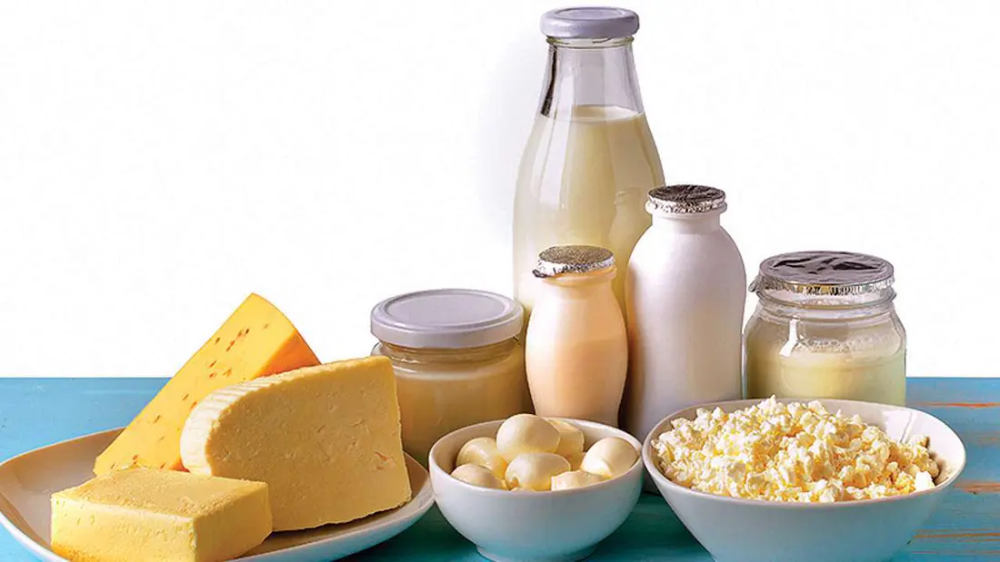

Hay buenas razones para eliminar los productos lácteos de una dieta diseñada para vencer a la diabetes tipo 2. Los productos lácteos  proporcionan  una gran cantidad de grasa,  colesterol, azúcar y caseína, la proteína animal, todos los cuales se necesita reducir al mínimo si en realidad deseas vencer la diabetes. Veamos como influyen los **Productos Lácteos, Diabetes Y Grasa** en relación a la diabetes.

#### **Grasa**

Todos los productos lácteos como la leche, nata, [yogur](/yogur-griego-en-la-dieta-diabetica/), queso, mantequilla y así sucesivamente, se hacen de la leche y la mayoría de ellos son altos en grasa.

La leche es principalmente agua. Esto hace que la medición de la cantidad de grasa (u otros ingredientes) en la leche no tenga sentido. Los nutricionistas prefieren medir la grasa en líquidos mediante la medición de las calorías que se obtiene de la grasa como porcentaje del total de calorías que se obtiene de un alimento en particular, como la leche.

Las calorías que se obtienen de la grasa en la leche de vaca son: leche entera alrededor del 49%, leche reducida (2%), alrededor del 35% y baja en grasa (1%), aproximadamente el 20% de calorías de grasa.

Para la leche desnatada, por supuesto,  debes conseguir cero calorías que se deriven de la grasa. Pero, de hecho, es imposible hacer que la leche sea totalmente libre de grasa y recibes a razón de menos del 5% de calorías de grasa con la gleche descremada.

El porcentaje de calorías que provienen de la grasa no se ve afectada por el contenido de agua de la leche. Como se puede ver, incluso la leche baja en grasa contiene aún una gran cantidad de grasa.

Muchos otros productos lácteos están cargados de grasa. Si comes yogur, alrededor del 47% de las calorías provienen de la grasa. Con el queso, hasta el 70% de las calorías provienen de la grasa, dependiendo del tipo de queso. En cuanto a la crema agria, casi el 90% de las calorías provienen de la grasa (¡87% para la versión reducida en grasa!)

La mantequilla es apenas mejor. La mantequilla comercial se compone de hasta 82% de grasa, 16% o menos de agua, y hasta 2% de la cuajada, es decir, los sólidos lácteos no grasos. Esta mantequilla también puede contener sal de hasta el 2%, otro punto negativo si tienes problemas de presión arterial (que es dos veces más común en los diabéticos que en los no diabéticos).

Si eres diabético, el mejor plan es renunciar a todos los productos lácteos, ya que, con la excepción de la leche descremada o de otros productos lácteos a partir del cual la grasa se ha eliminado, los productos alimenticios a base de leche bloquean los receptores en las células musculares, la causa más probable de la diabetes tipo 2.
