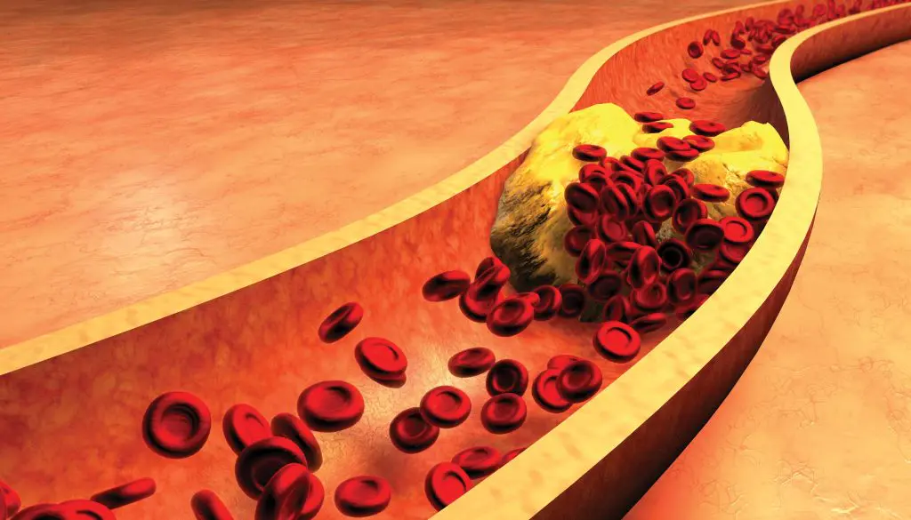

import { Hiper1 } from '../../../constants/Tables/hiperlipidemia.js'

Con un nombre tan complicado como Hiperlipidemia, es difícil entender de que se trata: no es nada más que una manera sofisticada de decir que tienes muchos lípidos (ácidos grasos) en la sangre.

Esta condición puede presentar un número diverso de síntomas, pero para la mayoría de las personas se expresa en **colesterol alto** y **niveles altos de triglicéridos**.  Nuestro cuerpo usa una cierta cantidad de colesterol diariamente pero a veces el proceso deja de funcionar, puede ser por genética o debido a tu dieta. Niveles altos de colesterol bueno (HDL) está asociado con un menor riesgo de enfermedades del corazón o de un ataque al corazon. HDL ayuda eliminando el colesterol de las arterias, lo que reduce la acumulación de placa. El colesterol malo (LDL), a diferencia del HDL, puede causar bloqueos si tienes niveles muy elevados; creando **problemas graves en tu [sistema cardiovascular](/diabetes-y-los-problemas-coronarios/)**.

## Como Tratar la Hiperlipidemia?

Si eres diagnosticado con hiperlipidemia, tu salud en general y tu nivel de riesgo debe ser estudiado con tu médico para desarrollar el mejor tratamiento. Tomando mejores decisiones al comer e incrementando la actividad física son los primeros pasos que te van ha ayudar a reducir los niveles altos de colesterol. Dependiendo de tu riesgo en general, tu doctor puede recetar medicamentos en conjunto con una plan de dieta y actividad física.

Consultar con tu médico es importante debido a que cada condición tiene mecanismos particulares de funcionamiento. Por ejemplo, si tienes triglicéridos altos, tomar alcohol puede ser particularmente peligroso. Pero para aquellos con colesterol alto, el tomar ciertas bebidas alcohólicas acompañadas de un plan de comida saludable y ejercicios puede ser beneficioso.

## Se puede revertir la Hiperlipidemia?

En muchos casos, puedes mejorar a través de comidas saludables y ejercicio regular. Sigue estos consejos para manejar tu riesgo de colesterol alto:

- Acostumbrate a leer las etiquetas de la comida que compras y escoge alimentos que sean bajos en colesterol y grasas saturadas. Para aquellos que quieren bajar su colesterol, la American Heart Association recomienda que limites tu consumo diario de grasas saturadas a 5 o 6 por ciento de la dosis calórica diaria, debes evitar las grasas “trans”.
- Limita tu consumo de carnes rojas y de [productos lácteos](/productos-lacteos-diabetes-grasa/) de leche completa, esto te ayudará a reducir las grasas saturadas y las grasas trans en tu dieta. Escoge leche y productos lácteos descremados o bajos en grasas.
- Incrementa el [consumo de fibra](/cuales-son-los-carbohidratos-buenos-para-los-diabeticos/): una dieta rica en fibra puede ayudarte a bajar el colesterol hasta 10 por ciento.
- Aprende sobre los principios de una [alimentación saludable para el corazón](/12-consejos-para-una-alimentacion-saludable-para-el-corazon/)
- Tienes familiares que sufren de colesterol alto? Puede ser que seas más propenso a sufrir de colesterol alto. La genética puede ser un factor en tu situación particular. Si ese es el caso, toma control de la situación con una dieta sana y ejercicio regular.
- Pierde peso: bajar 10 por ciento tu peso puede tener un impacto importante en reducir tu riesgo o revertir hiperlipidemia
- Ciertos medicamentos naturales pueden ser muy efectivos en ayudar con síntomas de hiperlipidemia.

## Top 3 Medicamentos para la Hiperlipidemia

Basado en la página técnica en salud [WebMD](https://www.webmd.com/)  los 3 medicamentos que pueden ayudar con las dos condiciones mas comunes de hiperlipidemia (altos niveles de colesterol y de trigliceridos) son:

<Hiper1 />

## Riesgo para alguien con Diabetes Tipo 2

Altos niveles de colesterol son peligroso para todo el mundo, pero particularmente peligrosos para una persona con [diabetes tipo 2](/diabetes-tipo-2/).

Ya sabes que la diabetes genera una serie de complicaciones adicionales si no te cuidas tus [niveles de glucosa](/cuanto-es-el-nivel-normal-de-glucosa/) en la sangre. [Complicaciones cardiovasculares](/diabetes-y-los-problemas-coronarios/) son comunes en aquellos con diabetes tipo 2, y el colesterol alto puede hacerle daño a tu sistema cardiovascular.
