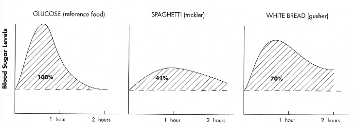

Esta es una de las preguntas más frecuentes que nos realizan a través de la web, y es normal que muchas personas se pregunten esto debido a que existe la creencia de que la pasta es un alimento dañino, que puede hacerte engordar, o bien, darte unos buenos kilos de más.

Para empezar a dar respuesta a esta pregunta, iniciamos recordándote que la persona con diabetes puede comer los mismos alimentos que una persona sin ella, la diferencia radica que en la diabetes se debe de controlar dos aspectos fundamentales:

La **Calidad** del alimento y su **Cantidad**. Debido a que no es igual que consumas una taza de pasta a un plato entero de pasta (Cantidad), así como es diferente una porción de lasaña, con más grasa y carbohidratos que una ración de pasta al pesto (Calidad).

## **La pasta y la glicemia.**

A las personas con diabetes les preocupa que al consumir pasta su azúcar en sangre (glicemia) se eleve a valores muy altos, que sean difíciles de retornar a la normalidad. Pero, aunque no lo crean, la pasta sube menos la glicemia que el arroz ¡Si! Así es. Esto se ha evidenciado gracias a la experimentación científica que se encarga de determinar el índice glicémico, el cual representa el porcentaje de aumento de la glicemia con respecto a un alimento de referencia como la glucosa. En la gráfica pueden ver como la curva glicémica para la pasta es menor que la del pan blanco.

## **La pasta y la obesidad**

Como si fuera poco, a inicios de Julio del 2016 la [revista científica Nutrition & Diabetes](https://www.nature.com/articles/nutd201620) del grupo editorial \_Nature\_, publicó un estudio en el que evaluaron a 23.366 sujetos mediterráneos y encontraron una asociación negativa entre el consumo de pasta y la obesidad medida por índice de masa corporal (IMC o peso con relación a la estatura) y además con las medidas de relación entre la circunferencia de cintura y cadera. Lo cual quiere decir que más bien el consumo de pasta se asocia con IMC saludable, una menor circunferencia de cintura y una mejor relación cintura-cadera. Esto refuerza el mensaje de que la dieta mediterránea constituye un muy buen patrón a seguir y que además, la pasta como un alimento que forma parte de la base de esta dieta, es una alternativa para los planes de pérdida de peso, siempre y cuando se consuma de forma regular en una cantidad adecuada.

Pero y entonces **¿Cuál es el secreto para poder comer pasta y que no se me eleven los niveles de azúcar en sangre, ni engorde?** Muy sencillo, cuida la relación calidad y cantidad:

- Primero la **cantidad**, consumiendo una taza o porción de pasta al día.
- Segundo la **calidad**, cocinando la pasta hasta el punto que los italianos llaman “_al dente_”, ya que mientras mayor sea el tiempo de cocción, más disponible estarán [los carbohidratos](/que-son-carbohidratos/) del almidón. Mientras que “_al dente_” evitamos que se absorban rápidamente los carbohidratos y nos mantenemos más saludables.
- Es mejor si acompañas tu pasta con vegetales frescos o salsas naturales a base de tomate, cebolla, ajo y aceite de oliva virgen, puedes hacer igualmente una salsa pesto, o cualquier otra combinación de vegetales. Evita a toda costa agregarle salsas procesadas ya que contienen mucho sodio, así como salsas grasosas o mucha cantidad de aceite.

Así que ya sabes, si tienes diabetes ¡claro que puedes comer pasta!, pero eso sí, no olvides las reglas de calidad y cantidad para asegurarte de consumir la ración que debes y mantenerte fuerte, saludable y con energía.
