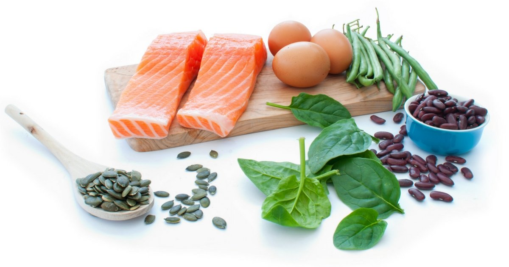

El indice insulinico es más amplio que el índice glucémico. El índice glucémico sólo muestra el efecto de [los carbohidratos](/que-son-carbohidratos/) en el azúcar en la sangre mientras que el indice insulinico tiene en cuenta no sólo los hidratos de carbono, sino el efecto del alimento en los niveles de insulina en la sangre.

## Indice Insulinico y el Indice Glucemico

Los estudios sobre el indice insulinico de los alimentos es limitado en comparación con los estudios sobre el indice glucemico. En un estudio en el American Journal of Clinical Nutrition se evaluaron sólo 38 alimentos y encontraron que las puntuaciones de glucemia e insulina están altamente correlacionados. El descubrimiento más interesante fue que "los alimentos ricos en proteínas y productos de panadería (ricos en grasas y carbohidratos refinados) provocaron respuestas de insulina que eran desproporcionadamente mayores que en sus respuestas glucémicas."

Si bien es claro que la demanda de insulina ejercida por los alimentos es importante para la salud a largo plazo, esto no necesariamente implica que necesitamos un índice de insulina de alimentos en lugar de un índice glucémico. Cuando ambos se han probado en conjunto, el índice glucémico es un buen indicador del indice insulinico de la comida. En otras palabras, un [alimento de bajo IG](/listado-de-alimentos-con-bajo-indice-glucemico/) tiene un valor bajo de índice insulinico y un [alimento de alto IG](/listado-de-alimentos-con-alto-indice-glucemico/) tiene un valor alto de índice insulinico.

Además, hay que tener en cuento que el nivel de glucosa en la sangre está directamente relacionado con reacciones adversas tales como la glicosilación de proteínas (vínculos entre la glucosa y proteína) y moléculas oxidativas.

Sin embargo, hay algunos casos en que el alimento tiene un valor glucémico bajo, pero un valor de índice alto de insulina. Esto se aplica a los productos lácteos y algunos alimentos muy agradables al paladar de alto contenido energético ("alimentos de indulgencia"). Algunos alimentos (tales como carne, pescado y huevos) que no contienen hidratos de carbono, solo proteínas y grasas (y esencialmente tienen un valor cero de IG), estimulan aumentos significativos en la insulina en la sangre.

En la actualidad, no sabemos cómo interpretar este tipo de respuesta (baja glucemia, insulina alta) para la salud a largo plazo. Puede ser un buen resultado debido a que el aumento de la insulina ha contribuido al bajo nivel de glucemia. Por otro lado, puede ser no tan bueno, porque el aumento de la demanda de insulina contribuye al "agotamiento" de las células beta  y el desarrollo de la [diabetes tipo 2](/diabetes-tipo-2/). Hasta que estudios se lleven a cabo para responder a este tipo de preguntas, el índice glucémico sigue siendo una herramienta probada para predecir los efectos de los alimentos sobre la salud.

La siguiente tabla muestra la comparación de las puntuaciones de la glucemia y el indice insulinico en estos 38 alimentos. Tenga en cuenta que los resultados de glucemia están presentados asumiendo que el valor glucémico del pan blanco es igual a 100, aunque es común usar como referencia para el índice glucémico un valor de glucosa igual a 100.

Sobre todo, tenga en cuenta que los resultados del puntaje de glucemia se diferencian de otras formas de índice glucémico: los valores de índice glucémico se basa en porciones de 50 gramos de carbohidratos de alimentos y los puntajes de glucemia están basados en porciones de 1000 kJ de alimentos", explica el autor principal del estudio, la Dra. Susanna Hol.

<table>
  <tbody>
    <tr>
      <th>
        <strong>Alimento</strong>
      </th>
      <th>
        <strong>Tipo de Alimento</strong>
      </th>
      <th>
        <strong>Indice Glucémico</strong>
      </th>
      <th>
        <strong>Indice Insulinico</strong>
      </th>
    </tr>
    <tr style="height: 24px;">
      <td style="width: 208px; height: 24px;">All-Bran</td>
      <td style="width: 273px; height: 24px;">Cereales desayuno</td>
      <td style="width: 167.688px; height: 24px;">40 ± 7</td>
      <td style="width: 181.313px; height: 24px;">32 ± 4</td>
    </tr>
    <tr style="height: 24.3011px;">
      <td style="width: 208px; height: 24.3011px;">Porridge</td>
      <td style="width: 273px; height: 24.3011px;">Cereales desayuno</td>
      <td style="width: 167.688px; height: 24.3011px;">60 ± 12</td>
      <td style="width: 181.313px; height: 24.3011px;">40 ± 4</td>
    </tr>
    <tr style="height: 24px;">
      <td style="width: 208px; height: 24px;">Muesli</td>
      <td style="width: 273px; height: 24px;">Cereales desayuno</td>
      <td style="width: 167.688px; height: 24px;">43 ± 7</td>
      <td style="width: 181.313px; height: 24px;">46 ± 5</td>
    </tr>
    <tr style="height: 24px;">
      <td style="width: 208px; height: 24px;">Special K</td>
      <td style="width: 273px; height: 24px;">Cereales desayuno</td>
      <td style="width: 167.688px; height: 24px;">70 ± 9</td>
      <td style="width: 181.313px; height: 24px;">66 ± 5</td>
    </tr>
    <tr style="height: 24px;">
      <td style="width: 208px; height: 24px;">Smacks con miel</td>
      <td style="width: 273px; height: 24px;">Cereales desayuno</td>
      <td style="width: 167.688px; height: 24px;">60 ± 7</td>
      <td style="width: 181.313px; height: 24px;">67 ± 6</td>
    </tr>
    <tr style="height: 24px;">
      <td style="width: 208px; height: 24px;">Sustain</td>
      <td style="width: 273px; height: 24px;">Cereales desayuno</td>
      <td style="width: 167.688px; height: 24px;">66 ± 6</td>
      <td style="width: 181.313px; height: 24px;">71 ± 6</td>
    </tr>
    <tr style="height: 24px;">
      <td style="width: 208px; height: 24px;">Cornflakes</td>
      <td style="width: 273px; height: 24px;">Cereales desayuno</td>
      <td style="width: 167.688px; height: 24px;">76 ± 11</td>
      <td style="width: 181.313px; height: 24px;">75 ± 8</td>
    </tr>
    <tr style="height: 24px;">
      <td style="width: 208px; height: 24px;">
        <strong>Media de:</strong>
      </td>
      <td style="width: 273px; height: 24px;">
        <strong>Cereales desayuno</strong>
      </td>
      <td style="width: 167.688px; height: 24px;">
        <strong>59 ± 3</strong>
      </td>
      <td style="width: 181.313px; height: 24px;">
        <strong>57 ± 3</strong>
      </td>
    </tr>
    <tr style="height: 24px;">
      <td style="width: 208px; height: 24px;"></td>
      <td style="width: 273px; height: 24px;"></td>
      <td style="width: 167.688px; height: 24px;"></td>
      <td style="width: 181.313px; height: 24px;"></td>
    </tr>
    <tr style="height: 24px;">
      <td style="width: 208px; height: 24px;">Pan blanco (referencia)</td>
      <td style="width: 273px; height: 24px;">Ricos en carbohidratos</td>
      <td style="width: 167.688px; height: 24px;">100 ± 0</td>
      <td style="width: 181.313px; height: 24px;">100 ± 0</td>
    </tr>
    <tr style="height: 24px;">
      <td style="width: 208px; height: 24px;">Pasta blanca</td>
      <td style="width: 273px; height: 24px;">Ricos en carbohidratos</td>
      <td style="width: 167.688px; height: 24px;">46 ± 10</td>
      <td style="width: 181.313px; height: 24px;">40 ± 5</td>
    </tr>
    <tr style="height: 24px;">
      <td style="width: 208px; height: 24px;">Pasta integral</td>
      <td style="width: 273px; height: 24px;">Ricos en carbohidratos</td>
      <td style="width: 167.688px; height: 24px;">68 ± 10</td>
      <td style="width: 181.313px; height: 24px;">40 ± 5</td>
    </tr>
    <tr style="height: 24px;">
      <td style="width: 208px; height: 24px;">Pan con centeno</td>
      <td style="width: 273px; height: 24px;">Ricos en carbohidratos</td>
      <td style="width: 167.688px; height: 24px;">60 ± 12</td>
      <td style="width: 181.313px; height: 24px;">56 ± 6</td>
    </tr>
    <tr style="height: 24px;">
      <td style="width: 208px; height: 24px;">Arroz integral</td>
      <td style="width: 273px; height: 24px;">Ricos en carbohidratos</td>
      <td style="width: 167.688px; height: 24px;">104 ± 18</td>
      <td style="width: 181.313px; height: 24px;">62 ± 11</td>
    </tr>
    <tr style="height: 24px;">
      <td style="width: 208px; height: 24px;">Patatas fritas</td>
      <td style="width: 273px; height: 24px;">Ricos en carbohidratos</td>
      <td style="width: 167.688px; height: 24px;">71 ± 16</td>
      <td style="width: 181.313px; height: 24px;">74 ± 12</td>
    </tr>
    <tr style="height: 24px;">
      <td style="width: 208px; height: 24px;">Arroz blanco</td>
      <td style="width: 273px; height: 24px;">Ricos en carbohidratos</td>
      <td style="width: 167.688px; height: 24px;">110 ± 15</td>
      <td style="width: 181.313px; height: 24px;">79 ± 12</td>
    </tr>
    <tr style="height: 24px;">
      <td style="width: 208px; height: 24px;">Pan integral</td>
      <td style="width: 273px; height: 24px;">Ricos en carbohidratos</td>
      <td style="width: 167.688px; height: 24px;">97 ± 17</td>
      <td style="width: 181.313px; height: 24px;">96 ± 12</td>
    </tr>
    <tr style="height: 24px;">
      <td style="width: 208px; height: 24px;">Patatas</td>
      <td style="width: 273px; height: 24px;">Ricos en carbohidratos</td>
      <td style="width: 167.688px; height: 24px;">141 ± 35</td>
      <td style="width: 181.313px; height: 24px;">121 ± 11</td>
    </tr>
    <tr style="height: 24px;">
      <td style="width: 208px; height: 24px;">
        <strong>Media de:</strong>
      </td>
      <td style="width: 273px; height: 24px;">
        <strong>Ricos en carbohidratos</strong>
      </td>
      <td style="width: 167.688px; height: 24px;">
        <strong>88 ± 6</strong>
      </td>
      <td style="width: 181.313px; height: 24px;">
        <strong>74 ± 8</strong>
      </td>
    </tr>
    <tr style="height: 24px;">
      <td style="width: 208px; height: 24px;"></td>
      <td style="width: 273px; height: 24px;"></td>
      <td style="width: 167.688px; height: 24px;"></td>
      <td style="width: 181.313px; height: 24px;"></td>
    </tr>
    <tr style="height: 24px;">
      <td style="width: 208px; height: 24px;">Huevos</td>
      <td style="width: 273px; height: 24px;">Ricos en proteínas</td>
      <td style="width: 167.688px; height: 24px;">42 ± 16</td>
      <td style="width: 181.313px; height: 24px;">31 ± 6</td>
    </tr>
    <tr style="height: 24px;">
      <td style="width: 208px; height: 24px;">Queso</td>
      <td style="width: 273px; height: 24px;">Ricos en proteínas</td>
      <td style="width: 167.688px; height: 24px;">55 ± 18</td>
      <td style="width: 181.313px; height: 24px;">45 ± 13</td>
    </tr>
    <tr style="height: 24px;">
      <td style="width: 208px; height: 24px;">Ternera</td>
      <td style="width: 273px; height: 24px;">Ricos en proteínas</td>
      <td style="width: 167.688px; height: 24px;">21 ± 8</td>
      <td style="width: 181.313px; height: 24px;">51 ± 16</td>
    </tr>
    <tr style="height: 24px;">
      <td style="width: 208px; height: 24px;">Lentejas</td>
      <td style="width: 273px; height: 24px;">Ricos en proteínas</td>
      <td style="width: 167.688px; height: 24px;">62 ± 22</td>
      <td style="width: 181.313px; height: 24px;">58 ± 12</td>
    </tr>
    <tr style="height: 24px;">
      <td style="width: 208px; height: 24px;">Pescado</td>
      <td style="width: 273px; height: 24px;">Ricos en proteínas</td>
      <td style="width: 167.688px; height: 24px;">28 ± 13</td>
      <td style="width: 181.313px; height: 24px;">59 ± 18</td>
    </tr>
    <tr style="height: 24px;">
      <td style="width: 208px; height: 24px;">Judías blancas</td>
      <td style="width: 273px; height: 24px;">Ricos en proteínas</td>
      <td style="width: 167.688px; height: 24px;">114 ± 18</td>
      <td style="width: 181.313px; height: 24px;">120 ± 19</td>
    </tr>
    <tr style="height: 24px;">
      <td style="width: 208px; height: 24px;">
        <strong>Media de:</strong>
      </td>
      <td style="width: 273px; height: 24px;">
        <strong>Ricos en proteínas</strong>
      </td>
      <td style="width: 167.688px; height: 24px;">
        <strong>54 ± 7</strong>
      </td>
      <td style="width: 181.313px; height: 24px;">
        <strong>61 ± 7</strong>
      </td>
    </tr>
    <tr style="height: 24px;">
      <td style="width: 208px; height: 24px;"></td>
      <td style="width: 273px; height: 24px;"></td>
      <td style="width: 167.688px; height: 24px;"></td>
      <td style="width: 181.313px; height: 24px;"></td>
    </tr>
    <tr style="height: 24px;">
      <td style="width: 208px; height: 24px;">Manzanas</td>
      <td style="width: 273px; height: 24px;">Frutas</td>
      <td style="width: 167.688px; height: 24px;">50 ± 6</td>
      <td style="width: 181.313px; height: 24px;">59 ± 4</td>
    </tr>
    <tr style="height: 24px;">
      <td style="width: 208px; height: 24px;">Naranjas</td>
      <td style="width: 273px; height: 24px;">Frutas</td>
      <td style="width: 167.688px; height: 24px;">39 ± 7</td>
      <td style="width: 181.313px; height: 24px;">60 ± 3</td>
    </tr>
    <tr style="height: 24px;">
      <td style="width: 208px; height: 24px;">Plátanos</td>
      <td style="width: 273px; height: 24px;">Frutas</td>
      <td style="width: 167.688px; height: 24px;">79 ± 10</td>
      <td style="width: 181.313px; height: 24px;">81 ± 5</td>
    </tr>
    <tr style="height: 24px;">
      <td style="width: 208px; height: 24px;">Uvas</td>
      <td style="width: 273px; height: 24px;">Frutas</td>
      <td style="width: 167.688px; height: 24px;">74 ± 9</td>
      <td style="width: 181.313px; height: 24px;">82 ± 6</td>
    </tr>
    <tr style="height: 24px;">
      <td style="width: 208px; height: 24px;">
        <strong>Media de:</strong>
      </td>
      <td style="width: 273px; height: 24px;">
        <strong>Frutas</strong>
      </td>
      <td style="width: 167.688px; height: 24px;">
        <strong>61 ± 5</strong>
      </td>
      <td style="width: 181.313px; height: 24px;">
        <strong>71 ± 3</strong>
      </td>
    </tr>
    <tr style="height: 24px;">
      <td style="width: 208px; height: 24px;"></td>
      <td style="width: 273px; height: 24px;"></td>
      <td style="width: 167.688px; height: 24px;"></td>
      <td style="width: 181.313px; height: 24px;"></td>
    </tr>
    <tr style="height: 24px;">
      <td style="width: 208px; height: 24px;">Cacahuetes</td>
      <td style="width: 273px; height: 24px;">Snacks</td>
      <td style="width: 167.688px; height: 24px;">12 ± 4</td>
      <td style="width: 181.313px; height: 24px;">20 ± 5</td>
    </tr>
    <tr style="height: 24px;">
      <td style="width: 208px; height: 24px;">Palomitas de maíz</td>
      <td style="width: 273px; height: 24px;">Snacks</td>
      <td style="width: 167.688px; height: 24px;">62 ± 16</td>
      <td style="width: 181.313px; height: 24px;">54 ± 9</td>
    </tr>
    <tr style="height: 24px;">
      <td style="width: 208px; height: 24px;">Patatas fritas</td>
      <td style="width: 273px; height: 24px;">Snacks</td>
      <td style="width: 167.688px; height: 24px;">52 ± 9</td>
      <td style="width: 181.313px; height: 24px;">61 ± 14</td>
    </tr>
    <tr style="height: 24px;">
      <td style="width: 208px; height: 24px;">Helados</td>
      <td style="width: 273px; height: 24px;">Snacks</td>
      <td style="width: 167.688px; height: 24px;">70 ± 19</td>
      <td style="width: 181.313px; height: 24px;">89 ± 13</td>
    </tr>
    <tr style="height: 24px;">
      <td style="width: 208px; height: 24px;">
        <a href="/yogur-griego-en-la-dieta-diabetica/" class="ilgen">
          Yogurt
        </a>
      </td>
      <td style="width: 273px; height: 24px;">Snacks</td>
      <td style="width: 167.688px; height: 24px;">62 ± 15</td>
      <td style="width: 181.313px; height: 24px;">115 ± 13</td>
    </tr>
    <tr style="height: 24px;">
      <td style="width: 208px; height: 24px;">Barrita Mars</td>
      <td style="width: 273px; height: 24px;">Snacks</td>
      <td style="width: 167.688px; height: 24px;">79 ± 13</td>
      <td style="width: 181.313px; height: 24px;">122 ± 15</td>
    </tr>
    <tr style="height: 24px;">
      <td style="width: 208px; height: 24px;">
        <strong>Media de:</strong>
      </td>
      <td style="width: 273px; height: 24px;">
        <strong>Snacks</strong>
      </td>
      <td style="width: 167.688px; height: 24px;">
        <strong>65 ± 6</strong>
      </td>
      <td style="width: 181.313px; height: 24px;">
        <strong>89 ± 7</strong>
      </td>
    </tr>
    <tr style="height: 24px;">
      <td style="width: 208px; height: 24px;"></td>
      <td style="width: 273px; height: 24px;"></td>
      <td style="width: 167.688px; height: 24px;"></td>
      <td style="width: 181.313px; height: 24px;"></td>
    </tr>
    <tr style="height: 24px;">
      <td style="width: 208px; height: 24px;">Donuts</td>
      <td style="width: 273px; height: 24px;">Bollería/Panaderia</td>
      <td style="width: 167.688px; height: 24px;">63 ± 12</td>
      <td style="width: 181.313px; height: 24px;">74 ± 9</td>
    </tr>
    <tr style="height: 24px;">
      <td style="width: 208px; height: 24px;">Croissants</td>
      <td style="width: 273px; height: 24px;">Bollería/Panaderia</td>
      <td style="width: 167.688px; height: 24px;">74 ± 9</td>
      <td style="width: 181.313px; height: 24px;">79 ± 14</td>
    </tr>
    <tr style="height: 24px;">
      <td style="width: 208px; height: 24px;">Pasteles</td>
      <td style="width: 273px; height: 24px;">Bollería/Panaderia</td>
      <td style="width: 167.688px; height: 24px;">56 ± 14</td>
      <td style="width: 181.313px; height: 24px;">82 ± 12</td>
    </tr>
    <tr style="height: 24px;">
      <td style="width: 208px; height: 24px;">Galletas crackers</td>
      <td style="width: 273px; height: 24px;">Bollería/Panaderia</td>
      <td style="width: 167.688px; height: 24px;">118 ± 24</td>
      <td style="width: 181.313px; height: 24px;">87 ± 12</td>
    </tr>
    <tr style="height: 24px;">
      <td style="width: 208px; height: 24px;">Galletas cookies</td>
      <td style="width: 273px; height: 24px;">Bollería/Panaderia</td>
      <td style="width: 167.688px; height: 24px;">74 ± 11</td>
      <td style="width: 181.313px; height: 24px;">92 ± 15</td>
    </tr>
    <tr style="height: 24px;">
      <td style="width: 208px; height: 24px;">
        <strong>Media de:</strong>
      </td>
      <td style="width: 273px; height: 24px;">
        <strong>Bollería</strong>
      </td>
      <td style="width: 167.688px; height: 24px;">
        <strong>77 ± 7</strong>
      </td>
      <td style="width: 181.313px; height: 24px;">
        <strong>83 ± 5</strong>
      </td>
    </tr>
    <tr style="height: 24px;">
      <td style="width: 208px; height: 24px;"></td>
      <td style="width: 273px; height: 24px;"></td>
      <td style="width: 167.688px; height: 24px;"></td>
      <td style="width: 181.313px; height: 24px;"></td>
    </tr>
    <tr style="height: 24px;" className="bg-gray-200">
      <td style="width: 208px; height: 24px;">
        <strong>Media de:</strong>
      </td>
      <td style="width: 273px; height: 24px;">
        <strong>Todos</strong>
      </td>
      <td style="width: 167.688px; height: 24px;">
        <strong>69 ± 13</strong>
      </td>
      <td style="width: 181.313px; height: 24px;">
        <strong>72± 9</strong>
      </td>
    </tr>
  </tbody>
</table>

---

**Referencias:**

The Insulin Demand Generated by 1000-kJ Portions of Common Foods in the American Journal of Clinical Nutrition 1997, Vol. 66: pages 1264-1276 by Susanne HA Holt, Janette C. Brand Miller, and Peter Petocz.

Mäkeläinen H, Anttila H, Sihvonen J, et al. (June 2007). "The effect of β-glucan on the glycemic and insulin index". Eur J Clin Nutr 61 (6): 779–85. doi:10.1038/sj.ejcn.1602561. PMID 17151593.
