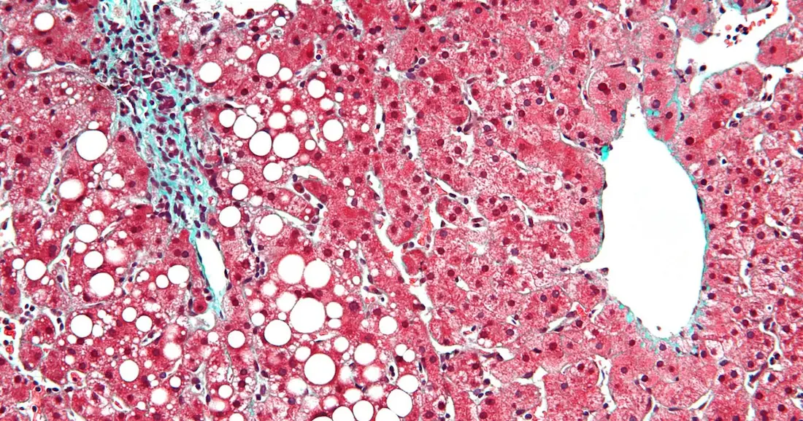

La Enfermedad de Higado Graso no alcohólico (EHGNA) es la enfermedad hepática crónica más común en Estados Unidos. Debido al papel central del hígado en muchos procesos del cuerpo, la grasa en el hígado puede tener un efecto dominó, aumentando el riesgo de desarrollar [enfermedades cardiovasculares](/diabetes-y-los-problemas-coronarios/) y la [diabetes tipo 2](/diabetes-tipo-2/).

## Higado Graso y Diabetes Tipo 2

Los vínculos entre el higado graso no alcohólico y la diabetes tipo 2 están particularmente bien documentados. El ochenta por ciento de las personas con diabetes tienen grasa en el hígado, dice Kenneth Cusi, MD, FACP, FACE, un endocrinólogo de la Universidad de Florida en Gainesville.

Cada vez más, los investigadores se están dando cuenta de que la conexión no es una coincidencia. "Cuando estaba en la escuela de medicina, la gente pensaba que la grasa relacionada con la obesidad en el hígado era simplemente un espectador inocente," Cusi dice. "Ahora endocrinólogos están empezando a darse cuenta de que este es un problema que hay que atacar."

Las investigaciones indican que la EHGNA puede contribuir a la prediabetes y a la diabetes tipo 2. Debido a que el hígado juega un papel tan importante en la regulación del azúcar en la sangre, la acumulación de grasa en este órgano tan vital hace que sea más difícil controlar los [niveles de glucosa](/cuanto-es-el-nivel-normal-de-glucosa/) en ayunas. También hace que el cuerpo sea más resistente a la insulina, haciendo trabajar excesivamente el páncreas y sus células beta y la aceleración de la llegada de la diabetes tipo 2. **"Cuando desarrollas hígado graso, la diabetes es más difícil de controlar"**, dice Cusi.

Sin embargo, a pesar de que la mayoría de las personas con diabetes tipo 2 pueden tener higados grasos, Cusi dice que la condición no se diagnostica normalmente, debido a la falta de conocimiento entre algunos doctores y la naturaleza oculta de la enfermedad.

La obesidad es un indicador de higado graso, pero EHGNA es muy difícil de detectar, a menudo elude los análisis de sangre y exámenes físicos. La forma más fiable para el diagnóstico es la biopsia hepática, un procedimiento invasivo y costoso. Otras opciones incluyen ultrasonido y resonancia magnética, un método menos preciso pero más económico.

Los exámenes físicos y análisis de sangre podrían no dar resultado alguno: "Una minoría de los pacientes tienen molestias o dolor, pero para la gran mayoría que no hay síntomas," dice Cusi. "Es por eso que es tan difícil para los médicos. Incluso las enzimas hepáticas de los pacientes pueden ser normales."

Si hay grasa en el hígado, piensa muy seriamente sobre cambios de estilo de vida, y pregunta a tu médico si suplementos de vitamina E o pioglitazona son adecuados para usted", añade Cusi, señalando que la pioglitazona está aprobado sólo para pacientes con diabetes tipo 2 diabetes. Adicionalmente, la realización de una limpieza de hígado unas cuantas veces al año reduce considerablemente el riesgo de desarrollar síntomas hepáticos.

La clave para revertir el curso de la enfermedad del hígado graso es la pérdida de peso. "Reducir los hidratos de carbono reduce la grasa en el hígado rápidamente", dice Cusi.

Una pérdida del 5 por ciento del peso corporal es suficiente para iniciar la reducción de grasa en el hígado, y sólo unos pocos puntos porcentuales más empieza a reducir la inflamación que está tan estrechamente conectada con resistencia a la insulina. "Si usted comienza a perder peso," Cusi dice, "un montón de cosas empiezan a mejorar."

**Referencia:** Curry, Andrew. "Fatty Liver And Type 2 Diabetes". Diabetes Forecast. N.p., 2012. Web. 28 Sept. 2016.
