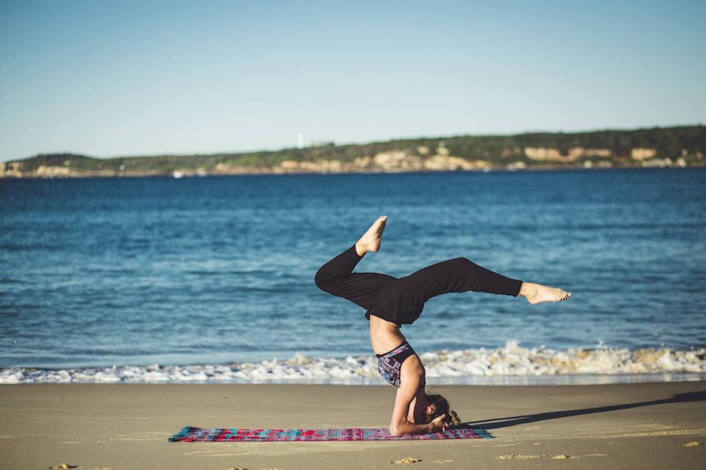
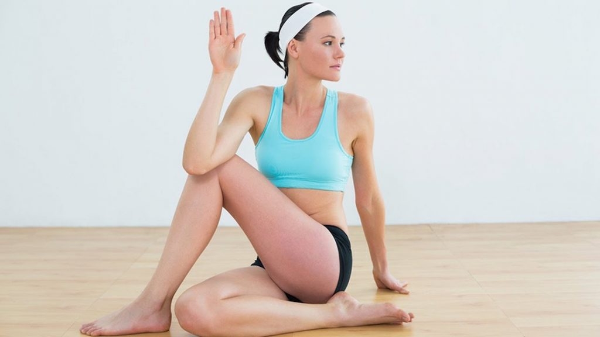

Es importante abrir nuestro entendimiento de las herramientas que tenemos para luchar contra las diabetes. Aquí te presento posturas o asanas del Yoga que te servirán para desarrollar un plan de yoga contra la diabetes! Te sirven para ayudar a luchar contra la diabetes a la vez que logras un equilibrio espiritual en tu vida.

## Yoga contra la Diabetes

Uno de estos tratamientos alternativos es la práctica de **Yoga**. 5.000 años de eficacia luchando por el mejoramiento corporal y espiritual del ser humano es un aval difícil de ignorar. De hecho, la práctica del yoga contra la diabetes es una práctica tan reconocida en la lucha contra la diabetes que la medicina moderna debe guardar un prudente silencio o de lo contrario podría se ella la que quede en ridículo.

El yoga cura a nivel espiritual, que es, según la cultura oriental, el génesis de todo lo malo y bueno del mundo.  Un estudio, realizado por SA Ramaiah en Washington, comparó los efectos de ejercicios, como caminar, correr en una caminadora y bicicleta estática con asanas como Upavishta Bakasana , Bakasana (postura de la grulla) y Dhanurasana. Se encontró que estas asanas fueron los más efectivos, ya que ayudaron a estimular la secreción hormonal del páncreas y rejuvenecer su capacidad de producir insulina. También fortalecen los músculos de la espalda que mejoran la tonificación de vísceras abdominales (músculos y órganos internos) .

El equilibrio en Bakasana mejora la interacción entre la glándula pituitaria y el páncreas. Es algo que para cultura occidental podría una herejía pero ante las pruebas no se debe discutir.

Debes saber que estas posturas funcionan en base a buscar el equilibrio total de cuerpo y espíritu. Sin embargo, algunas personas no las pueden realizar ya que físicamente les es muy difícil, o en algunos casos sufren de hipertensión o algún problema en la columna. Son casos aislados, pero en general el yoga es para todo el mundo y hoy es muy popular en muchos países.

## Dhanurasana (Postura del Arco)

Beneficios en tu plan de yoga contra la diabetes: mejora el funcionamiento del páncreas y los intestinos. De este modo ayuda a controlar los niveles de azúcar en la sangre. Órganos como el hígado, el páncreas y los órganos productores de enzimas funcionarán de forma activa mediante la práctica de esta asana. Para practicarlo acuéstate sobre tu estómago con las piernas extendidas y los brazos a los costados de tu cuerpo. Luego alza tus pies y llévalos hacia atrás y con tus manos agarra los tobillos.

Inhala, levanta el pecho del suelo y jala los tobillos llevando las piernas hacia atrás y arriba. Mira derecho al frente con una sonrisa en tu rostro (muy importante, le estás indicando al Universo que estás agradecido(a)). Mantén la postura estable con la atención en la respiración. Tu cuerpo debe estar tan tenso como un arco. Luego continúa respirando profundo y relájate más y más con la postura. Después de 15 a 20 segundos, cuando exhalas, delicadamente lleva tus piernas y pecho al suelo. Suelta los tobillos y descansa.

En personas con hipertensión o baja presión, traumas en el cuello, dolor de cabeza, hernias, dolor en el coxis o parte baja de la espalda, cualquier tipo de migraña o que hayan tenido una cirugía abdominal reciente NO se recomienda esta posición. Pero se recomienda realizarla a mujeres embarazadas. Es un excelente ejercicio que redundará en tu bienestar físico y espiritual, incluye este asana como parte de tu plan de yoga contra la diabetes.

## Halasana (Postura del Arado)

Beneficios en tu plan de yoga contra la diabetes: estimula el páncreas, el bazo y se activa el sistema inmunológico masajeando todos los órganos internos, incluyendo el páncreas y su producción de insulina. Mejora el funcionamiento del  riñón y el hígado y fortalece los músculos abdominales. También rejuvenece la mente.

Para practicarlo debes echarte en el suelo con las piernas estiradas y juntas, los brazos a los costados con las palmas de las manos hacia abajo. Con una inhalación, apoyándote en las manos y la fuerza de los abdominales elevar las piernas por encima de la cabeza hasta que los dedos toquen el piso. Y el torso queda perpendicular al suelo.

Puedes poner las manos en la espalda o apoyadas en el suelo. Mantén las piernas juntas. Si tus pies no tocan el suelo, sigue apoyando la espalda con las manos. Baja las piernas tanto como sea posible, manteniendo las piernas rectas.  Presiona tus hombros y brazos firmemente en el suelo, girando hacia abajo por el lado del dedo meñique de tus manos. El peso en la postura debe caer en la parte externa de los hombros.

Alinea las caderas encima de tus hombros y separa al máximo la pelvis de los hombros. Levanta el coxis más alto, y presione tu ingle interna profundamente en la pelvis. Mantén un espacio entre la barbilla y el pecho, y, al mismo tiempo, levante el pecho para abrir la parte superior.

Mantén  la postura mínimo 30 segundos, hasta un máximo de 2 minutos respirando normalmente. Para deshacer la postura, baja lentamente la espalda al suelo, una vértebra a la vez, manteniendo las piernas lo más pegadas posible al cuerpo doblando las rodillas si es necesario.

Mantén la cabeza apoyada en el suelo. Una vez que las caderas llegan al suelo dobla las rodillas y apoya las plantas de los pies en él para descansar.  No es recomendable en algunas personas (ejemplo presión alta y glaucoma) así que te dejo como tarea que investigues un poco más.

## Vrikshasana

Beneficios en tu plan de yoga contra la diabetes: Ayuda a estimular la secreción hormonal del páncreas. Método: mantén la espalda recta y los pies cerca uno del otro. Las rodillas, las piernas y las manos deben mantenerse rectas. -Ahora trae tu pie derecho y mantenlo en tu muslo izquierdo. Trata de hacer un ángulo recto. Si eres incapaz de mantener el pie en el muslo, trata de mantener el pie en la pierna izquierda donde te sientas cómodo y mantener el equilibrio.

Pero recuerda, tu dedo del pie derecho debe apuntar hacia abajo. El equilibrio de tu cuerpo debe depender de la pierna izquierda. Alza las palmas de las manos y llévalas al centro de tu pecho y mantienes la figura que señala hacia arriba. Mueve lentamente las manos encima de tu cabeza y hacia delante. Levante los brazos sobre su cabeza. Sus brazos deben estar ligeramente flexionadas.

Mantente una posición  recta, mira al frente y trata de estar relajado(a). Manténte en esta posición durante unos 10 segundos. Respira normalmente. Lentamente trae tus manos en la parte media del pecho igual que antes, llevas la pierna derecha en el suelo y vuelves a la posición inicial. . Repite el mismo procedimiento con la otra pierna. Prueba a repetir todo el procedimiento dos o tres veces.

## Ardha Matsyendrasana

Este asana masajea los riñones, el páncreas, el intestino delgado, la vesícula biliar y el hígado, ayudando a estimular la digestión y exprimir las toxinas. Útil para los diabéticos, alivia los problemas del páncreas. Aumenta la elasticidad de la columna vertebral y tonifica los nervios espinales.  Además de eso sirve para aliviar los dolores menstruales, la ciática, los dolores de espalda y la fatiga. En los textos hindúes tradicionales se afirma que este asana aumenta el apetito y destruye las enfermedades más mortales.

La forma de practicarlo es la siguiente: debes empezar en la posición de Dansana (postura del bastón, otro asana muy recomendado para tu salud). Luego dobla la rodilla derecha y esconde el pie derecho bajo tu glúteo derecho. Dobla la rodilla izquierda y pasa el pie por encima de la rodilla derecha. La planta del pie izquierdo se apoya con firmeza y la rodilla izquierda apunta hacia arriba. Después pasa el brazo y codo derecho por encima de la rodilla izquierda. Sujeta el pie izquierdo con la mano derecha.

La posición de la mano requiere mucha flexibilidad. Alternativamente se puede curvar la mano derecha sobre la rodilla izquierda y empujarla hacia la derecha. La mano izquierda se coloca detrás del glúteo izquierdo con la palma contra el suelo. Al espirar, gira suavemente el tronco y la cabeza 90 grados a la izquierda. Con la siguiente espiración, gira más la cabeza y mira atrás. Aguanta de 20 a 30 segundos, procura respirar con normalidad. Espira mientras sales de la postura. Repite con el giro hacia la derecha. **No debes practicar este asana si tienes problemas de espaldas o en la columna vertebral.**
