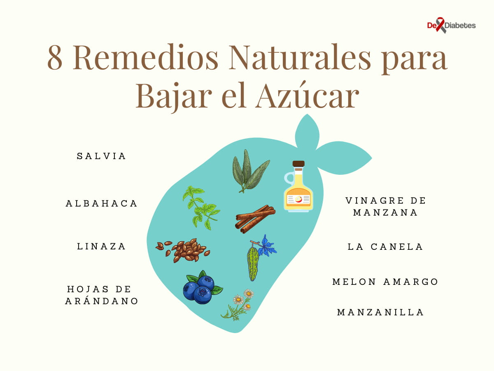

import Alert from '@material-ui/lab/Alert';

import { Link } from "gatsby";  

La diabetes es uno de los trastornos con más incidencia relacionado con el estilo de vida, se puede combatir eficazmente con ajustes personales y una dieta saludable. Aunque hay numerosas opciones de tratamiento de control de la glucemia en la sangre, los remedios caseros para bajar el azúcar pueden complementar el tratamiento.

## Causas de Glucemia Alta en Sangre en la Diabetes

A veces, la causa de un pico de glucosa en la sangre es clara. Pero otras veces, la causa es un poco más misteriosa.

Según el Centro para el Control y la Prevención de Enfermedades, pueden causar la inestabilidad de la glucemia:

- Perder el sueño
- Saltarse el desayuno
- No beber suficiente agua
- Beber café (incluso sin edulcorante)
- Comer alimentos con alto contenido de azúcar / carbohidratos
- Beber alcohol
- Enfermarse
- Cambiar de medicamento

Aún más extraño, el dolor de una quemadura causa estrés y los niveles altos de estrés pueden alterar el nivel de azúcar en la sangre. 

Una dieta baja en fibra y azúcares refinados junto a un estilo sedentario incrementa la probabilidad de niveles elevados de glucosa.

## Remedios Naturales de Reducir los Niveles de Azúcar en Sangre

Los remedios naturales pueden ayudar a reducir los niveles de azúcar en sangre. Sin embargo, puede ser necesario consultar a un médico si los niveles de azúcar en sangre se mantienen constantemente altos. 

Algunas formas naturales para ayudar a regular el azúcar en sangre incluyen:

- **Ejercicio:** el ejercicio regular puede ayudar a mantener un peso moderado y aumentar la sensibilidad a la insulina. Este aumento de sensibilidad hace que las células utilicen el azúcar disponible en el torrente sanguíneo.  Además, el ejercicio ayuda a los músculos a utilizar el azúcar en sangre para generar energía y contraer los músculos. Las formas útiles de ejercicio incluyen levantamiento de pesas, caminar a paso ligero, correr, andar en bicicleta, bailar, caminar, nadar, etc.

- **Dieta baja en carbohidratos:** el cuerpo transforma carbohidratos en azúcares (principalmente glucosa) y luego la insulina ayuda al cuerpo a utilizar y almacenar el azúcar para obtener energía.  Un alto nivel de carbohidratos puede hacer que los niveles de insulina fluctúe y se desarrolle resistencia a la insulina. Una dieta baja en carbohidratos ayuda a controlar el azúcar en la sangre a largo plazo.
- **Ingesta de fibra:** la fibra frena la digestión de los carbohidratos, regula el apetito, absorbe el azúcar y promueve un aumento más gradual de los niveles de azúcar en sangre. La fibra soluble mejora explícitamente el control del azúcar en sangre.  Dietas ricas en fibra que contenga verduras, frutas, legumbres y cereales integrales pueden ayudar a controlar mejor la diabetes tipo 1, al mejorar la capacidad del cuerpo para regular la glucemia.

**Aplicar medidas de control de las porciones:** el control de las porciones ayuda a regular la ingesta de calorías y puede ayudar a mantener un peso moderado. Este control del peso promueve niveles saludables de azúcar en sangre y reduce el riesgo de diabetes tipo 2.

**Alimentos con bajo índice glucémico (IG):** comer alimentos con bajo IG reduce los niveles de azúcar en la sangre en diabéticos. IG mide cómo el cuerpo absorbe o digiere los alimentos, lo que afecta la velocidad a la que aumentan los niveles de azúcar en sangre. Los alimentos con IG bajo (hasta 55) a moderado (56-69) incluyen cebada, yogur, avena, frijoles, legumbres, etc.

**Manejo del estrés:** el estrés puede afectar la glucemia. Durante el estrés se producen hormonas como el glucagón y el cortisol. El ejercicio, la relajación y la meditación reducen significativamente el estrés y disminuyen los niveles de azúcar en sangre.

**Hidratación:** Beber suficiente agua puede ayudar a mantener la glucemia dentro de límites saludables. Además, previene la deshidratación y ayuda a los riñones a eliminar el exceso de azúcar a través de la orina.

## Remedios Caseros para Bajar la Glucosa Naturalmente

Tés como el de canela y salvia o consumir vinagre de manzana pueden ser excelentes remedios naturales para ayudar a controlar la diabetes. Estos remedios contienen propiedades hipoglucemiantes que pueden bajar el azúcar en la sangre.

Sin embargo, es importante mencionar que el uso de estas plantas no sustituye el tomar medicamentos para la diabetes recetados por el endocrinólogo, ni las recomendaciones nutricionales que ayudan a controlar la glucosa en la sangre

### 1\. Salvia

Un estudio que investigó el vínculo entre la salvia y la diabetes encontró que el extracto de salvia reduce los niveles de glucosa en sangre en ratas al activar un receptor específico, otros estudios realizados en humanos también han confirmado estos resultados. 

Adicionalmente, ciertas investigaciones han revelado que la salvia también es eficiente para [bajar el colesterol](/hierba-colesterol-azucar-sangre/).

Consejo: Prepara un té de salvia colocando 2 cucharadas de hojas secas de salvia una taza de agua hirviendo y dejar reposar durante 10 minutos. Tomar hasta 2 veces al día.

### 2\. Albahaca (Tulsi)

Las hojas de albahaca están llenas de antioxidantes y aceites esenciales que producen eugenol y cariofileno. En conjunto, estos compuestos ayudan a las células beta pancreáticas (células que almacenan y liberan insulina) para funcionar correctamente y aumentar la sensibilidad a la insulina. 

Una ventaja añadida es que los antioxidantes presentes en estas hojas ayudan a combatir los efectos nocivos del estrés oxidativo.

**Consejo:** Consumir dos o tres hojas de Tulsi o una cucharada llena de su jugo en ayunas.

### 3\. Semillas de Lino (Linaza)

Debido a su alto contenido en fibra, la linaza ayuda a la digestión y ayuda en la absorción adecuada de grasas y azúcares. El consumo de la semilla de lino ayuda a reducir en casi un 28 por ciento el nivel de azúcar posprandial en diabéticos.

**Consejo:** Consumir una cucharada de polvo de semillas de linaza cada mañana con el estómago vacío con un vaso de agua tibia. Sin embargo, no tomes más de 2 cucharadas por día, ya que puede ser perjudicial para tu salud.

### 4\. Hojas de Arándano

Las hojas de arándano se han utilizado en Ayurveda durante muchos siglos para controlar la diabetes. 

Recientemente, la revista Journal of Nutrition puntualizó que las hojas de la planta de arándano contienen altas cantidades de antocianidina, que mejoran la acción de varias proteínas implicadas en el transporte de la glucosa y el metabolismo de la grasa. Debido a esta propiedad única, las hojas de arándano pueden ser un remedio para reducir los niveles de azúcar en la sangre.

**Consejo:** aplasta el arándano en un mortero y consume 100 miligramos de este extracto todos los días con el estómago vacío.

### 5\. Vinagre de Manzana

Existe evidencia que los alimentos fermentados como el vinagre de sidra de manzana que contienen ácido láctico o ácido acético pueden reducir el azúcar en sangre. Estos ácidos mejoran la capacidad de almacenar el exceso de glucosa en el hígado.

Sin embargo, muchos de los estudios parecen ser de tamaño bastante pequeño y los resultados en general han sido mixtos. El vinagre también puede tener efectos secundarios como irritación del estómago y náuseas. Este [artículo de Medscape](https://www.medscape.com/viewarticle/862975) advierte que la ingesta de vinagre debe limitarse a un máximo de 1-2 cucharadas diluidas en agua, dos veces al día.

**Consejo:**

- Un [pequeño estudio](https://care.diabetesjournals.org/content/30/11/2814.full) en personas con diabetes informó que consumir 2 cucharadas de vinagre de sidra de manzana antes de acostarse redujo el azúcar en sangre en ayunas en un 4 % a la mañana siguiente
- Si quieres consumir vinagre de sidra de manzana, diluye 1 o 2 cucharadas de vinagre de sidra de manzana en un vaso grande de agua. Bébelo antes de las comidas o justo antes de acostarse, cuando tiene el mayor impacto reductor sobre el azúcar en sangre.
- Como ocurre con la mayoría de los tipos de vinagre, una persona no debe consumir vinagre de sidra de manzana sin diluir. 
- El vinagre de sidra de manzana también es un ingrediente de cocina versátil. Puedes usarlo en aderezos para ensaladas, adobos, salsas y sopas, y funciona bien con muchos tipos de carnes y pescados

<Alert variant="outlined" severity="info">
  Revisa nuestro artículo sobre <Link to="/como-bajar-el-azucar-en-la-sangre-con-vinagre-de-manzana/">como bajar el azucar en la sangre con el vinagre de manzana</Link>
</Alert>

### 6\. Canela

La canela aparte de ser un saborizante o condimento también puede ser un remedio para mejorar tu salud. Incorpora la canela en tus bebidas o comidas.

**Consejos:**

- Puedes agregar desde 1/4 hasta 1/2 cucharadita (según tu tolerancia) de canela a lo que comas o tomas. 
- Prepara un té de canela colocando 3 palos de canela en una olla con 1 litro de agua, llevar a fuego medio hasta que hierva por 5 minutos. A continuación, apague y tape la olla hasta que esté tibio, puede beber este té varias veces al día. 
- Si no puedes consumir la canela de esta forma, puedes tomar cápsulas de canela.

<Alert variant="outlined" severity="info">
  Revisa nuestro artículo sobre <Link to="/canela-glucosa-alta/">como la canela ayuda a controlar el azucar en la sangre</Link>
</Alert>

### 7\. Melón Amargo

El melón amargo tiene sustancias activas con propiedades antidiabéticas que se ha confirmado tiene un efecto reductor de la glucosa en la sangre y contiene un compuesto similar a la insulina conocido como polipéptido-p.

**Consejo:** Prepara un té colocando 1 cucharada de hojas secas de melón amargo en 1 litro de agua hirviendo. Deja reposar durante 5 minutos, cuele y beba durante el día.

### 8\. Manzanilla

Las personas con diabetes suelen utilizar el té de manzanilla para ayudar a reducir la glucosa en la sangre. Los estudios han demostrado caídas elevadas en el azúcar en sangre en pacientes que tienen diabetes tipo dos durante un período de 2 meses.

**Consejo:** prepara un té de manzanilla añadiendo 1 cucharada de manzanilla al agua hirviendo y dejar reposar durante 5 a 10 minutos. Luego, colar y beber de 2 a 3 veces al día.