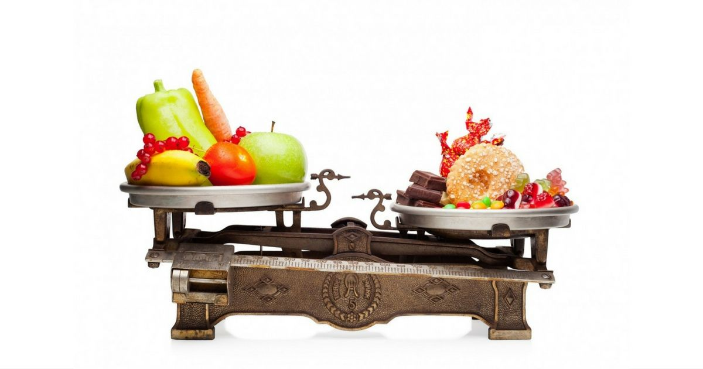

Si tienes prediabetes, los niveles de azúcar en la sangre son más altos de lo que deberían ser, pero no lo suficiente para que puedas ser clasificado como diabético. La pérdida de alrededor del 5 por ciento a 7 por ciento de tu peso y hacer ejercicio al menos 150 minutos a la semana puede ayudar a retrasar o prevenir la diabetes tipo 2, pero una dieta para prediabetes también pueden ser beneficiosa.

## #1 Cuídate de los Alimentos de Alto Indice Glucémico

Los alimentos con un alto índice glucémico no son las mejores opciones para las personas con prediabetes. Las estimaciones de índice glucémico (IG) probaron que los alimentos de alto IG afectaron mucho más los niveles de azúcar en la sangre que los alimentos con IG bajo. Un estudio publicado en el American Journal of Clinical Nutrition en 2010 encontró que después de una dieta de indice glucémico bajo junto con ejercicios de una hora al día, cinco días a la semana, ayudó a que los niveles de azúcar en la sangre bajaran en personas con pre-diabetes.

Los alimentos altos en IG que debes evitar incluyen pan blanco, galletas saladas y galletas dulces. Otros alimentos con un alto índice glucémico son el arroz blanco, galletas de arroz, patatas, palomitas de maíz, harina de avena instantánea y cereales refinados, como copos de maíz inflados. Elije pan integral en lugar de un panecillo blanco y opta por la cebada sobre el arroz blanco. La fruta fresca y la mayoría de las verduras sin almidón son buenas opciones de IG bajo, con la excepción de la piña y el melón.

Los alimentos que son bajos en el IG son los mejores para su azúcar en la sangre. Incorporar los siguientes elementos en tu dieta para prediabetes:

- Avena (cortada o hojuelas, evita harina de avena instantánea)
- pan de trigo integral molido a la piedra
- verduras sin almidón, como las zanahorias y verduras de hojas verdes
- frijoles
- patatas dulces
- maíz
- pasta (de preferencia integral)

La información nutricional en las etiquetas de los alimentos no revelan el IG de un determinado alimento. Chequea el contenido de fibra en la etiqueta para ayudarte a determinar la clasificación de IG de un alimento. Recuerda que debes limitar la ingesta de grasas saturadas para reducir el riesgo de desarrollar colesterol alto y enfermedades del corazón, junto con prediabetes.

El consumo de comidas mixtas es una buena forma de reducir el IG de un alimento determinado. Por ejemplo, si vas a comer arroz blanco, incluye verduras y pollo para retardar la digestión de los granos y minimizar los picos.

## #2 Come carnes magras

La carne no contiene carbohidratos, pero puede ser una fuente importante de grasas saturadas en su dieta. Comer mucha carne puede conducir a niveles altos de colesterol. Si tienes prediabetes, una dieta baja en grasas saturadas y colesterol puede ayudar a reducir el riesgo de enfermedades del corazón. Se recomienda evitar cortes de carne con grasa visible o la piel.

Elija fuentes de proteínas para una dieta para prediabetes como la siguiente:

- pollo sin piel
- sustituto de huevo o claras de huevo
- frijoles y legumbres
- productos de soja como el tofu y el tempeh
- peces, como el bacalao, el lenguado, abadejo, mero, atún, o trucha
- cortes de carne magra, como el bistec de falda, redondo tierra, lomo y asado con grasa guarnecidos
- crustáceos, como el cangrejo, langosta, camarones, vieiras o
- pavo sin piel
- [yogur](/yogur-griego-en-la-dieta-diabetica/) bajo en grasa griega

Cortes muy magros de carne tienen aproximadamente 0 a 1 g de grasa y 35 calorías por onza (28 gramos). Opciones de alto contenido de grasa de la carne, tales como costillas pueden tener más de 7 gramos de grasa y 100 calorías por onza.

Limita la cantidad de grasas que se agregan durante la cocción, así como la que se agrega en la mesa. Esto incluyen la mantequilla, aceites, aderezos para ensaladas, crema de queso y crema agria. Cocer al vapor, hornear y el microondas son buenos métodos para la reducción de grasa durante la cocción. Las hierbas y especias pueden ayudar a añadir sabor sin añadir grasa y azúcar.

## #3 Come más alimentos ricos en fibra

La fibra ofrece varios beneficios. Te ayuda a sentirte lleno durante más tiempo. La fibra añade volumen a la dieta que facilita los movimientos del intestino. El consumo de alimentos ricos en fibra puede hacer que sea menos probable que comas en exceso. También ayudan a evitar el "choque" que puede venir de comer una comida alta en azúcar. Estos tipos de alimentos a menudo te proporcionan energía en el momento pero te hace sentir cansado después.

Incluye estos alimentos ricos en fibra en una dieta para prediabetes:

- frijoles y legumbres
- frutas y verduras que tienen una piel comestible
- panes de grano entero
- cereales integrales como la quinua o cebada
- cereales de grano entero
- pasta de trigo integral

## #4 Elimina alimentos bajos en nutrientes

No necesariamente tienes que reducir drásticamente [los carbohidratos](/que-son-carbohidratos/) cuando presentas prediabetes, pero debes limitar los carbohidratos excesivamente procesados y altamente refinados debido a que estos suelen ser bajos en nutrientes y altos en calorías. Elije granos enteros en lugar de granos refinados, y llena el resto de tu plato con alimentos nutritivos tales como frijoles, frutas, verduras, productos lácteos bajos en grasa y fuentes de proteína magra.

Considera la posibilidad de probar los Enfoques Alimenticios para Detener la Hipertensión, en tu plan de alimentación. Esta dieta hace hincapié en los alimentos saludables que debes comer, que se centran en los alimentos ricos en calcio, magnesio, potasio, proteínas y fibra. Es baja en grasas no saludables y sodio. Se recomienda para las personas con diabetes, pero también ayudará a las personas con prediabetes.

## #5 Controla las Porciones en una dieta para prediabetes

Un estudio publicado en Endocrine en junio de 2013 encontró que las personas con prediabetes experimentaron mejoras en sus niveles de azúcar en la sangre, índice de masa corporal, el colesterol y los niveles de presión arterial cuando seguían una determinada dieta bien estructurada. La dieta contenía entre 1.200 y 1.700 calorías y era 50 por ciento de carbohidratos, 30 por ciento de grasa y 20 por ciento de proteínas.

Una buena dieta para prediabetes debe tomar en cuenta los tamaños de las porciones adecuadas para ayudar a minimizar los niveles de azúcar en la sangre. Llena la mitad de tu plato con verduras sin almidón, y luego divide la otra mitad entre los granos enteros o un vegetal con almidón y una fuente de proteína magra. Termina tu comida con un pedazo de fruta o una ración de lácteos bajos en grasa.

Uno de los mejores métodos para controlar las porciones es la práctica consciente de comer. Come cuando tengas hambre. Para cuando estés lleno. Siéntate a comer, poco a poco. Concéntrate en lo que estas comiendo y los sabores.
