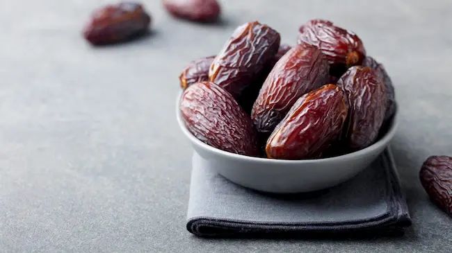
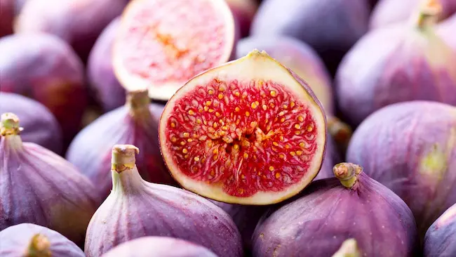
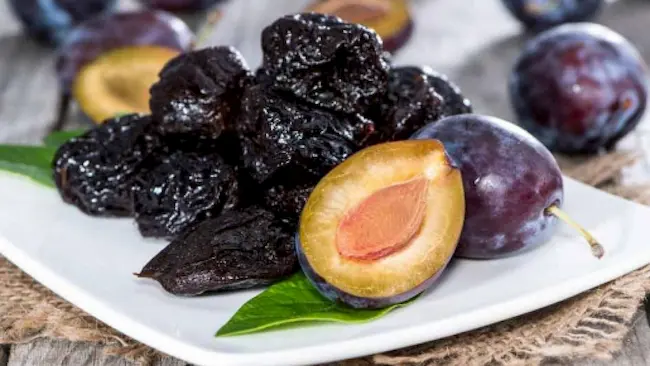
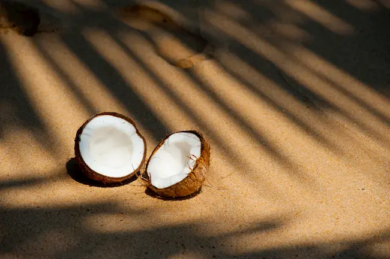
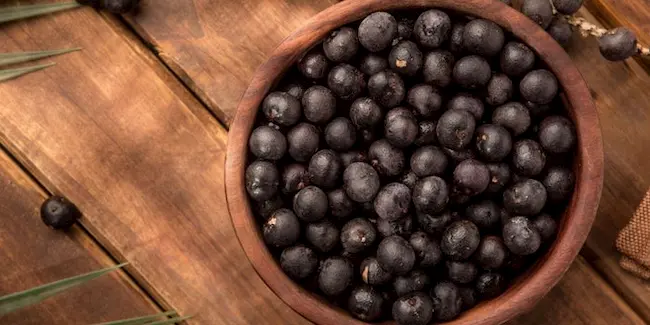
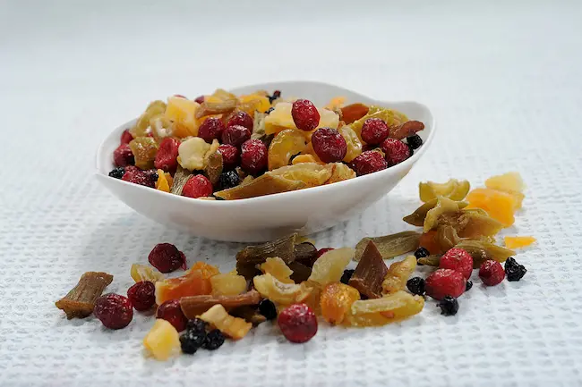
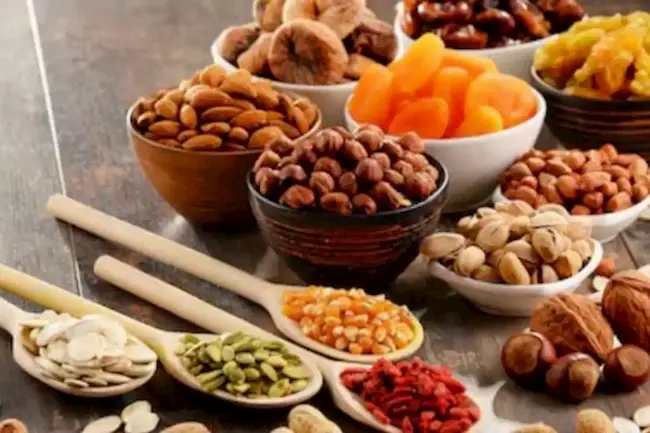
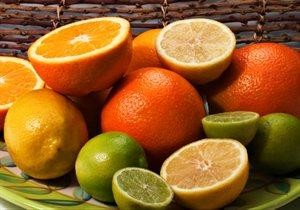

Consumir una dieta que sea baja en azúcar y baja en grasa es esencial para vencer a la diabetes. La mayor parte de las frutas se pueden comer sin inconvenientes. Sin embargo, hay ciertas frutas que debes tratar con precaución o evitar por completo. Aquí hay nueve de ellas.

El problema fundamental que causa la diabetes tipo 2 parece ser la grasa bloqueando los receptores de glucosa en las células musculares, lo que deja al azúcar y a la insulina sin rumbo en el torrente sanguíneo.

De acuerdo a la experiencia es conocido que puede vencer a la diabetes al comer alimentos que son (1) bajos en azúcar, (2) bajos en grasa, (3) bajos en sal, (4) altos en fibra y que (5) se digieren lentamente (bajo Indice Glicémico IG). La forma más fácil de hacerlo es mediante una dieta basada en la concentración de alimentos naturales no procesados, que son en su mayoría plantas, y mediante la exclusión de todos los productos lácteos (leche, queso, mantequilla, etc.) y los huevos de la dieta.

También es necesario beber mucha agua, para ayudar en la absorción de toda la fibra que vas a comer con esta dieta centrada en los vegetales. Se puede beber al menos dos litros de agua al día; además del agua, jugos, té y leche de soja en la comida y opcionalmente algo de café.

También se recomienda tener un buen suplemento multivitamínico con el fin de cubrir las posibles deficiencias en la dieta que puedan surgir al evitar los productos lácteos y los huevos.

La mayoría de las frutas contienen ciertos azúcares naturales, pero por lo general no los contienen en exceso. La mayoría son muy bajas en grasa y sal. Las frutas también son altas en fibra y se digieren lentamente. Por lo tanto, la fruta debe ser parte de una dieta para vencer la diabetes, sobre todo porque la mayoría de las frutas están llenas de micronutrientes (vitaminas y minerales).

Sin embargo, hay algunas excepciones a esta regla general. Aquí hay nueve de estos frutos que debes tratar con extrema precaución o evitar por completo.

## #1) Dátiles

Los dátiles proporcionan una amplia gama de nutrientes esenciales, 2,45 g de proteína por cada 100 g, junto con 8 g de fibra dietética. Come dátiles regularmente y rara vez sufrirás de estreñimiento.

Los dátiles también son particularmente ricos en las vitaminas del grupo B. Además están cargados de minerales para la dieta. Pero ellos contienen muy poca vitamina C, prácticamente ninguna si se han secado.

El problema con los dátiles es el contenido de azúcar. 63% de un dátil maduro consiste en azúcares. Sin embargo, los índices glucémicos de las tres variedades diferentes de dátiles blandos, semi-secos y secos son 35,5, 49,7 y 30,5, lo que sugiere que los diabéticos pueden comer algunos dátiles, pero con precaución.

Pero ten cuidado con los dátiles rellenos y los glaseados. El relleno suele consistir en una pasta bien azucarada, mientras que el glaseado se compone casi enteramente de azúcar.

## #2) Higos

Los higos son muy nutritivos. De hecho, los higos secos comunes son las fuentes más ricas de plantas de fibra dietética, cobre, manganeso, magnesio, potasio, y calcio en relación con las necesidades humanas.

Alrededor del 10% de un higo, fresco o seco, se compone de fibra y los higos tienen una reputación bien fundada como laxante. La fibra en los higos se dice que también logra niveles más bajos de insulina y de glucosa en la sangre.

Los higos contienen vitaminas del grupo B, casi tanto como los dátiles. Y al igual que éstos contienen poca vitamina C. Pero los higos tienen una gran cantidad de antioxidantes. Y para completar están llenos de minerales para la dieta.

Pero de nuevo, como con los dátiles, el problema es el azúcar. En 100 g de higos se encuentran casi 64 g de hidratos de carbono, de los cuales los azúcares componen 48 g. Esto es algo menor que los dátiles pero, sin embargo, significa que los higos tienen que ser tratados con precaución por los diabéticos.

Si prefieres arriesgarte y darte un pequeño gusto con un higo debes elegir los que tienen piel oscura, ya que son los más nutritivos.

Los dátiles y los higos son alimentos excelentes pero un diabético no debe abusar de ellos porque contienen mucha azúcar. Pero siempre te repito que lo mejor es consultar con el médico.

En el próximo post te estaré describiendo cuáles son esas otras frutas con las cuales debes tener extrema precaución. Allí te explicaré porque hay que tener cuidado con las ciruelas, las ciruelas pasas, el coco, la palma de acaí y otras frutas que pueden ser problemáticas para la salud de una persona diabética.

## #3) Las ciruelas y ciruelas pasas

Hay cientos de variedades de ciruelas, cada una con su propio sabor y color. Todas se pueden secar. Las ciruelas secas son llamados ciruelas pasas.

Una ciruela fresca cruda tiene muy poca grasa, proteínas y sodio. Es una bastante buena fuente de fibra, vitaminas A y K, fósforo y potasio, y una excelente fuente de vitamina C.

Desafortunadamente, el 10% de una ciruela está conformada por azúcar y como su índice glucémico (IG) puede ser tan alto como 53 (dependiendo de la variedad) los diabéticos sólo deben comer ciruelas con estricta moderación.

El secado de una ciruela quita casi toda el agua, por lo que el valor nutricional de una ciruela pasa es dramáticamente diferente. También reduce la cantidad de vitamina C en al menos un 90%, y más de cuadruplicar las cantidades de fósforo y potasio. Las ciruelas pasas son también ricas en cobre y boro.

El secado aumenta la fibra dietética en un factor de cinco, por lo que no es sorprendente que las ciruelas pasas son bien conocidas por su efecto laxante. Esta fibra incluye inulina que, cuando se descompone por las bacterias intestinales, hace que el entorno sea más ácido en el tracto digestivo que, a su vez, hace que sea más fácil para el calcio que sea absorbido.

Sin embargo, en comparación con una ciruela fresca cruda, hay cerca de cuatro veces más de la cantidad de azúcar en una ciruela pasa. Así, a pesar de que las ciruelas pasas tienen un valor de IG de sólo el 29, tienen que ser tratadas con precaución por los diabéticos. De hecho, mi consejo sería hacer caso omiso de ellas a menos que las necesites por sus efectos laxantes.

## #4) Coco

La carne de coco, la materia blanca del interior del coco, contiene menos azúcar y más proteínas que los plátanos, las manzanas y las naranjas. Es una excelente fuente de fibra y es relativamente alta en minerales tales como hierro, fósforo y zinc.

El problema con el consumo de coco es una cantidad de grasa de 33,5 g por cada 100 g, una friolera de los cuales 30 g, o aproximadamente el 90% está saturado.

Un diabético con el objetivo de derrotar a la diabetes, sólo tiene que olvidarse del coco. Es preferible buscar otras opciones de [remedios caceros para bajar el azúcar](/remedios-caseros-para-bajar-el-azucar).

## #5) Açaí

El fruto de Açaí se vende como pulpa o jugo congelado. También es un ingrediente en bebidas, batidos y alimentos. En los últimos diez años por efectos de la comercialización espuria se ha hecho muy popular como un suplemento dietético mágico.

¿Sabías que el açaí ofrece una variedad de beneficios para la salud sorprendentes? Se puede revertir la diabetes y otras enfermedades crónicas. Consumido regularmente también se ampliará el tamaño de tu pene y aumentará tu virilidad sexual si eres hombre. Asimismo, promueve la pérdida de peso (pero sin los prejuicios de género). (Estoy siendo sarcástico)

Cosas Milagrosas, se podría decir, _excepto que no hay estudios independientes científicamente controlados  para demostrar los beneficios de salud fabulosos que obtendrás de consumir açaí_. Hasta donde se sabe, el açaí nunca ha sido evaluado por algún laboratorio de buena reputación o institución de investigación en cualquier lugar del mundo. Si sabes de alguno que sea serio y comprobable te agradezco que me avises.

Sin embargo, no es del todo malo. La piel y la pulpa de la fruta de açaí contiene más de 52% de carbohidratos, aunque la mayor parte de esto es fibra dietética y poco de él es azúcar. El Açaí también contiene muchos polifenoles, que son los antioxidantes encontrados en las plantas.

El problema con la fruta de açaí es que 32,5 g de cada 100g consiste en grasa. Así, si la obviamente falsa publicidad no es suficiente para ponerlo fuera de tu dieta, basta con pensar en el contenido de grasa aparentemente diseñado a medida para volver a obstruir los receptores de glucosa en las células del músculo.

## #6) Fruta cristalizada (escarchada o fruta glaceada)

Las frutas cristalizadas,  confitadas o frutas glaceadas son pequeñas piezas de fruta que se han conservado con la utilización de azúcar. El fruto está empapado con jarabe de azúcar, y una vez que se ha saturado con el azúcar evita que los microorganismos que echan a perder la fruta crezcan en ese entorno.

Los frutos glaseados pueden incluir dátiles, cerezas, piña, jengibre y castañas, así como la cáscara de naranja y limón. Huye de ellas como de la peste, por razones que no tienen que ser declaradas por su obvias cualidades dañinas.

## #7) Fruta seca

Los frutos secos son la fruta fresca de la que la mayor parte del agua se ha eliminado. La mayor parte del valor nutritivo de la fruta fresca se conserva, sin embargo, la fruta seca tiene un sabor más dulce y una vida útil mucho más larga.

La fruta puede ser secada de dos maneras. El método tradicional es ya sea con el sol o en túneles especiales de viento con calefacción.

La segunda manera es infundir la fruta con un edulcorante (como jarabe de sacarosa) antes del secado, un método utilizado para secar frutas como arándanos, cerezas, fresas y mangos. Ten en cuenta que algunos productos que se venden como fruta seca (por ejemplo, la papaya y la piña) son, de hecho, fruta escarchada.

El contenido de nutrientes específicos de varias frutas secas reflejan los nutrientes de las frutas originales. Las frutas secas de la manera tradicional tendrán casi los mismos nutrientes que sus originales frescos. La fruta en infusión con azúcar antes del secado contendrá naturalmente mucho más azúcar que la que tenía cuando estaba fresca.

Secar, por definición, elimina la mayor parte del agua que concentra los azúcares naturales de la fruta. Para obtener el mismo total de azúcar y de energía, la cantidad de frutos secos que debes comer sólo debe ser aproximadamente 1/3 de la cantidad de fruta fresca original.

Las ciruelas, dátiles secos, higos, albaricoques, melocotones, manzanas y peras proporcionan energía cuando te sientes cansado y puedes hacer grandes bocadillos siempre que hayan sido secadas a la manera tradicional sin ser infundida en un edulcorante.

#### Fruta enlatada

En teoría, el contenido nutricional de las frutas en conserva debe ser poco diferente de la fruta fresca. Sin embargo el enlatado por lo general incluye una forma de cocina como parte del proceso que puede afectar a los valores nutricionales. La vitamina C, por ejemplo, es destruida por el calor y la fruta fresca contendrá más vitamina C que las frutas enlatadas.

Algunas frutas enlatadas tienen menor contenido de fibra que los alimentos naturales. Esto es porque a menudo las pieles se retiran cuando se están enlatando estas fruta.

En teoría, sin embargo, la fruta en latas no debería causar problemas para los diabéticos  con su dieta. El problema es que los fabricantes suelen añadir azúcar durante el enlatado. Así que hay que leer las etiquetas cuidadosamente.

#### La toronja y otras frutas cítricas

Todas las frutas cítricas tienen propiedades similares, y son una fuente rica de vitaminas (especialmente vitaminas B y C), minerales (especialmente potasio) y fibra dietética (de los cuales 65 a 70% es pectina).

También contienen fitoquímicos (compuestos biológicamente activos, no nutrientes) que pueden ayudar a reducir el riesgo de muchas enfermedades crónicas que son de importancia crucial para los diabéticos con síndrome cardiovascular, enfermedad metabólica, enfermedades del corazón, la hipertensión, los accidentes cerebrovasculares, el cáncer y la anemia.

Los cítricos no contienen grasa, son sin sodio y sin colesterol. El número de calorías es baja por lo que son útiles para reducir de peso. Los cítricos también ofrecen mucha fibra.

Estas frutas contienen hidratos de carbono simples (fructosa, glucosa y sacarosa) y ácido cítrico. Sin embargo, todos ellos tienen bajo IG (menos de 55), y mientras  más agudo es el sabor, menor será el IG por lo que los diabéticos pueden comerlas con moderación.

_Sin embargo, no todas las frutas cítricas son totalmente beneficiosas, especialmente si estás tomando ciertos medicamentos._

Por ejemplo, el pomelo o toronja, de acuerdo con los ensayos clínicos en laboratorios acreditados, inhibe las enzimas que metabolizan varios medicamentos en tus intestinos. Esto aumenta la concentración de estos medicamentos en la sangre a niveles que podrían ser tóxicos. Los efectos duran por 24 horas o más.

Estos medicamentos incluyen los medicamentos para reducir el colesterol, tales como atorvastatina (Lipitor), simvastatin (Zocor) y lovastatina (Mevacor) y para controlar la presión arterial, como amlodipina (Norvasc), nifedipina (Adalat, Procardia) y verapamilo (Isoptin, Calan) .

El pomelo también bloquea la acción de los antihistamínicos y algunos medicamentos psiquiátricos como diazepam (Valium).

#### Resumen

La fruta es buena para ti.

Sin embargo, se debe evitar:

- Los dátiles rellenos o glaseados
- Frutas cristalizada (escarchada o glacé de fruta)
- Los frutos secos que se ha infundido con el azúcar antes del secado
- Ciruelas (excepto como laxante)
- Estañado (en lata) de frutas que contiene azúcar añadido
- Pomelo, ya que interfiere con el metabolismo de los fármacos vitales

Debes tratar a otros cítricos con extrema precaución hasta que sus efectos sobre el metabolismo de los fármacos vitales se haya evaluado científicamente.

Además, debes comer muy poco de:

- Dátiles (azúcar 60%)
- Higos 48% (azúcar)
- Ciruelas
- Coco (grasa 33,5%)
- Açaí (grasa 32,5%)
