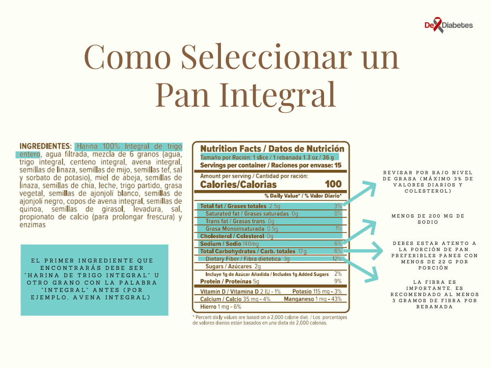

El pan está presente en la alimentación en muchos países. Sin embargo, sobre su uso en los diabéticos, aun no hay acuerdos entre los especialistas. Así que trataré de brindarte información que te ayude a tomar decisiones para  un consumo responsable de este alimento.

Para controlar la diabetes es necesario comer alimentos con bajo contenido de azúcar, bajos en grasas, bajos en sal, altos en fibra y que liberen la glucosa en la sangre lentamente, es decir que tengan bajo Índice Glicémico (IG).

La calidad del pan depende en gran medida del contenido de proteína de la harina de trigo. Los mejores panes utilizan harina con 12 a 14% de proteína un poco más que, la harina de uso general (para todo uso) que sólo aporta de 9 a 12% de proteína, esto en realidad quiere decir que por cada 100 gramos que consumas de pan 12 a 14 % de las calorías o 9 a 12% de las calorías provienen de las proteínas según hablemos de harina panadera o de harina de trigo para todo uso.

Volviendo al IG, el pan blanco tiene un IG alto, de hecho a veces se usa como referencia para comparar el IG de otros alimentos. Los panes integrales por lo general tienen valores de IG más bajo que el del pan blanco. El pan integral regular tiene un valor de IG de alrededor de 51 hasta 61[^1], mientras que la calificación del pan integral de centeno es de aproximadamente 56. El pan de cebada (si se puede encontrar) es muy denso y tiene un valor de IG de alrededor de 34, mientras que las tortillas de trigo tienen una calificación de alrededor de 30 [^2].

Así entonces un diabético puede comer la mayoría de los panes integrales, los panes de centeno y los panes crujientes hechos de centeno. También puede comer tortas sin levadura, tales como panes de trigo entero, siendo necesario conocer el contenido de sal y grasa y no abusar de las porciones[^3].

## ¿Qué sucede con la harina refinada?

La harina refinada a partir del cual se hace el pan blanco carece de las cantidades que necesitas de vitaminas, especialmente las del complejo B, como la tiamina o B1, la riboflavina o B2 y la niacina; también les falta vitamina E y minerales que si encuentras en el pan integral. En cuanto a las vitaminas B, 80% de tiamina, 60% de riboflavina y 75% de la niacina se pierden cuando la harina se refina,  mientras que la mayor parte de la vitamina E se pierde cuando se eliminan el germen de trigo y el salvado.

Durante el refinado también se pierde aproximadamente el 50% de calcio, 70% de fósforo, 80% de hierro, 75% de manganeso, 50% de potasio, 65% de cobre, y casi todo el magnesio.

La refinación tiende a destruir las proteínas en los granos, así como la mitad de los ácidos grasos insaturados. El resultado es que la harina refinada contiene proteínas de pobre calidad y almidón de engorde; además muy pocas vitaminas y minerales.

A veces, la tiamina, riboflavina, niacina, y el hierro pueden ser añadidos luego durante el procesamiento. Pero, como los nutrientes añadidos representan una pequeña fracción de los nutrientes extraídos, los granos refinados son menos nutritivos que los granos enteros. 

La extracción de la fibra y la molienda de los granos finamente también aumenta el valor del índice glucémico, es decir, la glucosa a partir de los granos refinados se digiere más rápidamente en el cuerpo que la glucosa de los granos enteros. Esto significa que si comes pan blanco el aumento en el azúcar en la sangre es más alto que si comes pan de granos integrales.

## Entonces, ¿Cuál es el problema con el pan blanco?

El pan blanco está hecho de granos refinados, por lo general de trigo, así que este alimento sufre las mismas pérdidas de nutrientes que te mencionamos antes para los granos refinados. Pero ese blanco brillante se consigue usando blanqueadores químicos en la harina. 

Algunos de estos agentes de blanqueo se combinan con las proteínas en la harina para producir aloxano. Pruebas de laboratorio han demostrado que el aloxano puede destruir las células beta del páncreas (son las que producen la insulina) en animales de laboratorio, en los cuales se usa para producir diabetes de forma experimental.

Aunque se especula que el aloxano se usa como blanqueador del pan, su presencia en el pan horneado no se ha podido  demostrar siendo una posible explicación que se destruya durante el horneado, tampoco se ha podido demostrar el efecto de destrucción del aloxano en las células beta del páncreas del humano.
En todo caso el uso de blanqueadores en las harinas de cereales y productos relacionados está regulado por la FDA (CFR 21 137.105) [^4]

## Claves para comprar el pan integral

Cuando los granos se refinan, la capa externa fibrosa (el salvado) y el núcleo denso en nutrientes (el germen) se eliminan, dejando solo el endospermo almidonado. Pero el salvado y el germen es donde se encuentran la mayoría de los nutrientes.

Los panes hechos con granos integrales incluyen todas las partes del grano y son una gran fuente de vitamina B, de vitamina E y de fibra que además de saciarte ayuda a mantener una adecuada salud intestinal. El hecho de que el pan sea de color marrón no significa que sea a base de granos integrales. 

Para estar seguro acostúmbrate a revisar las etiquetas y la lista de ingredientes.

1. Afirmaciones en la etiqueta como "hecho con trigo integral",  "multigrano" indican que el pan puede contener algo de trigo integral, pero también que pueden estar elaborados predominantemente con granos procesados.
2. El primer ingrediente que encontrarás debe ser "harina de trigo integral" u otro grano con la palabra "integral" antes (por ejemplo, avena integral). Evita los panes con "harina de trigo enriquecida" o "harina de trigo" como primer ingrediente; estos términos indican granos refinados. También evita los panes que contienen jarabe de maíz con alto contenido de fructosa y sabores y conservantes artificiales.
3. Las variedades de pan integral en rebanadas finas y más ligeras suelen tener dos rebanadas por porción. Los panes artesanales y de panadería más grandes a menudo tienen una porción de 1 unidad o rebanada. Así que debes estar atento, en promedio una porción de pan, puede aportarte entre 22 y 56 gramos de carbohidratos, dependiendo del tamaño de esa porción. 

## ¿Qué debes recordar?

Si eres de los que le gusta el pan:\

- Prefiere el pan de trigo, centeno y granos integrales hechos a base de grano integral o de harina 100% integral, siempre respetando la cantidad diaria que tienes permitida. Este pan tiene un bajo contenido en sal (sodio), es bajo en grasa (como máximo 3% en peso) y no contiene azúcar añadido.

- Ten presente que una gran variedad de panes pueden ser clasificados como semi-integral, lo que afectará el valor de su IG, por ejemplo, una mezcla 50:50 de harina integral y refinada por lo general tiene un valor de IG de al menos 58, mientras que con 100% de pan integral su valor medio será de 51%.

**Recursos Consultados:**

[^1]: [La ciencia se inclina por el pan integral frente al pan blanco para prevenir el sobrepeso](https://www.upf.edu/es/web/e-noticies/home_upf/-/asset_publisher/8EYbnGNU3js6/content/id/163272913/maximized)
[^2]: [Índice glucémico en panes, pasteles y tortillas](https://www.aboutespanol.com/indice-glucemico-en-panes-pasteles-y-tortillas-2123726)
[^3]: [Myths about Diabetes](https://www.diabetes.org/diabetes-risk/prediabetes/myths-about-diabetes)
[^4]: [CFR - Code of Federal Regulations Title 21](https://www.accessdata.fda.gov/scripts/cdrh/cfdocs/cfcfr/CFRSearch.cfm?fr=137.105)

